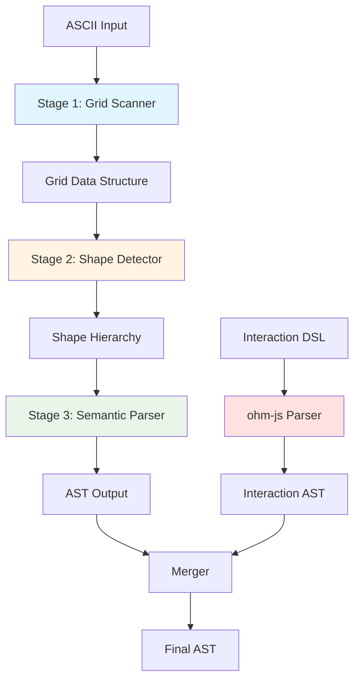
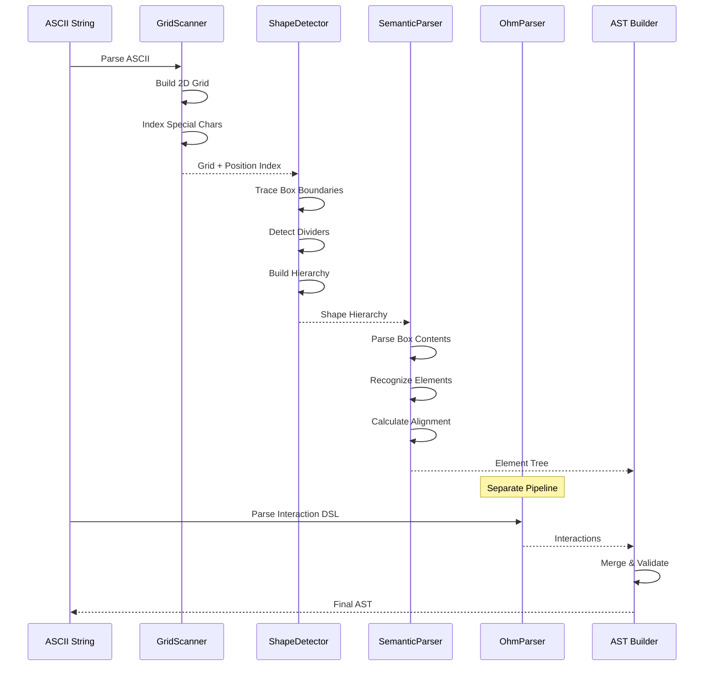

# Design Specification: Wyreframe Parser Refactoring

**Project**: Wyreframe ASCII Wireframe to HTML Converter
**Language**: ReScript
**Version**: 1.0
**Date**: 2025-12-22
**Status**: Draft

---

## Overview

This document specifies the design for refactoring the Wyreframe parser from a regex-based JavaScript implementation to a systematic 3-stage pipeline architecture in ReScript. The new parser will use ohm-js for the interaction DSL parsing only, while implementing custom 2D grid parsing for the ASCII wireframe structure.

### Design Goals

1. **Type Safety**: Leverage ReScript's type system for compile-time guarantees
2. **Extensibility**: Plugin-based element parsers for easy addition of new element types
3. **Clarity**: Natural language error messages with contextual information
4. **Performance**: Efficient parsing with immutable data structures
5. **Maintainability**: Clear separation of concerns across the 3-stage pipeline

---

## Architecture Overview

### 3-Stage Pipeline



### Data Flow



### Technology Stack

| Component | Technology | Rationale |
|-----------|-----------|-----------|
| **2D Grid Parsing** | Custom ReScript | Type-safe, efficient grid operations |
| **Interaction DSL** | ohm-js | Declarative grammar, proven YAML-like parser |
| **Type System** | ReScript variants & records | Compile-time safety, pattern matching |
| **Error Handling** | Result&lt;'a, 'e&gt; types | Functional error propagation |
| **Data Structures** | Immutable Belt collections | Performance + functional purity |

---

## Module Design

### Module Structure

```
src/parser/
├── Core/                      # Foundation types
│   ├── Types.res             # Core type definitions
│   ├── Position.res          # Position operations
│   ├── Bounds.res            # Bounding box operations
│   └── Grid.res              # 2D grid data structure
│
├── Scanner/                   # Stage 1: Grid Scanner
│   ├── GridScanner.res       # Main scanner module
│   └── CharacterIndex.res    # Special character indexing
│
├── Detector/                  # Stage 2: Shape Detector
│   ├── ShapeDetector.res     # Main detector module
│   ├── BoxTracer.res         # Box boundary tracing
│   ├── DividerDetector.res   # Divider line detection
│   └── HierarchyBuilder.res  # Nesting hierarchy construction
│
├── Semantic/                  # Stage 3: Semantic Parser
│   ├── SemanticParser.res    # Main semantic parser
│   ├── ParserRegistry.res    # Element parser registry
│   ├── AlignmentCalc.res     # Alignment calculation
│   ├── ASTBuilder.res        # AST construction
│   └── Elements/             # Element parsers
│       ├── ElementParser.res # Parser interface
│       ├── ButtonParser.res
│       ├── InputParser.res
│       ├── LinkParser.res
│       ├── CheckboxParser.res
│       ├── EmphasisParser.res
│       └── TextParser.res
│
├── Interactions/              # Interaction DSL (ohm-js)
│   ├── InteractionParser.res # ReScript bindings
│   ├── interaction.ohm       # Ohm grammar
│   └── InteractionAST.res    # Interaction AST types
│
├── Errors/                    # Error system
│   ├── ErrorTypes.res        # Error variant types
│   ├── ErrorMessages.res     # Natural language templates
│   └── ErrorContext.res      # Context builder
│
└── WyreframeParser.res       # Public API
```

---

## Core Type Definitions

### Types.res

```rescript
// Core position type
module rec Position: {
  type t = {
    row: int,
    col: int,
  }

  let make: (int, int) => t
  let right: (t, ~n: int=?) => t
  let down: (t, ~n: int=?) => t
  let left: (t, ~n: int=?) => t
  let up: (t, ~n: int=?) => t
  let equals: (t, t) => bool
  let isWithin: (t, Bounds.t) => bool
  let toString: t => string
}

// Bounding box
and Bounds: {
  type t = {
    top: int,
    left: int,
    bottom: int,
    right: int,
  }

  let make: (~top: int, ~left: int, ~bottom: int, ~right: int) => t
  let width: t => int
  let height: t => int
  let area: t => int
  let contains: (t, t) => bool
  let overlaps: (t, t) => bool
}

// Grid cell character
type cellChar =
  | Corner      // '+'
  | HLine       // '-'
  | VLine       // '|'
  | Divider     // '='
  | Space       // ' '
  | Char(string) // Any other character

// Alignment
type alignment =
  | Left
  | Center
  | Right

// Element types
type element =
  | Box({
      name: option<string>,
      bounds: Bounds.t,
      children: array<element>,
    })
  | Button({
      id: string,
      text: string,
      position: Position.t,
      align: alignment,
    })
  | Input({
      id: string,
      placeholder: option<string>,
      position: Position.t,
    })
  | Link({
      id: string,
      text: string,
      position: Position.t,
      align: alignment,
    })
  | Checkbox({
      checked: bool,
      label: string,
      position: Position.t,
    })
  | Text({
      content: string,
      emphasis: bool,
      position: Position.t,
      align: alignment,
    })
  | Divider({
      position: Position.t,
    })
  | Row({
      children: array<element>,
      align: alignment,
    })
  | Section({
      name: string,
      children: array<element>,
    })

// Scene definition
type scene = {
  id: string,
  title: string,
  transition: string,
  elements: array<element>,
}

// Complete AST
type ast = {
  scenes: array<scene>,
}

// Interaction types
type interactionVariant =
  | Primary
  | Secondary
  | Ghost

type interactionAction =
  | Goto({
      target: string,
      transition: string,
      condition: option<string>,
    })
  | Back
  | Forward
  | Validate({fields: array<string>})
  | Call({
      function: string,
      args: array<string>,
      condition: option<string>,
    })

type interaction = {
  elementId: string,
  properties: Js.Dict.t<Js.Json.t>,
  actions: array<interactionAction>,
}

type sceneInteractions = {
  sceneId: string,
  interactions: array<interaction>,
}
```

---

## Stage 1: Grid Scanner

### Grid.res

The Grid module provides the 2D character array abstraction with efficient position-based operations.

```rescript
module Grid = {
  type t = {
    cells: array<array<cellChar>>,
    width: int,
    height: int,
    cornerIndex: array<Position.t>,
    hLineIndex: array<Position.t>,
    vLineIndex: array<Position.t>,
    dividerIndex: array<Position.t>,
  }

  // Create grid from lines
  let fromLines: array<string> => t

  // Character access
  let get: (t, Position.t) => option<cellChar>
  let getLine: (t, int) => option<array<cellChar>>
  let getRange: (t, int, ~startCol: int, ~endCol: int) => option<array<cellChar>>

  // Directional scanning with predicate
  let scanRight: (t, Position.t, cellChar => bool) => array<(Position.t, cellChar)>
  let scanDown: (t, Position.t, cellChar => bool) => array<(Position.t, cellChar)>
  let scanLeft: (t, Position.t, cellChar => bool) => array<(Position.t, cellChar)>
  let scanUp: (t, Position.t, cellChar => bool) => array<(Position.t, cellChar)>

  // Search operations
  let findAll: (t, cellChar) => array<Position.t>
  let findInRange: (t, cellChar, Bounds.t) => array<Position.t>

  // Validation
  let isValidPosition: (t, Position.t) => bool
}
```

**Implementation Details:**

```rescript
let fromLines = (lines: array<string>): t => {
  // Normalize line lengths
  let maxWidth = lines->Belt.Array.reduce(0, (acc, line) =>
    Js.Math.max_int(acc, String.length(line))
  )

  // Build 2D cell array
  let cells = lines->Belt.Array.map(line => {
    let chars = line->Js.String2.split("")
    let padded = Belt.Array.concat(
      chars->Belt.Array.map(charToCellChar),
      Belt.Array.make(maxWidth - Array.length(chars), Space)
    )
    padded
  })

  // Build special character indices
  let cornerIndex = []
  let hLineIndex = []
  let vLineIndex = []
  let dividerIndex = []

  cells->Belt.Array.forEachWithIndex((row, rowIdx) => {
    row->Belt.Array.forEachWithIndex((cell, colIdx) => {
      let pos = Position.make(rowIdx, colIdx)
      switch cell {
      | Corner => cornerIndex->Js.Array2.push(pos)->ignore
      | HLine => hLineIndex->Js.Array2.push(pos)->ignore
      | VLine => vLineIndex->Js.Array2.push(pos)->ignore
      | Divider => dividerIndex->Js.Array2.push(pos)->ignore
      | _ => ()
      }
    })
  })

  {
    cells,
    width: maxWidth,
    height: Array.length(cells),
    cornerIndex,
    hLineIndex,
    vLineIndex,
    dividerIndex,
  }
}

// Scan right until predicate fails or boundary reached
let scanRight = (grid: t, pos: Position.t, predicate: cellChar => bool): array<(Position.t, cellChar)> => {
  let results = []
  let currentPos = ref(pos)

  while currentPos.contents.col < grid.width {
    switch get(grid, currentPos.contents) {
    | Some(cell) if predicate(cell) => {
        results->Js.Array2.push((currentPos.contents, cell))->ignore
        currentPos := Position.right(currentPos.contents)
      }
    | _ => break
    }
  }

  results
}
```

### GridScanner.res

```rescript
module GridScanner = {
  type scanResult = Result.t<Grid.t, ParseError.t>

  let scan: string => scanResult

  // Private helpers
  let normalizeLineEndings: string => string
  let splitLines: string => array<string>
  let validateInput: string => Result.t<unit, ParseError.t>
}
```

**Key Algorithms:**

1. **Line Normalization**: Convert CRLF to LF, handle trailing whitespace
2. **Grid Construction**: Build 2D array with consistent width (pad with spaces)
3. **Character Indexing**: Pre-build lookup tables for `+`, `-`, `|`, `=` characters for O(1) access
4. **Validation**: Check for invalid characters, warn about tabs vs spaces

---

## Stage 2: Shape Detector

### BoxTracer.res

Implements the core box tracing algorithm using the Grid's directional scanning.

```rescript
module BoxTracer = {
  type traceError =
    | UncloseBoxTop(Position.t)
    | UncloseBoxRight(Position.t)
    | UncloseBoxBottom(Position.t)
    | UncloseBoxLeft(Position.t)
    | MismatchedWidth({
        topLeft: Position.t,
        topWidth: int,
        bottomWidth: int,
      })
    | MisalignedPipe({
        position: Position.t,
        expectedCol: int,
        actualCol: int,
      })

  type box = {
    name: option<string>,
    bounds: Bounds.t,
    children: array<box>,
  }

  type traceResult = Result.t<box, traceError>

  // Trace box starting from top-left corner
  let traceBox: (Grid.t, Position.t) => traceResult

  // Extract box name from top border
  let extractBoxName: array<cellChar> => option<string>
}
```

**Box Tracing Algorithm:**

```
Algorithm: traceBox(grid, topLeft)
───────────────────────────────────────
Input:  Grid data structure, top-left corner position
Output: Result<box, traceError>

1. Verify topLeft is a Corner ('+')
2. Scan right along top edge:
   - Collect HLine ('-') characters and name characters
   - Stop at Corner ('+') → topRight position
   - If no corner found → UncloseBoxTop error

3. Extract box name from top edge characters

4. Scan down from topRight:
   - Collect VLine ('|') characters
   - Stop at Corner ('+') → bottomRight position
   - If no corner found → UncloseBoxRight error

5. Scan left from bottomRight:
   - Collect HLine ('-') or Divider ('=') characters
   - Stop at Corner ('+') → bottomLeft position
   - If no corner found → UncloseBoxBottom error

6. Validate bottom width matches top width:
   - If mismatch → MismatchedWidth error

7. Scan up from bottomLeft:
   - Verify VLine ('|') alignment with left edge
   - Stop at topLeft (must match start position)
   - If no match → UncloseBoxLeft error
   - If misaligned → MisalignedPipe error

8. Create Bounds from corners
9. Return Ok(box)
```

**Visual Representation:**

```
  (1) Scan Right →────────────→ (2)
      +--------Name-------------+
      │                         │
      ↑                         ↓ (3) Scan Down
      │                         │
      │                         │
   (5)│                         │
      │                         │
      +-------------------------+
  (4) ←────── Scan Left ────────

Validation Points:
- (2) Must find corner after scanning right
- (3) Must find corner after scanning down
- (4) Must find corner after scanning left
- (5) Must return to start position
- Width(1→2) must equal Width(4→3)
```

### HierarchyBuilder.res

```rescript
module HierarchyBuilder = {
  type hierarchyError =
    | OverlappingBoxes({box1: box, box2: box})
    | CircularNesting

  // Build parent-child hierarchy from flat box list
  let buildHierarchy: array<box> => Result.t<array<box>, hierarchyError>

  // Check if outer completely contains inner
  let contains: (Bounds.t, Bounds.t) => bool

  // Find smallest containing box (immediate parent)
  let findParent: (box, array<box>) => option<box>
}
```

**Hierarchy Algorithm:**

```rescript
let buildHierarchy = (boxes: array<box>): Result.t<array<box>, hierarchyError> => {
  // Sort by area (descending) - larger boxes are potential parents
  let sorted = boxes
    ->Belt.Array.copy
    ->Belt.SortArray.stableSortBy((a, b) => {
      let areaA = Bounds.area(a.bounds)
      let areaB = Bounds.area(b.bounds)
      compare(areaB, areaA) // Descending
    })

  // Build parent-child relationships
  sorted->Belt.Array.forEach(box => {
    // Find smallest box that completely contains this box
    let parent = sorted->Belt.Array.getBy(candidate => {
      candidate !== box && contains(candidate.bounds, box.bounds)
    })

    switch parent {
    | Some(p) => {
        // Add to parent's children
        p.children->Js.Array2.push(box)->ignore
        box.parent = Some(p) // Track parent for validation
      }
    | None => ()
    }
  })

  // Validate no overlaps (boxes must be either nested or disjoint)
  let hasOverlap = sorted->Belt.Array.some(box1 => {
    sorted->Belt.Array.some(box2 => {
      box1 !== box2 &&
      !contains(box1.bounds, box2.bounds) &&
      !contains(box2.bounds, box1.bounds) &&
      Bounds.overlaps(box1.bounds, box2.bounds)
    })
  })

  if hasOverlap {
    Error(OverlappingBoxes({/* ... */}))
  } else {
    // Return only root boxes (no parent)
    let roots = sorted->Belt.Array.keep(box => box.parent == None)
    Ok(roots)
  }
}
```

---

## Stage 3: Semantic Parser

### Element Parser Registry

```rescript
module rec ElementParser: {
  type parseResult = option<element>

  type t = {
    priority: int,
    canParse: string => bool,
    parse: (string, Position.t, Bounds.t) => parseResult,
  }
}

and ParserRegistry: {
  type t

  let make: unit => t
  let register: (t, ElementParser.t) => unit
  let parse: (t, string, Position.t, Bounds.t) => element

  // Built-in parsers
  let makeButtonParser: unit => ElementParser.t
  let makeInputParser: unit => ElementParser.t
  let makeLinkParser: unit => ElementParser.t
  let makeCheckboxParser: unit => ElementParser.t
  let makeEmphasisParser: unit => ElementParser.t
  let makeTextParser: unit => ElementParser.t
}
```

**Button Parser Example:**

```rescript
let makeButtonParser = (): ElementParser.t => {
  priority: 100,
  canParse: content => {
    Js.Re.test_(%re("/\[\s*[^\]]+\s*\]/"), content)
  },
  parse: (content, position, boxBounds) => {
    let pattern = %re("/\[\s*([^\]]+?)\s*\]/")

    switch Js.Re.exec_(pattern, content) {
    | Some(result) => {
        let captures = Js.Re.captures(result)
        switch captures[1] {
        | Some(text) => {
            let buttonText = text->Js.Nullable.toOption->Belt.Option.getExn
            let align = AlignmentCalc.calculate(content, position, boxBounds)

            Some(Button({
              id: slugify(buttonText),
              text: buttonText,
              position,
              align,
            }))
          }
        | None => None
        }
      }
    | None => None
    }
  },
}
```

**Registry Usage:**

```rescript
let registry = ParserRegistry.make()

// Register parsers in priority order
registry->ParserRegistry.register(ParserRegistry.makeButtonParser())
registry->ParserRegistry.register(ParserRegistry.makeInputParser())
registry->ParserRegistry.register(ParserRegistry.makeLinkParser())
registry->ParserRegistry.register(ParserRegistry.makeCheckboxParser())
registry->ParserRegistry.register(ParserRegistry.makeEmphasisParser())
registry->ParserRegistry.register(ParserRegistry.makeTextParser()) // Lowest priority (fallback)

// Parse content
let element = registry->ParserRegistry.parse("[ Submit ]", position, bounds)
// Returns: Button({id: "submit", text: "Submit", ...})
```

### AlignmentCalc.res

```rescript
module AlignmentCalc = {
  type alignmentStrategy =
    | RespectPosition    // Buttons, links, emphasis text
    | AlwaysLeft         // Regular text, checkboxes, inputs

  let calculate: (string, Position.t, Bounds.t) => alignment

  let calculateWithStrategy: (
    string,
    Position.t,
    Bounds.t,
    alignmentStrategy
  ) => alignment
}
```

**Alignment Algorithm:**

```rescript
let calculate = (content: string, position: Position.t, boxBounds: Bounds.t): alignment => {
  let trimmed = content->Js.String2.trim
  let contentStart = position.col
  let contentEnd = contentStart + String.length(trimmed)

  // Box interior bounds (excluding border characters)
  let boxLeft = boxBounds.left + 1
  let boxRight = boxBounds.right - 1
  let boxWidth = boxRight - boxLeft

  if boxWidth <= 0 {
    Left
  } else {
    let leftSpace = contentStart - boxLeft
    let rightSpace = boxRight - contentEnd

    let leftRatio = float_of_int(leftSpace) /. float_of_int(boxWidth)
    let rightRatio = float_of_int(rightSpace) /. float_of_int(boxWidth)

    // Thresholds for alignment detection
    let leftThreshold = 0.2
    let rightThreshold = 0.2
    let centerTolerance = 0.15

    if leftRatio < leftThreshold && rightRatio > 0.3 {
      Left
    } else if rightRatio < rightThreshold && leftRatio > 0.3 {
      Right
    } else if Js.Math.abs_float(leftRatio -. rightRatio) < centerTolerance {
      Center
    } else {
      Left // Default
    }
  }
}
```

### SemanticParser.res

```rescript
module SemanticParser = {
  type parseContext = {
    grid: Grid.t,
    shapes: array<box>,
    registry: ParserRegistry.t,
  }

  type parseResult = Result.t<array<scene>, array<ParseError.t>>

  let parse: parseContext => parseResult

  // Private helpers
  let parseBoxContent: (box, Grid.t, ParserRegistry.t) => array<element>
  let extractContentLines: (box, Grid.t) => array<string>
  let parseSceneDirectives: array<string> => (string, string, string)
}
```

---

## Interaction DSL Parser (ohm-js)

### Grammar Definition (interaction.ohm)

```ohm
InteractionDSL {
  Document = SceneBlock+

  SceneBlock = sceneDirective Interaction*

  sceneDirective = "@scene:" identifier

  Interaction = selector Properties Actions?

  selector = inputSelector | buttonSelector | linkSelector
  inputSelector = "#" identifier ":"
  buttonSelector = "[" text "]" ":"
  linkSelector = "\"" text "\"" ":"

  Properties = Property+
  Property = indent key ":" value

  Actions = Action+
  Action = indent "@" event "->" actionExpr

  actionExpr = gotoAction | backAction | forwardAction | validateAction | callAction

  gotoAction = "goto" "(" identifier ("," transition)? ")"
  backAction = "back" "(" ")"
  forwardAction = "forward" "(" ")"
  validateAction = "validate" "(" fieldList ")"
  callAction = identifier "(" argList? ")"

  transition = identifier ("-" identifier)?
  fieldList = identifier ("," identifier)*
  argList = value ("," value)*

  key = identifier
  value = string | boolean | number | identifier

  string = "\"" (~"\"" any)* "\""
  boolean = "true" | "false"
  number = digit+ ("." digit+)?
  identifier = letter (letter | digit | "-" | "_")*
  text = (~"]" ~"\"" any)+
  event = "click" | "change" | "submit" | "focus" | "blur"

  indent = "  " | "\t"
}
```

### ReScript Bindings

```rescript
module OhmParser = {
  @module("ohm-js") external makeGrammar: string => 'grammar = "grammar"

  type matchResult
  type semanticAction

  @send external match: ('grammar, string) => matchResult = "match"
  @send external succeeded: matchResult => bool = "succeeded"
  @send external createSemantics: 'grammar => semanticAction = "createSemantics"

  let grammar = makeGrammar(%raw(`
    // Embed the interaction.ohm grammar string here
  `))

  let parse: string => Result.t<array<sceneInteractions>, ParseError.t>
}
```

**Integration Example:**

```rescript
let parseInteractions = (dsl: string): Result.t<array<sceneInteractions>, ParseError.t> => {
  let matchResult = OhmParser.match(OhmParser.grammar, dsl)

  if OhmParser.succeeded(matchResult) {
    // Convert ohm match result to ReScript types
    let semantics = OhmParser.createSemantics(OhmParser.grammar)
    // ... semantic actions implementation
    Ok(interactions)
  } else {
    Error(ParseError.InvalidInteractionDSL({
      message: "Failed to parse interaction DSL",
      position: None,
    }))
  }
}
```

---

## Error System

### Error Types

```rescript
module ErrorTypes = {
  type errorCode =
    // Structural errors
    | UncloseBox({corner: Position.t, direction: string})
    | MismatchedWidth({
        topLeft: Position.t,
        topWidth: int,
        bottomWidth: int,
      })
    | MisalignedPipe({
        position: Position.t,
        expected: int,
        actual: int,
      })
    | OverlappingBoxes({
        box1Name: option<string>,
        box2Name: option<string>,
        position: Position.t,
      })

    // Syntax errors
    | InvalidElement({
        content: string,
        position: Position.t,
      })
    | UnclosedBracket({
        opening: Position.t,
      })
    | EmptyButton({
        position: Position.t,
      })
    | InvalidInteractionDSL({
        message: string,
        position: option<Position.t>,
      })

    // Warnings
    | UnusualSpacing({
        position: Position.t,
        issue: string,
      })
    | DeepNesting({
        depth: int,
        position: Position.t,
      })

  type severity = Error | Warning

  type t = {
    code: errorCode,
    severity: severity,
    context: ErrorContext.t,
  }

  let make: (errorCode, Grid.t) => t
  let getSeverity: errorCode => severity
}
```

### Error Messages

```rescript
module ErrorMessages = {
  type template = {
    title: string,
    message: string,
    solution: string,
  }

  let getTemplate: ErrorTypes.errorCode => template

  let format: ErrorTypes.t => string
}
```

**Example Template:**

```rescript
let getTemplate = (code: ErrorTypes.errorCode): template => {
  switch code {
  | UncloseBox({corner, direction}) => {
      title: "Box is not closed",
      message: `Box opened at row ${Int.toString(corner.row + 1)}, column ${Int.toString(corner.col + 1)} but never closed on the ${direction} side.`,
      solution: "Add the closing border with matching width using '+' corners and '-' edges.",
    }

  | MismatchedWidth({topLeft, topWidth, bottomWidth}) => {
      title: "Box width mismatch",
      message: `Box starting at row ${Int.toString(topLeft.row + 1)} has different widths:\n• Top: ${Int.toString(topWidth)} characters\n• Bottom: ${Int.toString(bottomWidth)} characters`,
      solution: "Make sure the top and bottom borders have the same width.",
    }

  | MisalignedPipe({position, expected, actual}) => {
      title: "Vertical border misaligned",
      message: `The '|' character at row ${Int.toString(position.row + 1)}, column ${Int.toString(actual + 1)} is not aligned with the box edge.\nExpected column: ${Int.toString(expected + 1)}`,
      solution: `Move the '|' to column ${Int.toString(expected + 1)}.`,
    }

  // ... other error templates
  }
}
```

### Error Context Builder

```rescript
module ErrorContext = {
  type t = {
    codeSnippet: option<string>,
    linesBefore: int,
    linesAfter: int,
  }

  let make: (Grid.t, Position.t, ~radius: int=?) => t

  let buildCodeSnippet: (Grid.t, Position.t, int) => string
}
```

**Code Snippet Example:**

```rescript
let buildCodeSnippet = (grid: Grid.t, position: Position.t, radius: int): string => {
  let startRow = Js.Math.max_int(0, position.row - radius)
  let endRow = Js.Math.min_int(grid.height - 1, position.row + radius)

  let lines = []

  for row in startRow to endRow {
    let lineNum = (row + 1)->Int.toString->Js.String2.padStart(4, " ")
    let prefix = if row == position.row { " → " } else { "   " }

    switch Grid.getLine(grid, row) {
    | Some(chars) => {
        let lineText = chars->Belt.Array.map(cellCharToString)->Js.Array2.joinWith("")
        lines->Js.Array2.push(`${prefix}${lineNum} │ ${lineText}`)->ignore

        // Add pointer under error position
        if row == position.row {
          let pointer = " "->Js.String2.repeat(position.col + 10) ++ "^"
          lines->Js.Array2.push(`      │ ${pointer}`)->ignore
        }
      }
    | None => ()
    }
  }

  lines->Js.Array2.joinWith("\n")
}
```

---

## Integration & Backward Compatibility

### Public API (WyreframeParser.res)

```rescript
module WyreframeParser = {
  // Main parsing function - backward compatible signature
  let parse: (string, option<string>) => Result.t<ast, array<ErrorTypes.t>>

  // Parse only wireframe (no interactions)
  let parseWireframe: string => Result.t<ast, array<ErrorTypes.t>>

  // Parse only interactions
  let parseInteractions: string => Result.t<array<sceneInteractions>, array<ErrorTypes.t>>

  // Merge wireframe AST with interactions
  let mergeInteractions: (ast, array<sceneInteractions>) => ast
}
```

**Implementation:**

```rescript
let parse = (wireframe: string, interactions: option<string>): Result.t<ast, array<ErrorTypes.t>> => {
  // Stage 1: Grid Scanner
  let gridResult = GridScanner.scan(wireframe)

  switch gridResult {
  | Error(e) => Error([e])
  | Ok(grid) => {
      // Stage 2: Shape Detector
      let shapesResult = ShapeDetector.detect(grid)

      switch shapesResult {
      | Error(errors) => Error(errors)
      | Ok(shapes) => {
          // Stage 3: Semantic Parser
          let context = {
            grid,
            shapes,
            registry: makeDefaultRegistry(),
          }

          let astResult = SemanticParser.parse(context)

          switch astResult {
          | Error(errors) => Error(errors)
          | Ok(scenes) => {
              let baseAst = {scenes: scenes}

              // Parse and merge interactions if provided
              switch interactions {
              | Some(dsl) => {
                  switch parseInteractions(dsl) {
                  | Ok(sceneInteractions) => Ok(mergeInteractions(baseAst, sceneInteractions))
                  | Error(errors) => Error(errors)
                  }
                }
              | None => Ok(baseAst)
              }
            }
          }
        }
      }
    }
  }
}
```

### Migration Strategy

**Phase 1: Parallel Implementation**
- Implement new parser alongside existing JavaScript parser
- Add feature flag to switch between parsers
- Run both parsers in test mode and compare outputs

**Phase 2: Gradual Rollout**
- Enable new parser for specific test cases
- Monitor error rates and performance metrics
- Expand to more test cases incrementally

**Phase 3: Full Migration**
- Default to new parser
- Deprecate old parser with warnings
- Remove old parser after validation period

**Compatibility Layer:**

```rescript
// Interop with JavaScript (during migration)
@module("./legacy/parser.js")
external legacyParse: (string, option<string>) => Js.Json.t = "parseWireframe"

let parseLegacy = (wireframe: string, interactions: option<string>): ast => {
  let result = legacyParse(wireframe, interactions)
  // Convert Js.Json.t to typed AST
  convertJsJsonToAst(result)
}

// Comparison utility
let compareResults = (
  newResult: Result.t<ast, array<ErrorTypes.t>>,
  legacyResult: ast
): comparisonReport => {
  // Compare scene counts, element counts, types, etc.
  // Report differences for debugging
}
```

---

## Testing Strategy

### Unit Testing

```rescript
// Grid.test.res
open Jest
open Expect

describe("Grid", () => {
  test("fromLines creates correct dimensions", () => {
    let lines = ["abc", "de", "f"]
    let grid = Grid.fromLines(lines)

    expect(grid.width)->toBe(3)
    expect(grid.height)->toBe(3)
  })

  test("scanRight stops at predicate failure", () => {
    let lines = ["+----+"]
    let grid = Grid.fromLines(lines)
    let start = Position.make(0, 0)

    let results = Grid.scanRight(grid, start, cell => {
      switch cell {
      | Corner | HLine => true
      | _ => false
      }
    })

    expect(Array.length(results))->toBe(6) // + and 4 dashes and +
  })
})

// BoxTracer.test.res
describe("BoxTracer", () => {
  test("traces simple box correctly", () => {
    let input = `
+----+
|    |
+----+
`
    let grid = Grid.fromLines(Js.String2.split(input, "\n"))
    let topLeft = Position.make(1, 0) // Skip first empty line

    let result = BoxTracer.traceBox(grid, topLeft)

    switch result {
    | Ok(box) => {
        expect(box.bounds.top)->toBe(1)
        expect(box.bounds.left)->toBe(0)
        expect(box.bounds.bottom)->toBe(3)
        expect(box.bounds.right)->toBe(5)
      }
    | Error(_) => fail("Expected successful box trace")
    }
  })

  test("detects unclosed box", () => {
    let input = `
+----+
|    |
+----
`
    let grid = Grid.fromLines(Js.String2.split(input, "\n"))
    let topLeft = Position.make(1, 0)

    let result = BoxTracer.traceBox(grid, topLeft)

    switch result {
    | Error(UncloseBoxBottom(_)) => pass
    | _ => fail("Expected UncloseBoxBottom error")
    }
  })
})
```

### Integration Testing

```rescript
describe("End-to-end parsing", () => {
  test("parses login scene correctly", () => {
    let wireframe = `
@scene: login
@title: Login

+---------------------------+
|      * WYREFRAME          |
|                           |
|  #email                   |
|                           |
|     [ Login ]             |
+---------------------------+
`

    let result = WyreframeParser.parse(wireframe, None)

    switch result {
    | Ok(ast) => {
        expect(Array.length(ast.scenes))->toBe(1)

        let scene = ast.scenes[0]
        expect(scene.id)->toBe("login")
        expect(scene.title)->toBe("Login")
        expect(Array.length(scene.elements))->toBeGreaterThan(0)

        // Verify element types
        let hasInput = scene.elements->Belt.Array.some(el => {
          switch el {
          | Input(_) => true
          | _ => false
          }
        })
        expect(hasInput)->toBe(true)
      }
    | Error(errors) => {
        Js.Console.error(errors)
        fail("Expected successful parse")
      }
    }
  })
})
```

### Property-Based Testing

```rescript
// Use fast-check for property-based testing
open FastCheck

describe("Parser properties", () => {
  test("parsing is deterministic", () => {
    let arbWireframe = fc.constant(`+---+\n|   |\n+---+`)

    fc.assert_(
      fc.property(arbWireframe, wireframe => {
        let result1 = WyreframeParser.parse(wireframe, None)
        let result2 = WyreframeParser.parse(wireframe, None)

        // Results should be identical
        switch (result1, result2) {
        | (Ok(ast1), Ok(ast2)) => deepEqual(ast1, ast2)
        | (Error(e1), Error(e2)) => deepEqual(e1, e2)
        | _ => false
        }
      })
    )
  })

  test("valid boxes always parse successfully", () => {
    let arbValidBox = fc.tuple(
      fc.integer({min: 3, max: 20}), // width
      fc.integer({min: 2, max: 10})  // height
    )->fc.map(((width, height)) => {
      let top = "+" ++ "-"->Js.String2.repeat(width) ++ "+"
      let middle = ("|" ++ " "->Js.String2.repeat(width) ++ "|")->Js.String2.repeat(height)
      let bottom = top

      [top, middle, bottom]->Js.Array2.joinWith("\n")
    })

    fc.assert_(
      fc.property(arbValidBox, box => {
        let result = WyreframeParser.parse(box, None)
        Belt.Result.isOk(result)
      })
    )
  })
})
```

---

## Performance Considerations

### ReScript Optimizations

1. **Immutable Data Structures**: ReScript's immutable collections compile to efficient JavaScript
2. **Pattern Matching**: Exhaustive checks at compile-time, optimal branch prediction
3. **Belt Standard Library**: Performance-optimized collection operations
4. **Inlining**: Small functions are inlined by the compiler
5. **Type Erasure**: Types compile away, no runtime overhead

### Algorithmic Optimizations

```rescript
// Memoization for repeated calculations
module AlignmentCache = {
  type key = (string, Position.t, Bounds.t)
  type cache = Belt.Map.t<key, alignment>

  let make: unit => cache
  let get: (cache, key) => option<alignment>
  let set: (cache, key, alignment) => cache
}

// Use cache in AlignmentCalc
let calculateWithCache = (
  content: string,
  position: Position.t,
  bounds: Bounds.t,
  cache: AlignmentCache.cache
): (alignment, AlignmentCache.cache) => {
  let key = (content, position, bounds)

  switch AlignmentCache.get(cache, key) {
  | Some(cached) => (cached, cache)
  | None => {
      let alignment = calculate(content, position, bounds)
      let newCache = AlignmentCache.set(cache, key, alignment)
      (alignment, newCache)
    }
  }
}
```

### Lazy Evaluation

```rescript
// Lazy index building
module LazyIndex = {
  type t<'a> = {
    mutable computed: bool,
    mutable value: option<array<'a>>,
    compute: unit => array<'a>,
  }

  let make: (unit => array<'a>) => t<'a>

  let force: t<'a> => array<'a> = index => {
    if !index.computed {
      index.value = Some(index.compute())
      index.computed = true
    }
    index.value->Belt.Option.getExn
  }
}

// Apply to Grid indices
type grid = {
  cells: array<array<cellChar>>,
  width: int,
  height: int,
  cornerIndex: LazyIndex.t<Position.t>,  // Computed on first access
  hLineIndex: LazyIndex.t<Position.t>,
  vLineIndex: LazyIndex.t<Position.t>,
}
```

### Benchmarking

```rescript
// Performance.test.res
describe("Performance benchmarks", () => {
  test("parses 100-line wireframe in <50ms", () => {
    let largeWireframe = generateLargeWireframe(100)

    let start = Js.Date.now()
    let _ = WyreframeParser.parse(largeWireframe, None)
    let end = Js.Date.now()

    let duration = end -. start
    expect(duration)->toBeLessThan(50.0)
  })

  test("parses 500-line wireframe in <200ms", () => {
    let veryLargeWireframe = generateLargeWireframe(500)

    let start = Js.Date.now()
    let _ = WyreframeParser.parse(veryLargeWireframe, None)
    let end = Js.Date.now()

    let duration = end -. start
    expect(duration)->toBeLessThan(200.0)
  })
})
```

---

## Build Configuration

### bsconfig.json

```json
{
  "name": "wyreframe-parser",
  "version": "0.1.0",
  "sources": [
    {
      "dir": "src/parser",
      "subdirs": true
    }
  ],
  "package-specs": {
    "module": "es6",
    "in-source": true
  },
  "suffix": ".mjs",
  "bs-dependencies": [
    "@rescript/core"
  ],
  "bs-dev-dependencies": [
    "@glennsl/rescript-jest"
  ],
  "gentypeconfig": {
    "language": "typescript",
    "module": "es6",
    "shims": {}
  },
  "warnings": {
    "error": "+101+5+104"
  },
  "ppx-flags": [],
  "bsc-flags": ["-open RescriptCore"]
}
```

### package.json Scripts

```json
{
  "scripts": {
    "res:build": "rescript",
    "res:watch": "rescript build -w",
    "res:clean": "rescript clean",
    "test": "jest",
    "test:watch": "jest --watch",
    "test:coverage": "jest --coverage"
  }
}
```

---

## Documentation Plan

### API Documentation

- **Module Documentation**: ReScript doc comments for all public modules
- **Type Documentation**: Detailed descriptions of all type variants
- **Usage Examples**: Code examples for each major function
- **Migration Guide**: How to migrate from JavaScript parser

### Architecture Documentation

- **Data Flow Diagrams**: Mermaid diagrams showing stage transitions
- **Algorithm Descriptions**: Pseudo-code for core algorithms
- **Error Catalog**: Complete list of error codes with examples
- **Performance Notes**: Optimization techniques and benchmarks

### Developer Guide

- **Setup Instructions**: ReScript installation and project setup
- **Testing Guide**: How to write tests for new parsers
- **Extension Guide**: How to add new element parsers
- **Debugging Tips**: Common issues and solutions

---

## Appendices

### Appendix A: Type Comparison - JavaScript vs ReScript

| Feature | JavaScript | ReScript |
|---------|-----------|----------|
| **Type Safety** | Runtime only | Compile-time + runtime |
| **Null Safety** | Manual checks | `option<'a>` type |
| **Error Handling** | Try-catch | `Result.t<'ok, 'err>` |
| **Pattern Matching** | Switch (limited) | Exhaustive matching |
| **Immutability** | Manual (const, Object.freeze) | Default |
| **Performance** | JIT optimization | Compile-time optimization |

### Appendix B: ohm-js Integration Pattern

```rescript
// External FFI bindings
@module("ohm-js")
external grammar: string => 'grammar = "grammar"

@send
external match: ('grammar, string) => 'matchResult = "match"

@send
external succeeded: 'matchResult => bool = "succeeded"

@send
external failed: 'matchResult => bool = "failed"

// Usage
let parseWithOhm = (grammarStr: string, input: string): bool => {
  let g = grammar(grammarStr)
  let m = match(g, input)
  succeeded(m)
}
```

### Appendix C: Error Code Reference

| Code | Severity | Category | Description |
|------|----------|----------|-------------|
| `UncloseBox` | Error | Structural | Box missing closing border |
| `MismatchedWidth` | Error | Structural | Top/bottom width different |
| `MisalignedPipe` | Error | Structural | Vertical border not aligned |
| `OverlappingBoxes` | Error | Structural | Boxes overlap incorrectly |
| `InvalidElement` | Error | Syntax | Unknown element syntax |
| `UnclosedBracket` | Error | Syntax | Bracket not closed |
| `EmptyButton` | Error | Syntax | Button has no text |
| `InvalidInteractionDSL` | Error | Syntax | DSL parsing failed |
| `UnusualSpacing` | Warning | Style | Tabs instead of spaces |
| `DeepNesting` | Warning | Style | Nesting depth >4 |

---

## Conclusion

This design specification provides a complete blueprint for refactoring the Wyreframe parser to ReScript with a 3-stage pipeline architecture. Key design decisions include:

1. **ReScript for type safety**: Compile-time guarantees eliminate entire classes of runtime errors
2. **ohm-js for DSL only**: Proven parser for YAML-like interaction syntax
3. **Custom 2D grid parsing**: Tailored to ASCII wireframe structure, efficient and accurate
4. **Extensible architecture**: Plugin-based element parsers enable easy feature additions
5. **Functional error handling**: Result types provide composable error propagation
6. **Backward compatibility**: Gradual migration strategy with parallel implementation

The implementation follows the roadmap defined in the requirements document, with clear phases from core infrastructure through full integration and migration.

---

**Document Version**: 1.0
**Last Updated**: 2025-12-22
**Next Review**: After Phase 1 implementation

