# Implementation Plan: Wyreframe Parser Refactoring

**Project**: Wyreframe ASCII Wireframe to HTML Converter
**Component**: Parser Architecture Refactoring to ReScript
**Version**: 1.0
**Date**: 2025-12-22

---

## Overview

This implementation plan breaks down the parser refactoring into 60+ actionable tasks organized across 6 phases. Each task is designed to be completed in a single session with clear acceptance criteria and dependencies.

**Key Technologies:**
- **Language**: ReScript
- **2D Grid Parsing**: Custom implementation
- **Interaction DSL**: ohm-js
- **Testing**: Jest with ReScript bindings

---

## Phase 0: Project Setup

### TASK-001: Initialize ReScript Project Configuration
**Phase**: 0 - Setup
**Priority**: Must-have
**Complexity**: Small

**Description**: Set up the ReScript compiler configuration and project structure for the parser refactoring.

**Files to Create/Modify**:
- `bsconfig.json` (create)
- `package.json` (modify)
- `.gitignore` (modify)

**Dependencies**: None

**Acceptance Criteria**:
- [ ] bsconfig.json is created with correct module settings (es6, in-source)
- [ ] ReScript compiler is added to package.json dependencies
- [ ] `res:build`, `res:watch`, `res:clean` scripts are added to package.json
- [ ] ReScript build artifacts (*.bs.js, *.mjs) are added to .gitignore
- [ ] Running `npm run res:build` successfully compiles

**Requirements**: REQ-24 (Maintainability - Code Organization)

---

### TASK-002: Set Up Testing Framework
**Phase**: 0 - Setup
**Priority**: Must-have
**Complexity**: Small

**Description**: Configure Jest with ReScript bindings for unit and integration testing.

**Files to Create/Modify**:
- `jest.config.js` (create)
- `package.json` (modify)
- `__tests__/setup.res` (create)

**Dependencies**: TASK-001

**Acceptance Criteria**:
- [ ] @glennsl/rescript-jest is installed and configured
- [ ] jest.config.js is set up to handle ReScript files
- [ ] A sample test file runs successfully
- [ ] `npm test` command executes tests
- [ ] Coverage reporting is enabled

**Requirements**: REQ-25 (Testability - Unit Test Coverage)

---

### TASK-003: Create Directory Structure
**Phase**: 0 - Setup
**Priority**: Must-have
**Complexity**: Small

**Description**: Create the modular directory structure for the parser components as defined in the design specification.

**Files to Create/Modify**:
- `src/parser/Core/` (create directory)
- `src/parser/Scanner/` (create directory)
- `src/parser/Detector/` (create directory)
- `src/parser/Semantic/` (create directory)
- `src/parser/Semantic/Elements/` (create directory)
- `src/parser/Interactions/` (create directory)
- `src/parser/Errors/` (create directory)

**Dependencies**: TASK-001

**Acceptance Criteria**:
- [ ] All directories exist as per design specification
- [ ] Each directory has an index file or README placeholder
- [ ] Directory structure matches PARSER_ARCHITECTURE.md Section 6

**Requirements**: REQ-24 (Maintainability - Code Organization)

---

### TASK-004: Set Up ohm-js Integration
**Phase**: 0 - Setup
**Priority**: Must-have
**Complexity**: Medium

**Description**: Install ohm-js and create ReScript FFI bindings for the interaction DSL parser.

**Files to Create/Modify**:
- `package.json` (modify - add ohm-js)
- `src/parser/Interactions/OhmBindings.res` (create)
- `src/parser/Interactions/interaction.ohm` (create - empty placeholder)

**Dependencies**: TASK-001

**Acceptance Criteria**:
- [ ] ohm-js is installed as a dependency
- [ ] ReScript external bindings for ohm-js are created
- [ ] Basic grammar loading function is implemented
- [ ] A test can successfully load and use an ohm grammar

**Requirements**: Design Section "Interaction DSL Parser (ohm-js)"

---

## Phase 1: Core Infrastructure

### TASK-005: Implement Position Type
**Phase**: 1 - Core Infrastructure
**Priority**: Must-have
**Complexity**: Small

**Description**: Create the Position module with row/col coordinates and navigation methods.

**Files to Create/Modify**:
- `src/parser/Core/Position.res` (create)
- `src/parser/Core/__tests__/Position_test.res` (create)

**Dependencies**: TASK-003

**Acceptance Criteria**:
- [ ] Position type with row and col fields is defined
- [ ] make(int, int) constructor function exists
- [ ] Navigation functions (right, down, left, up) with optional distance parameter work correctly
- [ ] equals() comparison function works
- [ ] toString() formats as "(row, col)"
- [ ] Unit tests cover all functions with ≥90% coverage

**Requirements**: REQ-1 (Grid Scanner - 2D Character Grid Construction), REQ-2 (Grid Scanner - Position-Based Navigation)

---

### TASK-006: Implement Bounds Type
**Phase**: 1 - Core Infrastructure
**Priority**: Must-have
**Complexity**: Small

**Description**: Create the Bounds module for rectangular bounding boxes with containment and overlap detection.

**Files to Create/Modify**:
- `src/parser/Core/Bounds.res` (create)
- `src/parser/Core/__tests__/Bounds_test.res` (create)

**Dependencies**: TASK-005

**Acceptance Criteria**:
- [ ] Bounds type with top, left, bottom, right fields is defined
- [ ] make() constructor validates bounds (top < bottom, left < right)
- [ ] width(), height(), area() calculations are correct
- [ ] contains(bounds, bounds) detects complete containment
- [ ] overlaps(bounds, bounds) detects partial overlap
- [ ] Unit tests cover edge cases (zero-width, negative bounds, etc.)

**Requirements**: REQ-6 (Shape Detector - Nesting Hierarchy Construction), Design Section "Core Type Definitions"

---

### TASK-007: Implement Core Types Module
**Phase**: 1 - Core Infrastructure
**Priority**: Must-have
**Complexity**: Medium

**Description**: Define all core variant types (cellChar, alignment, element, scene, ast) in the Types module.

**Files to Create/Modify**:
- `src/parser/Core/Types.res` (create)
- `src/parser/Core/__tests__/Types_test.res` (create)

**Dependencies**: TASK-005, TASK-006

**Acceptance Criteria**:
- [ ] cellChar variant (Corner, HLine, VLine, Divider, Space, Char) is defined
- [ ] alignment variant (Left, Center, Right) is defined
- [ ] element variant (Box, Button, Input, Link, Checkbox, Text, Divider, Row, Section) is defined
- [ ] scene record type with id, title, transition, elements is defined
- [ ] ast record type with scenes array is defined
- [ ] All types match the design specification exactly
- [ ] Type documentation comments are added

**Requirements**: REQ-15 (Semantic Parser - AST Generation), Design Section "Core Type Definitions"

---

### TASK-008: Implement Grid Data Structure
**Phase**: 1 - Core Infrastructure
**Priority**: Must-have
**Complexity**: Large

**Description**: Create the Grid module with 2D character array, position-based access, and directional scanning.

**Files to Create/Modify**:
- `src/parser/Core/Grid.res` (create)
- `src/parser/Core/__tests__/Grid_test.res` (create)

**Dependencies**: TASK-005, TASK-007

**Acceptance Criteria**:
- [ ] Grid type with cells, width, height, and character indices is defined
- [ ] fromLines(array<string>) creates normalized 2D grid
- [ ] get(grid, position) returns option<cellChar>
- [ ] getLine(grid, int) returns option<array<cellChar>>
- [ ] getRange(grid, int, startCol, endCol) works correctly
- [ ] scanRight/Down/Left/Up with predicate function work correctly
- [ ] findAll(grid, cellChar) uses prebuilt indices for O(1) lookup
- [ ] isValidPosition validates bounds
- [ ] Unit tests cover boundary conditions, empty grids, and large grids
- [ ] Performance test: 1000-line grid builds in <10ms

**Requirements**: REQ-1 (Grid Scanner - 2D Character Grid Construction), REQ-2 (Grid Scanner - Position-Based Navigation), Design Section "Stage 1: Grid Scanner"

---

### TASK-009: Write Grid Scanner Integration Tests
**Phase**: 1 - Core Infrastructure
**Priority**: Must-have
**Complexity**: Small

**Description**: Create integration tests that verify Grid construction with realistic wireframe inputs.

**Files to Create/Modify**:
- `src/parser/Core/__tests__/Grid_integration_test.res` (create)

**Dependencies**: TASK-008

**Acceptance Criteria**:
- [ ] Test with simple box wireframe (3x3)
- [ ] Test with nested boxes wireframe
- [ ] Test with dividers and mixed characters
- [ ] Test with uneven line lengths (normalization)
- [ ] Test with special characters in box names
- [ ] All tests pass

**Requirements**: REQ-25 (Testability - Unit Test Coverage)

---

## Phase 2: Shape Detection

### TASK-010: Implement BoxTracer Module - Basic Box Tracing
**Phase**: 2 - Shape Detection
**Priority**: Must-have
**Complexity**: Large

**Description**: Implement the core box boundary tracing algorithm that follows edges from a starting corner.

**Files to Create/Modify**:
- `src/parser/Detector/BoxTracer.res` (create)
- `src/parser/Detector/__tests__/BoxTracer_test.res` (create)

**Dependencies**: TASK-008

**Acceptance Criteria**:
- [ ] traceBox(grid, position) starts from a '+' corner
- [ ] Traces right edge until finding '+' corner (validates '-' characters)
- [ ] Traces down edge until finding '+' corner (validates '|' characters)
- [ ] Traces left edge until finding '+' corner (validates '-' or '=' characters)
- [ ] Traces up edge back to start (validates '|' characters)
- [ ] Returns Ok(box) for valid closed boxes
- [ ] Returns Error(UncloseBox*) for incomplete boxes
- [ ] Unit tests cover all edge directions and failure cases

**Requirements**: REQ-3 (Shape Detector - Box Boundary Tracing), Design Section "Box Tracing Algorithm"

---

### TASK-011: Implement BoxTracer - Box Name Extraction
**Phase**: 2 - Shape Detection
**Priority**: Must-have
**Complexity**: Medium

**Description**: Add box name extraction from top border patterns like "+--Name--+".

**Files to Create/Modify**:
- `src/parser/Detector/BoxTracer.res` (modify)
- `src/parser/Detector/__tests__/BoxTracer_test.res` (modify)

**Dependencies**: TASK-010

**Acceptance Criteria**:
- [ ] extractBoxName(array<cellChar>) recognizes "+--Name--+" pattern
- [ ] Extracts text between dashes, trims whitespace
- [ ] Returns None for boxes without names ("+----------+")
- [ ] Handles multi-word names with spaces
- [ ] Returns name in box record
- [ ] Unit tests cover named and unnamed boxes

**Requirements**: REQ-4 (Shape Detector - Box Name Extraction)

---

### TASK-012: Implement BoxTracer - Width Validation
**Phase**: 2 - Shape Detection
**Priority**: Must-have
**Complexity**: Medium

**Description**: Add validation that top and bottom edges have matching widths.

**Files to Create/Modify**:
- `src/parser/Detector/BoxTracer.res` (modify)
- `src/parser/Detector/__tests__/BoxTracer_test.res` (modify)

**Dependencies**: TASK-010

**Acceptance Criteria**:
- [ ] Compares top edge width with bottom edge width during tracing
- [ ] Returns Error(MismatchedWidth) if widths differ
- [ ] Error includes both widths in context
- [ ] Error includes top-left position
- [ ] Unit tests verify mismatched width detection

**Requirements**: REQ-7 (Shape Detector - Box Boundary Validation)

---

### TASK-013: Implement BoxTracer - Pipe Alignment Validation
**Phase**: 2 - Shape Detection
**Priority**: Must-have
**Complexity**: Medium

**Description**: Add validation that vertical '|' characters are properly aligned with box edges.

**Files to Create/Modify**:
- `src/parser/Detector/BoxTracer.res` (modify)
- `src/parser/Detector/__tests__/BoxTracer_test.res` (modify)

**Dependencies**: TASK-010

**Acceptance Criteria**:
- [ ] Validates left edge '|' characters are in correct column
- [ ] Validates right edge '|' characters are in correct column
- [ ] Returns Error(MisalignedPipe) with expected and actual columns
- [ ] Error includes position of misaligned character
- [ ] Unit tests verify alignment validation

**Requirements**: REQ-7 (Shape Detector - Box Boundary Validation)

---

### TASK-014: Implement DividerDetector Module
**Phase**: 2 - Shape Detection
**Priority**: Must-have
**Complexity**: Medium

**Description**: Detect horizontal divider lines (lines with '=' characters) within boxes.

**Files to Create/Modify**:
- `src/parser/Detector/DividerDetector.res` (create)
- `src/parser/Detector/__tests__/DividerDetector_test.res` (create)

**Dependencies**: TASK-008

**Acceptance Criteria**:
- [ ] detectDividers(grid, bounds) scans for '=' characters within box bounds
- [ ] Returns array of divider positions (row number)
- [ ] Validates dividers span the full box width
- [ ] Ignores '=' characters outside box boundaries
- [ ] Returns dividers in top-to-bottom order
- [ ] Unit tests cover boxes with 0, 1, and multiple dividers

**Requirements**: REQ-5 (Shape Detector - Divider Detection)

---

### TASK-015: Implement HierarchyBuilder - Containment Detection
**Phase**: 2 - Shape Detection
**Priority**: Must-have
**Complexity**: Medium

**Description**: Implement the contains() function to determine if one box completely contains another.

**Files to Create/Modify**:
- `src/parser/Detector/HierarchyBuilder.res` (create)
- `src/parser/Detector/__tests__/HierarchyBuilder_test.res` (create)

**Dependencies**: TASK-006

**Acceptance Criteria**:
- [ ] contains(outer, inner) returns true if outer completely encloses inner
- [ ] Uses bounds comparison: outer.top < inner.top && outer.left < inner.left && outer.bottom > inner.bottom && outer.right > inner.right
- [ ] Returns false for partially overlapping boxes
- [ ] Returns false for equal bounds
- [ ] Returns false for disjoint boxes
- [ ] Unit tests cover all spatial relationships

**Requirements**: REQ-6 (Shape Detector - Nesting Hierarchy Construction)

---

### TASK-016: Implement HierarchyBuilder - Parent-Child Relationships
**Phase**: 2 - Shape Detection
**Priority**: Must-have
**Complexity**: Large

**Description**: Build hierarchical parent-child relationships from a flat list of boxes based on spatial containment.

**Files to Create/Modify**:
- `src/parser/Detector/HierarchyBuilder.res` (modify)
- `src/parser/Detector/__tests__/HierarchyBuilder_test.res` (modify)

**Dependencies**: TASK-015

**Acceptance Criteria**:
- [ ] buildHierarchy(array<box>) sorts boxes by area (descending)
- [ ] For each box, finds smallest box that contains it (immediate parent)
- [ ] Populates children arrays in parent boxes
- [ ] Returns only root-level boxes (no parent)
- [ ] Handles multiple nesting levels correctly
- [ ] Unit tests verify 2-level, 3-level, and 4-level nesting

**Requirements**: REQ-6 (Shape Detector - Nesting Hierarchy Construction), Design Section "Hierarchy Algorithm"

---

### TASK-017: Implement HierarchyBuilder - Overlap Detection
**Phase**: 2 - Shape Detection
**Priority**: Must-have
**Complexity**: Medium

**Description**: Detect and report overlapping boxes that are neither nested nor disjoint.

**Files to Create/Modify**:
- `src/parser/Detector/HierarchyBuilder.res` (modify)
- `src/parser/Detector/__tests__/HierarchyBuilder_test.res` (modify)

**Dependencies**: TASK-016

**Acceptance Criteria**:
- [ ] Detects boxes that overlap but don't have containment relationship
- [ ] Returns Error(OverlappingBoxes) with both box names/positions
- [ ] Validates all box pairs for overlaps
- [ ] Allows properly nested and disjoint boxes
- [ ] Unit tests verify overlap detection and valid configurations

**Requirements**: REQ-6 (Shape Detector - Nesting Hierarchy Construction), Design Section "Nesting detection"

---

### TASK-018: Implement ShapeDetector Main Module
**Phase**: 2 - Shape Detection
**Priority**: Must-have
**Complexity**: Medium

**Description**: Create the main ShapeDetector module that orchestrates box tracing, divider detection, and hierarchy building.

**Files to Create/Modify**:
- `src/parser/Detector/ShapeDetector.res` (create)
- `src/parser/Detector/__tests__/ShapeDetector_test.res` (create)

**Dependencies**: TASK-010, TASK-014, TASK-016

**Acceptance Criteria**:
- [ ] detect(grid) finds all '+' corners in the grid
- [ ] Attempts to trace a box from each corner
- [ ] Collects all successfully traced boxes
- [ ] Detects dividers for each box
- [ ] Builds hierarchy from flat box list
- [ ] Returns Result<array<box>, array<error>>
- [ ] Collects all errors rather than stopping at first error
- [ ] Unit tests verify complete shape detection pipeline

**Requirements**: REQ-28 (Reliability - Error Recovery), Design Section "Stage 2: Shape Detector"

---

### TASK-019: Write Shape Detection Integration Tests
**Phase**: 2 - Shape Detection
**Priority**: Must-have
**Complexity**: Medium

**Description**: Create comprehensive integration tests for the shape detection pipeline with realistic wireframes.

**Files to Create/Modify**:
- `src/parser/Detector/__tests__/ShapeDetector_integration_test.res` (create)

**Dependencies**: TASK-018

**Acceptance Criteria**:
- [ ] Test simple single box detection
- [ ] Test nested boxes (2 levels)
- [ ] Test nested boxes (3 levels)
- [ ] Test multiple sibling boxes
- [ ] Test boxes with dividers
- [ ] Test boxes with names
- [ ] Test malformed boxes (unclosed, mismatched, overlapping)
- [ ] All tests pass

**Requirements**: REQ-25 (Testability - Unit Test Coverage)

---

## Phase 3: Semantic Parsing

### TASK-020: Implement ElementParser Interface
**Phase**: 3 - Semantic Parsing
**Priority**: Must-have
**Complexity**: Small

**Description**: Define the ElementParser interface that all element parsers must implement.

**Files to Create/Modify**:
- `src/parser/Semantic/Elements/ElementParser.res` (create)

**Dependencies**: TASK-007

**Acceptance Criteria**:
- [ ] ElementParser type has priority: int field
- [ ] canParse(string) => bool function signature is defined
- [ ] parse(string, Position.t, Bounds.t) => option<element> function signature is defined
- [ ] Documentation comments explain each function's purpose
- [ ] Type exports are public for use in registry

**Requirements**: REQ-8 (Semantic Parser - Element Recognition Registry), REQ-26 (Extensibility - Element Parser Plugin System)

---

### TASK-021: Implement ButtonParser
**Phase**: 3 - Semantic Parsing
**Priority**: Must-have
**Complexity**: Medium

**Description**: Create a parser for button syntax "[ Text ]" that recognizes and parses button elements.

**Files to Create/Modify**:
- `src/parser/Semantic/Elements/ButtonParser.res` (create)
- `src/parser/Semantic/Elements/__tests__/ButtonParser_test.res` (create)

**Dependencies**: TASK-020

**Acceptance Criteria**:
- [ ] canParse recognizes pattern `\[\s*[^\]]+\s*\]`
- [ ] parse extracts text between brackets
- [ ] Generates element with type='button', id=slugified text, text=extracted content
- [ ] Trims leading/trailing whitespace from button text
- [ ] Returns None for empty button text
- [ ] Priority is set to 100
- [ ] Unit tests cover valid buttons, empty text, nested brackets

**Requirements**: REQ-9 (Semantic Parser - Button Element Recognition), Design Section "Button Parser Example"

---

### TASK-022: Implement InputParser
**Phase**: 3 - Semantic Parsing
**Priority**: Must-have
**Complexity**: Small

**Description**: Create a parser for input field syntax "#fieldname".

**Files to Create/Modify**:
- `src/parser/Semantic/Elements/InputParser.res` (create)
- `src/parser/Semantic/Elements/__tests__/InputParser_test.res` (create)

**Dependencies**: TASK-020

**Acceptance Criteria**:
- [ ] canParse recognizes pattern `#\w+`
- [ ] parse extracts identifier after '#'
- [ ] Generates element with type='input', id=extracted identifier
- [ ] Returns None for invalid identifiers (non-word characters)
- [ ] Priority is set to 90
- [ ] Unit tests cover valid inputs, invalid characters

**Requirements**: REQ-10 (Semantic Parser - Input Field Recognition)

---

### TASK-023: Implement LinkParser
**Phase**: 3 - Semantic Parsing
**Priority**: Must-have
**Complexity**: Small

**Description**: Create a parser for link syntax "Link Text" (quoted text).

**Files to Create/Modify**:
- `src/parser/Semantic/Elements/LinkParser.res` (create)
- `src/parser/Semantic/Elements/__tests__/LinkParser_test.res` (create)

**Dependencies**: TASK-020

**Acceptance Criteria**:
- [ ] canParse recognizes pattern `"[^"]+"`
- [ ] parse extracts text between quotes
- [ ] Generates element with type='link', text=extracted content
- [ ] Handles quotes within text (escaped)
- [ ] Priority is set to 80
- [ ] Unit tests cover valid links, escaped quotes, empty text

**Requirements**: REQ-11 (Semantic Parser - Link Recognition)

---

### TASK-024: Implement CheckboxParser
**Phase**: 3 - Semantic Parsing
**Priority**: Should-have
**Complexity**: Small

**Description**: Create a parser for checkbox syntax "[x]" (checked) and "[ ]" (unchecked).

**Files to Create/Modify**:
- `src/parser/Semantic/Elements/CheckboxParser.res` (create)
- `src/parser/Semantic/Elements/__tests__/CheckboxParser_test.res` (create)

**Dependencies**: TASK-020

**Acceptance Criteria**:
- [ ] canParse recognizes "[x]" and "[ ]" patterns
- [ ] parse extracts checked state (true for [x], false for [ ])
- [ ] Extracts label text following the checkbox on the same line
- [ ] Generates element with type='checkbox', checked=bool, label=text
- [ ] Priority is set to 85
- [ ] Unit tests cover checked, unchecked, with/without labels

**Requirements**: REQ-12 (Semantic Parser - Checkbox Recognition)

---

### TASK-025: Implement EmphasisParser
**Phase**: 3 - Semantic Parsing
**Priority**: Should-have
**Complexity**: Small

**Description**: Create a parser for emphasis syntax "* Text".

**Files to Create/Modify**:
- `src/parser/Semantic/Elements/EmphasisParser.res` (create)
- `src/parser/Semantic/Elements/__tests__/EmphasisParser_test.res` (create)

**Dependencies**: TASK-020

**Acceptance Criteria**:
- [ ] canParse recognizes pattern `\*\s+\w+`
- [ ] parse extracts text after asterisk
- [ ] Generates element with type='text', emphasis=true, content=text
- [ ] Priority is set to 70
- [ ] Unit tests cover valid emphasis text, multiple asterisks

**Requirements**: REQ-13 (Semantic Parser - Emphasis Text Recognition)

---

### TASK-026: Implement TextParser (Fallback)
**Phase**: 3 - Semantic Parsing
**Priority**: Must-have
**Complexity**: Small

**Description**: Create a fallback parser for plain text that doesn't match any other pattern.

**Files to Create/Modify**:
- `src/parser/Semantic/Elements/TextParser.res` (create)
- `src/parser/Semantic/Elements/__tests__/TextParser_test.res` (create)

**Dependencies**: TASK-020

**Acceptance Criteria**:
- [ ] canParse always returns true (catches everything)
- [ ] parse generates element with type='text', content=raw text
- [ ] Sets emphasis=false by default
- [ ] Priority is set to 1 (lowest, used as fallback)
- [ ] Unit tests verify it catches unrecognized patterns

**Requirements**: REQ-8 (Semantic Parser - Element Recognition Registry)

---

### TASK-027: Implement ParserRegistry
**Phase**: 3 - Semantic Parsing
**Priority**: Must-have
**Complexity**: Medium

**Description**: Create the parser registry that maintains a prioritized list of element parsers and dispatches parsing.

**Files to Create/Modify**:
- `src/parser/Semantic/ParserRegistry.res` (create)
- `src/parser/Semantic/__tests__/ParserRegistry_test.res` (create)

**Dependencies**: TASK-020

**Acceptance Criteria**:
- [ ] make() creates an empty registry
- [ ] register(parser) adds parser and sorts by priority (descending)
- [ ] parse(content, position, bounds) tries each parser in priority order
- [ ] Returns first successful parse result
- [ ] Falls back to TextParser if no parser matches
- [ ] Unit tests verify priority ordering and fallback behavior

**Requirements**: REQ-8 (Semantic Parser - Element Recognition Registry), Design Section "Parser Registry"

---

### TASK-028: Implement AlignmentCalc Module
**Phase**: 3 - Semantic Parsing
**Priority**: Must-have
**Complexity**: Medium

**Description**: Implement alignment calculation based on element position relative to box boundaries.

**Files to Create/Modify**:
- `src/parser/Semantic/AlignmentCalc.res` (create)
- `src/parser/Semantic/__tests__/AlignmentCalc_test.res` (create)

**Dependencies**: TASK-006, TASK-007

**Acceptance Criteria**:
- [ ] calculate(content, position, boxBounds) computes leftSpace and rightSpace
- [ ] Calculates leftRatio and rightRatio relative to box width
- [ ] Returns Left if leftRatio < 0.2 && rightRatio > 0.3
- [ ] Returns Right if rightRatio < 0.2 && leftRatio > 0.3
- [ ] Returns Center if abs(leftRatio - rightRatio) < 0.15
- [ ] Defaults to Left if no conditions match
- [ ] Unit tests cover all alignment cases and edge conditions

**Requirements**: REQ-14 (Semantic Parser - Alignment Calculation), Design Section "Alignment Algorithm"

---

### TASK-029: Implement ASTBuilder Module
**Phase**: 3 - Semantic Parsing
**Priority**: Must-have
**Complexity**: Medium

**Description**: Create the AST builder that constructs the final abstract syntax tree from parsed elements and scene metadata.

**Files to Create/Modify**:
- `src/parser/Semantic/ASTBuilder.res` (create)
- `src/parser/Semantic/__tests__/ASTBuilder_test.res` (create)

**Dependencies**: TASK-007

**Acceptance Criteria**:
- [ ] buildScene(id, title, transition, elements) creates scene record
- [ ] buildAST(scenes) creates ast record with scenes array
- [ ] Handles optional fields (title, transition) correctly
- [ ] Validates scene IDs are unique
- [ ] Returns Result<ast, error> for validation failures
- [ ] Unit tests verify AST structure matches specification

**Requirements**: REQ-15 (Semantic Parser - AST Generation)

---

### TASK-030: Implement SemanticParser - Box Content Extraction
**Phase**: 3 - Semantic Parsing
**Priority**: Must-have
**Complexity**: Medium

**Description**: Implement content extraction from box interior, excluding borders.

**Files to Create/Modify**:
- `src/parser/Semantic/SemanticParser.res` (create)
- `src/parser/Semantic/__tests__/SemanticParser_test.res` (create)

**Dependencies**: TASK-008

**Acceptance Criteria**:
- [ ] extractContentLines(box, grid) gets lines within box bounds
- [ ] Excludes top and bottom border lines
- [ ] Excludes left and right border characters ('|')
- [ ] Preserves internal whitespace
- [ ] Returns array of content lines
- [ ] Unit tests verify correct extraction for various box sizes

**Requirements**: Design Section "SemanticParser.res"

---

### TASK-031: Implement SemanticParser - Element Recognition Pipeline
**Phase**: 3 - Semantic Parsing
**Priority**: Must-have
**Complexity**: Large

**Description**: Implement the main parsing loop that processes box content line-by-line and recognizes elements using the registry.

**Files to Create/Modify**:
- `src/parser/Semantic/SemanticParser.res` (modify)
- `src/parser/Semantic/__tests__/SemanticParser_test.res` (modify)

**Dependencies**: TASK-027, TASK-030

**Acceptance Criteria**:
- [ ] parseBoxContent(box, grid, registry) iterates through content lines
- [ ] For each line, determines position in grid
- [ ] Calls registry.parse() to recognize elements
- [ ] Calculates alignment for each element using AlignmentCalc
- [ ] Handles dividers as section separators
- [ ] Returns array of elements for the box
- [ ] Unit tests verify element recognition and positioning

**Requirements**: REQ-15 (Semantic Parser - AST Generation), Design Section "SemanticParser.res"

---

### TASK-032: Implement SemanticParser - Scene Directive Parsing
**Phase**: 3 - Semantic Parsing
**Priority**: Must-have
**Complexity**: Medium

**Description**: Parse scene directives (@scene, @title, @transition) from wireframe input.

**Files to Create/Modify**:
- `src/parser/Semantic/SemanticParser.res` (modify)
- `src/parser/Semantic/__tests__/SemanticParser_test.res` (modify)

**Dependencies**: TASK-031

**Acceptance Criteria**:
- [ ] parseSceneDirectives(lines) recognizes @scene: pattern
- [ ] Extracts scene ID from @scene directive
- [ ] Recognizes optional @title: directive
- [ ] Recognizes optional @transition: directive
- [ ] Groups content by scene boundaries
- [ ] Returns array of scene metadata
- [ ] Unit tests cover various directive combinations

**Requirements**: REQ-20 (Integration - Backward Compatibility)

---

### TASK-033: Implement SemanticParser - Main Parse Function
**Phase**: 3 - Semantic Parsing
**Priority**: Must-have
**Complexity**: Large

**Description**: Implement the main parse() function that orchestrates the complete semantic parsing pipeline.

**Files to Create/Modify**:
- `src/parser/Semantic/SemanticParser.res` (modify)
- `src/parser/Semantic/__tests__/SemanticParser_test.res` (modify)

**Dependencies**: TASK-029, TASK-031, TASK-032

**Acceptance Criteria**:
- [ ] parse(parseContext) accepts grid, shapes, and registry
- [ ] Groups shapes by scene
- [ ] For each box, parses content and generates elements
- [ ] Builds complete AST with all scenes
- [ ] Returns Result<array<scene>, array<ParseError>>
- [ ] Collects all errors for reporting
- [ ] Unit tests verify end-to-end semantic parsing

**Requirements**: REQ-15 (Semantic Parser - AST Generation), Design Section "SemanticParser.res"

---

### TASK-034: Write Semantic Parser Integration Tests
**Phase**: 3 - Semantic Parsing
**Priority**: Must-have
**Complexity**: Medium

**Description**: Create comprehensive integration tests for the semantic parsing pipeline.

**Files to Create/Modify**:
- `src/parser/Semantic/__tests__/SemanticParser_integration_test.res` (create)

**Dependencies**: TASK-033

**Acceptance Criteria**:
- [ ] Test parsing a complete login scene with input and button
- [ ] Test multiple scenes in one wireframe
- [ ] Test nested boxes with element recognition
- [ ] Test dividers creating sections
- [ ] Test all element types (button, input, link, checkbox, emphasis, text)
- [ ] Test alignment calculation (left, center, right)
- [ ] All tests pass

**Requirements**: REQ-25 (Testability - Unit Test Coverage)

---

## Phase 4: Error System

### TASK-035: Define Error Type Variants
**Phase**: 4 - Error System
**Priority**: Must-have
**Complexity**: Medium

**Description**: Define all error code variants for structural errors, syntax errors, and warnings.

**Files to Create/Modify**:
- `src/parser/Errors/ErrorTypes.res` (create)
- `src/parser/Errors/__tests__/ErrorTypes_test.res` (create)

**Dependencies**: TASK-005

**Acceptance Criteria**:
- [ ] errorCode variant includes all error types from requirements (UncloseBox, MismatchedWidth, MisalignedPipe, OverlappingBoxes, InvalidElement, UnclosedBracket, EmptyButton, InvalidInteractionDSL, UnusualSpacing, DeepNesting)
- [ ] Each error variant includes necessary context data (position, expected/actual values)
- [ ] severity variant (Error, Warning) is defined
- [ ] ParseError type includes code, severity, and context
- [ ] getSeverity(errorCode) determines severity based on code
- [ ] Unit tests verify error creation and severity assignment

**Requirements**: REQ-16 (Error System - Structured Error Objects), REQ-19 (Error System - Comprehensive Error Coverage)

---

### TASK-036: Implement Error Message Templates
**Phase**: 4 - Error System
**Priority**: Must-have
**Complexity**: Large

**Description**: Create natural language error message templates for all error codes.

**Files to Create/Modify**:
- `src/parser/Errors/ErrorMessages.res` (create)
- `src/parser/Errors/__tests__/ErrorMessages_test.res` (create)

**Dependencies**: TASK-035

**Acceptance Criteria**:
- [ ] template type with title, message, solution fields is defined
- [ ] getTemplate(errorCode) returns appropriate template for each error code
- [ ] All templates use clear, natural language
- [ ] Each template includes a "💡 Solution" section with actionable steps
- [ ] Templates use emoji indicators (❌ for errors, ⚠️ for warnings)
- [ ] Templates interpolate context data (positions, widths, etc.)
- [ ] Unit tests verify template formatting for all error codes

**Requirements**: REQ-17 (Error System - Natural Language Error Messages), REQ-27 (Usability - Error Message Quality)

---

### TASK-037: Implement ErrorContext Builder
**Phase**: 4 - Error System
**Priority**: Must-have
**Complexity**: Medium

**Description**: Create a context builder that generates code snippets showing error location with visual indicators.

**Files to Create/Modify**:
- `src/parser/Errors/ErrorContext.res` (create)
- `src/parser/Errors/__tests__/ErrorContext_test.res` (create)

**Dependencies**: TASK-008

**Acceptance Criteria**:
- [ ] make(grid, position, ~radius=2) creates context with surrounding lines
- [ ] buildCodeSnippet generates formatted output with line numbers
- [ ] Error line is marked with arrow ( → )
- [ ] Error column is marked with pointer (^)
- [ ] Handles edge cases (start/end of file)
- [ ] Configurable radius for snippet size
- [ ] Unit tests verify snippet generation for various positions

**Requirements**: REQ-18 (Error System - Contextual Code Snippets)

---

### TASK-038: Implement Error Formatting Function
**Phase**: 4 - Error System
**Priority**: Must-have
**Complexity**: Medium

**Description**: Create the format() function that combines templates, context, and data to produce complete error messages.

**Files to Create/Modify**:
- `src/parser/Errors/ErrorMessages.res` (modify)
- `src/parser/Errors/__tests__/ErrorMessages_test.res` (modify)

**Dependencies**: TASK-036, TASK-037

**Acceptance Criteria**:
- [ ] format(parseError) generates complete error message
- [ ] Includes error title with appropriate emoji
- [ ] Includes descriptive message with interpolated data
- [ ] Includes code snippet if position is available
- [ ] Includes solution section
- [ ] Formats consistently across all error types
- [ ] Unit tests verify complete error message formatting

**Requirements**: REQ-17 (Error System - Natural Language Error Messages), REQ-27 (Usability - Error Message Quality)

---

### TASK-039: Integrate Errors into BoxTracer
**Phase**: 4 - Error System
**Priority**: Must-have
**Complexity**: Small

**Description**: Update BoxTracer to use structured error types instead of string errors.

**Files to Create/Modify**:
- `src/parser/Detector/BoxTracer.res` (modify)
- `src/parser/Detector/__tests__/BoxTracer_test.res` (modify)

**Dependencies**: TASK-035, TASK-010

**Acceptance Criteria**:
- [ ] traceBox returns Result.t<box, ParseError.t>
- [ ] Creates appropriate error variants (UncloseBox, MismatchedWidth, MisalignedPipe)
- [ ] Includes all necessary context in error variants
- [ ] Unit tests verify error creation and data

**Requirements**: REQ-16 (Error System - Structured Error Objects)

---

### TASK-040: Integrate Errors into HierarchyBuilder
**Phase**: 4 - Error System
**Priority**: Must-have
**Complexity**: Small

**Description**: Update HierarchyBuilder to use structured error types for overlap detection.

**Files to Create/Modify**:
- `src/parser/Detector/HierarchyBuilder.res` (modify)
- `src/parser/Detector/__tests__/HierarchyBuilder_test.res` (modify)

**Dependencies**: TASK-035, TASK-017

**Acceptance Criteria**:
- [ ] buildHierarchy returns Result.t<array<box>, ParseError.t>
- [ ] Creates OverlappingBoxes error with both box names and positions
- [ ] Unit tests verify error format

**Requirements**: REQ-16 (Error System - Structured Error Objects)

---

### TASK-041: Implement Warning Detection - Unusual Spacing
**Phase**: 4 - Error System
**Priority**: Should-have
**Complexity**: Small

**Description**: Add detection for unusual spacing patterns (tabs vs spaces).

**Files to Create/Modify**:
- `src/parser/Scanner/GridScanner.res` (modify)
- `src/parser/Scanner/__tests__/GridScanner_test.res` (modify)

**Dependencies**: TASK-035

**Acceptance Criteria**:
- [ ] Detects tab characters in input
- [ ] Generates UnusualSpacing warning with position
- [ ] Warning includes description of issue
- [ ] Does not stop parsing (warning only)
- [ ] Unit tests verify tab detection

**Requirements**: REQ-19 (Error System - Comprehensive Error Coverage)

---

### TASK-042: Implement Warning Detection - Deep Nesting
**Phase**: 4 - Error System
**Priority**: Should-have
**Complexity**: Small

**Description**: Add warning for excessive nesting depth (>4 levels).

**Files to Create/Modify**:
- `src/parser/Detector/HierarchyBuilder.res` (modify)
- `src/parser/Detector/__tests__/HierarchyBuilder_test.res` (modify)

**Dependencies**: TASK-035, TASK-016

**Acceptance Criteria**:
- [ ] Calculates nesting depth for each box
- [ ] Generates DeepNesting warning if depth > 4
- [ ] Warning includes depth and position of deeply nested box
- [ ] Does not stop parsing (warning only)
- [ ] Unit tests verify depth calculation and warning

**Requirements**: REQ-19 (Error System - Comprehensive Error Coverage)

---

## Phase 5: Integration

### TASK-043: Create ohm Grammar for Interaction DSL
**Phase**: 5 - Integration
**Priority**: Must-have
**Complexity**: Large

**Description**: Define the complete ohm grammar for the interaction DSL syntax.

**Files to Create/Modify**:
- `src/parser/Interactions/interaction.ohm` (modify - replace placeholder)
- `src/parser/Interactions/__tests__/interaction_grammar_test.res` (create)

**Dependencies**: TASK-004

**Acceptance Criteria**:
- [ ] Grammar defines Document, SceneBlock, Interaction rules
- [ ] Supports selector patterns (inputSelector, buttonSelector, linkSelector)
- [ ] Supports property definitions (key: value)
- [ ] Supports action definitions (@event -> actionExpr)
- [ ] Supports action types (goto, back, forward, validate, call)
- [ ] Grammar correctly parses valid interaction DSL examples
- [ ] Grammar rejects invalid syntax with clear error messages
- [ ] Unit tests verify grammar rules

**Requirements**: Design Section "Grammar Definition (interaction.ohm)"

---

### TASK-044: Implement InteractionAST Types
**Phase**: 5 - Integration
**Priority**: Must-have
**Complexity**: Medium

**Description**: Define ReScript types for the interaction DSL AST.

**Files to Create/Modify**:
- `src/parser/Interactions/InteractionAST.res` (create)

**Dependencies**: TASK-007

**Acceptance Criteria**:
- [ ] interactionVariant type (Primary, Secondary, Ghost) is defined
- [ ] interactionAction variant (Goto, Back, Forward, Validate, Call) is defined
- [ ] interaction record type with elementId, properties, actions is defined
- [ ] sceneInteractions record type with sceneId, interactions is defined
- [ ] All types match the design specification
- [ ] Type documentation is added

**Requirements**: Design Section "Core Type Definitions"

---

### TASK-045: Implement Ohm Semantic Actions
**Phase**: 5 - Integration
**Priority**: Must-have
**Complexity**: Large

**Description**: Implement semantic actions that convert ohm parse results to ReScript InteractionAST types.

**Files to Create/Modify**:
- `src/parser/Interactions/InteractionParser.res` (create)
- `src/parser/Interactions/__tests__/InteractionParser_test.res` (create)

**Dependencies**: TASK-043, TASK-044

**Acceptance Criteria**:
- [ ] createSemantics() defines semantic actions for each grammar rule
- [ ] Converts Document to array<sceneInteractions>
- [ ] Converts SceneBlock to sceneInteractions
- [ ] Converts Interaction to interaction
- [ ] Converts Properties to Js.Dict.t<Js.Json.t>
- [ ] Converts Actions to array<interactionAction>
- [ ] Handles all action types correctly
- [ ] Unit tests verify semantic action conversions

**Requirements**: Design Section "ReScript Bindings"

---

### TASK-046: Implement InteractionParser Main Function
**Phase**: 5 - Integration
**Priority**: Must-have
**Complexity**: Medium

**Description**: Implement the main parse() function for interaction DSL that uses ohm-js.

**Files to Create/Modify**:
- `src/parser/Interactions/InteractionParser.res` (modify)
- `src/parser/Interactions/__tests__/InteractionParser_test.res` (modify)

**Dependencies**: TASK-045

**Acceptance Criteria**:
- [ ] parse(string) loads grammar and matches input
- [ ] Returns Ok(array<sceneInteractions>) on success
- [ ] Returns Error(ParseError.InvalidInteractionDSL) on failure
- [ ] Extracts error position from ohm failure
- [ ] Unit tests verify successful parsing and error handling

**Requirements**: Design Section "Integration Example"

---

### TASK-047: Implement AST Merger
**Phase**: 5 - Integration
**Priority**: Must-have
**Complexity**: Medium

**Description**: Create function to merge wireframe AST with interaction AST.

**Files to Create/Modify**:
- `src/parser/WyreframeParser.res` (create - partial)
- `src/parser/__tests__/WyreframeParser_test.res` (create)

**Dependencies**: TASK-044, TASK-029

**Acceptance Criteria**:
- [ ] mergeInteractions(ast, sceneInteractions) matches scenes by ID
- [ ] Attaches interaction properties to matching elements
- [ ] Attaches actions to matching elements
- [ ] Validates element IDs exist in wireframe AST
- [ ] Returns Error for mismatched scene IDs or element IDs
- [ ] Unit tests verify correct merging and error cases

**Requirements**: Design Section "Integration & Backward Compatibility"

---

### TASK-048: Implement WyreframeParser - Main Parse Function
**Phase**: 5 - Integration
**Priority**: Must-have
**Complexity**: Large

**Description**: Implement the main parse() function that orchestrates all 3 stages (Grid, Shape, Semantic) and interaction merging.

**Files to Create/Modify**:
- `src/parser/WyreframeParser.res` (modify)
- `src/parser/__tests__/WyreframeParser_test.res` (modify)

**Dependencies**: TASK-018, TASK-033, TASK-046, TASK-047

**Acceptance Criteria**:
- [ ] parse(wireframe, interactions) accepts ASCII wireframe and optional interaction DSL
- [ ] Executes Stage 1: GridScanner.scan()
- [ ] Executes Stage 2: ShapeDetector.detect()
- [ ] Executes Stage 3: SemanticParser.parse()
- [ ] Optionally parses and merges interactions
- [ ] Returns Result<ast, array<ParseError.t>>
- [ ] Collects all errors from all stages
- [ ] Unit tests verify complete pipeline with various inputs

**Requirements**: REQ-20 (Integration - Backward Compatibility), REQ-21 (Integration - Public API Stability)

---

### TASK-049: Implement parseWireframe Helper Function
**Phase**: 5 - Integration
**Priority**: Must-have
**Complexity**: Small

**Description**: Create a helper function to parse only the wireframe without interactions.

**Files to Create/Modify**:
- `src/parser/WyreframeParser.res` (modify)
- `src/parser/__tests__/WyreframeParser_test.res` (modify)

**Dependencies**: TASK-048

**Acceptance Criteria**:
- [ ] parseWireframe(string) calls parse(wireframe, None)
- [ ] Returns Result<ast, array<ParseError.t>>
- [ ] Unit tests verify it works without interactions

**Requirements**: Design Section "Public API (WyreframeParser.res)"

---

### TASK-050: Implement parseInteractions Helper Function
**Phase**: 5 - Integration
**Priority**: Must-have
**Complexity**: Small

**Description**: Create a helper function to parse only the interaction DSL.

**Files to Create/Modify**:
- `src/parser/WyreframeParser.res` (modify)
- `src/parser/__tests__/WyreframeParser_test.res` (modify)

**Dependencies**: TASK-046

**Acceptance Criteria**:
- [ ] parseInteractions(string) calls InteractionParser.parse()
- [ ] Returns Result<array<sceneInteractions>, array<ParseError.t>>
- [ ] Unit tests verify independent interaction parsing

**Requirements**: Design Section "Public API (WyreframeParser.res)"

---

### TASK-051: Create End-to-End Integration Tests
**Phase**: 5 - Integration
**Priority**: Must-have
**Complexity**: Large

**Description**: Create comprehensive end-to-end tests with complete realistic wireframes and interactions.

**Files to Create/Modify**:
- `src/parser/__tests__/WyreframeParser_e2e_test.res` (create)
- `src/parser/__tests__/fixtures/` (create directory with test wireframes)

**Dependencies**: TASK-048

**Acceptance Criteria**:
- [ ] Test complete login scene with email input, password input, login button
- [ ] Test multi-scene wireframe (login, home, settings)
- [ ] Test nested boxes with various elements
- [ ] Test wireframe with interactions (goto, validate, etc.)
- [ ] Test error cases (unclosed box, misaligned pipes, etc.)
- [ ] Test warning cases (tabs, deep nesting)
- [ ] All test fixtures are realistic examples
- [ ] All tests pass

**Requirements**: REQ-25 (Testability - Unit Test Coverage)

---

### TASK-052: Implement Performance Benchmarks
**Phase**: 5 - Integration
**Priority**: Must-have
**Complexity**: Medium

**Description**: Create performance benchmark tests to ensure parsing speed meets requirements.

**Files to Create/Modify**:
- `src/parser/__tests__/Performance_test.res` (create)
- `src/parser/__tests__/fixtures/large_wireframes/` (create with generated fixtures)

**Dependencies**: TASK-048

**Acceptance Criteria**:
- [ ] Benchmark for 100-line wireframe completes in ≤50ms
- [ ] Benchmark for 500-line wireframe completes in ≤200ms
- [ ] Benchmark for 2000-line wireframe completes in ≤1000ms
- [ ] Memory usage test for 2000-line wireframe stays under 50MB
- [ ] Generate test fixtures of various sizes programmatically
- [ ] Tests pass on standard hardware

**Requirements**: REQ-22 (Performance - Parsing Speed), REQ-23 (Performance - Memory Efficiency)

---

### TASK-053: Add GenType Annotations for TypeScript Interop
**Phase**: 5 - Integration
**Priority**: Should-have
**Complexity**: Small

**Description**: Add GenType annotations to public API for TypeScript type generation.

**Files to Create/Modify**:
- `src/parser/WyreframeParser.res` (modify - add @genType)
- `src/parser/Core/Types.res` (modify - add @genType.as for renamed types)

**Dependencies**: TASK-048

**Acceptance Criteria**:
- [ ] @genType.as annotations rename ReScript variants to TypeScript-friendly names
- [ ] Main parse() function is exported with TypeScript types
- [ ] Helper functions (parseWireframe, parseInteractions) are exported
- [ ] Generated .gen.tsx files have correct TypeScript types
- [ ] Types compile without errors in TypeScript

**Requirements**: REQ-21 (Integration - Public API Stability)

---

## Phase 6: Migration & Documentation

### TASK-054: Create Compatibility Layer for Legacy Parser
**Phase**: 6 - Migration
**Priority**: Must-have
**Complexity**: Medium

**Description**: Create JavaScript/ReScript interop layer to call legacy parser for comparison.

**Files to Create/Modify**:
- `src/parser/legacy/LegacyParserInterop.res` (create)
- `src/parser/__tests__/ParserComparison_test.res` (create)

**Dependencies**: TASK-048

**Acceptance Criteria**:
- [ ] External FFI bindings to legacy JavaScript parser
- [ ] convertJsJsonToAst() converts JavaScript result to ReScript types
- [ ] parseLegacy() wrapper function
- [ ] Unit tests verify interop works correctly

**Requirements**: REQ-30 (Migration - Phased Rollout)

---

### TASK-055: Implement Parser Comparison Tool
**Phase**: 6 - Migration
**Priority**: Must-have
**Complexity**: Large

**Description**: Create a tool that runs both parsers on the same input and generates a comparison report.

**Files to Create/Modify**:
- `src/parser/comparison/ComparisonTool.res` (create)
- `src/parser/comparison/ComparisonReport.res` (create)
- `src/parser/__tests__/ComparisonTool_test.res` (create)

**Dependencies**: TASK-054

**Acceptance Criteria**:
- [ ] compareResults(newResult, legacyResult) compares ASTs
- [ ] Compares scene counts, element counts, element types, positions
- [ ] Categorizes differences: acceptable improvements, neutral differences, regressions
- [ ] Generates detailed comparison report with statistics
- [ ] Report highlights regressions for investigation
- [ ] Unit tests verify comparison logic

**Requirements**: REQ-30 (Migration - Phased Rollout)

---

### TASK-056: Run Parallel Validation Tests
**Phase**: 6 - Migration
**Priority**: Must-have
**Complexity**: Large

**Description**: Run both parsers on existing test suite and validate results match or improve.

**Files to Create/Modify**:
- `scripts/parallel_validation.res` (create)
- `validation_results/` (create directory for reports)

**Dependencies**: TASK-055

**Acceptance Criteria**:
- [ ] Script runs both parsers on all test fixtures
- [ ] Generates comparison report for each fixture
- [ ] Aggregates results into summary report
- [ ] Reports show: pass rate, improvement rate, regression rate
- [ ] No critical regressions detected
- [ ] Script can be run from command line

**Requirements**: REQ-30 (Migration - Phased Rollout)

---

### TASK-057: Implement Feature Flag System
**Phase**: 6 - Migration
**Priority**: Must-have
**Complexity**: Small

**Description**: Add feature flag to switch between legacy and new parser.

**Files to Create/Modify**:
- `src/config/ParserConfig.res` (create)
- `src/parser/WyreframeParser.res` (modify)

**Dependencies**: TASK-054

**Acceptance Criteria**:
- [ ] ParserConfig.useNewParser() reads environment variable or config
- [ ] Defaults to legacy parser initially
- [ ] WyreframeParser checks flag and routes to appropriate parser
- [ ] Flag can be set per-test for gradual rollout
- [ ] Documentation explains how to use the flag

**Requirements**: REQ-30 (Migration - Phased Rollout)

---

### TASK-058: Write API Documentation
**Phase**: 6 - Documentation
**Priority**: Must-have
**Complexity**: Medium

**Description**: Create comprehensive API documentation for the new parser.

**Files to Create/Modify**:
- `docs/API.md` (create)
- `docs/TYPES.md` (create)
- `docs/EXAMPLES.md` (create)

**Dependencies**: TASK-053

**Acceptance Criteria**:
- [ ] API.md documents all public functions with signatures
- [ ] TYPES.md documents all type variants with examples
- [ ] EXAMPLES.md provides usage examples for common scenarios
- [ ] Documentation includes TypeScript usage examples
- [ ] Documentation explains error handling patterns
- [ ] Documentation is clear and beginner-friendly

**Requirements**: REQ-29 (Documentation - Architecture Documentation)

---

### TASK-059: Write Migration Guide
**Phase**: 6 - Documentation
**Priority**: Must-have
**Complexity**: Medium

**Description**: Create migration guide for users transitioning from legacy parser.

**Files to Create/Modify**:
- `docs/MIGRATION_GUIDE.md` (create)

**Dependencies**: TASK-057

**Acceptance Criteria**:
- [ ] Explains differences between legacy and new parser
- [ ] Lists breaking changes (if any)
- [ ] Provides step-by-step migration instructions
- [ ] Includes feature flag usage instructions
- [ ] Shows before/after code examples
- [ ] Explains improved error messages

**Requirements**: REQ-30 (Migration - Phased Rollout)

---

### TASK-060: Write Developer Guide
**Phase**: 6 - Documentation
**Priority**: Should-have
**Complexity**: Medium

**Description**: Create developer guide for extending the parser with new element types.

**Files to Create/Modify**:
- `docs/DEVELOPER_GUIDE.md` (create)
- `docs/examples/CustomElementParser.res` (create)

**Dependencies**: TASK-027

**Acceptance Criteria**:
- [ ] Explains parser architecture (3 stages)
- [ ] Shows how to create custom ElementParser
- [ ] Provides complete example of custom parser
- [ ] Explains how to register custom parser
- [ ] Covers testing custom parsers
- [ ] Documents extension points in the system

**Requirements**: REQ-26 (Extensibility - Element Parser Plugin System), REQ-29 (Documentation - Architecture Documentation)

---

### TASK-061: Update README with New Parser Information
**Phase**: 6 - Documentation
**Priority**: Must-have
**Complexity**: Small

**Description**: Update main README.md to mention new parser and link to documentation.

**Files to Create/Modify**:
- `README.md` (modify)

**Dependencies**: TASK-058, TASK-059

**Acceptance Criteria**:
- [ ] Mentions parser refactoring in changelog/features section
- [ ] Links to API documentation
- [ ] Links to migration guide
- [ ] Updates installation instructions if needed
- [ ] Updates usage examples to reflect new API (if changed)

**Requirements**: REQ-29 (Documentation - Architecture Documentation)

---

### TASK-062: Deprecate Legacy Parser
**Phase**: 6 - Migration
**Priority**: Should-have
**Complexity**: Small

**Description**: Mark legacy parser as deprecated and add deprecation warnings.

**Files to Create/Modify**:
- `src/parser/legacy/index.js` (modify - add deprecation notice)
- `src/parser/WyreframeParser.res` (modify - log warning when using legacy)

**Dependencies**: TASK-056 (after validation complete)

**Acceptance Criteria**:
- [ ] Console warning logged when legacy parser is used
- [ ] Warning directs users to migration guide
- [ ] Warning can be suppressed with environment variable
- [ ] JSDoc @deprecated annotation added to legacy functions
- [ ] Deprecation timeline mentioned in warning

**Requirements**: REQ-30 (Migration - Phased Rollout)

---

### TASK-063: Remove Legacy Parser Code
**Phase**: 6 - Migration
**Priority**: Should-have
**Complexity**: Small

**Description**: Remove legacy parser code after successful migration validation period.

**Files to Create/Modify**:
- `src/parser/legacy/` (delete directory)
- `src/parser/comparison/` (delete directory - no longer needed)
- `src/config/ParserConfig.res` (modify - remove feature flag)

**Dependencies**: TASK-062 (after deprecation period)

**Acceptance Criteria**:
- [ ] All legacy parser files removed
- [ ] Comparison tools removed
- [ ] Feature flag logic removed
- [ ] WyreframeParser only uses new parser
- [ ] All tests pass without legacy parser
- [ ] Bundle size reduced

**Requirements**: REQ-30 (Migration - Phased Rollout)

---

## Tasks Dependency Diagram

```mermaid
flowchart TD
    %% Phase 0: Setup
    T001[TASK-001: ReScript Config]
    T002[TASK-002: Testing Framework]
    T003[TASK-003: Directory Structure]
    T004[TASK-004: ohm-js Setup]

    %% Phase 1: Core Infrastructure
    T005[TASK-005: Position Type]
    T006[TASK-006: Bounds Type]
    T007[TASK-007: Core Types]
    T008[TASK-008: Grid Structure]
    T009[TASK-009: Grid Integration Tests]

    %% Phase 2: Shape Detection
    T010[TASK-010: BoxTracer Basic]
    T011[TASK-011: Box Name Extraction]
    T012[TASK-012: Width Validation]
    T013[TASK-013: Pipe Alignment]
    T014[TASK-014: DividerDetector]
    T015[TASK-015: HierarchyBuilder Contains]
    T016[TASK-016: Parent-Child Relations]
    T017[TASK-017: Overlap Detection]
    T018[TASK-018: ShapeDetector Main]
    T019[TASK-019: Shape Integration Tests]

    %% Phase 3: Semantic Parsing
    T020[TASK-020: ElementParser Interface]
    T021[TASK-021: ButtonParser]
    T022[TASK-022: InputParser]
    T023[TASK-023: LinkParser]
    T024[TASK-024: CheckboxParser]
    T025[TASK-025: EmphasisParser]
    T026[TASK-026: TextParser]
    T027[TASK-027: ParserRegistry]
    T028[TASK-028: AlignmentCalc]
    T029[TASK-029: ASTBuilder]
    T030[TASK-030: Content Extraction]
    T031[TASK-031: Element Recognition]
    T032[TASK-032: Scene Directives]
    T033[TASK-033: SemanticParser Main]
    T034[TASK-034: Semantic Integration Tests]

    %% Phase 4: Error System
    T035[TASK-035: Error Types]
    T036[TASK-036: Error Templates]
    T037[TASK-037: ErrorContext Builder]
    T038[TASK-038: Error Formatting]
    T039[TASK-039: BoxTracer Errors]
    T040[TASK-040: HierarchyBuilder Errors]
    T041[TASK-041: Spacing Warnings]
    T042[TASK-042: Nesting Warnings]

    %% Phase 5: Integration
    T043[TASK-043: ohm Grammar]
    T044[TASK-044: InteractionAST]
    T045[TASK-045: Ohm Semantics]
    T046[TASK-046: InteractionParser]
    T047[TASK-047: AST Merger]
    T048[TASK-048: WyreframeParser Main]
    T049[TASK-049: parseWireframe Helper]
    T050[TASK-050: parseInteractions Helper]
    T051[TASK-051: E2E Tests]
    T052[TASK-052: Performance Benchmarks]
    T053[TASK-053: GenType Annotations]

    %% Phase 6: Migration
    T054[TASK-054: Compatibility Layer]
    T055[TASK-055: Comparison Tool]
    T056[TASK-056: Parallel Validation]
    T057[TASK-057: Feature Flag]
    T058[TASK-058: API Docs]
    T059[TASK-059: Migration Guide]
    T060[TASK-060: Developer Guide]
    T061[TASK-061: Update README]
    T062[TASK-062: Deprecate Legacy]
    T063[TASK-063: Remove Legacy]

    %% Dependencies - Phase 0
    T001 --> T002
    T001 --> T003
    T001 --> T004

    %% Dependencies - Phase 1
    T003 --> T005
    T005 --> T006
    T005 --> T007
    T007 --> T008
    T008 --> T009

    %% Dependencies - Phase 2
    T008 --> T010
    T010 --> T011
    T010 --> T012
    T010 --> T013
    T008 --> T014
    T006 --> T015
    T015 --> T016
    T016 --> T017
    T010 --> T018
    T014 --> T018
    T016 --> T018
    T018 --> T019

    %% Dependencies - Phase 3
    T007 --> T020
    T020 --> T021
    T020 --> T022
    T020 --> T023
    T020 --> T024
    T020 --> T025
    T020 --> T026
    T020 --> T027
    T006 --> T028
    T007 --> T028
    T007 --> T029
    T008 --> T030
    T027 --> T031
    T030 --> T031
    T031 --> T032
    T029 --> T033
    T031 --> T033
    T032 --> T033
    T033 --> T034

    %% Dependencies - Phase 4
    T005 --> T035
    T035 --> T036
    T008 --> T037
    T036 --> T038
    T037 --> T038
    T035 --> T039
    T010 --> T039
    T035 --> T040
    T017 --> T040
    T035 --> T041
    T035 --> T042
    T016 --> T042

    %% Dependencies - Phase 5
    T004 --> T043
    T007 --> T044
    T043 --> T045
    T044 --> T045
    T045 --> T046
    T044 --> T047
    T029 --> T047
    T018 --> T048
    T033 --> T048
    T046 --> T048
    T047 --> T048
    T048 --> T049
    T046 --> T050
    T048 --> T051
    T048 --> T052
    T048 --> T053

    %% Dependencies - Phase 6
    T048 --> T054
    T054 --> T055
    T055 --> T056
    T054 --> T057
    T053 --> T058
    T057 --> T059
    T027 --> T060
    T058 --> T061
    T059 --> T061
    T056 --> T062
    T062 --> T063

    %% Styling by phase
    classDef phase0 fill:#e1f5fe
    classDef phase1 fill:#fff4e1
    classDef phase2 fill:#e8f5e8
    classDef phase3 fill:#f3e5f5
    classDef phase4 fill:#ffe0e0
    classDef phase5 fill:#fff9e1
    classDef phase6 fill:#e0f2f1

    class T001,T002,T003,T004 phase0
    class T005,T006,T007,T008,T009 phase1
    class T010,T011,T012,T013,T014,T015,T016,T017,T018,T019 phase2
    class T020,T021,T022,T023,T024,T025,T026,T027,T028,T029,T030,T031,T032,T033,T034 phase3
    class T035,T036,T037,T038,T039,T040,T041,T042 phase4
    class T043,T044,T045,T046,T047,T048,T049,T050,T051,T052,T053 phase5
    class T054,T055,T056,T057,T058,T059,T060,T061,T062,T063 phase6
```

---

## Summary Statistics

- **Total Tasks**: 63
- **Must-Have Tasks**: 51 (81%)
- **Should-Have Tasks**: 12 (19%)
- **Small Complexity**: 28 (44%)
- **Medium Complexity**: 22 (35%)
- **Large Complexity**: 13 (21%)

**Estimated Timeline**: 8-12 weeks for complete implementation (assuming 1-2 developers)

---

**Document Version**: 1.0
**Last Updated**: 2025-12-22
**Next Review**: After Phase 1 completion
