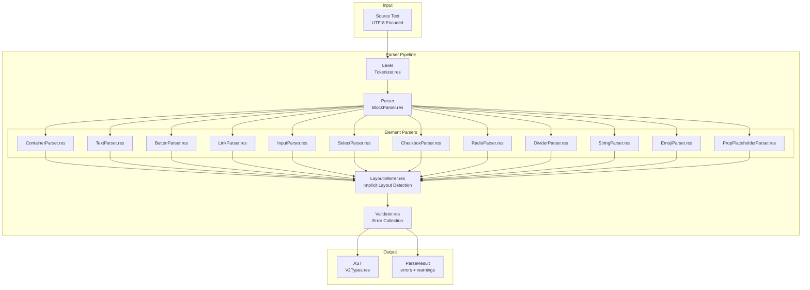
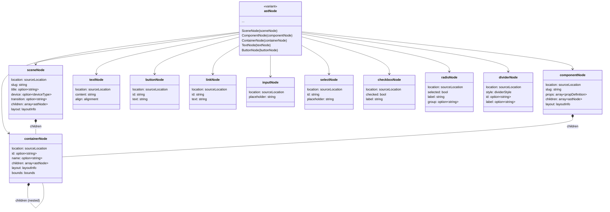
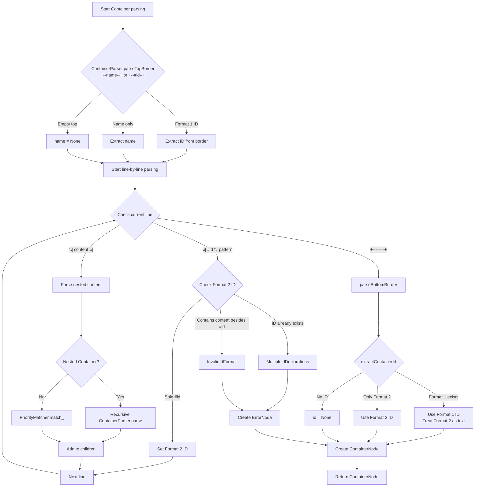
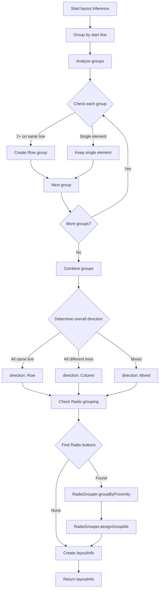

# Wyreframe Syntax v2.3 Parser Design Document

## Overview

### Design Goals

This document defines the architecture and detailed design for the Wyreframe Syntax v2.3 Parser. The Parser is responsible for analyzing ASCII wireframe text and converting it into a structured AST (Abstract Syntax Tree).

### Document Information

- **Version**: 1.1.0
- **Based on Requirements**: .claude/specs/syntax-v2-parser/requirements.md
- **Based on Spec**: Wyreframe Syntax v2.3 Specification
- **Implementation Language**: ReScript (with @rescript/core)
- **Created**: 2025-12-27
- **Updated**: 2025-12-27
- **Status**: Draft

### Design Scope

**Included:**
- Block type (Scene, Component) parsing
- 9 core elements parsing
- ID system processing
- String Literal and Emoji Shortcode processing
- Implicit layout inference
- PropPlaceholder processing
- Error handling and recovery

**Excluded:**
- Interaction DSL parsing (separate parser)
- Rendering or code generation
- Styling and event handling

---

## Architecture Design

### System Architecture Diagram



### Data Flow Diagram

```mermaid
flowchart LR
    subgraph "Phase 1: Tokenization"
        A[Source Text] --> B[Character Stream]
        B --> C[Token Stream]
    end

    subgraph "Phase 2: Block Detection"
        C --> D{Block Type?}
        D -->|@scene:| E[Scene Context]
        D -->|@component:| F[Component Context]
        D -->|Neither| G[Error: Missing Block]
    end

    subgraph "Phase 3: Element Parsing"
        E --> H[PriorityMatcher.res]
        F --> H
        H --> I[Element Parsers]
        I --> J[Raw AST Nodes]
    end

    subgraph "Phase 4: Layout & Validation"
        J --> K[LayoutInferrer.res]
        K --> L[Validator.res]
        L --> M[Final AST]
        L --> N[Errors/Warnings]
    end
```

### Module Structure

```
src/parser/v2/
├── V2Parser.res             # Public API exports (main entry point)
├── types/
│   ├── V2Types.res          # AST node type definitions
│   ├── Token.res            # Token type definitions
│   └── V2Errors.res         # Error/Warning type definitions
├── lexer/
│   ├── Lexer.res            # Lexer main module
│   ├── Scanner.res          # Character scanner
│   └── TokenStream.res      # Token stream utilities
├── parser/
│   ├── BlockParser.res      # Block type parser (@scene, @component)
│   ├── ParseContext.res     # Parse context (scene/component state)
│   └── PriorityMatcher.res  # Priority-based pattern matching
├── elements/
│   ├── V2ElementParser.res  # Element parser interface
│   ├── V2ParserRegistry.res # Element parser registry
│   ├── ContainerParser.res  # Container parser (+--name--+)
│   ├── TextParser.res       # Text parser (fallback)
│   ├── ButtonParser.res     # Button parser ([ text ])
│   ├── LinkParser.res       # Link parser (< text >)
│   ├── InputParser.res      # Input parser ([__field__])
│   ├── SelectParser.res     # Select parser ([v: placeholder])
│   ├── CheckboxParser.res   # Checkbox parser ([x], [ ])
│   ├── RadioParser.res      # Radio parser ((*), ( ))
│   ├── DividerParser.res    # Divider parser (---, ===)
│   ├── StringParser.res     # String literal parser ("...")
│   ├── EmojiParser.res      # Emoji shortcode parser (:name:)
│   └── PropPlaceholderParser.res  # PropPlaceholder parser (${prop})
├── layout/
│   ├── LayoutInferrer.res   # Layout inference
│   └── RadioGrouper.res     # Radio button grouping
├── utils/
│   ├── PositionUtils.res    # Line/column tracking utilities
│   ├── Slugify.res          # Text to slug conversion
│   ├── UnicodeUtils.res     # Unicode utilities
│   └── EscapeUtils.res      # Escape sequence handling
├── registry/
│   ├── EmojiRegistry.res    # Emoji shortcode mappings
│   └── ElementRegistry.res  # Element parser registration
└── __tests__/
    ├── Lexer_test.res
    ├── Parser_test.res
    ├── elements/
    │   ├── ContainerParser_test.res
    │   ├── ButtonParser_test.res
    │   └── ...
    └── integration/
        └── FullParse_test.res
```

---

## Component Design

### Component 1: Lexer (Tokenizer)

**Responsibilities:**
- Process input text as a character stream
- Track position information (line, column)
- Classify basic tokens (identifier, punctuation, whitespace, newline)
- Correctly handle Unicode characters

**Interfaces:**

```rescript
// types/Token.res

/** Token position in source */
type position = {
  line: int,    // 1-based line number
  column: int,  // 1-based column number (Unicode-aware)
  offset: int,  // 0-based character offset
}

/** Token types */
type tokenType =
  | Identifier
  | Punctuation
  | Whitespace
  | Newline
  | String
  | Number
  | EOF

/** Token record */
type t = {
  tokenType: tokenType,
  value: string,
  position: position,
}

// lexer/Lexer.res

/** Lexer module type */
type t = {
  source: string,
  mutable current: int,
  mutable line: int,
  mutable column: int,
}

/** Create a new lexer from source text */
let make: string => t

/** Tokenize entire source */
let tokenize: t => TokenStream.t

/** Peek at current token without consuming */
let peek: t => Token.t

/** Consume and return current token */
let next: t => Token.t

/** Look ahead n tokens */
let lookAhead: (t, int) => Token.t

/** Get current position */
let getPosition: t => Token.position
```

```rescript
// lexer/TokenStream.res

/** Token stream type */
type t = {
  tokens: array<Token.t>,
  mutable current: int,
}

let make: array<Token.t> => t
let peek: t => Token.t
let next: t => Token.t
let lookAhead: (t, int) => Token.t
let rewind: (t, int) => unit
let isAtEnd: t => bool
```

**Dependencies:**
- `Token` from types/Token.res
- `Position` utilities from utils/PositionUtils.res

---

### Component 2: Parser (Main)

**Responsibilities:**
- Detect and parse block types (@scene, @component)
- Coordinate priority-based pattern matching
- Delegate to Element Parsers
- Manage Parse Context
- Collect and recover from errors

**Interfaces:**

```rescript
// parser/ParseContext.res

/** Block type variant */
type blockType =
  | Scene
  | Component

/** Prop definition for components */
type propDefinition = {
  name: string,
  optional: bool,
  defaultValue: option<string>,
}

/** Parse context record */
type t = {
  blockType: blockType,
  blockId: string,
  props: array<propDefinition>,
  mutable currentContainer: option<V2Types.containerNode>,
  mutable errors: array<V2Errors.parseError>,
  mutable warnings: array<V2Errors.parseWarning>,
}

let make: (~blockType: blockType, ~blockId: string) => t
let addError: (t, V2Errors.parseError) => unit
let addWarning: (t, V2Errors.parseWarning) => unit
let setCurrentContainer: (t, option<V2Types.containerNode>) => unit
```

```rescript
// parser/BlockParser.res

/** Parse options */
type parseOptions = {
  strict: bool,
  emojiRegistry: option<EmojiRegistry.t>,
  tabSize: int,
  maxDepth: int,
}

let defaultOptions: parseOptions

/** Main parse function */
let parse: (string, ~options: parseOptions=?) => V2Types.parseResult

/** Parse a single block */
let parseBlock: (TokenStream.t, ParseContext.t) => V2Types.blockNode

/** Parse content within a block */
let parseContent: (TokenStream.t, ParseContext.t) => array<V2Types.astNode>
```

**Dependencies:**
- `Lexer` for tokenization
- `V2ParserRegistry` for element parsing
- `LayoutInferrer` for layout detection

---

### Component 3: Element Parser Registry

**Responsibilities:**
- Register and manage element-specific parsers
- Select parsers based on priority
- Support extension with new element types

**Interfaces:**

```rescript
// elements/V2ElementParser.res

/** Parse result - Some(element) if successful, None if pattern doesn't match */
type parseResult = option<V2Types.elementNode>

/** Element parser interface (record type) */
type t = {
  elementType: V2Types.nodeType,
  priority: int,
  canParse: TokenStream.t => bool,
  parse: (ParseContext.t, TokenStream.t) => parseResult,
}

/** Helper to create an element parser */
let make: (
  ~elementType: V2Types.nodeType,
  ~priority: int,
  ~canParse: TokenStream.t => bool,
  ~parse: (ParseContext.t, TokenStream.t) => parseResult,
) => t
```

```rescript
// elements/V2ParserRegistry.res

/** Registry type */
type t = {
  mutable parsers: array<V2ElementParser.t>,
}

let make: unit => t

/** Register an element parser (auto-sorted by priority) */
let register: (t, V2ElementParser.t) => unit

/** Unregister a parser by element type */
let unregister: (t, V2Types.nodeType) => unit

/** Get all parsers sorted by priority (descending) */
let getParsersByPriority: t => array<V2ElementParser.t>

/** Try to parse using registered parsers */
let tryParse: (t, ParseContext.t, TokenStream.t) => option<V2Types.astNode>

/** Create registry with all default parsers */
let makeDefault: unit => t
```

**Dependencies:**
- Individual element parsers
- `ParseContext` for context-aware parsing

---

### Component 4: Container Parser

**Responsibilities:**
- Recognize `+--name--+` Container boundaries
- Recursively parse nested Containers
- Extract Container IDs (Format 1: `+--#id--+`, Format 2: `| #id |`)
- Parse children elements

**Interfaces:**

```rescript
// elements/ContainerParser.res

/** Container border info extracted from top border */
type containerBorderInfo = {
  name: option<string>,
  id: option<string>,  // Format 1 ID from border
  width: int,
  position: Token.position,
}

/** Priority constant */
let priority: int  // 10

/** Parse top border and extract info */
let parseTopBorder: TokenStream.t => option<containerBorderInfo>

/** Parse container content recursively */
let parseContainerContent: (ParseContext.t, TokenStream.t) => array<V2Types.astNode>

/** Parse bottom border */
let parseBottomBorder: TokenStream.t => result<unit, V2Errors.errorCode>

/** Extract container ID from border info and content */
let extractContainerId: (containerBorderInfo, array<V2Types.astNode>) => option<string>

/** Create a ContainerParser instance */
let make: unit => V2ElementParser.t
```

**Dependencies:**
- `TokenStream` for tokenization
- `V2ParserRegistry` for nested content parsing

---

### Component 5: Priority Matcher

**Responsibilities:**
- Attempt pattern matching in priority order
- Resolve pattern conflicts (e.g., `[x]` vs `[ x ]`)
- Return the first successfully matched parser

**Interfaces:**

```rescript
// parser/PriorityMatcher.res

/** Priority constants module */
module Priority = {
  let string: int          // 115 - "..." (supports multiline)
  let containerId: int     // 110
  let propPlaceholder: int // 105
  let emoji: int           // 100
  let select: int          // 95
  let input: int           // 90
  let radio: int           // 85
  let checkbox: int        // 80
  let button: int          // 70
  let link: int            // 60
  let dividerLabeledBold: int // 50
  let dividerLabeled: int  // 48
  let dividerId: int       // 45
  let divider: int         // 40
  let container: int       // 10
  let text: int            // 1 (fallback)
}

/** Priority matcher type */
type t = {
  registry: V2ParserRegistry.t,
}

let make: V2ParserRegistry.t => t

/** Match token stream against parsers in priority order */
let match_: (t, TokenStream.t) => option<V2ElementParser.t>

/** Get all parsers sorted by priority */
let getParsersInOrder: t => array<V2ElementParser.t>
```

**Dependencies:**
- `V2ParserRegistry`
- `TokenStream` for pattern checking

---

### Component 6: Layout Inferrer

**Responsibilities:**
- Infer layout based on element start positions
- Same line elements = Row arrangement
- Different line elements = Column arrangement
- Group Radio buttons

**Interfaces:**

```rescript
// layout/LayoutInferrer.res

/** Layout direction */
type direction =
  | Row
  | Column
  | Mixed

/** Element group */
type elementGroup = {
  direction: direction,
  children: array<V2Types.astNode>,
  startLine: int,
}

/** Layout info */
type layoutInfo = {
  direction: direction,
  groups: array<elementGroup>,
}

/** Radio group */
type radioGroup = {
  id: string,
  members: array<V2Types.radioNode>,
}

/** Infer layout from AST nodes */
let inferLayout: array<V2Types.astNode> => layoutInfo

/** Group radio buttons */
let groupRadioButtons: array<V2Types.radioNode> => array<radioGroup>

/** Calculate distribution within container */
let calculateDistribution: (array<V2Types.astNode>, int) => V2Types.distribution
```

```rescript
// layout/RadioGrouper.res

/** Group radio buttons by proximity */
let groupByProximity: array<V2Types.radioNode> => array<array<V2Types.radioNode>>

/** Assign group IDs to radio buttons */
let assignGroupIds: array<array<V2Types.radioNode>> => array<V2Types.radioNode>
```

**Dependencies:**
- AST node position information

---

### Component 7: Validator

**Responsibilities:**
- Validate parsing results
- Collect errors and warnings
- Support error recovery

**Interfaces:**

```rescript
// validator/Validator.res

/** Validation result */
type validationResult = {
  valid: bool,
  errors: array<V2Errors.parseError>,
  warnings: array<V2Errors.parseWarning>,
}

/** Validate AST node */
let validate: (V2Types.astNode, ParseContext.t) => validationResult

/** Collect all errors from context */
let collectErrors: ParseContext.t => array<V2Errors.parseError>

/** Collect all warnings from context */
let collectWarnings: ParseContext.t => array<V2Errors.parseWarning>
```

**Dependencies:**
- AST types
- Error types

---

## Data Model

### Core AST Type Definitions

```rescript
// types/V2Types.res

// =============================================================================
// Base Types
// =============================================================================

/** Position in source */
type position = {
  line: int,      // 1-based line number
  column: int,    // 1-based column number (Unicode-aware)
  offset: int,    // 0-based character offset
}

/** Source location span */
type sourceLocation = {
  start: position,
  end_: position,  // 'end' is reserved in ReScript
}

/** Node type variant */
type nodeType =
  | Scene
  | Component
  | Container
  | Text
  | Button
  | Link
  | Input
  | Select
  | Checkbox
  | Radio
  | Divider
  | String        // supports multiline content
  | Emoji
  | PropPlaceholder
  | Error

// =============================================================================
// Block Nodes
// =============================================================================

/** Device type variant */
type deviceType =
  | Mobile
  | Tablet
  | Desktop

/** Prop definition */
type propDefinition = {
  name: string,
  optional: bool,
  defaultValue: option<string>,
}

/** Layout direction */
type layoutDirection =
  | Row
  | Column
  | Mixed

/** Layout info */
type rec layoutInfo = {
  direction: layoutDirection,
  groups: array<elementGroup>,
}

and elementGroup = {
  direction: layoutDirection,
  children: array<astNode>,
  startLine: int,
}

// Forward declaration for recursive types
and astNode =
  | SceneNode(sceneNode)
  | ComponentNode(componentNode)
  | ContainerNode(containerNode)
  | TextNode(textNode)
  | ButtonNode(buttonNode)
  | LinkNode(linkNode)
  | InputNode(inputNode)
  | SelectNode(selectNode)
  | CheckboxNode(checkboxNode)
  | RadioNode(radioNode)
  | DividerNode(dividerNode)
  | StringNode(stringNode)
  | EmojiNode(emojiNode)
  | PropPlaceholderNode(propPlaceholderNode)
  | ErrorNode(errorNode)

and sceneNode = {
  location: sourceLocation,
  slug: string,
  title: option<string>,
  device: option<deviceType>,
  transition: option<string>,
  children: array<astNode>,
  layout: layoutInfo,
}

and componentNode = {
  location: sourceLocation,
  slug: string,
  props: array<propDefinition>,
  children: array<astNode>,
  layout: layoutInfo,
}

// =============================================================================
// Element Nodes
// =============================================================================

and bounds = {
  x: int,
  y: int,
  width: int,
  height: int,
}

and containerNode = {
  location: sourceLocation,
  id: option<string>,
  name: option<string>,
  children: array<astNode>,
  layout: layoutInfo,
  bounds: bounds,
}

/** Alignment type */
and alignment =
  | Left
  | Center
  | Right

and textNode = {
  location: sourceLocation,
  content: string,
  align: alignment,
}

and buttonNode = {
  location: sourceLocation,
  id: string,        // auto-generated slug from text
  text: string,
}

and linkNode = {
  location: sourceLocation,
  id: string,        // auto-generated slug from text
  text: string,
}

and inputNode = {
  location: sourceLocation,
  placeholder: string,
}

and selectNode = {
  location: sourceLocation,
  id: string,        // auto-generated slug from placeholder
  placeholder: string,
}

and checkboxNode = {
  location: sourceLocation,
  checked: bool,
  label: string,
}

and radioNode = {
  location: sourceLocation,
  selected: bool,
  label: string,
  group: option<string>,    // inferred group ID
}

/** Divider style */
and dividerStyle =
  | Normal
  | Bold

and dividerNode = {
  location: sourceLocation,
  style: dividerStyle,
  id: option<string>,
  label: option<string>,
}

// =============================================================================
// Special Nodes
// =============================================================================

/** String interpolation content */
and interpolationContent =
  | Literal(string)
  | Placeholder(propPlaceholderNode)

and stringNode = {
  location: sourceLocation,
  content: string,                              // supports multiline content
  interpolations: array<interpolationContent>,
  multiline: bool,                              // true if contains newlines
}

and emojiNode = {
  location: sourceLocation,
  shortcode: string,
  emoji: string,      // resolved Unicode emoji
}

and propPlaceholderNode = {
  location: sourceLocation,
  name: string,
  required: bool,
  defaultValue: option<string>,
}

and errorNode = {
  location: sourceLocation,
  message: string,
  recoveredContent: option<string>,
}

// =============================================================================
// Type Aliases
// =============================================================================

type blockNode =
  | SceneBlock(sceneNode)
  | ComponentBlock(componentNode)

type elementNode =
  | Element_Container(containerNode)
  | Element_Text(textNode)
  | Element_Button(buttonNode)
  | Element_Link(linkNode)
  | Element_Input(inputNode)
  | Element_Select(selectNode)
  | Element_Checkbox(checkboxNode)
  | Element_Radio(radioNode)
  | Element_Divider(dividerNode)

type specialNode =
  | Special_String(stringNode)
  | Special_Emoji(emojiNode)
  | Special_PropPlaceholder(propPlaceholderNode)

// =============================================================================
// Distribution Types
// =============================================================================

type distribution =
  | Equal
  | SpaceBetween
  | SpaceAround
  | Start
  | End
  | Center

// =============================================================================
// Radio Group
// =============================================================================

type radioGroup = {
  id: string,
  members: array<radioNode>,
}

// =============================================================================
// Parse Result
// =============================================================================

type parseResult = {
  ast: option<blockNode>,
  errors: array<V2Errors.parseError>,
  warnings: array<V2Errors.parseWarning>,
  success: bool,
}

// =============================================================================
// Helper Functions
// =============================================================================

/** Get node type from AST node */
let getNodeType: astNode => nodeType

/** Get source location from AST node */
let getLocation: astNode => sourceLocation

/** Check if node is a block node */
let isBlockNode: astNode => bool

/** Check if node is an element node */
let isElementNode: astNode => bool

/** Get children from node (if any) */
let getChildren: astNode => option<array<astNode>>
```

### Data Model Diagram



### Error Types

```rescript
// types/V2Errors.res

/** Error severity */
type severity =
  | Error
  | Warning

/** Error codes */
type errorCode =
  | InvalidIdFormat
  | MultipleIdDeclarations
  | UnclosedInput
  | UnclosedString
  | UnclosedContainer
  | MissingBlockDeclaration

/** Warning codes */
type warningCode =
  | PropOutsideComponent
  | UnknownEmoji(string)      // carries the unknown shortcode
  | MixedDividerLabelId
  | MissingCheckboxLabel
  | MissingRadioLabel

/** Parse error record */
type parseError = {
  code: errorCode,
  message: string,
  location: V2Types.sourceLocation,
  recoverable: bool,
}

/** Parse warning record */
type parseWarning = {
  code: warningCode,
  message: string,
  location: V2Types.sourceLocation,
}

/** Error message templates */
let getErrorMessage: errorCode => string

/** Warning message templates */
let getWarningMessage: warningCode => string

/** Create a parse error */
let makeError: (
  ~code: errorCode,
  ~location: V2Types.sourceLocation,
  ~recoverable: bool,
) => parseError

/** Create a parse warning */
let makeWarning: (
  ~code: warningCode,
  ~location: V2Types.sourceLocation,
) => parseWarning

// Implementation
let getErrorMessage = (code: errorCode): string => {
  switch code {
  | InvalidIdFormat => "Error: Invalid ID format - ID line must contain only #id"
  | MultipleIdDeclarations => "Error: Multiple ID declarations in container"
  | UnclosedInput => "Error: Unclosed Input boundary - missing '__]'"
  | UnclosedString => "Error: Unclosed string literal - missing '\"'"
  | UnclosedContainer => "Error: Unclosed container - missing bottom border"
  | MissingBlockDeclaration => "Error: Missing block declaration - add @scene: or @component:"
  }
}

let getWarningMessage = (code: warningCode): string => {
  switch code {
  | PropOutsideComponent => "Warning: PropPlaceholder outside @component - will render as literal"
  | UnknownEmoji(name) => `Warning: Unknown emoji shortcode ':${name}:' - rendering as text`
  | MixedDividerLabelId => "Warning: Mixed label and ID in divider - treating as text"
  | MissingCheckboxLabel => "Warning: Checkbox without label"
  | MissingRadioLabel => "Warning: Radio without label"
  }
}
```

---

## Business Process

### Process 1: Full Parse Flow

```mermaid
flowchart TD
    START[Call V2Parser.parse] --> INIT[ParseContext.make]
    INIT --> TOKENIZE[Lexer.tokenize]
    TOKENIZE --> DETECT_BLOCK{BlockParser.detectBlockType}

    DETECT_BLOCK -->|@scene:| PARSE_SCENE[BlockParser.parseScene]
    DETECT_BLOCK -->|@component:| PARSE_COMPONENT[BlockParser.parseComponent]
    DETECT_BLOCK -->|None| ERROR_BLOCK[V2Errors.MissingBlockDeclaration]

    PARSE_SCENE --> PARSE_PROPS[BlockParser.parseBlockProperties]
    PARSE_COMPONENT --> PARSE_PROPS

    PARSE_PROPS --> PARSE_CONTENT[BlockParser.parseContent]
    PARSE_CONTENT --> PRIORITY_MATCH{PriorityMatcher.match_}

    PRIORITY_MATCH -->|Match success| ELEMENT_PARSE[V2ElementParser.parse]
    PRIORITY_MATCH -->|Match failure| TEXT_FALLBACK[TextParser.parse]

    ELEMENT_PARSE --> COLLECT_NODES[Collect nodes]
    TEXT_FALLBACK --> COLLECT_NODES

    COLLECT_NODES --> HAS_MORE{TokenStream.isAtEnd?}
    HAS_MORE -->|No| PRIORITY_MATCH
    HAS_MORE -->|Yes| INFER_LAYOUT[LayoutInferrer.inferLayout]

    INFER_LAYOUT --> VALIDATE[Validator.validate]
    VALIDATE --> BUILD_RESULT[Create parseResult]

    ERROR_BLOCK --> BUILD_RESULT
    BUILD_RESULT --> RETURN[Return result]
```

### Process 2: Container Parsing



### Process 3: Bracket Element Disambiguation

```mermaid
flowchart TD
    START["[ ] pattern found"] --> CHECK_SELECT{"Starts with [v: ?"}

    CHECK_SELECT -->|Yes| PARSE_SELECT[SelectParser.parse<br/>Priority 95]
    CHECK_SELECT -->|No| CHECK_INPUT{"Starts with [__ & ends with __]?"}

    CHECK_INPUT -->|Yes| PARSE_INPUT[InputParser.parse<br/>Priority 90]
    CHECK_INPUT -->|No| CHECK_CHECKBOX{Exactly 3 chars with brackets?<br/>[x]/[X]/[v]/[V]/[ ]}

    CHECK_CHECKBOX -->|Yes| CHECK_LABEL{Label follows?}
    CHECK_LABEL -->|Yes| PARSE_CHECKBOX[CheckboxParser.parse<br/>Priority 80]
    CHECK_LABEL -->|No| WARN_LABEL[MissingCheckboxLabel warning<br/>Parse as Checkbox]

    CHECK_CHECKBOX -->|No| PARSE_BUTTON[ButtonParser.parse<br/>Priority 70]

    PARSE_SELECT --> RETURN[Return result]
    PARSE_INPUT --> RETURN
    PARSE_CHECKBOX --> RETURN
    WARN_LABEL --> RETURN
    PARSE_BUTTON --> RETURN
```

### Process 4: String Literal Parsing with Interpolation

```mermaid
flowchart TD
    START[Start String parsing] --> CHECK_QUOTE{"Starts with \"?"}

    CHECK_QUOTE -->|Yes| PARSE_STRING[Parse String<br/>Priority 115]
    CHECK_QUOTE -->|No| NOT_STRING[Not a String]

    PARSE_STRING --> SCAN_CONTENT[Scanner.scanContent]

    SCAN_CONTENT --> CHECK_CHAR{Current character}

    CHECK_CHAR -->|"\\\"" escape| ESCAPE_QUOTE[Add quote character]
    CHECK_CHAR -->|"\\\\" escape| ESCAPE_BACKSLASH[Add backslash]
    CHECK_CHAR -->|"\\$" escape| ESCAPE_DOLLAR[Add dollar sign]
    CHECK_CHAR -->|"${" start| PARSE_PROP[PropPlaceholderParser.parse]
    CHECK_CHAR -->|Closing quote| END_STRING[End string]
    CHECK_CHAR -->|Newline character| ADD_NEWLINE[Add newline, multiline=true]
    CHECK_CHAR -->|Regular character| ADD_CHAR[Add character]
    CHECK_CHAR -->|EOF| ERROR_UNCLOSED[UnclosedString error]

    ESCAPE_QUOTE --> NEXT_CHAR[Next character]
    ESCAPE_BACKSLASH --> NEXT_CHAR
    ESCAPE_DOLLAR --> NEXT_CHAR
    PARSE_PROP --> ADD_INTERP[Add to interpolations]
    ADD_INTERP --> NEXT_CHAR
    ADD_NEWLINE --> NEXT_CHAR
    ADD_CHAR --> NEXT_CHAR

    NEXT_CHAR --> CHECK_CHAR

    END_STRING --> BUILD_NODE[Create StringNode]
    ERROR_UNCLOSED --> ERROR_NODE[Create ErrorNode]

    BUILD_NODE --> RETURN[Return result]
    ERROR_NODE --> RETURN
```

### Process 5: Layout Inference



### Process 6: Error Recovery

```mermaid
flowchart TD
    START[Error occurred] --> CLASSIFY{Classify error}

    CLASSIFY -->|Recoverable| RECOVERABLE[Attempt recovery]
    CLASSIFY -->|Unrecoverable| UNRECOVERABLE[Halt parsing]

    RECOVERABLE --> ERROR_TYPE{errorCode type}

    ERROR_TYPE -->|UnclosedContainer| RECOVER_CONTAINER[Parse until current line<br/>Add ErrorNode]
    ERROR_TYPE -->|UnclosedString| RECOVER_STRING[String until end of line<br/>Add ErrorNode]
    ERROR_TYPE -->|UnclosedInput| RECOVER_INPUT[Find ] to close<br/>Add ErrorNode]
    ERROR_TYPE -->|InvalidIdFormat| RECOVER_ID[Treat as text<br/>Add warning]

    RECOVER_CONTAINER --> COLLECT_ERROR[ParseContext.addError]
    RECOVER_STRING --> COLLECT_ERROR
    RECOVER_INPUT --> COLLECT_ERROR
    RECOVER_ID --> COLLECT_WARNING[ParseContext.addWarning]

    COLLECT_ERROR --> CONTINUE[Continue parsing next element]
    COLLECT_WARNING --> CONTINUE

    UNRECOVERABLE --> FINAL_ERROR[Create final error]
    FINAL_ERROR --> RETURN_PARTIAL[Return partial AST + errors]

    CONTINUE --> NEXT_ELEMENT[Proceed to next element]
```

---

## Error Handling Strategy

### Error Categories

| Category | Recoverable | Description |
|----------|-------------|-------------|
| Syntax Errors | Partial | Syntax errors (unclosed brackets, etc.) |
| Semantic Errors | Yes | Semantic errors (duplicate IDs, etc.) |
| Fatal Errors | No | Unrecoverable errors |

### Error Recovery Mechanisms

1. **Synchronization Points**
   - Container boundaries (`+--------+`)
   - End of line (`\n`)
   - Block declarations (`@scene:`, `@component:`)

2. **Skip-to-Sync Strategy**
   - Skip to next synchronization point on error
   - Preserve skipped content as ErrorNode

3. **Partial Recovery**
   - Implicitly close unclosed elements at current line/block end
   - Include error information with recovered content

### Error Reporting Format

```rescript
// Error output example
let errorExample: V2Errors.parseError = {
  code: UnclosedContainer,
  message: "Error: Unclosed container - missing bottom border",
  location: {
    start: { line: 5, column: 1, offset: 45 },
    end_: { line: 5, column: 12, offset: 56 },
  },
  recoverable: true,
}
```

---

## Testing Strategy

### Test Categories

1. **Unit Tests**
   - Individual tests for each Element Parser
   - Lexer tokenization tests
   - Position calculation tests

2. **Integration Tests**
   - Full parsing flow tests
   - Nested Container tests
   - Layout inference tests

3. **Error Recovery Tests**
   - Recovery tests for each error type
   - Partial parsing result verification

4. **Performance Tests**
   - 100-line file: < 50ms
   - 1000-line file: < 500ms
   - Memory usage: < 10x input size

### Test Coverage Targets

| Component | Target Coverage |
|-----------|-----------------|
| Lexer | 95% |
| Parser | 90% |
| Element Parsers | 95% |
| Layout Inferrer | 90% |
| Error Handling | 85% |

### Example Test Cases

```rescript
// __tests__/elements/ContainerParser_test.res

open Vitest

describe("ContainerParser", () => {
  test("should parse container with name", () => {
    let input = `+--Login--+
|         |
+---------+`
    let result = V2Parser.parse(input)

    switch result.ast {
    | Some(SceneBlock(scene)) => {
        switch scene.children->Array.get(0) {
        | Some(ContainerNode(container)) => {
            expect(container.name)->toEqual(Some("Login"))
          }
        | _ => fail("Expected ContainerNode")
        }
      }
    | _ => fail("Expected SceneBlock")
    }
  })

  test("should parse container with format 1 ID", () => {
    let input = `+--#card1--+
|           |
+-----------+`
    let result = V2Parser.parse(input)

    switch result.ast {
    | Some(SceneBlock(scene)) => {
        switch scene.children->Array.get(0) {
        | Some(ContainerNode(container)) => {
            expect(container.id)->toEqual(Some("card1"))
          }
        | _ => fail("Expected ContainerNode")
        }
      }
    | _ => fail("Expected SceneBlock")
    }
  })

  test("should report error for multiple IDs", () => {
    let input = `+----------+
| #id1     |
| #id2     |
+----------+`
    let result = V2Parser.parse(input)

    let hasMultipleIdError = result.errors->Array.some(err => {
      err.code == MultipleIdDeclarations
    })

    expect(hasMultipleIdError)->toEqual(true)
  })
})
```

---

## Performance Considerations

### Optimization Strategies

1. **Lazy Tokenization**
   - Generate tokens only when needed
   - Minimize memory usage

2. **Look-ahead Caching**
   - Cache repetitive look-aheads in Priority Matcher
   - Improve pattern matching performance

3. **Incremental Parsing (Future)**
   - Re-parse only changed portions
   - Support real-time editing environments

### Memory Management

- Token object pooling
- AST node reuse (where possible)
- Streaming processing for large strings

---

## Extensibility Design

### Adding New Element Types

1. Create new parser module implementing `V2ElementParser.t`
2. Register with `V2ParserRegistry`
3. Add new node variant to `V2Types.astNode`
4. Assign priority value

```rescript
// Example: Adding a new element type
// elements/CustomElementParser.res

open V2Types

let priority = 75  // Between Button (70) and Checkbox (80)

let canParse = (stream: TokenStream.t): bool => {
  let token = TokenStream.peek(stream)
  token.value->String.startsWith("{{")
}

let parse = (context: ParseContext.t, stream: TokenStream.t): option<V2Types.astNode> => {
  // Implementation
  None  // placeholder
}

let make = (): V2ElementParser.t => {
  V2ElementParser.make(
    ~elementType=Custom,
    ~priority,
    ~canParse,
    ~parse,
  )
}

// Registration in V2ParserRegistry.res
let registry = V2ParserRegistry.make()
registry->V2ParserRegistry.register(CustomElementParser.make())
```

### Custom Emoji Registry

```rescript
// registry/EmojiRegistry.res

type t = {
  mutable mappings: Dict.t<string>,
}

let make = (): t => {
  { mappings: Dict.make() }
}

let register = (registry: t, shortcode: string, emoji: string): unit => {
  registry.mappings->Dict.set(shortcode, emoji)
}

let lookup = (registry: t, shortcode: string): option<string> => {
  registry.mappings->Dict.get(shortcode)
}

// Default registry with standard emoji
let makeDefault = (): t => {
  let registry = make()
  registry->register("check", "\u2714")
  registry->register("cross", "\u2718")
  registry->register("warning", "\u26A0")
  registry->register("info", "\u2139")
  registry->register("heart", "\u2764")
  registry->register("star", "\u2B50")
  registry->register("search", "\u{1F50D}")
  registry->register("settings", "\u2699")
  registry->register("user", "\u{1F464}")
  registry->register("home", "\u{1F3E0}")
  registry->register("mail", "\u2709")
  registry->register("bell", "\u{1F514}")
  registry->register("lock", "\u{1F512}")
  registry->register("bow", "\u{1F647}")
  registry
}

// Usage
let customRegistry = EmojiRegistry.make()
customRegistry->EmojiRegistry.register("custom", "\u{1F389}")
customRegistry->EmojiRegistry.register("company-logo", "\u{1F3E2}")
```

---

## API Design

### Public API

```rescript
// V2Parser.res - Main entry point

/** Parse options */
type parseOptions = {
  /** Enable strict mode (no error recovery) */
  strict: bool,
  /** Custom emoji registry */
  emojiRegistry: option<EmojiRegistry.t>,
  /** Tab size for column calculation */
  tabSize: int,
  /** Maximum nesting depth */
  maxDepth: int,
}

/** Default parse options */
let defaultOptions: parseOptions = {
  strict: false,
  emojiRegistry: None,
  tabSize: 4,
  maxDepth: 10,
}

/** Main parsing function */
@genType
let parse: (string, ~options: parseOptions=?) => V2Types.parseResult

/** Parse only wireframe (no interactions) */
@genType
let parseWireframe: string => V2Types.parseResult

/** Parser version */
@genType
let version: string

/** Parser implementation identifier */
@genType
let implementation: string
```

### Usage Example

```rescript
// Example usage
open V2Parser
open V2Types

let source = `
@scene: login
@title: Login Page

+--Login--+
| [__email__] |
| [__password__] |
| [ Sign In ] |
+---------+
`

let result = parse(source)

switch result.success {
| true => {
    switch result.ast {
    | Some(block) => Console.log2("AST:", block)
    | None => ()
    }
  }
| false => {
    Console.log("Errors:")
    result.errors->Array.forEach(err => {
      Console.log(err.message)
    })
  }
}

// Handle warnings
result.warnings->Array.forEach(w => {
  Console.warn(w.message)
})
```

---

## Traceability Matrix

| Requirement | Design Component | Test Category |
|-------------|------------------|---------------|
| REQ-1 Block Type | BlockParser.res, sceneNode, componentNode | Unit, Integration |
| REQ-2 Container | ContainerParser.res, containerNode | Unit, Integration |
| REQ-3 Container ID | ContainerParser.extractContainerId | Unit |
| REQ-4 Text | TextParser.res, textNode | Unit |
| REQ-5 Button | ButtonParser.res, buttonNode | Unit |
| REQ-6 Link | LinkParser.res, linkNode | Unit |
| REQ-7 Input | InputParser.res, inputNode | Unit |
| REQ-8 Select | SelectParser.res, selectNode | Unit |
| REQ-9 Checkbox | CheckboxParser.res, checkboxNode | Unit |
| REQ-10 Radio | RadioParser.res, radioNode, RadioGrouper.res | Unit, Integration |
| REQ-11 Divider | DividerParser.res, dividerNode | Unit |
| REQ-12 String Literal | StringParser.res, stringNode (multiline supported) | Unit |
| REQ-13 Emoji | EmojiParser.res, emojiNode, EmojiRegistry.res | Unit |
| REQ-14 PropPlaceholder | PropPlaceholderParser.res, propPlaceholderNode | Unit |
| REQ-15 Implicit Layout | LayoutInferrer.res, layoutInfo | Integration |
| REQ-16 Priority System | PriorityMatcher.res, Priority module | Integration |
| REQ-17 Error Handling | Validator.res, V2Errors.res | Error Recovery |
| REQ-18 AST Output | V2Types.res, parseResult | Integration |
| REQ-19 Performance | Lazy tokenization, caching | Performance |
| REQ-20 Extensibility | V2ParserRegistry.res, EmojiRegistry.res | Unit |
| REQ-21 Error Recovery | Validator.res, synchronization points | Error Recovery |
| REQ-22 Unicode | PositionUtils.res, UnicodeUtils.res | Unit |

---

## V1/V2 Parser Integration Strategy

### Coexistence Approach

The V2 parser is designed to coexist with the existing V1 parser during the transition period. Both parsers can be used simultaneously without conflicts.

### Directory Structure

```
src/parser/
├── Core/                    # Shared types (Position, Bounds) - V1
├── Semantic/                # V1 parser implementation
├── Detector/                # V1 element detection
├── Errors/                  # V1 error handling
├── Interactions/            # V1 interaction parsing
├── Fixer/                   # V1 error correction
├── Parser.res               # V1 entry point
├── ParserTypes.res          # V1 types
└── v2/                      # V2 parser (NEW)
    ├── V2Parser.res         # V2 entry point
    ├── types/               # V2-specific types
    ├── lexer/               # V2 lexer
    ├── parser/              # V2 parser core
    ├── elements/            # V2 element parsers
    ├── layout/              # V2 layout inference
    ├── utils/               # V2 utilities
    ├── registry/            # V2 registries
    └── __tests__/           # V2 tests
```

### Shared Components

The following components from V1 can be potentially reused:

| V1 Component | V2 Equivalent | Reuse Strategy |
|--------------|---------------|----------------|
| `Core/Position.res` | `v2/types/V2Types.position` | Consider sharing or aliasing |
| `Core/Bounds.res` | `v2/types/V2Types.bounds` | Consider sharing or aliasing |
| `Errors/ErrorTypes.res` | `v2/types/V2Errors.res` | Separate implementations |

### Migration Path

1. **Phase 1 (Current)**: V2 parser development in isolation at `src/parser/v2/`
2. **Phase 2**: Side-by-side testing - both parsers parse same input, compare results
3. **Phase 3**: Feature flag to select V1 or V2 parser at runtime
4. **Phase 4**: V2 becomes default, V1 available as fallback
5. **Phase 5**: V1 deprecation and removal

### API Compatibility

The V2 parser exports a similar API to V1 for easier migration:

```rescript
// V1 API
let parse: string => Parser.parseResult

// V2 API (compatible shape)
let parse: (string, ~options: parseOptions=?) => V2Types.parseResult
```

### Type Interoperability

For gradual migration, AST conversion functions may be provided:

```rescript
// Future: Convert V2 AST to V1 format for compatibility
let v2ToV1: V2Types.astNode => ParserTypes.astNode

// Future: Convert V1 AST to V2 format for upgrade
let v1ToV2: ParserTypes.astNode => V2Types.astNode
```

---

## Summary

This design document defines the complete architecture and detailed design for the Wyreframe Syntax v2.3 Parser implemented in ReScript.

**Key Design Decisions:**

1. **Modular Architecture**: Separated into Lexer, Parser, Element Parsers, Layout Inferrer
2. **Priority-based Pattern Matching**: Clear element distinction with priorities from 115 to 1
3. **Error Recovery**: Support partial parsing through synchronization points
4. **Extensibility**: Easy addition of new element types through Element Parser registry
5. **Performance**: Optimization through lazy tokenization and caching
6. **ReScript Patterns**: Using variant types, record types, and module-based organization

**ReScript-Specific Patterns:**

- Variant types for AST nodes (e.g., `astNode`, `nodeType`, `errorCode`)
- Record types for parser interfaces (e.g., `V2ElementParser.t`)
- Module-based organization with clear signatures
- Result type for error handling (`result<'a, 'e>`)
- Option type for nullable values (`option<'a>`)
- GenType annotations for TypeScript interop (`@genType`)

**Next Steps:**
- Create Implementation Plan
- Implement each component in detail
- Write test code

---

**Version**: 1.1.0
**Last Updated**: 2025-12-27
**Status**: Draft
