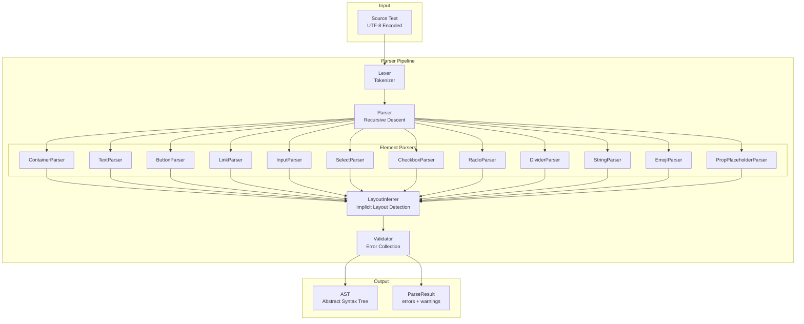
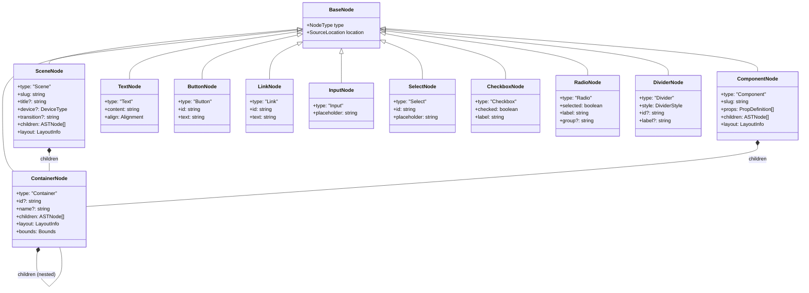
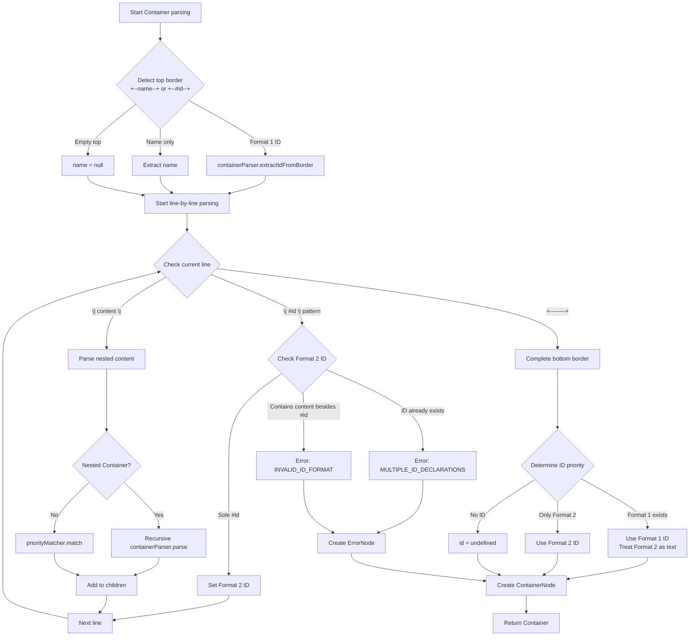
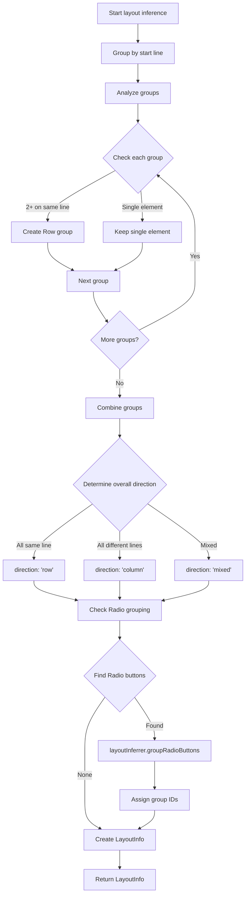

# Wyreframe Syntax v2.3 Parser Design Document

## Overview

### Design Goals

This document defines the architecture and detailed design for the Wyreframe Syntax v2.3 Parser. The Parser is responsible for analyzing ASCII wireframe text and converting it into a structured AST (Abstract Syntax Tree).

### Document Information

- **Version**: 1.0.0
- **Based on Requirements**: .claude/specs/syntax-v2-parser/requirements.md
- **Based on Spec**: docs/syntax-v2.md (v2.3.0-draft)
- **Created**: 2025-12-27
- **Status**: Draft

### Design Scope

**Included:**
- Block type (Scene, Component) parsing
- 9 core elements parsing
- ID system processing
- String Literal and Emoji Shortcode processing
- Implicit layout inference
- PropPlaceholder processing
- Error handling and recovery

**Excluded:**
- Interaction DSL parsing (separate parser)
- Rendering or code generation
- Styling and event handling

---

## Architecture Design

### System Architecture Diagram



### Data Flow Diagram

```mermaid
flowchart LR
    subgraph "Phase 1: Tokenization"
        A[Source Text] --> B[Character Stream]
        B --> C[Token Stream]
    end

    subgraph "Phase 2: Block Detection"
        C --> D{Block Type?}
        D -->|@scene:| E[Scene Context]
        D -->|@component:| F[Component Context]
        D -->|Neither| G[Error: Missing Block]
    end

    subgraph "Phase 3: Element Parsing"
        E --> H[Priority Matcher]
        F --> H
        H --> I[Element Parsers]
        I --> J[Raw AST Nodes]
    end

    subgraph "Phase 4: Layout & Validation"
        J --> K[Layout Inferrer]
        K --> L[Validator]
        L --> M[Final AST]
        L --> N[Errors/Warnings]
    end
```

### Module Structure

```
src/parser/
├── index.ts                 # Public API exports
├── types/
│   ├── ast.ts               # AST node type definitions
│   ├── tokens.ts            # Token type definitions
│   ├── errors.ts            # Error/Warning type definitions
│   └── options.ts           # Parser options interface
├── lexer/
│   ├── index.ts             # Lexer main class
│   ├── scanner.ts           # Character scanner
│   └── token-stream.ts      # Token stream utilities
├── parser/
│   ├── index.ts             # Main parser class
│   ├── context.ts           # Parse context (scene/component)
│   ├── priority-matcher.ts  # Priority-based pattern matching
│   └── block-parser.ts      # Block type parser
├── elements/
│   ├── index.ts             # Element parser registry
│   ├── container.ts         # Container parser
│   ├── text.ts              # Text parser
│   ├── button.ts            # Button parser
│   ├── link.ts              # Link parser
│   ├── input.ts             # Input parser
│   ├── select.ts            # Select parser
│   ├── checkbox.ts          # Checkbox parser
│   ├── radio.ts             # Radio parser
│   ├── divider.ts           # Divider parser
│   ├── string-literal.ts    # String parser
│   ├── emoji.ts             # Emoji shortcode parser
│   └── prop-placeholder.ts  # PropPlaceholder parser
├── layout/
│   ├── index.ts             # Layout inferrer
│   └── grouping.ts          # Radio/element grouping
├── utils/
│   ├── position.ts          # Line/column tracking
│   ├── slug.ts              # Text to slug conversion
│   ├── unicode.ts           # Unicode utilities
│   └── escape.ts            # Escape sequence handling
├── registry/
│   ├── emoji-registry.ts    # Emoji shortcode mappings
│   └── element-registry.ts  # Element parser registration
└── __tests__/
    ├── lexer.test.ts
    ├── parser.test.ts
    ├── elements/
    │   ├── container.test.ts
    │   ├── button.test.ts
    │   └── ...
    └── integration/
        └── full-parse.test.ts
```

---

## Component Design

### Component 1: Lexer (Tokenizer)

**Responsibilities:**
- Process input text as a character stream
- Track position information (line, column)
- Classify basic tokens (identifier, punctuation, whitespace, newline)
- Correctly handle Unicode characters

**Interfaces:**

```typescript
interface Lexer {
  tokenize(source: string): TokenStream;
  peek(): Token;
  next(): Token;
  lookAhead(count: number): Token;
  getPosition(): Position;
}

interface TokenStream {
  tokens: Token[];
  current: number;
  peek(): Token;
  next(): Token;
  lookAhead(n: number): Token;
  rewind(position: number): void;
}
```

**Dependencies:**
- `Position` from utils/position.ts
- `Token` types from types/tokens.ts

---

### Component 2: Parser (Main)

**Responsibilities:**
- Detect and parse block types (@scene, @component)
- Coordinate priority-based pattern matching
- Delegate to Element Parsers
- Manage Parse Context
- Collect and recover from errors

**Interfaces:**

```typescript
interface Parser {
  parse(source: string, options?: ParseOptions): ParseResult;
  parseBlock(): BlockNode;
  parseContent(context: ParseContext): ASTNode[];
}

interface ParseContext {
  blockType: 'scene' | 'component';
  blockId: string;
  props?: PropDefinition[];
  currentContainer?: ContainerNode;
  errors: ParseError[];
  warnings: ParseWarning[];
}
```

**Dependencies:**
- `Lexer` for tokenization
- `ElementParserRegistry` for element parsing
- `LayoutInferrer` for layout detection

---

### Component 3: Element Parser Registry

**Responsibilities:**
- Register and manage element-specific parsers
- Select parsers based on priority
- Support extension with new element types

**Interfaces:**

```typescript
interface ElementParserRegistry {
  register(parser: ElementParser): void;
  unregister(type: ElementType): void;
  getParserByPriority(): ElementParser[];
  tryParse(context: ParseContext, lexer: Lexer): ASTNode | null;
}

interface ElementParser {
  readonly type: ElementType;
  readonly priority: number;
  canParse(lexer: Lexer): boolean;
  parse(context: ParseContext, lexer: Lexer): ASTNode;
}
```

**Dependencies:**
- Individual element parsers
- `ParseContext` for context-aware parsing

---

### Component 4: Container Parser

**Responsibilities:**
- Recognize `+--name--+` Container boundaries
- Recursively parse nested Containers
- Extract Container IDs (Format 1: `+--#id--+`, Format 2: `| #id |`)
- Parse children elements

**Interfaces:**

```typescript
interface ContainerParser extends ElementParser {
  readonly priority: 10;
  parseTopBorder(lexer: Lexer): ContainerBorderInfo;
  parseContainerContent(context: ParseContext, lexer: Lexer): ASTNode[];
  parseBottomBorder(lexer: Lexer): void;
  extractContainerId(borderInfo: ContainerBorderInfo, content: ASTNode[]): string | null;
}

interface ContainerBorderInfo {
  name: string | null;
  id: string | null;  // Format 1 ID
  width: number;
  position: Position;
}
```

**Dependencies:**
- `Lexer` for tokenization
- `ElementParserRegistry` for nested content parsing

---

### Component 5: Priority Matcher

**Responsibilities:**
- Attempt pattern matching in priority order
- Resolve pattern conflicts (e.g., `[x]` vs `[ x ]`)
- Return the first successfully matched parser

**Interfaces:**

```typescript
interface PriorityMatcher {
  readonly priorityOrder: readonly number[];
  match(lexer: Lexer): ElementParser | null;
  getParsersInOrder(): ElementParser[];
}

// Priority constants
const PRIORITY = {
  STRING: 115,           // "..." (supports multiline)
  CONTAINER_ID: 110,
  PROP_PLACEHOLDER: 105,
  EMOJI: 100,
  SELECT: 95,
  INPUT: 90,
  RADIO: 85,
  CHECKBOX: 80,
  BUTTON: 70,
  LINK: 60,
  DIVIDER_LABELED_BOLD: 50,
  DIVIDER_LABELED: 48,
  DIVIDER_ID: 45,
  DIVIDER: 40,
  CONTAINER: 10,
  TEXT: 1,
} as const;
```

**Dependencies:**
- `ElementParserRegistry`
- `Lexer` for pattern checking

---

### Component 6: Layout Inferrer

**Responsibilities:**
- Infer layout based on element start positions
- Same line elements = Row arrangement
- Different line elements = Column arrangement
- Group Radio buttons

**Interfaces:**

```typescript
interface LayoutInferrer {
  inferLayout(nodes: ASTNode[]): LayoutInfo;
  groupRadioButtons(nodes: RadioNode[]): RadioGroup[];
  calculateDistribution(nodes: ASTNode[], containerWidth: number): Distribution;
}

interface LayoutInfo {
  direction: 'row' | 'column' | 'mixed';
  groups: ElementGroup[];
}

interface ElementGroup {
  direction: 'row' | 'column';
  children: ASTNode[];
  startLine: number;
}
```

**Dependencies:**
- AST node position information

---

### Component 7: Validator

**Responsibilities:**
- Validate parsing results
- Collect errors and warnings
- Support error recovery

**Interfaces:**

```typescript
interface Validator {
  validate(ast: ASTNode, context: ParseContext): ValidationResult;
  collectErrors(): ParseError[];
  collectWarnings(): ParseWarning[];
}

interface ValidationResult {
  valid: boolean;
  errors: ParseError[];
  warnings: ParseWarning[];
}
```

**Dependencies:**
- AST types
- Error types

---

## Data Model

### Core AST Type Definitions

```typescript
// =============================================================================
// Base Types
// =============================================================================

interface Position {
  line: number;      // 1-based line number
  column: number;    // 1-based column number (Unicode-aware)
  offset: number;    // 0-based character offset
}

interface SourceLocation {
  start: Position;
  end: Position;
}

interface BaseNode {
  type: NodeType;
  location: SourceLocation;
}

type NodeType =
  | 'Scene'
  | 'Component'
  | 'Container'
  | 'Text'
  | 'Button'
  | 'Link'
  | 'Input'
  | 'Select'
  | 'Checkbox'
  | 'Radio'
  | 'Divider'
  | 'String'       // supports multiline content
  | 'Emoji'
  | 'PropPlaceholder'
  | 'Error';

// =============================================================================
// Block Nodes
// =============================================================================

interface SceneNode extends BaseNode {
  type: 'Scene';
  slug: string;
  title?: string;
  device?: 'mobile' | 'tablet' | 'desktop';
  transition?: string;
  children: ASTNode[];
  layout: LayoutInfo;
}

interface ComponentNode extends BaseNode {
  type: 'Component';
  slug: string;
  props: PropDefinition[];
  children: ASTNode[];
  layout: LayoutInfo;
}

interface PropDefinition {
  name: string;
  optional: boolean;
  defaultValue?: string;
}

// =============================================================================
// Element Nodes
// =============================================================================

interface ContainerNode extends BaseNode {
  type: 'Container';
  id?: string;
  name?: string;
  children: ASTNode[];
  layout: LayoutInfo;
  bounds: Bounds;
}

interface Bounds {
  x: number;
  y: number;
  width: number;
  height: number;
}

interface TextNode extends BaseNode {
  type: 'Text';
  content: string;
  align: 'Left' | 'Center' | 'Right';
}

interface ButtonNode extends BaseNode {
  type: 'Button';
  id: string;        // auto-generated slug from text
  text: string;
}

interface LinkNode extends BaseNode {
  type: 'Link';
  id: string;        // auto-generated slug from text
  text: string;
}

interface InputNode extends BaseNode {
  type: 'Input';
  placeholder: string;
}

interface SelectNode extends BaseNode {
  type: 'Select';
  id: string;        // auto-generated slug from placeholder
  placeholder: string;
}

interface CheckboxNode extends BaseNode {
  type: 'Checkbox';
  checked: boolean;
  label: string;
}

interface RadioNode extends BaseNode {
  type: 'Radio';
  selected: boolean;
  label: string;
  group?: string;    // inferred group ID
}

interface DividerNode extends BaseNode {
  type: 'Divider';
  style: 'normal' | 'bold';
  id?: string;
  label?: string;
}

// =============================================================================
// Special Nodes
// =============================================================================

interface StringNode extends BaseNode {
  type: 'String';
  content: string;                                    // supports multiline content
  interpolations: (string | PropPlaceholderNode)[];
  multiline: boolean;                                 // true if contains newlines
}

interface EmojiNode extends BaseNode {
  type: 'Emoji';
  shortcode: string;
  emoji: string;      // resolved Unicode emoji
}

interface PropPlaceholderNode extends BaseNode {
  type: 'PropPlaceholder';
  name: string;
  required: boolean;
  defaultValue?: string;
}

interface ErrorNode extends BaseNode {
  type: 'Error';
  message: string;
  recoveredContent?: string;
}

// =============================================================================
// Union Types
// =============================================================================

type BlockNode = SceneNode | ComponentNode;

type ElementNode =
  | ContainerNode
  | TextNode
  | ButtonNode
  | LinkNode
  | InputNode
  | SelectNode
  | CheckboxNode
  | RadioNode
  | DividerNode;

type SpecialNode =
  | StringNode
  | EmojiNode
  | PropPlaceholderNode;

type ASTNode = BlockNode | ElementNode | SpecialNode | ErrorNode;

// =============================================================================
// Layout Types
// =============================================================================

interface LayoutInfo {
  direction: 'row' | 'column' | 'mixed';
  groups: ElementGroup[];
}

interface ElementGroup {
  direction: 'row' | 'column';
  children: ASTNode[];
  startLine: number;
}

interface RadioGroup {
  id: string;
  members: RadioNode[];
}

// =============================================================================
// Parse Result
// =============================================================================

interface ParseResult {
  ast: BlockNode | null;
  errors: ParseError[];
  warnings: ParseWarning[];
  success: boolean;
}
```

### Data Model Diagram



### Error Types

```typescript
interface ParseError {
  code: ErrorCode;
  message: string;
  location: SourceLocation;
  recoverable: boolean;
}

interface ParseWarning {
  code: WarningCode;
  message: string;
  location: SourceLocation;
}

type ErrorCode =
  | 'INVALID_ID_FORMAT'
  | 'MULTIPLE_ID_DECLARATIONS'
  | 'UNCLOSED_INPUT'
  | 'UNCLOSED_STRING'
  | 'UNCLOSED_CONTAINER'
  | 'MISSING_BLOCK_DECLARATION';

type WarningCode =
  | 'PROP_OUTSIDE_COMPONENT'
  | 'UNKNOWN_EMOJI'
  | 'MIXED_DIVIDER_LABEL_ID'
  | 'MISSING_CHECKBOX_LABEL'
  | 'MISSING_RADIO_LABEL';

// Error message templates
const ERROR_MESSAGES: Record<ErrorCode, string> = {
  INVALID_ID_FORMAT: 'Error: Invalid ID format - ID line must contain only #id',
  MULTIPLE_ID_DECLARATIONS: 'Error: Multiple ID declarations in container',
  UNCLOSED_INPUT: "Error: Unclosed Input boundary - missing '__]'",
  UNCLOSED_STRING: "Error: Unclosed string literal - missing '\"'",
  UNCLOSED_CONTAINER: 'Error: Unclosed container - missing bottom border',
  MISSING_BLOCK_DECLARATION: 'Error: Missing block declaration - add @scene: or @component:',
};

const WARNING_MESSAGES: Record<WarningCode, string> = {
  PROP_OUTSIDE_COMPONENT: 'Warning: PropPlaceholder outside @component - will render as literal',
  UNKNOWN_EMOJI: "Warning: Unknown emoji shortcode ':{name}:' - rendering as text",
  MIXED_DIVIDER_LABEL_ID: 'Warning: Mixed label and ID in divider - treating as text',
  MISSING_CHECKBOX_LABEL: 'Warning: Checkbox without label',
  MISSING_RADIO_LABEL: 'Warning: Radio without label',
};
```

---

## Business Process

### Process 1: Full Parse Flow

```mermaid
flowchart TD
    START[Call parse function] --> INIT[Initialize ParseContext]
    INIT --> TOKENIZE[Call lexer.tokenize]
    TOKENIZE --> DETECT_BLOCK{blockParser.detectBlockType}

    DETECT_BLOCK -->|@scene:| PARSE_SCENE[parseScene]
    DETECT_BLOCK -->|@component:| PARSE_COMPONENT[parseComponent]
    DETECT_BLOCK -->|None| ERROR_BLOCK[Error: MISSING_BLOCK_DECLARATION]

    PARSE_SCENE --> PARSE_PROPS[parseBlockProperties]
    PARSE_COMPONENT --> PARSE_PROPS

    PARSE_PROPS --> PARSE_CONTENT[parseContent]
    PARSE_CONTENT --> PRIORITY_MATCH{priorityMatcher.match}

    PRIORITY_MATCH -->|Match success| ELEMENT_PARSE[elementParser.parse]
    PRIORITY_MATCH -->|Match failure| TEXT_FALLBACK[textParser.parse]

    ELEMENT_PARSE --> COLLECT_NODES[Collect nodes]
    TEXT_FALLBACK --> COLLECT_NODES

    COLLECT_NODES --> HAS_MORE{More content?}
    HAS_MORE -->|Yes| PRIORITY_MATCH
    HAS_MORE -->|No| INFER_LAYOUT[layoutInferrer.inferLayout]

    INFER_LAYOUT --> VALIDATE[validator.validate]
    VALIDATE --> BUILD_RESULT[Create ParseResult]

    ERROR_BLOCK --> BUILD_RESULT
    BUILD_RESULT --> RETURN[Return result]
```

### Process 2: Container Parsing



### Process 3: Bracket Element Disambiguation

```mermaid
flowchart TD
    START["[ ] pattern found"] --> CHECK_SELECT{"Starts with [v: ?"}

    CHECK_SELECT -->|Yes| PARSE_SELECT[selectParser.parse<br/>Priority 95]
    CHECK_SELECT -->|No| CHECK_INPUT{"Starts with [__ & ends with __]?"}

    CHECK_INPUT -->|Yes| PARSE_INPUT[inputParser.parse<br/>Priority 90]
    CHECK_INPUT -->|No| CHECK_CHECKBOX{Exactly 3 chars with brackets?<br/>[x]/[X]/[v]/[V]/[ ]}

    CHECK_CHECKBOX -->|Yes| CHECK_LABEL{Label follows?}
    CHECK_LABEL -->|Yes| PARSE_CHECKBOX[checkboxParser.parse<br/>Priority 80]
    CHECK_LABEL -->|No| WARN_LABEL[Generate warning<br/>Parse as Checkbox]

    CHECK_CHECKBOX -->|No| PARSE_BUTTON[buttonParser.parse<br/>Priority 70]

    PARSE_SELECT --> RETURN[Return result]
    PARSE_INPUT --> RETURN
    PARSE_CHECKBOX --> RETURN
    WARN_LABEL --> RETURN
    PARSE_BUTTON --> RETURN
```

### Process 4: String Literal Parsing with Interpolation

```mermaid
flowchart TD
    START[Start String parsing] --> CHECK_QUOTE{"Starts with \"?"}

    CHECK_QUOTE -->|Yes| PARSE_STRING[Parse String<br/>Priority 115]
    CHECK_QUOTE -->|No| NOT_STRING[Not a String]

    PARSE_STRING --> SCAN_CONTENT[Scan content]

    SCAN_CONTENT --> CHECK_CHAR{Current character}

    CHECK_CHAR -->|"\\\"" escape| ESCAPE_QUOTE[Add quote character]
    CHECK_CHAR -->|"\\\\" escape| ESCAPE_BACKSLASH[Add backslash]
    CHECK_CHAR -->|"\\$" escape| ESCAPE_DOLLAR[Add dollar sign]
    CHECK_CHAR -->|"${" start| PARSE_PROP[propPlaceholderParser.parse]
    CHECK_CHAR -->|Closing quote| END_STRING[End string]
    CHECK_CHAR -->|Newline character| ADD_NEWLINE[Add newline, multiline=true]
    CHECK_CHAR -->|Regular character| ADD_CHAR[Add character]
    CHECK_CHAR -->|EOF| ERROR_UNCLOSED[Error: UNCLOSED_STRING]

    ESCAPE_QUOTE --> NEXT_CHAR[Next character]
    ESCAPE_BACKSLASH --> NEXT_CHAR
    ESCAPE_DOLLAR --> NEXT_CHAR
    PARSE_PROP --> ADD_INTERP[Add to interpolations]
    ADD_INTERP --> NEXT_CHAR
    ADD_NEWLINE --> NEXT_CHAR
    ADD_CHAR --> NEXT_CHAR

    NEXT_CHAR --> CHECK_CHAR

    END_STRING --> BUILD_NODE[Create StringNode]
    ERROR_UNCLOSED --> ERROR_NODE[Create ErrorNode]

    BUILD_NODE --> RETURN[Return result]
    ERROR_NODE --> RETURN
```

### Process 5: Layout Inference



### Process 6: Error Recovery

```mermaid
flowchart TD
    START[Error occurred] --> CLASSIFY{Classify error}

    CLASSIFY -->|Recoverable| RECOVERABLE[Attempt recovery]
    CLASSIFY -->|Unrecoverable| UNRECOVERABLE[Halt parsing]

    RECOVERABLE --> ERROR_TYPE{Error type}

    ERROR_TYPE -->|UNCLOSED_CONTAINER| RECOVER_CONTAINER[Parse until current line<br/>Add ErrorNode]
    ERROR_TYPE -->|UNCLOSED_STRING| RECOVER_STRING[String until end of line<br/>Add ErrorNode]
    ERROR_TYPE -->|UNCLOSED_INPUT| RECOVER_INPUT[Find ] to close<br/>Add ErrorNode]
    ERROR_TYPE -->|INVALID_ID_FORMAT| RECOVER_ID[Treat as text<br/>Add warning]

    RECOVER_CONTAINER --> COLLECT_ERROR[Collect error]
    RECOVER_STRING --> COLLECT_ERROR
    RECOVER_INPUT --> COLLECT_ERROR
    RECOVER_ID --> COLLECT_WARNING[Collect warning]

    COLLECT_ERROR --> CONTINUE[Continue parsing next element]
    COLLECT_WARNING --> CONTINUE

    UNRECOVERABLE --> FINAL_ERROR[Create final error]
    FINAL_ERROR --> RETURN_PARTIAL[Return partial AST + errors]

    CONTINUE --> NEXT_ELEMENT[Proceed to next element]
```

---

## Error Handling Strategy

### Error Categories

| Category | Recoverable | Description |
|----------|-------------|-------------|
| Syntax Errors | Partial | Syntax errors (unclosed brackets, etc.) |
| Semantic Errors | Yes | Semantic errors (duplicate IDs, etc.) |
| Fatal Errors | No | Unrecoverable errors |

### Error Recovery Mechanisms

1. **Synchronization Points**
   - Container boundaries (`+--------+`)
   - End of line (`\n`)
   - Block declarations (`@scene:`, `@component:`)

2. **Skip-to-Sync Strategy**
   - Skip to next synchronization point on error
   - Preserve skipped content as ErrorNode

3. **Partial Recovery**
   - Implicitly close unclosed elements at current line/block end
   - Include error information with recovered content

### Error Reporting Format

```typescript
// Error output example
{
  code: 'UNCLOSED_CONTAINER',
  message: 'Error: Unclosed container - missing bottom border',
  location: {
    start: { line: 5, column: 1, offset: 45 },
    end: { line: 5, column: 12, offset: 56 }
  },
  recoverable: true
}
```

---

## Testing Strategy

### Test Categories

1. **Unit Tests**
   - Individual tests for each Element Parser
   - Lexer tokenization tests
   - Position calculation tests

2. **Integration Tests**
   - Full parsing flow tests
   - Nested Container tests
   - Layout inference tests

3. **Error Recovery Tests**
   - Recovery tests for each error type
   - Partial parsing result verification

4. **Performance Tests**
   - 100-line file: < 50ms
   - 1000-line file: < 500ms
   - Memory usage: < 10x input size

### Test Coverage Targets

| Component | Target Coverage |
|-----------|-----------------|
| Lexer | 95% |
| Parser | 90% |
| Element Parsers | 95% |
| Layout Inferrer | 90% |
| Error Handling | 85% |

### Example Test Cases

```typescript
// Container parsing test
describe('ContainerParser', () => {
  it('should parse container with name', () => {
    const input = `+--Login--+
|         |
+---------+`;
    const result = parse(input);
    expect(result.ast.children[0]).toMatchObject({
      type: 'Container',
      name: 'Login',
    });
  });

  it('should parse container with format 1 ID', () => {
    const input = `+--#card1--+
|           |
+-----------+`;
    const result = parse(input);
    expect(result.ast.children[0]).toMatchObject({
      type: 'Container',
      id: 'card1',
    });
  });

  it('should report error for multiple IDs', () => {
    const input = `+----------+
| #id1     |
| #id2     |
+----------+`;
    const result = parse(input);
    expect(result.errors).toContainEqual(
      expect.objectContaining({
        code: 'MULTIPLE_ID_DECLARATIONS',
      })
    );
  });
});
```

---

## Performance Considerations

### Optimization Strategies

1. **Lazy Tokenization**
   - Generate tokens only when needed
   - Minimize memory usage

2. **Look-ahead Caching**
   - Cache repetitive look-aheads in Priority Matcher
   - Improve pattern matching performance

3. **Incremental Parsing (Future)**
   - Re-parse only changed portions
   - Support real-time editing environments

### Memory Management

- Token object pooling
- AST node reuse (where possible)
- Streaming processing for large strings

---

## Extensibility Design

### Adding New Element Types

1. Implement `ElementParser` interface
2. Register with `ElementParserRegistry`
3. Add new node type to AST types
4. Assign priority value

```typescript
// Example: Adding a new element type
class CustomElementParser implements ElementParser {
  readonly type = 'CustomElement' as const;
  readonly priority = 75; // Between Button (70) and Checkbox (80)

  canParse(lexer: Lexer): boolean {
    return lexer.peek().value.startsWith('{{');
  }

  parse(context: ParseContext, lexer: Lexer): CustomElementNode {
    // Implementation
  }
}

// Registration
registry.register(new CustomElementParser());
```

### Custom Emoji Registry

```typescript
// Extending emoji shortcodes
const emojiRegistry = new EmojiRegistry();
emojiRegistry.register(':custom:', '🎉');
emojiRegistry.register(':company-logo:', '🏢');

const parser = new Parser({
  emojiRegistry,
});
```

---

## API Design

### Public API

```typescript
// Main entry point
export function parse(source: string, options?: ParseOptions): ParseResult;

// Options interface
export interface ParseOptions {
  /** Enable strict mode (no error recovery) */
  strict?: boolean;

  /** Custom emoji registry */
  emojiRegistry?: EmojiRegistry;

  /** Tab size for column calculation */
  tabSize?: number;

  /** Maximum nesting depth */
  maxDepth?: number;
}

// Result interface
export interface ParseResult {
  /** Parsed AST (null if fatal error) */
  ast: BlockNode | null;

  /** Parse errors */
  errors: ParseError[];

  /** Parse warnings */
  warnings: ParseWarning[];

  /** Overall success status */
  success: boolean;
}

// Utility exports
export { Position, SourceLocation } from './types/ast';
export { ParseError, ParseWarning, ErrorCode, WarningCode } from './types/errors';
export * from './types/ast'; // All AST node types
```

### Usage Example

```typescript
import { parse, ParseResult } from '@wyreframe/parser';

const source = `
@scene: login
@title: Login Page

+--Login--+
| [__email__] |
| [__password__] |
| [ Sign In ] |
+---------+
`;

const result: ParseResult = parse(source);

if (result.success) {
  console.log('AST:', JSON.stringify(result.ast, null, 2));
} else {
  console.error('Errors:', result.errors);
}

// Handle warnings
result.warnings.forEach(w => console.warn(w.message));
```

---

## Traceability Matrix

| Requirement | Design Component | Test Category |
|-------------|------------------|---------------|
| REQ-1 Block Type | BlockParser, SceneNode, ComponentNode | Unit, Integration |
| REQ-2 Container | ContainerParser, ContainerNode | Unit, Integration |
| REQ-3 Container ID | ContainerParser.extractContainerId | Unit |
| REQ-4 Text | TextParser, TextNode | Unit |
| REQ-5 Button | ButtonParser, ButtonNode | Unit |
| REQ-6 Link | LinkParser, LinkNode | Unit |
| REQ-7 Input | InputParser, InputNode | Unit |
| REQ-8 Select | SelectParser, SelectNode | Unit |
| REQ-9 Checkbox | CheckboxParser, CheckboxNode | Unit |
| REQ-10 Radio | RadioParser, RadioNode, RadioGroup | Unit, Integration |
| REQ-11 Divider | DividerParser, DividerNode | Unit |
| REQ-12 String Literal | StringParser, StringNode (multiline supported) | Unit |
| REQ-13 Emoji | EmojiParser, EmojiNode, EmojiRegistry | Unit |
| REQ-14 PropPlaceholder | PropPlaceholderParser, PropPlaceholderNode | Unit |
| REQ-15 Implicit Layout | LayoutInferrer, LayoutInfo | Integration |
| REQ-16 Priority System | PriorityMatcher, PRIORITY constants | Integration |
| REQ-17 Error Handling | Validator, ParseError, ParseWarning | Error Recovery |
| REQ-18 AST Output | All AST types, ParseResult | Integration |
| REQ-19 Performance | Lazy tokenization, caching | Performance |
| REQ-20 Extensibility | ElementParserRegistry, EmojiRegistry | Unit |
| REQ-21 Error Recovery | Validator, synchronization points | Error Recovery |
| REQ-22 Unicode | Position.column, unicode utils | Unit |

---

## Summary

This design document defines the complete architecture and detailed design for the Wyreframe Syntax v2.3 Parser.

**Key Design Decisions:**

1. **Modular Architecture**: Separated into Lexer, Parser, Element Parsers, Layout Inferrer
2. **Priority-based Pattern Matching**: Clear element distinction with priorities from 115 to 1
3. **Error Recovery**: Support partial parsing through synchronization points
4. **Extensibility**: Easy addition of new element types through Element Parser registry
5. **Performance**: Optimization through lazy tokenization and caching

**Next Steps:**
- Create Implementation Plan
- Implement each component in detail
- Write test code

---

**Version**: 1.0.0
**Last Updated**: 2025-12-27
**Status**: Draft
