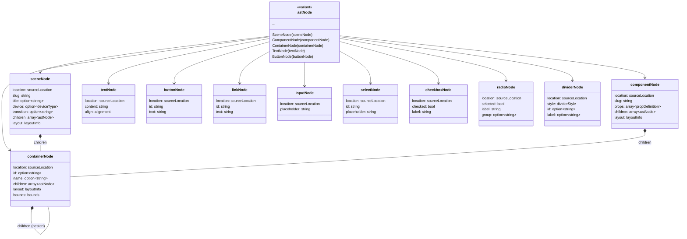
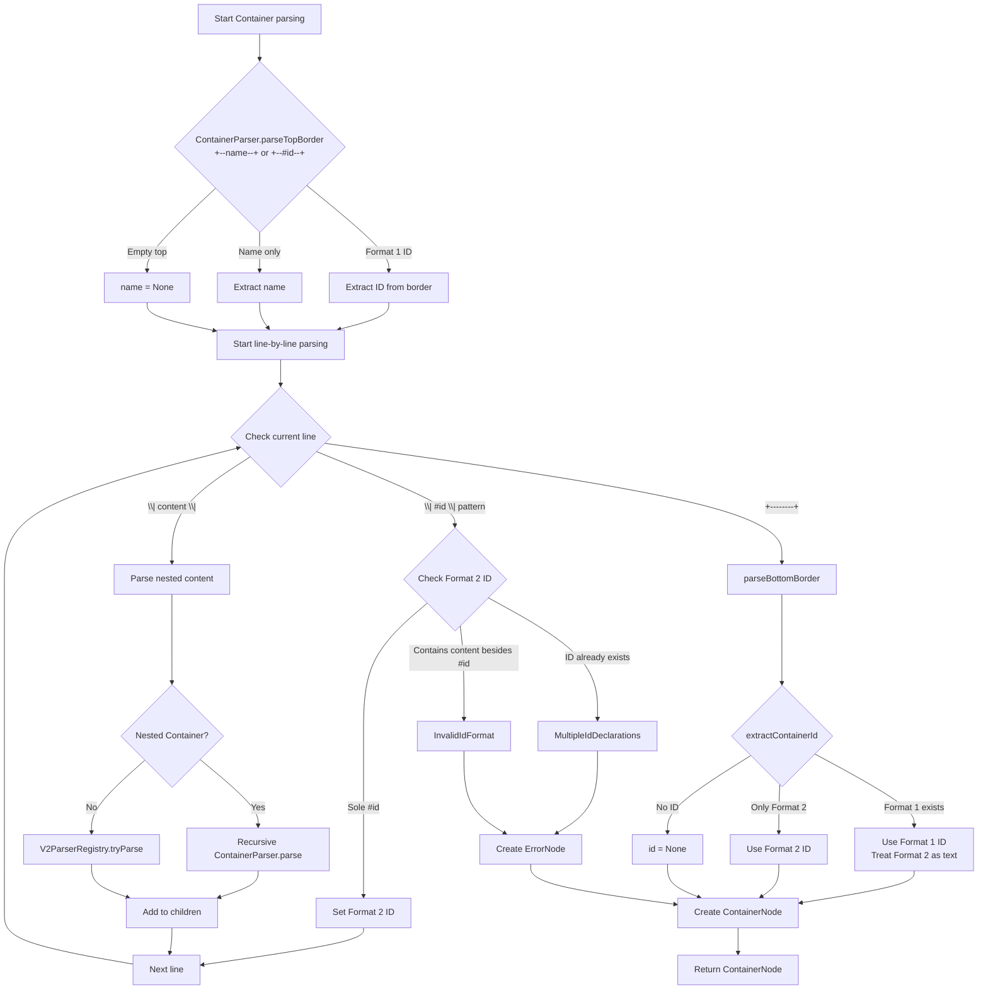
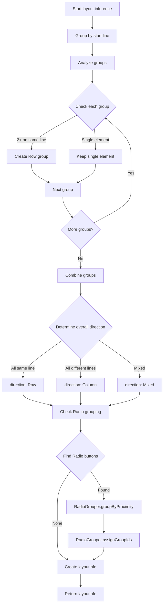
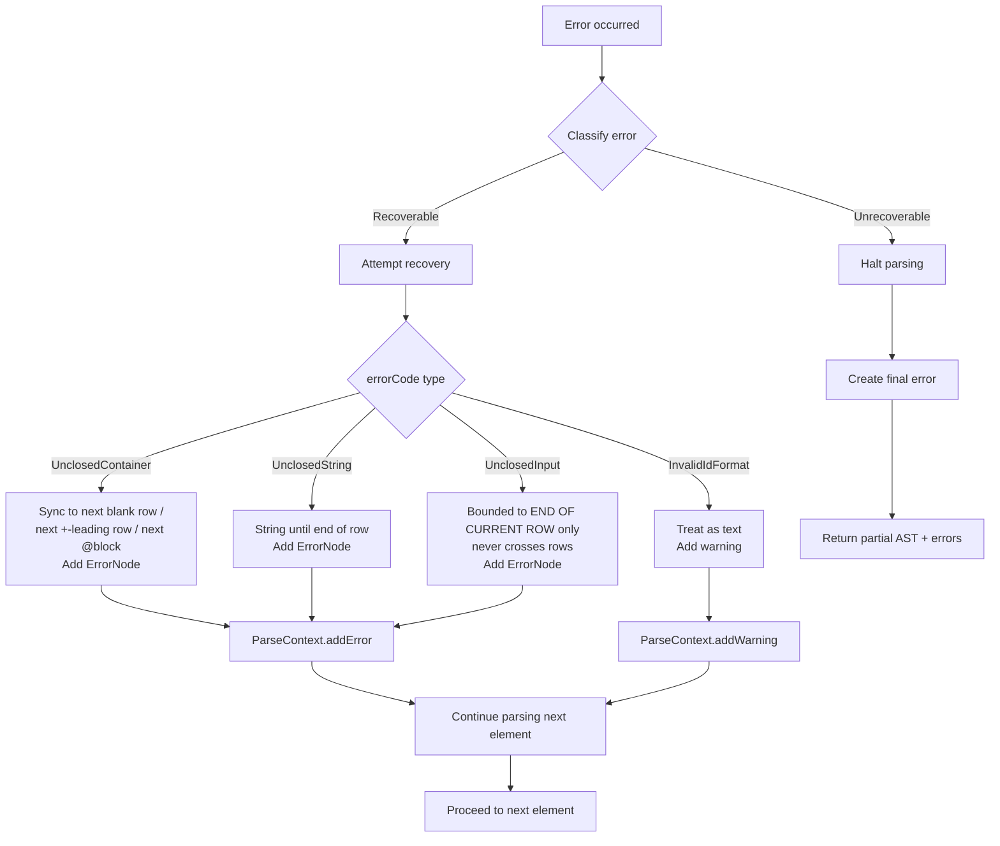

# Wyreframe Syntax v2.3 Parser Design Document

## Overview

### Design Goals

This document defines the architecture and detailed design for the Wyreframe Syntax v2.3 Parser. The Parser is responsible for analyzing ASCII wireframe text and converting it into a structured AST (Abstract Syntax Tree).

### Document Information

- **Version**: 1.2.0
- **Based on Requirements**: .claude/specs/syntax-v2-parser/requirements.md
- **Based on Spec**: Wyreframe Syntax v2.3 Specification
- **Implementation Language**: ReScript (with @rescript/core)
- **Created**: 2025-12-27
- **Updated**: 2026-06-08
- **Status**: Draft

### Design Philosophy

Wyreframe syntax is **2D ASCII art**, not a 1D text language. Two consequences shape this design:

1. **Grid-aware lexer.** Containers (`+--name--+` / `|`), text alignment, side-by-side layout, and radio grouping all depend on column-level alignment between non-adjacent lines. The lexer therefore carries both 1D coordinates (`offset`) and 2D coordinates (`row`, `col`) on every token, and a dedicated `GridIndex` lets parsers look up "what is at column X on row Y" without re-scanning.

2. **Heuristics are first-class.** Users hand-draw wireframes; misaligned by ±1 column, mixed tabs/spaces, slightly-off bottom borders are normal. Rather than hide tolerances inside parser internals, this design exposes them in a single [Heuristics Catalog](#heuristics-catalog) — named, tunable, testable, and traceable from runtime warnings back to a rule ID.

These two commitments — grid-aware tokens and explicit heuristics — should be applied throughout the implementation. When in doubt, prefer making a heuristic visible over hiding it in a `canParse` branch.

### Design Scope

**Included:**
- Block type (Scene, Component) parsing
- 9 core elements parsing
- ID system processing
- String Literal and Emoji Shortcode processing
- Implicit layout inference
- PropPlaceholder processing
- Error handling and recovery

**Excluded:**
- Interaction DSL parsing (separate parser)
- Rendering or code generation
- Styling and event handling

---

## Architecture Design

### System Architecture Diagram

```mermaid
graph TB
    subgraph Input
        SOURCE[Source Text<br/>UTF-8 Encoded]
    end

    subgraph "Parser Pipeline"
        LEXER[Lexer<br/>tokens + GridIndex]
        BLOCK[BlockParser<br/>@scene / @component]

        subgraph "Per-position dispatch"
            REGISTRY[V2ParserRegistry.tryParse<br/>priority-ordered canParse]
            EPS[Element Parsers<br/>Container / Text / Button / Link /<br/>Input / Select / Checkbox / Radio /<br/>Divider / String / Emoji / PropPlaceholder]
            REGISTRY -.->|first canParse=true| EPS
        end

        LAYOUT[LayoutInferrer<br/>+ RadioGrouper<br/>per parent.children]
        VALIDATOR[Validator<br/>cross-cutting checks]
        HEURISTICS[(Heuristics module<br/>shared by all stages)]
    end

    subgraph Output
        AST[AST<br/>V2Types]
        ERRORS[ParseResult<br/>errors + warnings + ruleIds]
    end

    SOURCE --> LEXER
    LEXER --> BLOCK
    BLOCK --> REGISTRY
    EPS --> LAYOUT
    LAYOUT --> VALIDATOR
    VALIDATOR --> AST
    VALIDATOR --> ERRORS
    HEURISTICS -.-> EPS
    HEURISTICS -.-> LAYOUT
    HEURISTICS -.-> VALIDATOR
```

### Data Flow Diagram

```mermaid
flowchart LR
    subgraph "Phase 1: Tokenization"
        A[Source Text] --> B[Character Stream]
        B --> C[Token Stream]
    end

    subgraph "Phase 2: Block Detection"
        C --> D{Block Type?}
        D -->|@scene:| E[Scene Context]
        D -->|@component:| F[Component Context]
        D -->|Neither| G[Error: Missing Block]
    end

    subgraph "Phase 3: Element Parsing"
        E --> H[V2ParserRegistry.tryParse]
        F --> H
        H --> I[Element Parsers]
        I --> J[Raw AST Nodes]
    end

    subgraph "Phase 4: Layout & Validation"
        J --> K[LayoutInferrer.res]
        K --> L[Validator.res]
        L --> M[Final AST]
        L --> N[Errors/Warnings]
    end
```

### Module Structure

```
src/parser/v2/
├── V2Parser.res             # Public API exports (main entry point)
├── types/
│   ├── V2Types.res          # AST node type definitions
│   ├── Token.res            # Token type definitions
│   └── V2Errors.res         # Error/Warning type definitions
├── lexer/
│   ├── Lexer.res            # Eager tokenizer (grid-aware)
│   ├── Scanner.res          # Character scanner (Unicode-aware)
│   ├── TokenStream.res      # Cursor over the token array (save/restore)
│   └── GridIndex.res        # Random-access (row, col) -> token index
├── parser/
│   ├── BlockParser.res      # Block type parser (@scene, @component)
│   ├── ParseContext.res     # Parse context (scene/component state)
│   └── Priority.res         # Priority constants (trial-order)
├── elements/
│   ├── V2ElementParser.res  # Element parser interface
│   ├── V2ParserRegistry.res # Element parser registry
│   ├── ContainerParser.res  # Container parser (+--name--+)
│   ├── TextParser.res       # Text parser (fallback)
│   ├── ButtonParser.res     # Button parser ([ text ])
│   ├── LinkParser.res       # Link parser (< text >)
│   ├── InputParser.res      # Input parser ([__field__])
│   ├── SelectParser.res     # Select parser ([v: placeholder])
│   ├── CheckboxParser.res   # Checkbox parser ([x], [ ])
│   ├── RadioParser.res      # Radio parser ((*), ( ))
│   ├── DividerParser.res    # Divider parser (---, ===)
│   ├── StringParser.res     # String literal parser ("...")
│   ├── EmojiParser.res      # Emoji shortcode parser (:name:)
│   └── PropPlaceholderParser.res  # PropPlaceholder parser (${prop})
├── layout/
│   ├── LayoutInferrer.res   # Layout inference (per parent.children)
│   └── RadioGrouper.res     # Radio button grouping (see Algorithm 3)
├── validator/
│   └── Validator.res        # Cross-cutting post-parse checks
├── utils/
│   ├── PositionUtils.res    # Row/column tracking utilities
│   ├── Slugify.res          # Text to slug conversion
│   ├── UnicodeUtils.res     # Grapheme & visual-width utilities (see Unicode Policy)
│   ├── EscapeUtils.res      # Escape sequence handling
│   └── Heuristics.res       # Tunable thresholds (see Heuristics Catalog)
├── registry/
│   ├── EmojiRegistry.res    # Emoji shortcode mappings
│   └── ElementRegistry.res  # Element parser registration
└── __tests__/
    ├── Lexer_test.res
    ├── Parser_test.res
    ├── elements/
    │   ├── ContainerParser_test.res
    │   ├── ButtonParser_test.res
    │   └── ...
    └── integration/
        └── FullParse_test.res
```

---

## Component Design

### Component 1: Grid-Aware Lexer

**Responsibilities:**
- Eagerly tokenize the source into a flat token array with **both 1D and 2D coordinates** on every token.
- Build a `GridIndex` mapping `(row, col) → token`, so parsers can ask "what character sits at column X of row Y?" in O(1) without rescanning.
- Recognize only **physical** lexemes (punctuation runs `+--+`, pipes `|`, brackets `[`/`]`, parens `(`/`)`, angle brackets `<`/`>`, dashes/equals runs, identifiers, strings, whitespace, newlines). Semantic disambiguation belongs to parsers.
- Correctly count columns under Unicode (see [Unicode Policy](#unicode-policy)).

**Why both coordinates?** A 1D `offset` is convenient for slicing source text and reporting errors; 2D `(row, col)` is required for column-alignment checks (Container borders, side-by-side layout, text alignment). Computing one from the other on the fly is slow and error-prone for ASCII-art content.

**Interfaces:**

```rescript
// types/Token.res

/** Token position in source - carries both 1D and 2D coordinates */
type position = {
  row: int,       // 0-based row (line index)
  col: int,       // 0-based visual column (Unicode-aware; wide chars count 2)
  offset: int,    // 0-based byte/character offset (Unicode-aware)
}

/** Physical token kinds — purely lexical, no semantic intent */
type tokenKind =
  | Identifier           // alphanumeric run
  | Dashes(int)          // `-` run with length
  | Equals(int)          // `=` run with length
  | Plus                 // `+`
  | Pipe                 // `|`
  | LBracket | RBracket  // `[` `]`
  | LParen   | RParen    // `(` `)`
  | LAngle   | RAngle    // `<` `>`
  | Underscores(int)     // `_` run with length
  | Colon                // `:`
  | Hash                 // `#`
  | Dollar               // `$`
  | LBrace   | RBrace    // `{` `}` (for ${...})
  | Asterisk             // `*`
  | Quote                // `"`
  | At                   // `@`
  | Comma                // `,`
  | QuestionMark         // `?`
  | Whitespace(int)      // run of spaces/tabs with visual width
  | Newline
  | Other(string)        // anything else (literal text)
  | EOF

type t = {
  kind: tokenKind,
  text: string,           // verbatim source slice
  position: position,     // start position
  endPosition: position,  // end position (exclusive)
}
```

```rescript
// lexer/Lexer.res

/** Tokenize the entire source eagerly. Returns the full token array.
    Lazy tokenization is rejected — see Performance Considerations. */
let tokenize: (~tabSize: int=?, string) => array<Token.t>
```

```rescript
// lexer/TokenStream.res

/** Cursor over a pre-tokenized array. Mutability is contained to a single cursor. */
type t

let make: array<Token.t> => t
let peek: t => Token.t
let peekAt: (t, int) => Token.t       // peek(N tokens ahead), 0 = current
let next: t => Token.t                 // advance and return
let save: t => int                     // snapshot cursor
let restore: (t, int) => unit          // rollback to snapshot (used by parsers' canParse)
let isAtEnd: t => bool
let position: t => Token.position
```

```rescript
// lexer/GridIndex.res

/** Random-access index over the tokenized source. */
type t

let make: array<Token.t> => t

/** Token whose span includes (row, col), or None if it's whitespace/empty. */
let tokenAt: (t, ~row: int, ~col: int) => option<Token.t>

/** Character at (row, col); ' ' if out of range. */
let charAt: (t, ~row: int, ~col: int) => string

/** All tokens on a given row in left-to-right order. */
let rowTokens: (t, ~row: int) => array<Token.t>

/** Highest row index in source. */
let lastRow: t => int
```

**`canParse` contract.** A parser's `canParse` may call `peek` / `peekAt` and use `save`/`restore` to roll back a probe. It must not advance the cursor on a `false` return. On `true`, the subsequent `parse` call is allowed to mutate.

**Dependencies:**
- `Token` from types/Token.res
- `PositionUtils` (utils/) for Unicode-aware column counting

---

### Component 2: Parser (Main)

**Responsibilities:**
- Detect and parse block types (@scene, @component)
- Coordinate priority-based pattern matching
- Delegate to Element Parsers
- Manage Parse Context
- Collect and recover from errors

**Interfaces:**

```rescript
// parser/ParseContext.res

/** Block type variant */
type blockType =
  | Scene
  | Component

/** Prop definition for components */
type propDefinition = {
  name: string,
  optional: bool,
  defaultValue: option<string>,
}

/** Parse context record */
type t = {
  blockType: blockType,
  blockId: string,
  props: array<propDefinition>,
  mutable currentContainer: option<V2Types.containerNode>,
  mutable errors: array<V2Errors.parseError>,
  mutable warnings: array<V2Errors.parseWarning>,
}

let make: (~blockType: blockType, ~blockId: string) => t
let addError: (t, V2Errors.parseError) => unit
let addWarning: (t, V2Errors.parseWarning) => unit
let setCurrentContainer: (t, option<V2Types.containerNode>) => unit
```

```rescript
// parser/BlockParser.res

/** Parse options */
type parseOptions = {
  strict: bool,
  emojiRegistry: option<EmojiRegistry.t>,
  tabSize: int,
  maxDepth: int,
}

let defaultOptions: parseOptions

/** Main parse function */
let parse: (string, ~options: parseOptions=?) => V2Types.parseResult

/** Parse a single block */
let parseBlock: (TokenStream.t, ParseContext.t) => V2Types.blockNode

/** Parse content within a block */
let parseContent: (TokenStream.t, ParseContext.t) => array<V2Types.astNode>
```

**Dependencies:**
- `Lexer` for tokenization
- `V2ParserRegistry` for element parsing
- `LayoutInferrer` for layout detection

---

### Component 3: Element Parser Registry

**Responsibilities:**
- Register element-specific parsers keyed by `nodeType`.
- Maintain a single priority-sorted list of parsers.
- Provide `tryParse(stream, ctx)`: walk parsers in descending priority, call each one's `canParse`, and dispatch `parse` on the first match.

This component **owns priority-based dispatch**. The previously separate `PriorityMatcher` has been merged into the registry — see [Priority and Disambiguation](#priority-and-disambiguation) below for why.

**Interfaces:**

```rescript
// elements/V2ElementParser.res

/** Parse outcome:
    - Some(node) → consumed input and produced a node
    - None       → canParse said yes but parse aborted (recoverable; reports via ctx) */
type parseResult = option<V2Types.astNode>

type t = {
  elementType: V2Types.nodeType,
  priority: int,
  /** Pure probe: must NOT advance the cursor. Free to use save/restore. */
  canParse: TokenStream.t => bool,
  /** Consume tokens and emit a node; record any errors/warnings on ctx. */
  parse: (ParseContext.t, TokenStream.t) => parseResult,
}

let make: (
  ~elementType: V2Types.nodeType,
  ~priority: int,
  ~canParse: TokenStream.t => bool,
  ~parse: (ParseContext.t, TokenStream.t) => parseResult,
) => t
```

```rescript
// elements/V2ParserRegistry.res

type t

let make: unit => t
let makeDefault: unit => t

let register: (t, V2ElementParser.t) => unit
let unregister: (t, V2Types.nodeType) => unit

/** Parsers in descending priority order (test/debug aid). */
let parsers: t => array<V2ElementParser.t>

/** Walk parsers by descending priority, return the first match's result.
    None means no parser claimed the current position (caller falls back to Text). */
let tryParse: (t, ParseContext.t, TokenStream.t) => option<V2Types.astNode>
```

**Dependencies:**
- Individual element parsers
- `ParseContext` for context-aware parsing

---

### Component 4: Container Parser

**Responsibilities:**
- Recognize `+--name--+` Container boundaries
- Recursively parse nested Containers
- Extract Container IDs (Format 1: `+--#id--+`, Format 2: `| #id |`)
- Parse children elements

**Interfaces:**

```rescript
// elements/ContainerParser.res

/** Container border info extracted from top border */
type containerBorderInfo = {
  name: option<string>,
  id: option<string>,  // Format 1 ID from border
  width: int,
  position: Token.position,
}

/** Priority constant */
let priority: int  // 10

/** Parse top border and extract info */
let parseTopBorder: TokenStream.t => option<containerBorderInfo>

/** Parse container content recursively */
let parseContainerContent: (ParseContext.t, TokenStream.t) => array<V2Types.astNode>

/** Parse bottom border */
let parseBottomBorder: TokenStream.t => result<unit, V2Errors.errorCode>

/** Extract container ID from border info and content */
let extractContainerId: (containerBorderInfo, array<V2Types.astNode>) => option<string>

/** Create a ContainerParser instance */
let make: unit => V2ElementParser.t
```

**Dependencies:**
- `TokenStream` for tokenization
- `V2ParserRegistry` for nested content parsing

---

### Component 5: Priority and Disambiguation

There are **two distinct concerns** the parser pipeline has to handle. They were previously conflated under "Priority Matcher"; this section separates them.

#### (A) Trial Order (Priority)

Priority is **the order in which `canParse` probes are attempted** at a given position. It is owned by `V2ParserRegistry`. The semantics are:

> *Walk parsers in descending priority. The first parser whose `canParse` returns `true` wins. Lower-priority parsers are not tried for this position.*

Priority values cluster by category, not by precise numeric distance — `dividerLabeledBold(50)` vs `dividerLabeled(48)` is **not** a tie-breaker between two overlapping patterns; both patterns are mutually exclusive at the token level, and the priority gap exists only to give each rule a stable, debuggable slot.

```rescript
// elements/Priority.res

/** Canonical priorities. Higher = tried first. */
module Priority = {
  let string: int          // 115 - "..." (highest; suppresses inner parsing)
  let containerId: int     // 110 - +--#id--+ / standalone | #id |
  let propPlaceholder: int // 105 - ${name}
  let emoji: int           // 100 - :name:
  let select: int          // 95  - [v: ...]
  let input: int           // 90  - [__...__]
  let radio: int           // 85  - (*) / ( )
  let checkbox: int        // 80  - [x] / [X] / [v] / [V] / [ ]
  let button: int          // 70  - [ ... ]  (fallback for bracket forms)
  let link: int            // 60  - < ... >
  let dividerLabeledBold: int // 50 - === text ===
  let dividerLabeled: int  // 48  - --- text ---
  let dividerId: int       // 45  - ---#id--- / ===#id===
  let divider: int         // 40  - --- / ===
  let container: int       // 10  - +--name--+ (multi-line; uses GridIndex)
  let text: int            // 1   - fallback
}
```

#### (B) Disambiguation Rules (inside `canParse`)

Whether a token sequence **really matches** a parser's pattern is decided by that parser's `canParse`. For the famously ambiguous bracket family, `canParse` encodes the rules explicitly:

| Parser | `canParse` rule (informal) |
|--------|---------------------------|
| Select | `[` immediately followed by `v` `:` |
| Input | `[` followed by `__` (2+ underscores) AND a closing `__]` exists on the same line |
| Checkbox | exactly `[x]` / `[X]` / `[v]` / `[V]` / `[ ]` (3 chars), with optional following label |
| Button | `[` ... `]` on one line that is **not** any of the above |

The previously separate Process 3 flowchart is *implementing* these rules; it is not a parallel mechanism. **Disambiguation lives inside each parser's `canParse`; the registry only decides trial order.**

#### Conflict resolution policy

- If two parsers might both legitimately match (rare; bug-prone), the higher-priority one wins by definition. Add a regression test fixture proving the choice.
- If a parser is unsure (e.g. its pattern *almost* matches), prefer to **return `false` from `canParse` and let the fallback chain continue**. Emit a warning from later passes if the input looked structurally close to a known pattern (see `nearMissPatterns` heuristic in the catalog).

**Dependencies:** none beyond `V2ParserRegistry` and `TokenStream`.

---

### Component 6: Layout Inferrer

**Responsibilities:**
- Given a parent's `children: array<astNode>`, derive its `layoutInfo` (direction, groups, distribution).
- Assign radio group IDs (mutating only the `group` field of `radioNode` records during AST assembly).

**Single source of truth.** Element nodes live exactly once, in `parent.children`. Layout groups address them by **index range**, never by re-storing the nodes. This eliminates the children duplication of the previous design.

**Interfaces:**

```rescript
// layout/LayoutInferrer.res

/** Layout direction */
type direction =
  | Row     // all children share a row
  | Column  // each child on its own row
  | Mixed   // multiple row-groups stacked

/** A contiguous slice of parent.children that shares a layout direction.
    [start, end_) is a half-open index range into parent.children. */
type elementGroup = {
  direction: direction,
  start: int,
  end_: int,        // exclusive
  startRow: int,    // visual row of the first child (debugging aid)
}

/** Computed layout. `distribution` is None when not applicable
    (e.g. single child, or unknown column width). */
type layoutInfo = {
  direction: direction,
  groups: array<elementGroup>,
  distribution: option<V2Types.distribution>,
}

/** Pure: derive layoutInfo for one parent given its children and bounds. */
let inferLayout: (
  ~children: array<V2Types.astNode>,
  ~containerBounds: option<V2Types.bounds>=?,
) => layoutInfo
```

```rescript
// layout/RadioGrouper.res

/** Given all radio nodes inside a parent (in document order) and that parent's
    bounds, partition them into groups by proximity heuristics
    (see Heuristics Catalog: radioGrouping.*) and assign each one a group ID. */
let assignGroups: (
  array<V2Types.radioNode>,
  ~parentBounds: option<V2Types.bounds>=?,
) => array<V2Types.radioNode>
```

**Dependencies:**
- AST node position information (`row`, `col`)
- `Heuristics` module for tunable thresholds

---

### Component 7: Validator (Cross-Cutting Checks)

**Scope.** Element parsers already emit their own local errors (unclosed input, missing label, etc.) onto `ParseContext` during parse. The Validator is responsible for **cross-cutting checks that require the assembled AST**, not for re-validating what parsers already checked.

Specifically:
- **ID uniqueness** within a block (duplicate Container IDs, Button/Link slug collisions).
- **Prop reference validity** — every `PropPlaceholder` name inside a `@component` must appear in that component's `@props:` list; otherwise emit a warning.
- **Radio group sanity** — no group containing exactly zero selected radios is an error, but two or more selected in the same group emits `MultipleRadiosSelected` (warning).
- **Depth limit** — enforce `parseOptions.maxDepth` on Container nesting; exceeding it produces an error and stops descending.
- **Near-miss reporting** — patterns flagged by parsers' `canParse` as "almost" matching a known shape are surfaced as warnings (see [Heuristics Catalog](#heuristics-catalog) → `nearMissPatterns`).

**Interfaces:**

```rescript
// validator/Validator.res

/** Run all cross-cutting checks against a fully-assembled block.
    Returns NEW errors/warnings; does not mutate the AST. */
let validate: V2Types.blockNode => (array<V2Errors.parseError>, array<V2Errors.parseWarning>)
```

**Dependencies:** AST types, Error types, `Heuristics` module.

---

## Data Model

### Core AST Type Definitions

```rescript
// types/V2Types.res

// =============================================================================
// Base Types
// =============================================================================

/** Position in source. Matches Token.position so positions flow through the
    pipeline without re-encoding. 0-based throughout; display layer adds +1
    when surfacing to humans. */
type position = {
  row: int,       // 0-based row (line index)
  col: int,       // 0-based visual column (Unicode-aware)
  offset: int,    // 0-based character offset
}

/** Source location span */
type sourceLocation = {
  start: position,
  end_: position,  // 'end' is reserved in ReScript
}

/** Node type variant */
type nodeType =
  | Scene
  | Component
  | Container
  | Text
  | Button
  | Link
  | Input
  | Select
  | Checkbox
  | Radio
  | Divider
  | String        // supports multiline content
  | Emoji
  | PropPlaceholder
  | Error

// =============================================================================
// Block Nodes
// =============================================================================

/** Device type variant */
type deviceType =
  | Mobile
  | Tablet
  | Desktop

/** Prop definition */
type propDefinition = {
  name: string,
  optional: bool,
  defaultValue: option<string>,
}

/** Layout direction */
type layoutDirection =
  | Row
  | Column
  | Mixed

/** Layout info. Groups address parent.children by index range — never re-store nodes.
    `distribution` is None when not applicable (e.g. single child, unknown width). */
type rec layoutInfo = {
  direction: layoutDirection,
  groups: array<elementGroup>,
  distribution: option<distribution>,
}

and elementGroup = {
  direction: layoutDirection,
  start: int,
  end_: int,        // exclusive index into parent.children
  startRow: int,    // for debugging / error reporting
}

and distribution =
  | Equal
  | SpaceBetween
  | SpaceAround
  | Start
  | End
  | Center

// Forward declaration for recursive types
and astNode =
  | SceneNode(sceneNode)
  | ComponentNode(componentNode)
  | ContainerNode(containerNode)
  | TextNode(textNode)
  | ButtonNode(buttonNode)
  | LinkNode(linkNode)
  | InputNode(inputNode)
  | SelectNode(selectNode)
  | CheckboxNode(checkboxNode)
  | RadioNode(radioNode)
  | DividerNode(dividerNode)
  | StringNode(stringNode)
  | EmojiNode(emojiNode)
  | PropPlaceholderNode(propPlaceholderNode)
  | ErrorNode(errorNode)

and sceneNode = {
  location: sourceLocation,
  slug: string,
  title: option<string>,
  device: option<deviceType>,
  transition: option<string>,
  children: array<astNode>,
  layout: layoutInfo,
}

and componentNode = {
  location: sourceLocation,
  slug: string,
  props: array<propDefinition>,
  children: array<astNode>,
  layout: layoutInfo,
}

// =============================================================================
// Element Nodes
// =============================================================================

and bounds = {
  x: int,
  y: int,
  width: int,
  height: int,
}

and containerNode = {
  location: sourceLocation,
  id: option<string>,
  name: option<string>,
  children: array<astNode>,
  layout: layoutInfo,
  bounds: bounds,
}

/** Alignment type */
and alignment =
  | Left
  | Center
  | Right

and textNode = {
  location: sourceLocation,
  content: string,
  align: alignment,
}

and buttonNode = {
  location: sourceLocation,
  id: string,        // auto-generated slug from text
  text: string,
}

and linkNode = {
  location: sourceLocation,
  id: string,        // auto-generated slug from text
  text: string,
}

and inputNode = {
  location: sourceLocation,
  placeholder: string,
}

and selectNode = {
  location: sourceLocation,
  id: string,        // auto-generated slug from placeholder
  placeholder: string,
}

and checkboxNode = {
  location: sourceLocation,
  checked: bool,
  label: string,
}

and radioNode = {
  location: sourceLocation,
  selected: bool,
  label: string,
  group: option<string>,    // inferred group ID
}

/** Divider style */
and dividerStyle =
  | Normal
  | Bold

and dividerNode = {
  location: sourceLocation,
  style: dividerStyle,
  id: option<string>,
  label: option<string>,
}

// =============================================================================
// Special Nodes
// =============================================================================

/** String interpolation content.
    Inside `"..."`, ONLY `${prop}` and `:emoji:` are interpolated;
    `< >`, `[ ]`, `(*)` etc. are treated as literal text. */
and interpolationContent =
  | Literal(string)
  | PropRef(propPlaceholderNode)
  | EmojiRef(emojiNode)

and stringNode = {
  location: sourceLocation,
  content: string,                              // raw text incl. unresolved placeholders
  interpolations: array<interpolationContent>,  // ordered segments for rendering
  multiline: bool,                              // true if content contains '\n'
}

and emojiNode = {
  location: sourceLocation,
  shortcode: string,
  emoji: string,      // resolved Unicode emoji
}

and propPlaceholderNode = {
  location: sourceLocation,
  name: string,
  required: bool,
  defaultValue: option<string>,
}

and errorNode = {
  location: sourceLocation,
  message: string,
  recoveredContent: option<string>,
}

// =============================================================================
// Type Aliases
// =============================================================================

type blockNode =
  | SceneBlock(sceneNode)
  | ComponentBlock(componentNode)

type elementNode =
  | Element_Container(containerNode)
  | Element_Text(textNode)
  | Element_Button(buttonNode)
  | Element_Link(linkNode)
  | Element_Input(inputNode)
  | Element_Select(selectNode)
  | Element_Checkbox(checkboxNode)
  | Element_Radio(radioNode)
  | Element_Divider(dividerNode)

type specialNode =
  | Special_String(stringNode)
  | Special_Emoji(emojiNode)
  | Special_PropPlaceholder(propPlaceholderNode)

// =============================================================================
// Radio Group
// =============================================================================

type radioGroup = {
  id: string,
  members: array<radioNode>,
}

// =============================================================================
// Parse Result
// =============================================================================

type parseResult = {
  ast: option<blockNode>,
  errors: array<V2Errors.parseError>,
  warnings: array<V2Errors.parseWarning>,
  success: bool,
}

// =============================================================================
// Helper Functions
// =============================================================================

/** Get node type from AST node */
let getNodeType: astNode => nodeType

/** Get source location from AST node */
let getLocation: astNode => sourceLocation

/** Check if node is a block node */
let isBlockNode: astNode => bool

/** Check if node is an element node */
let isElementNode: astNode => bool

/** Get children from node (if any) */
let getChildren: astNode => option<array<astNode>>
```

### Data Model Diagram


```mermaid
classDiagram
    class astNode {
        <<variant>>
        SceneNode(sceneNode)
        ComponentNode(componentNode)
        ContainerNode(containerNode)
        TextNode(textNode)
        ButtonNode(buttonNode)
        ...
    }

    class sceneNode {
        location: sourceLocation
        slug: string
        title: option~string~
        device: option~deviceType~
        transition: option~string~
        children: array~astNode~
        layout: layoutInfo
    }

    class componentNode {
        location: sourceLocation
        slug: string
        props: array~propDefinition~
        children: array~astNode~
        layout: layoutInfo
    }

    class containerNode {
        location: sourceLocation
        id: option~string~
        name: option~string~
        children: array~astNode~
        layout: layoutInfo
        bounds: bounds
    }

    class textNode {
        location: sourceLocation
        content: string
        align: alignment
    }

    class buttonNode {
        location: sourceLocation
        id: string
        text: string
    }

    class linkNode {
        location: sourceLocation
        id: string
        text: string
    }

    class inputNode {
        location: sourceLocation
        placeholder: string
    }

    class selectNode {
        location: sourceLocation
        id: string
        placeholder: string
    }

    class checkboxNode {
        location: sourceLocation
        checked: bool
        label: string
    }

    class radioNode {
        location: sourceLocation
        selected: bool
        label: string
        group: option~string~
    }

    class dividerNode {
        location: sourceLocation
        style: dividerStyle
        id: option~string~
        label: option~string~
    }

    astNode --> sceneNode
    astNode --> componentNode
    astNode --> containerNode
    astNode --> textNode
    astNode --> buttonNode
    astNode --> linkNode
    astNode --> inputNode
    astNode --> selectNode
    astNode --> checkboxNode
    astNode --> radioNode
    astNode --> dividerNode

    sceneNode *-- containerNode : children
    componentNode *-- containerNode : children
    containerNode *-- containerNode : children (nested)
```

### Error Types

```rescript
// types/V2Errors.res

/** Error severity */
type severity =
  | Error
  | Warning

/** Error codes */
type errorCode =
  | InvalidIdFormat
  | MultipleIdDeclarations
  | UnclosedInput
  | UnclosedString
  | UnclosedContainer
  | MissingBlockDeclaration
  | NestedBlockDeclaration
  | MaxDepthExceeded

/** Warning codes */
type warningCode =
  | PropOutsideComponent
  | UnknownEmoji(string)          // carries the unknown shortcode
  | MixedDividerLabelId
  | MissingCheckboxLabel
  | MissingRadioLabel
  // -- heuristic-driven warnings (each carries a ruleId on the parseWarning record) --
  | MisalignedContainerCorner
  | MisalignedContainerWall
  | InconsistentContainerWidth
  | RadioGroupAmbiguous
  | DuplicatePropName(string)     // carries the duplicated name
  | DuplicateContainerId(string)
  | UnknownPropReference(string)
  | MultipleRadiosSelected(string) // carries group id
  | LooksLikeButton                // near-miss
  | LooksLikeInput
  | LooksLikeCheckbox
  | LooksLikeRadio

/** Parse error record */
type parseError = {
  code: errorCode,
  message: string,
  location: V2Types.sourceLocation,
  recoverable: bool,
}

/** Parse warning record. `ruleId` traces heuristic-driven warnings back to
    the Heuristics Catalog (e.g. "container.wallAlignment", "text.center"). */
type parseWarning = {
  code: warningCode,
  message: string,
  location: V2Types.sourceLocation,
  ruleId: option<string>,
}

/** Error message templates */
let getErrorMessage: errorCode => string

/** Warning message templates */
let getWarningMessage: warningCode => string

/** Create a parse error */
let makeError: (
  ~code: errorCode,
  ~location: V2Types.sourceLocation,
  ~recoverable: bool,
) => parseError

/** Create a parse warning. Pass `ruleId` for heuristic-sourced warnings. */
let makeWarning: (
  ~code: warningCode,
  ~location: V2Types.sourceLocation,
  ~ruleId: string=?,
) => parseWarning

// Implementation
let getErrorMessage = (code: errorCode): string => {
  switch code {
  | InvalidIdFormat => "Error: Invalid ID format - ID line must contain only #id"
  | MultipleIdDeclarations => "Error: Multiple ID declarations in container"
  | UnclosedInput => "Error: Unclosed Input boundary - missing '__]'"
  | UnclosedString => "Error: Unclosed string literal - missing '\"'"
  | UnclosedContainer => "Error: Unclosed container - missing bottom border"
  | MissingBlockDeclaration => "Error: Missing block declaration - add @scene: or @component:"
  | NestedBlockDeclaration => "Error: @scene/@component cannot be nested inside another block"
  | MaxDepthExceeded => "Error: Container nesting exceeded maxDepth"
  }
}

let getWarningMessage = (code: warningCode): string => {
  switch code {
  | PropOutsideComponent => "Warning: PropPlaceholder outside @component - will render as literal"
  | UnknownEmoji(name) => `Warning: Unknown emoji shortcode ':${name}:' - rendering as text`
  | MixedDividerLabelId => "Warning: Mixed label and ID in divider - treating as text"
  | MissingCheckboxLabel => "Warning: Checkbox without label"
  | MissingRadioLabel => "Warning: Radio without label"
  | MisalignedContainerCorner => "Warning: Container corners are not aligned"
  | MisalignedContainerWall => "Warning: Container wall column drifted from the corner"
  | InconsistentContainerWidth => "Warning: Top and bottom borders have different widths"
  | RadioGroupAmbiguous => "Warning: Could not unambiguously group these radios"
  | DuplicatePropName(name) => `Warning: Duplicate prop '${name}' - last declaration wins`
  | DuplicateContainerId(id) => `Warning: Duplicate container id '${id}'`
  | UnknownPropReference(name) => `Warning: \${${name}} does not appear in @props`
  | MultipleRadiosSelected(g) => `Warning: Multiple selected radios in group '${g}'`
  | LooksLikeButton => "Warning: Bracket form looks like a Button but does not match"
  | LooksLikeInput => "Warning: Bracket form looks like an Input but does not match"
  | LooksLikeCheckbox => "Warning: Bracket form looks like a Checkbox but does not match"
  | LooksLikeRadio => "Warning: Paren form looks like a Radio but does not match"
  }
}
```

---

## Business Process

### Process 1: Full Parse Flow

```mermaid
flowchart TD
    START[Call V2Parser.parse] --> INIT[ParseContext.make]
    INIT --> TOKENIZE[Lexer.tokenize]
    TOKENIZE --> DETECT_BLOCK{BlockParser.detectBlockType}

    DETECT_BLOCK -->|@scene:| PARSE_SCENE[BlockParser.parseScene]
    DETECT_BLOCK -->|@component:| PARSE_COMPONENT[BlockParser.parseComponent]
    DETECT_BLOCK -->|None| ERROR_BLOCK[V2Errors.MissingBlockDeclaration]

    PARSE_SCENE --> PARSE_PROPS[BlockParser.parseBlockProperties]
    PARSE_COMPONENT --> PARSE_PROPS

    PARSE_PROPS --> PARSE_CONTENT[BlockParser.parseContent]
    PARSE_CONTENT --> PRIORITY_MATCH{V2ParserRegistry.tryParse}

    PRIORITY_MATCH -->|Match success| ELEMENT_PARSE[V2ElementParser.parse]
    PRIORITY_MATCH -->|Match failure| TEXT_FALLBACK[TextParser.parse]

    ELEMENT_PARSE --> COLLECT_NODES[Collect nodes]
    TEXT_FALLBACK --> COLLECT_NODES

    COLLECT_NODES --> HAS_MORE{TokenStream.isAtEnd?}
    HAS_MORE -->|No| PRIORITY_MATCH
    HAS_MORE -->|Yes| INFER_LAYOUT[LayoutInferrer.inferLayout]

    INFER_LAYOUT --> VALIDATE[Validator.validate]
    VALIDATE --> BUILD_RESULT[Create parseResult]

    ERROR_BLOCK --> BUILD_RESULT
    BUILD_RESULT --> RETURN[Return result]
```

### Process 2: Container Parsing


```mermaid
flowchart TD
    START[Start Container parsing] --> DETECT_TOP{ContainerParser.parseTopBorder<br/>+--name--+ or +--#id--+}

    DETECT_TOP -->|Format 1 ID| EXTRACT_ID1[Extract ID from border]
    DETECT_TOP -->|Name only| EXTRACT_NAME[Extract name]
    DETECT_TOP -->|Empty top| NO_NAME[name = None]

    EXTRACT_ID1 --> PARSE_LINES[Start line-by-line parsing]
    EXTRACT_NAME --> PARSE_LINES
    NO_NAME --> PARSE_LINES

    PARSE_LINES --> CHECK_LINE{Check current line}

    CHECK_LINE -->|"\\| #id \\|" pattern| CHECK_ID2{Check Format 2 ID}
    CHECK_LINE -->|"\\| content \\|"| PARSE_CONTENT[Parse nested content]
    CHECK_LINE -->|"+--------+"| BOTTOM_BORDER[parseBottomBorder]

    CHECK_ID2 -->|Sole #id| SET_ID2[Set Format 2 ID]
    CHECK_ID2 -->|ID already exists| ERROR_MULTI[MultipleIdDeclarations]
    CHECK_ID2 -->|Contains content besides #id| ERROR_FORMAT[InvalidIdFormat]

    SET_ID2 --> NEXT_LINE[Next line]
    PARSE_CONTENT --> RECURSE{Nested Container?}

    RECURSE -->|Yes| RECURSIVE_PARSE[Recursive ContainerParser.parse]
    RECURSE -->|No| ELEMENT_PARSE[V2ParserRegistry.tryParse]

    RECURSIVE_PARSE --> COLLECT[Add to children]
    ELEMENT_PARSE --> COLLECT

    COLLECT --> NEXT_LINE
    NEXT_LINE --> CHECK_LINE

    BOTTOM_BORDER --> RESOLVE_ID{extractContainerId}
    ERROR_MULTI --> ERROR_NODE[Create ErrorNode]
    ERROR_FORMAT --> ERROR_NODE

    RESOLVE_ID -->|Format 1 exists| USE_ID1[Use Format 1 ID<br/>Treat Format 2 as text]
    RESOLVE_ID -->|Only Format 2| USE_ID2[Use Format 2 ID]
    RESOLVE_ID -->|No ID| NO_ID[id = None]

    USE_ID1 --> BUILD_NODE[Create ContainerNode]
    USE_ID2 --> BUILD_NODE
    NO_ID --> BUILD_NODE
    ERROR_NODE --> BUILD_NODE

    BUILD_NODE --> RETURN[Return ContainerNode]
```

### Process 3: Bracket Element Disambiguation

```mermaid
flowchart TD
    START["[ ] pattern found"] --> CHECK_SELECT{"Starts with [v: ?"}

    CHECK_SELECT -->|Yes| PARSE_SELECT[SelectParser.parse<br/>Priority 95]
    CHECK_SELECT -->|No| CHECK_INPUT{"Starts with [__ & ends with __]?"}

    CHECK_INPUT -->|Yes| PARSE_INPUT[InputParser.parse<br/>Priority 90]
    CHECK_INPUT -->|No| CHECK_CHECKBOX{Exactly 3 chars with brackets?<br/>[x]/[X]/[v]/[V]/[ ]}

    CHECK_CHECKBOX -->|Yes| CHECK_LABEL{Label follows?}
    CHECK_LABEL -->|Yes| PARSE_CHECKBOX[CheckboxParser.parse<br/>Priority 80]
    CHECK_LABEL -->|No| WARN_LABEL[MissingCheckboxLabel warning<br/>Parse as Checkbox]

    CHECK_CHECKBOX -->|No| PARSE_BUTTON[ButtonParser.parse<br/>Priority 70]

    PARSE_SELECT --> RETURN[Return result]
    PARSE_INPUT --> RETURN
    PARSE_CHECKBOX --> RETURN
    WARN_LABEL --> RETURN
    PARSE_BUTTON --> RETURN
```

### Process 4: String Literal Parsing with Interpolation

```mermaid
flowchart TD
    START[Start String parsing] --> CHECK_QUOTE{"Starts with \"?"}

    CHECK_QUOTE -->|Yes| PARSE_STRING[Parse String<br/>Priority 115]
    CHECK_QUOTE -->|No| NOT_STRING[Not a String]

    PARSE_STRING --> SCAN_CONTENT[Scanner.scanContent]

    SCAN_CONTENT --> CHECK_CHAR{Current character}

    CHECK_CHAR -->|"\\\"" escape| ESCAPE_QUOTE[Add quote character]
    CHECK_CHAR -->|"\\\\" escape| ESCAPE_BACKSLASH[Add backslash]
    CHECK_CHAR -->|"\\$" escape| ESCAPE_DOLLAR[Add dollar sign]
    CHECK_CHAR -->|"${" start| PARSE_PROP[PropPlaceholderParser.parse]
    CHECK_CHAR -->|Closing quote| END_STRING[End string]
    CHECK_CHAR -->|Newline character| ADD_NEWLINE[Add newline, multiline=true]
    CHECK_CHAR -->|Regular character| ADD_CHAR[Add character]
    CHECK_CHAR -->|EOF| ERROR_UNCLOSED[UnclosedString error]

    ESCAPE_QUOTE --> NEXT_CHAR[Next character]
    ESCAPE_BACKSLASH --> NEXT_CHAR
    ESCAPE_DOLLAR --> NEXT_CHAR
    PARSE_PROP --> ADD_INTERP[Add to interpolations]
    ADD_INTERP --> NEXT_CHAR
    ADD_NEWLINE --> NEXT_CHAR
    ADD_CHAR --> NEXT_CHAR

    NEXT_CHAR --> CHECK_CHAR

    END_STRING --> BUILD_NODE[Create StringNode]
    ERROR_UNCLOSED --> ERROR_NODE[Create ErrorNode]

    BUILD_NODE --> RETURN[Return result]
    ERROR_NODE --> RETURN
```

### Process 5: Layout Inference


```mermaid
flowchart TD
    START[Start layout inference] --> GROUP_BY_LINE[Group by start line]

    GROUP_BY_LINE --> ANALYZE_GROUPS[Analyze groups]

    ANALYZE_GROUPS --> CHECK_GROUP{Check each group}

    CHECK_GROUP -->|2+ on same line| ROW_GROUP[Create Row group]
    CHECK_GROUP -->|Single element| SINGLE_ELEMENT[Keep single element]

    ROW_GROUP --> NEXT_GROUP[Next group]
    SINGLE_ELEMENT --> NEXT_GROUP

    NEXT_GROUP --> MORE_GROUPS{More groups?}
    MORE_GROUPS -->|Yes| CHECK_GROUP
    MORE_GROUPS -->|No| COMBINE_GROUPS[Combine groups]

    COMBINE_GROUPS --> DETERMINE_DIR{Determine overall direction}

    DETERMINE_DIR -->|All same line| DIR_ROW[direction: Row]
    DETERMINE_DIR -->|All different lines| DIR_COLUMN[direction: Column]
    DETERMINE_DIR -->|Mixed| DIR_MIXED[direction: Mixed]

    DIR_ROW --> CHECK_RADIO[Check Radio grouping]
    DIR_COLUMN --> CHECK_RADIO
    DIR_MIXED --> CHECK_RADIO

    CHECK_RADIO --> FIND_RADIOS{Find Radio buttons}
    FIND_RADIOS -->|Found| GROUP_RADIOS[RadioGrouper.groupByProximity]
    FIND_RADIOS -->|None| BUILD_LAYOUT[Create layoutInfo]

    GROUP_RADIOS --> ASSIGN_GROUPS[RadioGrouper.assignGroupIds]
    ASSIGN_GROUPS --> BUILD_LAYOUT

    BUILD_LAYOUT --> RETURN[Return layoutInfo]
```

### Process 6: Error Recovery


```mermaid
flowchart TD
    START[Error occurred] --> CLASSIFY{Classify error}

    CLASSIFY -->|Recoverable| RECOVERABLE[Attempt recovery]
    CLASSIFY -->|Unrecoverable| UNRECOVERABLE[Halt parsing]

    RECOVERABLE --> ERROR_TYPE{errorCode type}

    ERROR_TYPE -->|UnclosedContainer| RECOVER_CONTAINER[Sync to next blank row /<br/>next +-leading row / next @block<br/>Add ErrorNode]
    ERROR_TYPE -->|UnclosedString| RECOVER_STRING[String until end of row<br/>Add ErrorNode]
    ERROR_TYPE -->|UnclosedInput| RECOVER_INPUT[Bounded to END OF CURRENT ROW only<br/>never crosses rows<br/>Add ErrorNode]
    ERROR_TYPE -->|InvalidIdFormat| RECOVER_ID[Treat as text<br/>Add warning]

    RECOVER_CONTAINER --> COLLECT_ERROR[ParseContext.addError]
    RECOVER_STRING --> COLLECT_ERROR
    RECOVER_INPUT --> COLLECT_ERROR
    RECOVER_ID --> COLLECT_WARNING[ParseContext.addWarning]

    COLLECT_ERROR --> CONTINUE[Continue parsing next element]
    COLLECT_WARNING --> CONTINUE

    UNRECOVERABLE --> FINAL_ERROR[Create final error]
    FINAL_ERROR --> RETURN_PARTIAL[Return partial AST + errors]

    CONTINUE --> NEXT_ELEMENT[Proceed to next element]
```

---

## Error Handling Strategy

### Error Categories

| Category | Recoverable | Description |
|----------|-------------|-------------|
| Syntax Errors | Partial | Syntax errors (unclosed brackets, etc.) |
| Semantic Errors | Yes | Semantic errors (duplicate IDs, etc.) |
| Fatal Errors | No | Unrecoverable errors |

### Error Recovery Mechanisms

1. **Synchronization Points**
   - Container boundaries (`+--------+`)
   - End of line (`\n`)
   - Block declarations (`@scene:`, `@component:`)

2. **Skip-to-Sync Strategy**
   - Skip to next synchronization point on error
   - Preserve skipped content as ErrorNode

3. **Partial Recovery**
   - Implicitly close unclosed elements at current line/block end
   - Include error information with recovered content

### Error Reporting Format

```rescript
// Error output example
let errorExample: V2Errors.parseError = {
  code: UnclosedContainer,
  message: "Error: Unclosed container - missing bottom border",
  location: {
    start: { row: 4, col: 0, offset: 45 },   // displayed as line 5, col 1
    end_:  { row: 4, col: 11, offset: 56 },  // displayed as line 5, col 12
  },
  recoverable: true,
}
```

---

## Heuristics Catalog

ASCII wireframes are hand-drawn. Strict rules would reject realistic input; over-loose rules would silently misinterpret it. This catalog **names every heuristic the parser applies**, exposes its threshold as a tunable constant, and links it to the warnings/errors it can produce.

All thresholds live in a single module:

```rescript
// utils/Heuristics.res

type t = {
  // -- Grid alignment --
  /** Max column delta (in visual columns) for `+` corners and `|` walls
      to still count as "the same vertical line". Default: 1. */
  containerColumnTolerance: int,

  /** Max column delta for top-border length vs bottom-border length. Default: 2. */
  containerWidthTolerance: int,

  // -- Radio grouping --
  /** Two radios on the same row, separated by ≤ this many spaces, group together. Default: 6. */
  radioHorizontalGap: int,

  /** Two radios on consecutive rows whose `col` differs by ≤ this many columns,
      AND with no other element between them, group together. Default: 1. */
  radioVerticalColumnTolerance: int,

  /** Max blank rows between two radios that still allows grouping. Default: 0. */
  radioMaxBlankRows: int,

  // -- Text alignment --
  /** Threshold for declaring a text block "centered": |leftPad - rightPad| / containerWidth ≤ this. Default: 0.15. */
  centerSymmetryThreshold: float,

  /** Threshold for declaring a text "right-aligned": rightPad / containerWidth ≤ this. Default: 0.10. */
  rightAlignThreshold: float,

  // -- Divider --
  /** Minimum dash/equals run length to count as a Divider (vs decoration). Default: 3. */
  dividerMinRun: int,

  // -- Near-miss detection --
  /** Edit distance (in tokens) under which a non-matching bracket form is
      flagged as a "looks like X" warning. Default: 1. */
  nearMissTokenDistance: int,
}

let default: t

/** Merge user-supplied overrides into defaults. */
let make: (~overrides: t=?) => t
```

### Registered Heuristics

| ID | Concern | Threshold | Defaults to | Surfaces as |
|----|---------|-----------|-------------|-------------|
| `container.cornerAlignment` | `+` corners aligned across top/bottom borders | `containerColumnTolerance` | 1 col | `MisalignedContainerCorner` (warning) |
| `container.wallAlignment` | `|` walls aligned with corners on every row | `containerColumnTolerance` | 1 col | `MisalignedContainerWall` (warning) |
| `container.widthConsistency` | top border length ≈ bottom border length | `containerWidthTolerance` | 2 col | `InconsistentContainerWidth` (warning) |
| `radioGrouping.horizontal` | side-by-side radios on one row | `radioHorizontalGap` | 6 sp | (informational, used by RadioGrouper) |
| `radioGrouping.vertical` | stacked radios on consecutive rows | `radioVerticalColumnTolerance`, `radioMaxBlankRows` | 1 col, 0 rows | (informational) |
| `radioGrouping.container` | all radios inside one container group together unless split by clear separators | (no threshold; structural) | — | `RadioGroupAmbiguous` (warning) when both horizontal and vertical clues conflict |
| `text.center` | centered text detection | `centerSymmetryThreshold` | 0.15 | sets `alignment = Center` |
| `text.right` | right-aligned text detection | `rightAlignThreshold` | 0.10 | sets `alignment = Right` |
| `divider.minRun` | `---` / `===` minimum length | `dividerMinRun` | 3 chars | rejects shorter runs (treated as text) |
| `nearMissPatterns` | bracket-form one-edit away from known | `nearMissTokenDistance` | 1 token | `LooksLikeButton`, `LooksLikeInput`, ... (warnings) |
| `errorRecovery.containerSync` | unclosed container sync point | structural: next blank row OR next `+`-leading row OR next `@scene/@component` | — | `UnclosedContainer` (error) + ErrorNode |
| `errorRecovery.inputSync` | unclosed `[__` sync point | structural: **end of current row only** (never crosses rows) | — | `UnclosedInput` (error) + ErrorNode |

### Confidence and Auditability

Every heuristic decision attaches a **rule ID** to any warning it emits. Warnings carry the rule ID so users (and tests) can trace "why was this Center?" back to a single rule:

```rescript
// V2Errors.parseWarning gains an optional `ruleId` field:
type parseWarning = {
  code: warningCode,
  message: string,
  location: V2Types.sourceLocation,
  ruleId: option<string>,   // e.g. "text.center", "container.wallAlignment"
}
```

Each parser/inferrer that consults a heuristic must, when its decision was non-obvious, emit either a warning with `ruleId`, or — for purely informational decisions — record a debug breadcrumb the test harness can assert against.

### Testing the Heuristics

A dedicated `__tests__/heuristics/` directory holds:

- **Golden fixtures** — known-tricky hand-drawn inputs paired with the expected parser output and the expected `ruleId` set.
- **Tolerance sweeps** — for each numeric threshold, fixtures that bracket the boundary (just-inside, exact, just-outside) to lock the behavior at that boundary.
- **Conflict fixtures** — inputs designed to make two heuristics disagree, with the expected resolution.

Changes to default thresholds require updating golden fixtures and produce a visible diff in PRs.

---

## Key Algorithms

This section pins down the algorithms the previous design left as bare function signatures.

### Algorithm 1: Container Detection (Grid-Based)

**Input.** Source text + `GridIndex`.

**Output.** A `containerNode` with `bounds`, plus the in-bounds substring to be re-parsed for children.

**Steps.**

1. Scan the `GridIndex` row by row for a `Plus` token followed by a `Dashes(n)` run followed eventually by another `Plus` on the same row. This is a **candidate top border**.
2. Extract the candidate's left column `Lc` and right column `Rc`.
3. Walk downward from row+1. On each row, check `GridIndex.charAt(row, Lc)` and `charAt(row, Rc)`:
   - Both `|` (within `container.wallAlignment` tolerance) → row is a body row.
   - Both `+` and the row between them is a dash run → candidate **bottom border**.
   - Otherwise → container is unclosed; emit `UnclosedContainer` and recover per `errorRecovery.containerSync`.
4. The bottom border's left/right columns must match `Lc`/`Rc` within `container.widthConsistency`; otherwise emit `InconsistentContainerWidth` warning.
5. Bounds = `{ x: Lc, y: topRow, width: Rc - Lc + 1, height: bottomRow - topRow + 1 }`.
6. The container's children are produced by re-tokenizing the inner region `(topRow+1..bottomRow-1, Lc+1..Rc-1)` with adjusted positions, then running the full parse loop on that sub-stream. Nested containers are discovered by recursion at step 1.

**Why grid-based?** It is the only way to validate that walls on row 4 actually align with corners on row 2. Stream-based detection would have to backtrack across newlines for every `|` and is both slower and structurally unable to express "same column."

### Algorithm 2: Container ID Resolution

When a container is parsed, both Format 1 (`+--#id--+`) and Format 2 (`| #id |` as a standalone line) may be present.

1. Collect `format1Id`, `format2Ids` (array — multiple Format 2 candidates).
2. If `format1Id` is present AND `format2Ids` is non-empty → use `format1Id`; demote each Format 2 candidate to a TextNode child; do not emit an error.
3. If only `format2Ids` is present:
   - 1 candidate → that is the ID.
   - 2+ candidates → emit `MultipleIdDeclarations`, attach the first as the ID, demote the rest to TextNode, mark the node as `containsErrorRecovery`.
4. A `| #id text |` line (mixed) is detected during line parse; emit `InvalidIdFormat` and treat the whole line as text.

### Algorithm 3: Radio Group Assignment

**Input.** All `radioNode`s discovered inside one parent (in document order), plus parent bounds.

**Output.** Same nodes with `group: Some(groupId)`.

**Procedure.**

1. Build a graph where each radio is a node. Add an edge between two radios iff **any** of:
   - **Horizontal adjacency**: same row, column distance ≤ `radioHorizontalGap`, no non-whitespace token between them.
   - **Vertical adjacency**: row distance ≤ `radioMaxBlankRows + 1`, column distance ≤ `radioVerticalColumnTolerance`, no element between them on intervening columns.
2. Compute connected components. Each component is one group.
3. If the parent has bounds AND the parent is a Container AND exactly one component exists → assign it the container's id (if any), else `radio-group-<containerSlug>-1`.
4. If multiple components share the same parent Container with no clear visual separator (e.g. no Divider between them), emit `RadioGroupAmbiguous` (warning, ruleId `radioGrouping.container`).
5. Group IDs for multi-component cases: `<parentSlug>-group-<n>`, n starting at 1, document order.

### Algorithm 4: Text Alignment Detection

For a `textNode` inside a Container with known `bounds.width = W`:

1. Compute `leftPad` = columns from container's inner-left to text start.
2. Compute `rightPad` = columns from text end to container's inner-right.
3. If `leftPad < 2` AND `rightPad < 2` → `Left` (the text fills the row).
4. If `rightPad / W ≤ rightAlignThreshold` AND `leftPad > rightPad * 2` → `Right`.
5. If `|leftPad - rightPad| / W ≤ centerSymmetryThreshold` → `Center`.
6. Otherwise → `Left`.

When step 4 or 5 fires, emit a debug breadcrumb tagged with the matching `ruleId` so tests can assert it.

For text **outside** a Container (no `W`), default to `Left` and never invoke this algorithm.

### Algorithm 5: Props Parsing

The `@props:` attribute syntax is comma-separated. Each entry:

```
name              → { name, optional: false, defaultValue: None }
name?             → { name, optional: true,  defaultValue: None }
name=value        → { name, optional: false, defaultValue: Some(value) }
name?=value       → { name, optional: true,  defaultValue: Some(value) }
"a quoted name"=v → name with spaces; quoted form preserves verbatim
```

Whitespace around commas and `=` is stripped. Duplicate `name`s within the same component emit `DuplicatePropName` (warning); the last occurrence wins.

### Algorithm 6: maxDepth Enforcement

A counter on `ParseContext` increments on entering a Container, decrements on exit. If the counter would exceed `parseOptions.maxDepth`:

1. Emit `MaxDepthExceeded` (error).
2. Stop descending; the offending Container is parsed as an empty container (no children) with `containsErrorRecovery = true`.
3. Continue parsing siblings normally.

### Scene/Component Nesting

For v2.3, Scene and Component blocks **cannot be nested** inside other blocks. `astNode`'s variants exist for AST uniformity, not because nesting is legal. The block parser enforces this: a `@scene:` or `@component:` line encountered inside an already-active block produces `NestedBlockDeclaration` (error) and starts a new top-level block at that point.

---

## Mutability Policy

Mutability has a narrow, deliberate scope:

- **AST nodes are immutable records.** Once constructed and added to `parent.children`, they are never edited in place. Re-deriving (e.g. assigning a radio group ID) is done by **rebuilding** the parent with `{...parent, children: updated}`.
- **TokenStream cursor is mutable**, contained inside the `TokenStream.t` value. Probing (`canParse`) must use `save`/`restore`; consuming (`parse`) advances the cursor and is irreversible.
- **`ParseContext` is mutable** as an append-only error/warning collector. No other field mutates after `make`. Container nesting depth is the only counter.
- **Element parsers are pure functions of `(ctx, stream) → option<node>`.** They may mutate `ctx` (append errors), advance `stream`, and otherwise have no side effects.
- **No global state.** `EmojiRegistry` and `V2ParserRegistry` are instances passed in; default instances are constructed at `parse` entry.

Implementations should reject patterns that thread mutable state through helper functions; route everything through the cursor and the context.

---

## Unicode Policy

Wireframes are visually aligned ASCII art, so the parser must reason in **visual columns**, not bytes or Unicode code points.

- **`tabSize`** (default 4) determines tab expansion when computing `col`.
- **Wide characters** (East Asian Wide, including CJK ideographs and full-width forms): each counts as **2 visual columns** for grid alignment.
- **Combining marks and ZWJ sequences** (e.g. emoji `👨‍👩‍👧`): the entire grapheme cluster counts as the visual width of its base (typically 2 for emoji).
- **Surrogate pairs and code points beyond U+FFFF**: handled at the grapheme cluster level — never split.
- **Bidi text**: out of scope for v2.3. Right-to-left text inside wireframes may render incorrectly; the parser treats RTL characters as LTR for column-counting purposes.

A single `UnicodeUtils` module owns these calculations:

```rescript
// utils/UnicodeUtils.res

/** Visual width of a single grapheme cluster (1 for narrow, 2 for wide, 0 for combining). */
let graphemeWidth: string => int

/** Iterate grapheme clusters of a string with (offsetStart, offsetEnd, visualWidth). */
let foldGraphemes: (string, ('a, ~start: int, ~end_: int, ~width: int) => 'a, 'a) => 'a

/** Visual column count of a string with a starting column (tab-aware). */
let visualWidth: (string, ~startCol: int=?, ~tabSize: int=?) => int
```

All position computations in the Lexer route through these helpers; no other module is allowed to count columns directly.

---

## Testing Strategy

### Test Categories

1. **Unit Tests**
   - Individual tests for each Element Parser
   - Lexer tokenization tests
   - Position calculation tests

2. **Integration Tests**
   - Full parsing flow tests
   - Nested Container tests
   - Layout inference tests

3. **Error Recovery Tests**
   - Recovery tests for each error type
   - Partial parsing result verification

4. **Performance Tests**
   - 100-line file: < 50ms
   - 1000-line file: < 500ms
   - Memory usage: < 10x input size

### Test Coverage Targets

| Component | Target Coverage |
|-----------|-----------------|
| Lexer | 95% |
| Parser | 90% |
| Element Parsers | 95% |
| Layout Inferrer | 90% |
| Error Handling | 85% |

### Example Test Cases

```rescript
// __tests__/elements/ContainerParser_test.res

open Vitest

describe("ContainerParser", () => {
  test("should parse container with name", () => {
    let input = `+--Login--+
|         |
+---------+`
    let result = V2Parser.parse(input)

    switch result.ast {
    | Some(SceneBlock(scene)) => {
        switch scene.children->Array.get(0) {
        | Some(ContainerNode(container)) => {
            expect(container.name)->toEqual(Some("Login"))
          }
        | _ => fail("Expected ContainerNode")
        }
      }
    | _ => fail("Expected SceneBlock")
    }
  })

  test("should parse container with format 1 ID", () => {
    let input = `+--#card1--+
|           |
+-----------+`
    let result = V2Parser.parse(input)

    switch result.ast {
    | Some(SceneBlock(scene)) => {
        switch scene.children->Array.get(0) {
        | Some(ContainerNode(container)) => {
            expect(container.id)->toEqual(Some("card1"))
          }
        | _ => fail("Expected ContainerNode")
        }
      }
    | _ => fail("Expected SceneBlock")
    }
  })

  test("should report error for multiple IDs", () => {
    let input = `+----------+
| #id1     |
| #id2     |
+----------+`
    let result = V2Parser.parse(input)

    let hasMultipleIdError = result.errors->Array.some(err => {
      err.code == MultipleIdDeclarations
    })

    expect(hasMultipleIdError)->toEqual(true)
  })
})
```

---

## Performance Considerations

### Optimization Strategies

1. **Eager tokenization with random-access GridIndex.**
   The lexer tokenizes the entire source up front. This is intentional: ASCII-art parsing constantly needs random access to columns on earlier and later rows (Container wall checks, text alignment, side-by-side detection). Lazy tokenization would force backtracking across newlines on every grid query and was rejected.

2. **One-shot `canParse`.**
   Parsers' `canParse` probes are deliberately cheap (peek + maybe a single `peekAt`). They do not cache because there is no recomputation: `tryParse` walks parsers in priority order at each position exactly once, and the first match wins.

3. **GridIndex memory.**
   `GridIndex` uses a per-row sparse representation: only positions that carry a non-whitespace token are stored. Pure whitespace rows take O(1). Typical wireframes are sparse, so memory is well under the input size.

4. **Incremental Parsing (out of scope for v2.3).**
   Re-parsing only changed regions requires AST diffing and a stable identity scheme; intentionally deferred to a later version.

### Performance Targets (measurement contract)

The targets in the Testing Strategy section apply to:
- **Hardware**: Apple Silicon M-series or equivalent x86-64 laptop (≥ 2.5 GHz, ≥ 8 GB RAM).
- **Runtime**: Node.js ≥ 20, ReScript compiler version pinned by the repo's `package.json`.
- **Methodology**: best-of-5 wall time, single threaded, no parallel work. Measured via Vitest's `bench` or a dedicated `__tests__/perf/` harness.
- **Memory**: peak RSS during a single parse run, measured via `process.memoryUsage().heapUsed` snapshot deltas.

If a CI machine cannot meet these baselines, the target is adjusted in `vitest.config` with a comment linking back to this section, not silently relaxed.

### Memory Management

- Token records are plain ReScript records; no pooling.
- AST nodes are immutable records; sharing happens naturally for repeated text content via JavaScript engine string interning, no explicit reuse.

---

## Extensibility Design

### Adding New Element Types

1. Create new parser module implementing `V2ElementParser.t`
2. Register with `V2ParserRegistry`
3. Add new node variant to `V2Types.astNode`
4. Assign priority value

```rescript
// Example: Adding a new element type
// elements/CustomElementParser.res

open V2Types

let priority = 75  // Between Button (70) and Checkbox (80)

let canParse = (stream: TokenStream.t): bool => {
  let token = TokenStream.peek(stream)
  token.value->String.startsWith("{{")
}

let parse = (context: ParseContext.t, stream: TokenStream.t): option<V2Types.astNode> => {
  // Implementation
  None  // placeholder
}

let make = (): V2ElementParser.t => {
  V2ElementParser.make(
    ~elementType=Custom,
    ~priority,
    ~canParse,
    ~parse,
  )
}

// Registration in V2ParserRegistry.res
let registry = V2ParserRegistry.make()
registry->V2ParserRegistry.register(CustomElementParser.make())
```

### Custom Emoji Registry

```rescript
// registry/EmojiRegistry.res

type t = {
  mutable mappings: Dict.t<string>,
}

let make = (): t => {
  { mappings: Dict.make() }
}

let register = (registry: t, shortcode: string, emoji: string): unit => {
  registry.mappings->Dict.set(shortcode, emoji)
}

let lookup = (registry: t, shortcode: string): option<string> => {
  registry.mappings->Dict.get(shortcode)
}

// Default registry with standard emoji
let makeDefault = (): t => {
  let registry = make()
  registry->register("check", "\u2714")
  registry->register("cross", "\u2718")
  registry->register("warning", "\u26A0")
  registry->register("info", "\u2139")
  registry->register("heart", "\u2764")
  registry->register("star", "\u2B50")
  registry->register("search", "\u{1F50D}")
  registry->register("settings", "\u2699")
  registry->register("user", "\u{1F464}")
  registry->register("home", "\u{1F3E0}")
  registry->register("mail", "\u2709")
  registry->register("bell", "\u{1F514}")
  registry->register("lock", "\u{1F512}")
  registry->register("bow", "\u{1F647}")
  registry
}

// Usage
let customRegistry = EmojiRegistry.make()
customRegistry->EmojiRegistry.register("custom", "\u{1F389}")
customRegistry->EmojiRegistry.register("company-logo", "\u{1F3E2}")
```

---

## API Design

### Public API

```rescript
// V2Parser.res - Main entry point

/** Parse options */
type parseOptions = {
  /** Enable strict mode (no error recovery) */
  strict: bool,
  /** Custom emoji registry */
  emojiRegistry: option<EmojiRegistry.t>,
  /** Tab size for column calculation */
  tabSize: int,
  /** Maximum nesting depth */
  maxDepth: int,
}

/** Default parse options */
let defaultOptions: parseOptions = {
  strict: false,
  emojiRegistry: None,
  tabSize: 4,
  maxDepth: 10,
}

/** Main parsing function */
@genType
let parse: (string, ~options: parseOptions=?) => V2Types.parseResult

/** Parse only wireframe (no interactions) */
@genType
let parseWireframe: string => V2Types.parseResult

/** Parser version */
@genType
let version: string

/** Parser implementation identifier */
@genType
let implementation: string
```

### Usage Example

```rescript
// Example usage
open V2Parser
open V2Types

let source = `
@scene: login
@title: Login Page

+--Login--+
| [__email__] |
| [__password__] |
| [ Sign In ] |
+---------+
`

let result = parse(source)

switch result.success {
| true => {
    switch result.ast {
    | Some(block) => Console.log2("AST:", block)
    | None => ()
    }
  }
| false => {
    Console.log("Errors:")
    result.errors->Array.forEach(err => {
      Console.log(err.message)
    })
  }
}

// Handle warnings
result.warnings->Array.forEach(w => {
  Console.warn(w.message)
})
```

---

## Traceability Matrix

| Requirement | Design Component | Test Category |
|-------------|------------------|---------------|
| REQ-1 Block Type | BlockParser.res, sceneNode, componentNode | Unit, Integration |
| REQ-2 Container | ContainerParser.res, containerNode | Unit, Integration |
| REQ-3 Container ID | ContainerParser.extractContainerId | Unit |
| REQ-4 Text | TextParser.res, textNode | Unit |
| REQ-5 Button | ButtonParser.res, buttonNode | Unit |
| REQ-6 Link | LinkParser.res, linkNode | Unit |
| REQ-7 Input | InputParser.res, inputNode | Unit |
| REQ-8 Select | SelectParser.res, selectNode | Unit |
| REQ-9 Checkbox | CheckboxParser.res, checkboxNode | Unit |
| REQ-10 Radio | RadioParser.res, radioNode, RadioGrouper.res | Unit, Integration |
| REQ-11 Divider | DividerParser.res, dividerNode | Unit |
| REQ-12 String Literal | StringParser.res, stringNode (multiline supported) | Unit |
| REQ-13 Emoji | EmojiParser.res, emojiNode, EmojiRegistry.res | Unit |
| REQ-14 PropPlaceholder | PropPlaceholderParser.res, propPlaceholderNode | Unit |
| REQ-15 Implicit Layout | LayoutInferrer.res, layoutInfo, Algorithm 4 | Integration, Heuristics |
| REQ-16 Priority System | V2ParserRegistry.tryParse, Priority module, "Priority and Disambiguation" | Integration |
| REQ-17 Error Handling | Validator.res, V2Errors.res, Heuristics Catalog | Error Recovery |
| REQ-18 AST Output | V2Types.res, parseResult | Integration |
| REQ-19 Performance | Eager tokenization + GridIndex, measurement contract | Performance |
| REQ-20 Extensibility | V2ParserRegistry.res, EmojiRegistry.res, Heuristics overrides | Unit |
| REQ-21 Error Recovery | Validator.res, synchronization points, Algorithm 6 | Error Recovery |
| REQ-22 Unicode | PositionUtils.res, UnicodeUtils.res, Unicode Policy | Unit |

### Cross-Cutting Sections

| Section | Why it exists | Tested in |
|---------|---------------|-----------|
| Heuristics Catalog | Make every tunable threshold visible and auditable | `__tests__/heuristics/` |
| Key Algorithms | Pin down the non-trivial procedures (Container, Radio grouping, Alignment, Props, Depth) | Integration, Heuristics |
| Mutability Policy | Prevent ad-hoc mutation creeping into the parse pipeline | reviewed at code-review |
| Unicode Policy | Wide-character and grapheme handling for visual alignment | `UnicodeUtils_test.res` |

---

## V1/V2 Parser Integration Strategy

### Coexistence Approach

The V2 parser is designed to coexist with the existing V1 parser during the transition period. Both parsers can be used simultaneously without conflicts.

### Directory Structure

```
src/parser/
├── Core/                    # Shared types (Position, Bounds) - V1
├── Semantic/                # V1 parser implementation
├── Detector/                # V1 element detection
├── Errors/                  # V1 error handling
├── Interactions/            # V1 interaction parsing
├── Fixer/                   # V1 error correction
├── Parser.res               # V1 entry point
├── ParserTypes.res          # V1 types
└── v2/                      # V2 parser (NEW)
    ├── V2Parser.res         # V2 entry point
    ├── types/               # V2-specific types
    ├── lexer/               # V2 lexer
    ├── parser/              # V2 parser core
    ├── elements/            # V2 element parsers
    ├── layout/              # V2 layout inference
    ├── utils/               # V2 utilities
    ├── registry/            # V2 registries
    └── __tests__/           # V2 tests
```

### Shared Components

The following components from V1 can be potentially reused:

| V1 Component | V2 Equivalent | Reuse Strategy |
|--------------|---------------|----------------|
| `Core/Position.res` | `v2/types/V2Types.position` | Consider sharing or aliasing |
| `Core/Bounds.res` | `v2/types/V2Types.bounds` | Consider sharing or aliasing |
| `Errors/ErrorTypes.res` | `v2/types/V2Errors.res` | Separate implementations |

### Migration Path

1. **Phase 1 (Current)**: V2 parser development in isolation at `src/parser/v2/`
2. **Phase 2**: Side-by-side testing - both parsers parse same input, compare results
3. **Phase 3**: Feature flag to select V1 or V2 parser at runtime
4. **Phase 4**: V2 becomes default, V1 available as fallback
5. **Phase 5**: V1 deprecation and removal

### API Compatibility

The V2 parser exports a similar API to V1 for easier migration:

```rescript
// V1 API
let parse: string => Parser.parseResult

// V2 API (compatible shape)
let parse: (string, ~options: parseOptions=?) => V2Types.parseResult
```

### Type Interoperability

For gradual migration, AST conversion functions may be provided:

```rescript
// Future: Convert V2 AST to V1 format for compatibility
let v2ToV1: V2Types.astNode => ParserTypes.astNode

// Future: Convert V1 AST to V2 format for upgrade
let v1ToV2: ParserTypes.astNode => V2Types.astNode
```

---

## Summary

This design document defines the complete architecture and detailed design for the Wyreframe Syntax v2.3 Parser implemented in ReScript.

**Key Design Decisions:**

1. **Grid-aware lexer**: Tokens carry both 1D offset and 2D `(row, col)`; a `GridIndex` enables random column lookups required by ASCII-art parsing (Container walls, alignment, side-by-side layout).
2. **Heuristics are first-class**: Every tolerance lives in a single `Heuristics` module, every heuristic-driven warning carries a `ruleId`, and the Heuristics Catalog section documents each rule.
3. **Single dispatch mechanism**: `V2ParserRegistry.tryParse` walks parsers in priority order; disambiguation lives inside each parser's `canParse`. There is no parallel matcher.
4. **No data duplication in layout**: `layoutInfo` addresses children by index range; nodes live exactly once in `parent.children`.
5. **Bounded error recovery**: Each recoverable error has a named synchronization rule (e.g. `UnclosedInput` is row-bounded; never crosses rows).
6. **Mutability is narrowly scoped**: Documented Mutability Policy makes `ParseContext` and `TokenStream` cursor the only mutable surfaces.
7. **ReScript patterns**: Variant types for nodes/errors, record types for parser interfaces, immutable AST, `@genType` at the public boundary.

**ReScript-Specific Patterns:**

- Variant types for AST nodes (e.g., `astNode`, `nodeType`, `errorCode`)
- Record types for parser interfaces (e.g., `V2ElementParser.t`)
- Module-based organization with clear signatures
- Result type for error handling (`result<'a, 'e>`)
- Option type for nullable values (`option<'a>`)
- GenType annotations for TypeScript interop (`@genType`)

**Next Steps:**
- Create Implementation Plan
- Implement each component in detail
- Write test code

---

**Version**: 1.2.0
**Last Updated**: 2026-06-08
**Status**: Draft

### Changelog

- **1.2.0 (2026-06-08)** — Critical review pass.
  - Committed to grid-aware lexer (2D + 1D coordinates, `GridIndex`).
  - Merged `PriorityMatcher` into `V2ParserRegistry`; clarified the separation of trial-order vs disambiguation.
  - Restructured `layoutInfo` so children are not duplicated (index ranges instead of node arrays).
  - Validator scope narrowed to cross-cutting checks; per-parser checks remain in parsers.
  - Added **Heuristics Catalog** section: named, tunable, testable rules with `ruleId` traceability.
  - Added **Key Algorithms** section: Container detection, ID resolution, Radio grouping, Text alignment, Props parsing, maxDepth, Scene/Component nesting.
  - Added **Mutability Policy** and **Unicode Policy** sections.
  - `interpolationContent` now includes `EmojiRef`.
  - `parseWarning` gained `ruleId`; new warning codes for heuristic-driven cases.
  - Reworked error-recovery sync points (`UnclosedInput` is row-bounded).
  - Performance section: rejected lazy tokenization, added measurement contract.
