# Wyreframe Syntax v2.3 Parser - Implementation Plan

## Document Information

- **Version**: 1.1.0
- **Based on**: requirements.md, design.md
- **Created**: 2025-12-27
- **Updated**: 2025-12-27
- **Implementation Language**: ReScript (with @rescript/core)
- **Test Framework**: rescript-vitest
- **Status**: Draft

## Overview

This implementation plan provides a series of discrete, manageable coding steps for building the Wyreframe Syntax v2.3 Parser in ReScript. Each task follows test-driven development principles and builds incrementally on previous steps.

---

## Phase 1: Foundation (Types & Utils)

- [ ] 1. Set up parser module directory structure
  - Create the directory structure as specified in design.md: `src/parser/v2/types/`, `src/parser/v2/lexer/`, `src/parser/v2/parser/`, `src/parser/v2/elements/`, `src/parser/v2/layout/`, `src/parser/v2/utils/`, `src/parser/v2/registry/`, `src/parser/v2/__tests__/`
  - Create placeholder `.res` files for each module
  - _Requirements: REQ-20.1 (extensibility)_
  - _Complexity: S_
  - _Files: src/parser/v2/*_

- [ ] 2. Implement core AST type definitions
  - [ ] 2.1 Create base types and Position records
    - Implement `position` record with line, column, offset fields
    - Implement `sourceLocation` record with start and end_ positions
    - Write unit tests for position and location creation
    - _Requirements: REQ-18.2 (AST structure with position info)_
    - _Complexity: S_
    - _Files: src/parser/v2/types/V2Types.res, src/parser/v2/__tests__/types/V2Types_test.res_

  - [ ] 2.2 Create Node type variants
    - Define `nodeType` variant with all 15 node types (Scene, Component, Container, Text, Button, Link, Input, Select, Checkbox, Radio, Divider, String, Emoji, PropPlaceholder, Error)
    - Define `deviceType` variant (Mobile, Tablet, Desktop)
    - Define `alignment` variant (Left, Center, Right)
    - Define `dividerStyle` variant (Normal, Bold)
    - Define `layoutDirection` variant (Row, Column, Mixed)
    - Write unit tests for type guards
    - _Requirements: REQ-18.2, REQ-1 to REQ-14_
    - _Complexity: S_
    - _Files: src/parser/v2/types/V2Types.res_

  - [ ] 2.3 Create AST node records with recursive types
    - Define recursive `astNode` variant with all node constructors
    - Define `sceneNode` record with slug, title, device, transition, children, layout
    - Define `componentNode` record with slug, props, children, layout
    - Define `containerNode` record with id, name, children, layout, bounds
    - Define all element node records (textNode, buttonNode, linkNode, inputNode, selectNode, checkboxNode, radioNode, dividerNode)
    - Define special node records (stringNode with multiline support, emojiNode, propPlaceholderNode, errorNode)
    - Define `propDefinition` record
    - Define `layoutInfo` and `elementGroup` records
    - Define type aliases: `blockNode`, `elementNode`, `specialNode`
    - Write unit tests for node creation
    - _Requirements: REQ-1 to REQ-14, REQ-18.3, REQ-18.4_
    - _Complexity: M_
    - _Files: src/parser/v2/types/V2Types.res_

  - [ ] 2.4 Create ParseResult and helper functions
    - Define `parseResult` record with ast, errors, warnings, success fields
    - Implement `getNodeType` function
    - Implement `getLocation` function
    - Implement `isBlockNode` and `isElementNode` functions
    - Implement `getChildren` function
    - Write unit tests for helpers
    - _Requirements: REQ-18 (AST Output), REQ-17 (Error Handling)_
    - _Complexity: S_
    - _Files: src/parser/v2/types/V2Types.res_

- [ ] 3. Implement Error and Warning type definitions
  - [ ] 3.1 Create error type definitions
    - Define `severity` variant (Error, Warning)
    - Define `errorCode` variant with all 6 error codes (InvalidIdFormat, MultipleIdDeclarations, UnclosedInput, UnclosedString, UnclosedContainer, MissingBlockDeclaration)
    - Define `warningCode` variant with all 5 warning codes (PropOutsideComponent, UnknownEmoji, MixedDividerLabelId, MissingCheckboxLabel, MissingRadioLabel)
    - Define `parseError` and `parseWarning` records
    - _Requirements: REQ-17.1, REQ-17.3_
    - _Complexity: S_
    - _Files: src/parser/v2/types/V2Errors.res_

  - [ ] 3.2 Create error message functions
    - Implement `getErrorMessage` function with exact message strings from requirements
    - Implement `getWarningMessage` function with exact warning strings
    - Create helper functions: `makeError()`, `makeWarning()`
    - Write unit tests for error/warning creation
    - _Requirements: REQ-17.3, REQ-17.4_
    - _Complexity: S_
    - _Files: src/parser/v2/types/V2Errors.res, src/parser/v2/__tests__/types/V2Errors_test.res_

- [ ] 4. Implement Token type definitions
  - Define `tokenType` variant (Identifier, Punctuation, Whitespace, Newline, String, Number, EOF)
  - Define `t` record with tokenType, value, position fields
  - Implement `make`, `isEof`, `isNewline`, `isWhitespace` helper functions
  - Write unit tests for token creation and type checking
  - _Requirements: REQ-18.2 (position info)_
  - _Complexity: S_
  - _Files: src/parser/v2/types/Token.res, src/parser/v2/__tests__/types/Token_test.res_

- [ ] 5. Implement Parser options record
  - Create `parseOptions` record with strict, emojiRegistry, tabSize, maxDepth
  - Create `defaultOptions` with sensible defaults
  - Write unit tests for options validation
  - _Requirements: REQ-20.3 (custom emoji registry), REQ-21_
  - _Complexity: S_
  - _Files: src/parser/v2/parser/BlockParser.res_

- [ ] 6. Implement utility functions
  - [ ] 6.1 Create Position tracking utilities
    - Implement `advancePosition` for character-by-character tracking
    - Implement `advanceLine` for newline handling
    - Implement `calculateColumn` with Unicode-aware width
    - Implement `tabToSpaces` (tab = 4 spaces per spec)
    - Write unit tests for position tracking with various inputs
    - _Requirements: REQ-17.1, REQ-22.3_
    - _Complexity: M_
    - _Files: src/parser/v2/utils/PositionUtils.res, src/parser/v2/__tests__/utils/PositionUtils_test.res_

  - [ ] 6.2 Create slug generation utility
    - Implement `slugify` function converting text to kebab-case slugs
    - Handle Unicode characters, spaces, special characters
    - Write unit tests with various text inputs including Korean, Japanese, Chinese
    - _Requirements: REQ-1.1, REQ-5.3, REQ-6.3, REQ-8.3_
    - _Complexity: S_
    - _Files: src/parser/v2/utils/Slugify.res, src/parser/v2/__tests__/utils/Slugify_test.res_

  - [ ] 6.3 Create Unicode utilities
    - Implement `getCharWidth` for display width calculation
    - Implement `isNonAscii` for character classification
    - Implement `getCodePoint` for Unicode code point extraction
    - Write unit tests for Unicode strings and emoji
    - _Requirements: REQ-22.1, REQ-22.2, REQ-22.3_
    - _Complexity: M_
    - _Files: src/parser/v2/utils/UnicodeUtils.res, src/parser/v2/__tests__/utils/UnicodeUtils_test.res_

  - [ ] 6.4 Create escape sequence handling
    - Implement `processEscapeSequence` handling `\"`, `\\`, `\$`
    - Implement `unescapeString` for full string unescaping
    - Write unit tests for all escape sequences
    - _Requirements: REQ-12.4, REQ-12.5, REQ-12.6_
    - _Complexity: S_
    - _Files: src/parser/v2/utils/EscapeUtils.res, src/parser/v2/__tests__/utils/EscapeUtils_test.res_

---

## Phase 2: Lexer

- [ ] 7. Implement Character Scanner
  - Create `Scanner.t` type with source, current, line, column fields
  - Implement `make` from source string
  - Implement `peek`, `advance`, `isAtEnd`, `lookAhead` functions
  - Handle UTF-8 correctly for multi-byte characters
  - Handle both LF and CRLF line endings
  - Write unit tests for character-by-character scanning
  - _Requirements: REQ-22 (Unicode support), Assumptions 1, 2_
  - _Complexity: M_
  - _Files: src/parser/v2/lexer/Scanner.res, src/parser/v2/__tests__/lexer/Scanner_test.res_

- [ ] 8. Implement Token Stream utilities
  - Create `TokenStream.t` type with tokens array and current index
  - Implement `make`, `peek`, `next`, `lookAhead`, `rewind`, `isAtEnd` functions
  - Implement `getCurrentPosition` returning source position
  - Write unit tests for token stream operations
  - _Requirements: REQ-16 (priority system needs look-ahead)_
  - _Complexity: S_
  - _Files: src/parser/v2/lexer/TokenStream.res, src/parser/v2/__tests__/lexer/TokenStream_test.res_

- [ ] 9. Implement Lexer main module
  - Create `Lexer.t` type wrapping Scanner with token buffer
  - Implement `make` from source string
  - Implement `tokenize` returning TokenStream.t
  - Implement `nextToken` for single token generation
  - Classify tokens: Identifier, Punctuation, Whitespace, Newline, EOF
  - Write unit tests for tokenizing various inputs
  - _Requirements: REQ-19 (performance), REQ-22 (Unicode)_
  - _Complexity: M_
  - _Files: src/parser/v2/lexer/Lexer.res, src/parser/v2/__tests__/lexer/Lexer_test.res_

- [ ] 10. Add Lexer line-based utilities
  - Implement `getCurrentLine` returning entire current line as string
  - Implement `peekLine` to view next line without consuming
  - Implement `skipToNextLine` to advance past newline
  - Implement `getLineTokens` returning tokens for current line only
  - Implement `getIndentation` returning leading whitespace count
  - Write unit tests for line utilities
  - _Requirements: REQ-2 (Container), REQ-15 (Implicit Layout)_
  - _Complexity: S_
  - _Files: src/parser/v2/lexer/Lexer.res_

- [ ] 11. Add Lexer pattern detection utilities
  - Implement `matchPattern` for simple string pattern matching
  - Implement `matchRegex` for regex-based pattern matching
  - Implement `savePosition` and `restorePosition` for backtracking
  - Implement `consumeUntil` to consume tokens until pattern match
  - Write unit tests for pattern detection
  - _Requirements: REQ-16 (Priority System)_
  - _Complexity: M_
  - _Files: src/parser/v2/lexer/TokenStream.res_

- [ ] 12. Write Lexer integration tests
  - Test tokenization of complete wireframe source
  - Test Unicode text tokenization (Korean, Japanese, emoji)
  - Test mixed content (ASCII + Unicode)
  - Test line ending normalization (LF, CRLF)
  - Test tab handling (4 spaces)
  - Test position tracking accuracy
  - _Requirements: REQ-16, REQ-22_
  - _Complexity: M_
  - _Files: src/parser/v2/__tests__/lexer/Lexer_integration_test.res_

---

## Phase 3: Core Parser Infrastructure

- [ ] 13. Implement Parse Context
  - Create `ParseContext.t` record with blockType, blockId, props, currentContainer, errors, warnings
  - Define `blockType` variant (Scene, Component)
  - Implement `make` factory function
  - Implement `addError`, `addWarning`, `setCurrentContainer` functions
  - Implement `isInComponent` helper for prop placeholder validation
  - Write unit tests for context state management
  - _Requirements: REQ-14.4 (context awareness for PropPlaceholder), REQ-17.2_
  - _Complexity: M_
  - _Files: src/parser/v2/parser/ParseContext.res, src/parser/v2/__tests__/parser/ParseContext_test.res_

- [ ] 14. Implement Element Parser interface
  - Define `V2ElementParser.parseResult` type as `option<V2Types.astNode>`
  - Define `V2ElementParser.t` record type with elementType, priority, canParse, parse fields
  - Implement `make` factory function
  - Implement `getPriority`, `getElementType` getters
  - Write unit tests for interface compliance
  - _Requirements: REQ-20.1_
  - _Complexity: S_
  - _Files: src/parser/v2/elements/V2ElementParser.res, src/parser/v2/__tests__/elements/V2ElementParser_test.res_

- [ ] 15. Implement Priority Matcher
  - Create `Priority` module with all 16 priority constants (115 for String down to 1 for Text)
  - Create `PriorityMatcher.t` type with registry reference
  - Implement `make` from parser registry
  - Implement `match_` to find highest-priority matching parser
  - Implement `getParsersInOrder` returning sorted parser list
  - Write unit tests for priority ordering
  - _Requirements: REQ-16.1, REQ-16.2_
  - _Complexity: M_
  - _Files: src/parser/v2/parser/PriorityMatcher.res, src/parser/v2/__tests__/parser/PriorityMatcher_test.res_

- [ ] 16. Implement Element Parser Registry
  - Create `V2ParserRegistry.t` type with mutable parsers array
  - Implement `make`, `register` (auto-sort by priority), `unregister` functions
  - Implement `getParsersByPriority` returning sorted array
  - Implement `tryParse` attempting all parsers in priority order
  - Implement `makeDefault` (placeholder, to be populated in Phase 4)
  - Write unit tests for registry operations
  - _Requirements: REQ-20.1, REQ-20.2_
  - _Complexity: M_
  - _Files: src/parser/v2/elements/V2ParserRegistry.res, src/parser/v2/__tests__/elements/V2ParserRegistry_test.res_

- [ ] 17. Implement Block Parser
  - [ ] 17.1 Create block detection logic
    - Implement `detectBlockType` scanning for `@scene:` or `@component:`
    - Return MissingBlockDeclaration error if no block found
    - Write unit tests for block detection
    - _Requirements: REQ-1.1, REQ-1.5, REQ-1.7_
    - _Complexity: S_
    - _Files: src/parser/v2/parser/BlockParser.res_

  - [ ] 17.2 Implement Scene block parsing
    - Parse `@scene:` slug extraction
    - Parse optional `@title:`, `@device:`, `@transition:` properties
    - Validate device values (mobile, tablet, desktop)
    - Write unit tests for Scene parsing
    - _Requirements: REQ-1.1, REQ-1.2, REQ-1.3, REQ-1.4_
    - _Complexity: M_
    - _Files: src/parser/v2/parser/BlockParser.res, src/parser/v2/__tests__/parser/BlockParser_test.res_

  - [ ] 17.3 Implement Component block parsing
    - Parse `@component:` slug extraction
    - Parse `@props:` with comma-separated list and `?` optional markers
    - Create `propDefinition` objects
    - Write unit tests for Component parsing
    - _Requirements: REQ-1.5, REQ-1.6_
    - _Complexity: M_
    - _Files: src/parser/v2/parser/BlockParser.res_

  - [ ] 17.4 Implement content parsing delegation
    - Implement `parseContent` delegating to element parsers via PriorityMatcher
    - Wire up LayoutInferrer after content parsing
    - Write integration tests for full block parsing
    - _Requirements: REQ-16, REQ-15_
    - _Complexity: M_
    - _Files: src/parser/v2/parser/BlockParser.res_

---

## Phase 4: Element Parsers (by Priority Order)

- [ ] 18. Implement String Literal Parser (Priority 115)
  - [ ] 18.1 Create basic string parsing
    - Implement `StringParser` with `canParse` checking for `"` start
    - Parse content until closing `"` or EOF (error case)
    - Create `StringNode` with content property
    - Set priority = 115
    - Write unit tests for basic string parsing
    - _Requirements: REQ-12.1, REQ-12.8_
    - _Complexity: M_
    - _Files: src/parser/v2/elements/StringParser.res, src/parser/v2/__tests__/elements/StringParser_test.res_

  - [ ] 18.2 Add escape sequence handling
    - Integrate `EscapeUtils.unescapeString`
    - Handle `\"`, `\\`, `\$` sequences within string
    - Write unit tests for escaped characters
    - _Requirements: REQ-12.4, REQ-12.5, REQ-12.6_
    - _Complexity: S_
    - _Files: src/parser/v2/elements/StringParser.res_

  - [ ] 18.3 Add multiline string support
    - Allow newline characters within strings
    - Set `multiline: true` property when newlines present
    - Write unit tests for multiline strings
    - _Requirements: REQ-12.7_
    - _Complexity: S_
    - _Files: src/parser/v2/elements/StringParser.res_

  - [ ] 18.4 Add PropPlaceholder interpolation in strings
    - Detect `${...}` patterns within string content
    - Parse embedded PropPlaceholder, add to interpolations array
    - Write unit tests for interpolated strings
    - _Requirements: REQ-12.3_
    - _Complexity: M_
    - _Files: src/parser/v2/elements/StringParser.res_

  - [ ] 18.5 Add special character preservation
    - Ensure `[ ]`, `< >`, etc. are treated as literal text inside strings
    - Write unit tests verifying no nested parsing
    - _Requirements: REQ-12.2_
    - _Complexity: S_
    - _Files: src/parser/v2/elements/StringParser.res_

- [ ] 19. Implement PropPlaceholder Parser (Priority 105)
  - [ ] 19.1 Create basic PropPlaceholder parsing
    - Implement `PropPlaceholderParser` with `canParse` checking for `${` start
    - Parse `${prop}` pattern extracting prop name
    - Create `PropPlaceholderNode` with required=true
    - Set priority = 105
    - Write unit tests for basic parsing
    - _Requirements: REQ-14.1_
    - _Complexity: M_
    - _Files: src/parser/v2/elements/PropPlaceholderParser.res, src/parser/v2/__tests__/elements/PropPlaceholderParser_test.res_

  - [ ] 19.2 Add optional prop support
    - Parse `${prop?}` pattern with `?` suffix
    - Set required=false, defaultValue=None
    - Write unit tests for optional props
    - _Requirements: REQ-14.2_
    - _Complexity: S_
    - _Files: src/parser/v2/elements/PropPlaceholderParser.res_

  - [ ] 19.3 Add default value support
    - Parse `${prop:default}` pattern extracting default value
    - Write unit tests for props with defaults
    - _Requirements: REQ-14.3_
    - _Complexity: S_
    - _Files: src/parser/v2/elements/PropPlaceholderParser.res_

  - [ ] 19.4 Add context validation
    - Check `ParseContext.isInComponent` before parsing
    - Generate PropOutsideComponent warning for Scene context
    - Preserve literal `${prop}` text when outside component
    - Write unit tests for context-aware parsing
    - _Requirements: REQ-14.4_
    - _Complexity: S_
    - _Files: src/parser/v2/elements/PropPlaceholderParser.res_

- [ ] 20. Implement Emoji Parser (Priority 100)
  - [ ] 20.1 Create Emoji Registry
    - Create `EmojiRegistry.t` type with mutable mappings dictionary
    - Implement `make`, `register`, `lookup` functions
    - Implement `makeDefault` with all 14 standard shortcodes: `:check:`, `:cross:`, `:warning:`, `:info:`, `:heart:`, `:star:`, `:search:`, `:settings:`, `:user:`, `:home:`, `:mail:`, `:bell:`, `:lock:`, `:bow:`
    - Write unit tests for registry operations
    - _Requirements: REQ-13.3, REQ-20.3_
    - _Complexity: M_
    - _Files: src/parser/v2/registry/EmojiRegistry.res, src/parser/v2/__tests__/registry/EmojiRegistry_test.res_

  - [ ] 20.2 Create Emoji Parser
    - Implement `EmojiParser` with `canParse` checking for `:...:` pattern
    - Parse `:name:` extracting shortcode name
    - Lookup in registry, create `EmojiNode` with resolved emoji
    - Set priority = 100
    - Write unit tests for emoji parsing
    - _Requirements: REQ-13.1_
    - _Complexity: M_
    - _Files: src/parser/v2/elements/EmojiParser.res, src/parser/v2/__tests__/elements/EmojiParser_test.res_

  - [ ] 20.3 Handle unknown shortcodes
    - Generate UnknownEmoji warning for unregistered shortcodes
    - Return as text instead of EmojiNode
    - Write unit tests for unknown shortcode handling
    - _Requirements: REQ-13.2_
    - _Complexity: S_
    - _Files: src/parser/v2/elements/EmojiParser.res_

- [ ] 21. Implement Select Parser (Priority 95)
  - Implement `SelectParser` with `canParse` checking for `[v:` pattern
  - Extract placeholder text after `v:` until `]`
  - Generate ID from placeholder using `Slugify.slugify`
  - Create `SelectNode` with id, placeholder
  - Set priority = 95
  - Write unit tests for Select parsing
  - _Requirements: REQ-8.1, REQ-8.2, REQ-8.3_
  - _Complexity: M_
  - _Files: src/parser/v2/elements/SelectParser.res, src/parser/v2/__tests__/elements/SelectParser_test.res_

- [ ] 22. Implement Input Parser (Priority 90)
  - [ ] 22.1 Create basic Input parsing
    - Implement `InputParser` with `canParse` checking for `[__` start and `__]` end
    - Extract placeholder between first `__` and last `__`
    - Create `InputNode` with placeholder
    - Set priority = 90
    - Write unit tests for basic Input parsing
    - _Requirements: REQ-7.1, REQ-7.2_
    - _Complexity: M_
    - _Files: src/parser/v2/elements/InputParser.res, src/parser/v2/__tests__/elements/InputParser_test.res_

  - [ ] 22.2 Handle edge cases
    - Parse `[__my__var__]` correctly (multiple underscores in middle)
    - Parse `[____________]` as empty placeholder
    - Write unit tests for edge cases
    - _Requirements: REQ-7.3, REQ-7.4_
    - _Complexity: S_
    - _Files: src/parser/v2/elements/InputParser.res_

  - [ ] 22.3 Add error handling
    - Detect unclosed Input (`[__text` without `__]`)
    - Generate UnclosedInput error
    - Write unit tests for error cases
    - _Requirements: REQ-7.5_
    - _Complexity: S_
    - _Files: src/parser/v2/elements/InputParser.res_

- [ ] 23. Implement Radio Parser (Priority 85)
  - [ ] 23.1 Create basic Radio parsing
    - Implement `RadioParser` with `canParse` checking for `(*)` or `( )` pattern
    - Parse `(*)` as selected=true, `( )` as selected=false
    - Extract label text after parentheses
    - Create `RadioNode` with selected, label, group=None
    - Set priority = 85
    - Write unit tests for Radio parsing
    - _Requirements: REQ-10.1, REQ-10.2, REQ-10.3_
    - _Complexity: M_
    - _Files: src/parser/v2/elements/RadioParser.res, src/parser/v2/__tests__/elements/RadioParser_test.res_

  - [ ] 23.2 Add label validation
    - Generate MissingRadioLabel warning when label is missing
    - Write unit tests for warning generation
    - _Requirements: REQ-10.7_
    - _Complexity: S_
    - _Files: src/parser/v2/elements/RadioParser.res_

- [ ] 24. Implement Checkbox Parser (Priority 80)
  - [ ] 24.1 Create basic Checkbox parsing
    - Implement `CheckboxParser` with `canParse` checking for exactly 3-char pattern `[x]`, `[X]`, `[v]`, `[V]`, `[ ]`
    - Parse checked state: `x`, `X`, `v`, `V` = true; space = false
    - Extract label text after brackets
    - Create `CheckboxNode` with checked, label
    - Set priority = 80
    - Write unit tests for Checkbox parsing
    - _Requirements: REQ-9.1, REQ-9.2, REQ-9.3, REQ-9.4_
    - _Complexity: M_
    - _Files: src/parser/v2/elements/CheckboxParser.res, src/parser/v2/__tests__/elements/CheckboxParser_test.res_

  - [ ] 24.2 Add label validation
    - Generate MissingCheckboxLabel warning when label is missing
    - Write unit tests for warning generation
    - _Requirements: REQ-9.5_
    - _Complexity: S_
    - _Files: src/parser/v2/elements/CheckboxParser.res_

- [ ] 25. Implement Button Parser (Priority 70)
  - Implement `ButtonParser` with `canParse` checking for `[ ` start and ` ]` end (not matching Select/Input/Checkbox patterns)
  - Extract text between brackets
  - Handle `[  ]` (2+ spaces) as empty button
  - Handle asymmetric patterns like `[ x]` or `[x ]`
  - Generate ID from text using `Slugify.slugify`
  - Create `ButtonNode` with id, text
  - Set priority = 70
  - Write unit tests for all button variants
  - _Requirements: REQ-5.1, REQ-5.2, REQ-5.3, REQ-5.4, REQ-5.5_
  - _Complexity: M_
  - _Files: src/parser/v2/elements/ButtonParser.res, src/parser/v2/__tests__/elements/ButtonParser_test.res_

- [ ] 26. Implement Link Parser (Priority 60)
  - Implement `LinkParser` with `canParse` checking for `< ` start and ` >` end
  - Extract text between angle brackets
  - Generate ID from text using `Slugify.slugify`
  - Create `LinkNode` with id, text
  - Set priority = 60
  - Write unit tests for Link parsing
  - _Requirements: REQ-6.1, REQ-6.2, REQ-6.3_
  - _Complexity: S_
  - _Files: src/parser/v2/elements/LinkParser.res, src/parser/v2/__tests__/elements/LinkParser_test.res_

- [ ] 27. Implement Divider Parser (Priority 50/48/45/40)
  - [ ] 27.1 Create basic Divider parsing
    - Implement `DividerParser` with `canParse` checking for `---` or `===` patterns
    - Parse `---` as style=Normal (priority 40)
    - Parse `===` as style=Bold (priority 40)
    - Create `DividerNode` with style
    - Write unit tests for basic dividers
    - _Requirements: REQ-11.1, REQ-11.2_
    - _Complexity: M_
    - _Files: src/parser/v2/elements/DividerParser.res, src/parser/v2/__tests__/elements/DividerParser_test.res_

  - [ ] 27.2 Add labeled divider support
    - Parse `--- text ---` as labeled normal divider (priority 48)
    - Parse `=== text ===` as labeled bold divider (priority 50)
    - Extract label text (if not starting with `#`)
    - Write unit tests for labeled dividers
    - _Requirements: REQ-11.3, REQ-11.4_
    - _Complexity: M_
    - _Files: src/parser/v2/elements/DividerParser.res_

  - [ ] 27.3 Add ID support in dividers
    - Parse `-#id-`, `---#id---`, `--- #id ---` patterns (priority 45)
    - Parse `=#id=`, `===#id===` patterns
    - Extract ID from pattern
    - Write unit tests for ID dividers
    - _Requirements: REQ-11.5, REQ-11.6_
    - _Complexity: M_
    - _Files: src/parser/v2/elements/DividerParser.res_

  - [ ] 27.4 Handle mixed label/ID warning
    - Detect `--- text #id ---` mixed pattern
    - Generate MixedDividerLabelId warning
    - Treat entire content as text
    - Write unit tests for mixed pattern handling
    - _Requirements: REQ-11.7_
    - _Complexity: S_
    - _Files: src/parser/v2/elements/DividerParser.res_

- [ ] 28. Implement Container Parser (Priority 10)
  - [ ] 28.1 Create Container border detection
    - Implement `ContainerParser` with `canParse` checking for `+--` or `+#` patterns
    - Parse top border: `+--name--+`, `+--#id--+`, `+----------+`
    - Extract name and/or format 1 ID from border
    - Define `containerBorderInfo` record with name, id, width, position
    - Set priority = 10
    - Write unit tests for border detection
    - _Requirements: REQ-2.1, REQ-3.1_
    - _Complexity: M_
    - _Files: src/parser/v2/elements/ContainerParser.res, src/parser/v2/__tests__/elements/ContainerParser_test.res_

  - [ ] 28.2 Implement Container content parsing
    - Parse lines starting with `|` and ending with `|`
    - Detect and extract format 2 ID (`| #id |` as sole line content)
    - Handle ID precedence: format 1 > format 2
    - Recursively parse nested content using `V2ParserRegistry`
    - Write unit tests for content parsing
    - _Requirements: REQ-2.2, REQ-3.2, REQ-3.4, REQ-3.6_
    - _Complexity: L_
    - _Files: src/parser/v2/elements/ContainerParser.res_

  - [ ] 28.3 Implement nested Container parsing
    - Detect nested `+--+` patterns within content
    - Recursively call `ContainerParser.parse` for nested containers
    - Add nested containers to children array
    - Write unit tests for nested containers
    - _Requirements: REQ-2.4_
    - _Complexity: M_
    - _Files: src/parser/v2/elements/ContainerParser.res_

  - [ ] 28.4 Implement bottom border and bounds
    - Parse `+--------+` pattern as container end
    - Calculate container bounds (x, y, width, height)
    - Write unit tests for complete container parsing
    - _Requirements: REQ-2.3_
    - _Complexity: S_
    - _Files: src/parser/v2/elements/ContainerParser.res_

  - [ ] 28.5 Add Container error handling
    - Generate UnclosedContainer error when bottom border missing
    - Generate InvalidIdFormat error for `| #id text |` patterns
    - Generate MultipleIdDeclarations error for duplicate IDs
    - Write unit tests for all error cases
    - _Requirements: REQ-2.5, REQ-3.3, REQ-3.5_
    - _Complexity: M_
    - _Files: src/parser/v2/elements/ContainerParser.res_

  - [ ] 28.6 Handle nameless containers
    - Parse `+----------+` (no name) as Container with name=None
    - Write unit tests for nameless containers
    - _Requirements: REQ-2.6_
    - _Complexity: S_
    - _Files: src/parser/v2/elements/ContainerParser.res_

- [ ] 29. Implement Text Parser (Priority 1 - Fallback)
  - Implement `TextParser` as fallback parser with `canParse` always returning true
  - Parse any unmatched text as `TextNode`
  - Extract content from remaining tokens until newline
  - Calculate alignment (Left, Center, Right) based on position within container
  - Create `TextNode` with content, align properties
  - Set priority = 1
  - Write unit tests for text parsing and alignment
  - _Requirements: REQ-4.1, REQ-4.2, REQ-4.3_
  - _Complexity: M_
  - _Files: src/parser/v2/elements/TextParser.res, src/parser/v2/__tests__/elements/TextParser_test.res_

---

## Phase 5: Layout & Validation

- [ ] 30. Implement Layout Inferrer
  - [ ] 30.1 Create element grouping by line
    - Implement `LayoutInferrer` module
    - Group elements by their start line number
    - Elements on same line = row, different lines = column
    - Define `elementGroup` record with direction, children, startLine
    - Write unit tests for basic grouping
    - _Requirements: REQ-15.1, REQ-15.2_
    - _Complexity: M_
    - _Files: src/parser/v2/layout/LayoutInferrer.res, src/parser/v2/__tests__/layout/LayoutInferrer_test.res_

  - [ ] 30.2 Handle multiline Container layout
    - Use Container start line (`+--`) for layout calculation
    - Ignore element spacing for layout decisions
    - Write unit tests for multiline element layout
    - _Requirements: REQ-15.3, REQ-15.4_
    - _Complexity: M_
    - _Files: src/parser/v2/layout/LayoutInferrer.res_

  - [ ] 30.3 Determine layout direction
    - Calculate overall direction: Row, Column, or Mixed
    - Create `layoutInfo` record with direction and element groups
    - Implement `calculateDistribution` for container children spacing
    - Write unit tests for direction detection
    - _Requirements: REQ-15, REQ-18.5_
    - _Complexity: S_
    - _Files: src/parser/v2/layout/LayoutInferrer.res_

- [ ] 31. Implement Radio Button Grouping
  - Implement `groupByProximity` for vertical consecutive radios
  - Implement `groupByLine` for horizontal same-line radios
  - Implement `groupByContainer` for radios in same container
  - Implement `assignGroupIds` generating unique group IDs
  - Update radioNode.group field with assigned group ID
  - Write unit tests for all grouping scenarios
  - _Requirements: REQ-10.4, REQ-10.5, REQ-10.6_
  - _Complexity: M_
  - _Files: src/parser/v2/layout/RadioGrouper.res, src/parser/v2/__tests__/layout/RadioGrouper_test.res_

- [ ] 32. Implement Validator
  - [ ] 32.1 Create validation framework
    - Implement `Validator` module
    - Define `validationResult` record with valid, errors, warnings
    - Implement `validate` function accepting AST and context
    - Collect and return all errors and warnings
    - Write unit tests for validation framework
    - _Requirements: REQ-17.1, REQ-17.2_
    - _Complexity: M_
    - _Files: src/parser/v2/validator/Validator.res, src/parser/v2/__tests__/validator/Validator_test.res_

  - [ ] 32.2 Implement error recovery
    - Mark problematic elements as ErrorNode
    - Continue parsing after recoverable errors
    - Collect all errors in final result
    - Write unit tests for error recovery scenarios
    - _Requirements: REQ-21.1, REQ-21.2_
    - _Complexity: L_
    - _Files: src/parser/v2/validator/Validator.res_

  - [ ] 32.3 Handle fatal errors
    - Detect unrecoverable errors (e.g., missing block declaration)
    - Stop parsing with clear error message
    - Write unit tests for fatal error handling
    - _Requirements: REQ-21.3_
    - _Complexity: S_
    - _Files: src/parser/v2/validator/Validator.res_

- [ ] 33. Update V2ParserRegistry - Wire all parsers
  - Update `makeDefault` to register all 13 element parsers with correct priorities:
    - StringParser (115)
    - PropPlaceholderParser (105)
    - EmojiParser (100)
    - SelectParser (95)
    - InputParser (90)
    - RadioParser (85)
    - CheckboxParser (80)
    - ButtonParser (70)
    - LinkParser (60)
    - DividerParser (50/48/45/40)
    - ContainerParser (10)
    - TextParser (1)
  - Verify parser order is correct (descending priority)
  - Write integration test verifying correct parser selection
  - _Requirements: REQ-20_
  - _Complexity: S_
  - _Files: src/parser/v2/elements/V2ParserRegistry.res_

---

## Phase 6: Integration & Public API

- [ ] 34. Implement Main Parser module
  - [ ] 34.1 Create V2Parser module structure
    - Implement orchestration of full parse flow:
      1. Create Lexer from source
      2. Create TokenStream from tokens
      3. Create ParseContext
      4. Detect and parse block type
      5. Parse content with priority matching
      6. Infer layout
      7. Validate and collect errors/warnings
      8. Return parseResult
    - Write integration tests for basic parsing
    - _Requirements: REQ-18.1_
    - _Complexity: L_
    - _Files: src/parser/v2/V2Parser.res, src/parser/v2/__tests__/V2Parser_test.res_

  - [ ] 34.2 Implement parse function
    - Re-export `parseOptions` and `defaultOptions` from BlockParser
    - Implement `parse` function with options support
    - Add @genType annotations for TypeScript interop
    - Write integration tests for element recognition
    - _Requirements: REQ-16, REQ-18_
    - _Complexity: M_
    - _Files: src/parser/v2/V2Parser.res_

  - [ ] 34.3 Export public API
    - Export `parse` function as main entry point
    - Export `parseWireframe` convenience function
    - Export `version` string constant
    - Export `implementation` string constant ("rescript")
    - Write API usage example tests
    - _Requirements: REQ-18, REQ-20_
    - _Complexity: S_
    - _Files: src/parser/v2/V2Parser.res_

- [ ] 35. Create Element Registry module
  - Define `ElementRegistry.t` type with registered element types
  - Implement `make` with default element types
  - Implement `registerElement` for adding new element types
  - Implement `getElementTypes` returning all registered types
  - Integrate with V2ParserRegistry for dynamic registration
  - Write unit tests for registry operations
  - _Requirements: REQ-20_
  - _Complexity: S_
  - _Files: src/parser/v2/registry/ElementRegistry.res, src/parser/v2/__tests__/registry/ElementRegistry_test.res_

---

## Phase 7: Testing & Performance

- [ ] 36. Write comprehensive integration tests
  - [ ] 36.1 Full parse flow tests
    - Test complete Scene parsing with all element types
    - Test complete Component parsing with props and placeholders
    - Test deeply nested containers (3+ levels)
    - Write tests covering all 22 requirements
    - _Requirements: All REQ-1 through REQ-18_
    - _Complexity: L_
    - _Files: src/parser/v2/__tests__/integration/FullParse_test.res_

  - [ ] 36.2 Element priority disambiguation tests
    - Test `[v: Select]` parses as Select, not Button
    - Test `[__input__]` parses as Input, not Button
    - Test `[x] label` parses as Checkbox, not Button
    - Test `[ ] label` (1 space) parses as Checkbox, not Button
    - Test `[  ]` (2 spaces) parses as Button
    - Test `[ text ]` parses as Button
    - Test `:emoji:` parses as Emoji inside and outside string
    - Test `${prop}` parses as PropPlaceholder in component
    - Test string literal takes precedence over element syntax
    - _Requirements: REQ-16_
    - _Complexity: M_
    - _Files: src/parser/v2/__tests__/integration/Priority_test.res_

  - [ ] 36.3 Error recovery integration tests
    - Test parsing continues after recoverable errors
    - Test partial AST generation with error collection
    - Test multiple errors in single document
    - _Requirements: REQ-21_
    - _Complexity: M_
    - _Files: src/parser/v2/__tests__/integration/ErrorRecovery_test.res_

- [ ] 37. Write Error handling tests
  - Test MissingBlockDeclaration error for missing @scene/@component
  - Test UnclosedContainer error and recovery
  - Test UnclosedString error and recovery
  - Test UnclosedInput error and recovery
  - Test InvalidIdFormat error for `| #id text |`
  - Test MultipleIdDeclarations error
  - Test PropOutsideComponent warning
  - Test UnknownEmoji warning
  - Test MixedDividerLabelId warning
  - Test MissingCheckboxLabel warning
  - Test MissingRadioLabel warning
  - Verify error messages match exact format from REQ-17
  - Verify partial AST is returned on recoverable errors
  - _Requirements: REQ-17, REQ-21_
  - _Complexity: L_
  - _Files: src/parser/v2/__tests__/integration/ErrorHandling_test.res_

- [ ] 38. Write Unicode support tests
  - Test Korean text in containers and elements
  - Test Japanese text (hiragana, katakana, kanji)
  - Test Chinese text
  - Test direct Unicode emoji characters
  - Test mixed ASCII and non-ASCII content
  - Verify correct column position calculation with Unicode
  - Test tab character handling (4 spaces)
  - Test both LF and CRLF line endings
  - _Requirements: REQ-22_
  - _Complexity: M_
  - _Files: src/parser/v2/__tests__/integration/Unicode_test.res_

- [ ] 39. Implement performance tests
  - [ ] 39.1 Create performance benchmarks
    - Create benchmark for 100-line file (target: < 50ms)
    - Create benchmark for 1000-line file (target: < 500ms)
    - Write assertions for performance thresholds
    - _Requirements: REQ-19.1, REQ-19.2_
    - _Complexity: M_
    - _Files: src/parser/v2/__tests__/performance/Performance_test.res_

  - [ ] 39.2 Memory usage tests
    - Profile memory usage during parsing
    - Assert memory < 10x input size
    - _Requirements: REQ-19.3_
    - _Complexity: M_
    - _Files: src/parser/v2/__tests__/performance/Memory_test.res_

- [ ] 40. Implement performance optimizations
  - Implement lazy tokenization if beneficial
  - Implement look-ahead caching in PriorityMatcher
  - Optimize string operations in TokenStream
  - Review and optimize recursive container parsing
  - Re-run performance benchmarks
  - Document optimizations applied
  - Verify all existing tests still pass
  - _Requirements: REQ-19_
  - _Complexity: M_
  - _Files: Various parser modules_

- [ ] 41. Write extensibility examples
  - Example: Custom element parser registration
  - Example: Custom emoji shortcode registration
  - Example: Parser option customization
  - Example: Accessing parsed AST nodes
  - Verify examples compile and run correctly
  - _Requirements: REQ-20_
  - _Complexity: S_
  - _Files: src/parser/v2/__tests__/examples/Extensibility_test.res_

- [ ] 42. Final integration and code review
  - All unit tests pass (95% coverage target for element parsers)
  - All integration tests pass (90% coverage target for parser)
  - All performance tests pass
  - Code follows ReScript best practices
  - All public APIs have proper documentation
  - No console warnings or errors
  - TypeScript interop verified with @genType
  - Traceability matrix complete (all requirements covered)
  - Ready for production use
  - _Requirements: All requirements_
  - _Complexity: S_
  - _Files: Review only_

---

## Requirements Traceability Summary

| Requirement | Tasks |
|-------------|-------|
| REQ-1 Block Type | 2.2, 17.1, 17.2, 17.3 |
| REQ-2 Container | 2.3, 28.1-28.6 |
| REQ-3 Container ID | 28.1, 28.2, 28.5 |
| REQ-4 Text | 2.3, 29 |
| REQ-5 Button | 2.3, 25 |
| REQ-6 Link | 2.3, 26 |
| REQ-7 Input | 2.3, 22.1-22.3 |
| REQ-8 Select | 2.3, 21 |
| REQ-9 Checkbox | 2.3, 24.1-24.2 |
| REQ-10 Radio | 2.3, 23.1-23.2, 31 |
| REQ-11 Divider | 2.3, 27.1-27.4 |
| REQ-12 String Literal | 2.3, 18.1-18.5, 6.4 |
| REQ-13 Emoji | 2.3, 20.1-20.3 |
| REQ-14 PropPlaceholder | 2.3, 19.1-19.4 |
| REQ-15 Implicit Layout | 2.4, 30.1-30.3 |
| REQ-16 Priority System | 15, 36.2, 17.4 |
| REQ-17 Error Handling | 3.1, 3.2, 32.1, 37 |
| REQ-18 AST Output | 2.1-2.4, 34.1-34.3 |
| REQ-19 Performance | 39.1, 39.2, 40 |
| REQ-20 Extensibility | 1, 16, 20.1, 35, 41 |
| REQ-21 Error Recovery | 2.3, 32.1-32.3, 36.3 |
| REQ-22 Unicode | 6.1, 6.3, 7, 38 |

---

## Tasks Dependency Diagram

```mermaid
flowchart TD
    subgraph Phase1["Phase 1: Foundation"]
        T1[1. Directory structure]
        T2_1[2.1 Base types]
        T2_2[2.2 Node variants]
        T2_3[2.3 AST records]
        T2_4[2.4 ParseResult]
        T3_1[3.1 Error types]
        T3_2[3.2 Error messages]
        T4[4. Token types]
        T5[5. Parser options]
        T6_1[6.1 Position utils]
        T6_2[6.2 Slug utils]
        T6_3[6.3 Unicode utils]
        T6_4[6.4 Escape utils]
    end

    subgraph Phase2["Phase 2: Lexer"]
        T7[7. Scanner]
        T8[8. Token Stream]
        T9[9. Lexer]
        T10[10. Line utilities]
        T11[11. Pattern detection]
        T12[12. Lexer integration tests]
    end

    subgraph Phase3["Phase 3: Parser Infrastructure"]
        T13[13. Parse Context]
        T14[14. Parser interface]
        T15[15. Priority Matcher]
        T16[16. Parser Registry]
        T17[17. Block Parser]
    end

    subgraph Phase4["Phase 4: Element Parsers"]
        T18[18. String Parser]
        T19[19. PropPlaceholder]
        T20[20. Emoji Parser]
        T21[21. Select Parser]
        T22[22. Input Parser]
        T23[23. Radio Parser]
        T24[24. Checkbox Parser]
        T25[25. Button Parser]
        T26[26. Link Parser]
        T27[27. Divider Parser]
        T28[28. Container Parser]
        T29[29. Text Parser]
    end

    subgraph Phase5["Phase 5: Layout & Validation"]
        T30[30. Layout Inferrer]
        T31[31. Radio Grouping]
        T32[32. Validator]
        T33[33. Wire parsers]
    end

    subgraph Phase6["Phase 6: Integration"]
        T34[34. V2Parser]
        T35[35. Element Registry]
    end

    subgraph Phase7["Phase 7: Testing"]
        T36[36. Integration tests]
        T37[37. Error tests]
        T38[38. Unicode tests]
        T39[39. Performance tests]
        T40[40. Optimizations]
        T41[41. Extensibility examples]
        T42[42. Final review]
    end

    %% Phase 1 dependencies
    T1 --> T2_1
    T2_1 --> T2_2
    T2_2 --> T2_3
    T2_3 --> T2_4
    T2_1 --> T3_1
    T3_1 --> T3_2
    T1 --> T4
    T2_1 --> T5
    T1 --> T6_1
    T1 --> T6_2
    T1 --> T6_3
    T1 --> T6_4

    %% Phase 2 dependencies
    T4 --> T7
    T6_1 --> T7
    T6_3 --> T7
    T4 --> T8
    T7 --> T9
    T8 --> T9
    T9 --> T10
    T9 --> T11
    T11 --> T12

    %% Phase 3 dependencies
    T3_2 --> T13
    T2_3 --> T13
    T2_1 --> T14
    T14 --> T15
    T14 --> T16
    T9 --> T17
    T13 --> T17

    %% Phase 4 dependencies (all need infrastructure)
    T15 --> T18
    T16 --> T18
    T6_4 --> T18
    T13 --> T19
    T16 --> T19
    T16 --> T20
    T6_2 --> T21
    T16 --> T21
    T16 --> T22
    T16 --> T23
    T16 --> T24
    T6_2 --> T25
    T16 --> T25
    T6_2 --> T26
    T16 --> T26
    T16 --> T27
    T16 --> T28
    T16 --> T29

    %% Phase 4 inter-dependencies
    T19 --> T18

    %% Phase 5 dependencies
    T2_4 --> T30
    T30 --> T31
    T23 --> T31
    T3_2 --> T32
    T13 --> T32
    T18 --> T33
    T19 --> T33
    T20 --> T33
    T21 --> T33
    T22 --> T33
    T23 --> T33
    T24 --> T33
    T25 --> T33
    T26 --> T33
    T27 --> T33
    T28 --> T33
    T29 --> T33

    %% Phase 6 dependencies
    T9 --> T34
    T17 --> T34
    T30 --> T34
    T31 --> T34
    T32 --> T34
    T33 --> T34
    T34 --> T35

    %% Phase 7 dependencies
    T34 --> T36
    T34 --> T37
    T34 --> T38
    T34 --> T39
    T39 --> T40
    T34 --> T41
    T36 --> T42
    T37 --> T42
    T38 --> T42
    T39 --> T42
    T40 --> T42
    T41 --> T42

    %% Parallel execution groups
    style T2_2 fill:#e1f5fe
    style T2_3 fill:#e1f5fe
    style T2_4 fill:#e1f5fe
    style T6_1 fill:#fff3e0
    style T6_2 fill:#fff3e0
    style T6_3 fill:#fff3e0
    style T6_4 fill:#fff3e0
    style T18 fill:#c8e6c9
    style T19 fill:#c8e6c9
    style T20 fill:#c8e6c9
    style T21 fill:#c8e6c9
    style T22 fill:#c8e6c9
    style T23 fill:#c8e6c9
    style T24 fill:#c8e6c9
    style T25 fill:#c8e6c9
    style T26 fill:#c8e6c9
    style T27 fill:#c8e6c9
    style T28 fill:#c8e6c9
    style T29 fill:#c8e6c9
    style T36 fill:#f3e5f5
    style T37 fill:#f3e5f5
    style T38 fill:#f3e5f5
    style T39 fill:#f3e5f5
    style T41 fill:#f3e5f5
```

**Legend:**
- Blue: Type definition tasks (can run in parallel)
- Orange: Utility tasks (can run in parallel)
- Green: Element parser tasks (can run in parallel after infrastructure)
- Purple: Testing tasks (can run in parallel)

---

**Version**: 1.1.0
**Last Updated**: 2025-12-27
**Status**: Draft
