# Wyreframe Syntax v2.3 Parser - Implementation Plan

## Document Information

- **Version**: 1.0.0
- **Based on**: requirements.md, design.md
- **Created**: 2025-12-27
- **Status**: Draft

## Overview

This implementation plan provides a series of discrete, manageable coding steps for building the Wyreframe Syntax v2.3 Parser. Each task follows test-driven development principles and builds incrementally on previous steps.

---

## Phase 1: Foundation (Types & Utils)

- [ ] 1. Set up parser module directory structure
  - Create the directory structure as specified in design.md: `src/parser/`, `types/`, `lexer/`, `parser/`, `elements/`, `layout/`, `utils/`, `registry/`, `__tests__/`
  - Initialize `index.ts` files for each module with placeholder exports
  - Add module path aliases in tsconfig if needed
  - _Requirements: REQ-20.1 (extensibility)_
  - _Complexity: S_
  - _Files: src/parser/*, src/parser/index.ts_

- [ ] 2. Implement core AST type definitions
  - [ ] 2.1 Create base types and Position interfaces
    - Implement `Position`, `SourceLocation`, `BaseNode` interfaces
    - Define `NodeType` union type with all 14 node types
    - Write unit tests for type guards and type assertions
    - _Requirements: REQ-18.2 (AST structure with position info)_
    - _Complexity: S_
    - _Files: src/parser/types/ast.ts, src/parser/__tests__/types/ast.test.ts_

  - [ ] 2.2 Create Block node types (Scene, Component)
    - Implement `SceneNode` with slug, title, device, transition, children, layout properties
    - Implement `ComponentNode` with slug, props, children, layout properties
    - Implement `PropDefinition` interface with name, optional, defaultValue
    - Write unit tests for node creation and validation
    - _Requirements: REQ-1.1, REQ-1.5, REQ-1.6, REQ-18.3_
    - _Complexity: S_
    - _Files: src/parser/types/ast.ts_

  - [ ] 2.3 Create Element node types
    - Implement `ContainerNode`, `TextNode`, `ButtonNode`, `LinkNode`, `InputNode`, `SelectNode`, `CheckboxNode`, `RadioNode`, `DividerNode`
    - Implement `Bounds` interface for Container dimensions
    - Write unit tests for each node type creation
    - _Requirements: REQ-2, REQ-4, REQ-5, REQ-6, REQ-7, REQ-8, REQ-9, REQ-10, REQ-11, REQ-18.4_
    - _Complexity: M_
    - _Files: src/parser/types/ast.ts_

  - [ ] 2.4 Create Special node types
    - Implement `StringNode` with content, interpolations, multiline properties
    - Implement `EmojiNode` with shortcode, emoji properties
    - Implement `PropPlaceholderNode` with name, required, defaultValue properties
    - Implement `ErrorNode` with message, recoveredContent properties
    - Write unit tests for special node creation
    - _Requirements: REQ-12, REQ-13, REQ-14, REQ-21.1_
    - _Complexity: S_
    - _Files: src/parser/types/ast.ts_

  - [ ] 2.5 Create Layout types
    - Implement `LayoutInfo`, `ElementGroup`, `RadioGroup` interfaces
    - Define union types: `BlockNode`, `ElementNode`, `SpecialNode`, `ASTNode`
    - Write unit tests for layout type utilities
    - _Requirements: REQ-15, REQ-18.5_
    - _Complexity: S_
    - _Files: src/parser/types/ast.ts_

- [ ] 3. Implement Error and Warning type definitions
  - [ ] 3.1 Create error type definitions
    - Define `ErrorCode` type with all 6 error codes
    - Define `WarningCode` type with all 5 warning codes
    - Implement `ParseError` interface with code, message, location, recoverable
    - Implement `ParseWarning` interface with code, message, location
    - _Requirements: REQ-17.1, REQ-17.3_
    - _Complexity: S_
    - _Files: src/parser/types/errors.ts_

  - [ ] 3.2 Create error message templates
    - Implement `ERROR_MESSAGES` record with exact message strings from requirements
    - Implement `WARNING_MESSAGES` record with exact warning strings
    - Create helper functions: `createError()`, `createWarning()`
    - Write unit tests for error/warning creation
    - _Requirements: REQ-17.3, REQ-17.4_
    - _Complexity: S_
    - _Files: src/parser/types/errors.ts, src/parser/__tests__/types/errors.test.ts_

- [ ] 4. Implement Token type definitions
  - Define `Token` interface with type, value, location
  - Define `TokenType` enum (IDENTIFIER, PUNCTUATION, WHITESPACE, NEWLINE, EOF, etc.)
  - Write unit tests for token creation and type checking
  - _Requirements: REQ-18.2 (position info)_
  - _Complexity: S_
  - _Files: src/parser/types/tokens.ts, src/parser/__tests__/types/tokens.test.ts_

- [ ] 5. Implement Parser options interface
  - Create `ParseOptions` interface with strict, emojiRegistry, tabSize, maxDepth
  - Create `ParseResult` interface with ast, errors, warnings, success
  - Write unit tests for options validation
  - _Requirements: REQ-20.3 (custom emoji registry), REQ-21_
  - _Complexity: S_
  - _Files: src/parser/types/options.ts_

- [ ] 6. Implement utility functions
  - [ ] 6.1 Create Position tracking utilities
    - Implement `PositionTracker` class with line, column, offset tracking
    - Implement `advancePosition()`, `createLocation()` methods
    - Handle tab characters (convert to 4 spaces for column calculation)
    - Write unit tests for position tracking with various inputs
    - _Requirements: REQ-17.1, REQ-22.3_
    - _Complexity: M_
    - _Files: src/parser/utils/position.ts, src/parser/__tests__/utils/position.test.ts_

  - [ ] 6.2 Create slug generation utility
    - Implement `toSlug()` function converting text to kebab-case slugs
    - Handle Unicode characters, spaces, special characters
    - Write unit tests with various text inputs including Korean, Japanese, Chinese
    - _Requirements: REQ-1.1, REQ-5.3, REQ-6.3, REQ-8.3_
    - _Complexity: S_
    - _Files: src/parser/utils/slug.ts, src/parser/__tests__/utils/slug.test.ts_

  - [ ] 6.3 Create Unicode utilities
    - Implement Unicode-aware string length calculation
    - Implement grapheme cluster handling for emoji and CJK characters
    - Write unit tests for Unicode strings and emoji
    - _Requirements: REQ-22.1, REQ-22.2, REQ-22.3_
    - _Complexity: M_
    - _Files: src/parser/utils/unicode.ts, src/parser/__tests__/utils/unicode.test.ts_

  - [ ] 6.4 Create escape sequence handling
    - Implement `unescapeString()` function handling `\"`, `\\`, `\$`
    - Write unit tests for all escape sequences
    - _Requirements: REQ-12.4, REQ-12.5, REQ-12.6_
    - _Complexity: S_
    - _Files: src/parser/utils/escape.ts, src/parser/__tests__/utils/escape.test.ts_

---

## Phase 2: Lexer

- [ ] 7. Implement Character Scanner
  - Create `Scanner` class wrapping source string
  - Implement `peek()`, `next()`, `advance()`, `isAtEnd()` methods
  - Integrate `PositionTracker` for location tracking
  - Handle CRLF and LF line endings
  - Write unit tests for character-by-character scanning
  - _Requirements: REQ-22 (Unicode support), Assumptions 1, 2_
  - _Complexity: M_
  - _Files: src/parser/lexer/scanner.ts, src/parser/__tests__/lexer/scanner.test.ts_

- [ ] 8. Implement Token Stream utilities
  - Create `TokenStream` class with tokens array and cursor
  - Implement `peek()`, `next()`, `lookAhead(n)`, `rewind(position)` methods
  - Write unit tests for token stream operations
  - _Requirements: REQ-16 (priority system needs look-ahead)_
  - _Complexity: S_
  - _Files: src/parser/lexer/token-stream.ts, src/parser/__tests__/lexer/token-stream.test.ts_

- [ ] 9. Implement Lexer main class
  - Create `Lexer` class implementing tokenization logic
  - Implement `tokenize(source)` method returning `TokenStream`
  - Implement pattern recognition for basic tokens
  - Write unit tests for tokenizing various inputs
  - _Requirements: REQ-19 (performance), REQ-22 (Unicode)_
  - _Complexity: L_
  - _Files: src/parser/lexer/index.ts, src/parser/__tests__/lexer/index.test.ts_

---

## Phase 3: Core Parser Infrastructure

- [ ] 10. Implement Parse Context
  - Create `ParseContext` class with blockType, blockId, props, currentContainer, errors, warnings
  - Implement context mutation methods: `enterContainer()`, `exitContainer()`, `addError()`, `addWarning()`
  - Write unit tests for context state management
  - _Requirements: REQ-14.4 (context awareness for PropPlaceholder), REQ-17.2_
  - _Complexity: M_
  - _Files: src/parser/parser/context.ts, src/parser/__tests__/parser/context.test.ts_

- [ ] 11. Implement Block Parser
  - [ ] 11.1 Create block detection logic
    - Implement `detectBlockType()` method scanning for `@scene:` or `@component:`
    - Return error for missing block declaration
    - Write unit tests for block detection
    - _Requirements: REQ-1.1, REQ-1.5, REQ-1.7_
    - _Complexity: S_
    - _Files: src/parser/parser/block-parser.ts_

  - [ ] 11.2 Implement Scene block parsing
    - Parse `@scene:` slug extraction
    - Parse optional `@title:`, `@device:`, `@transition:` properties
    - Validate device values (mobile, tablet, desktop)
    - Write unit tests for Scene parsing
    - _Requirements: REQ-1.1, REQ-1.2, REQ-1.3, REQ-1.4_
    - _Complexity: M_
    - _Files: src/parser/parser/block-parser.ts, src/parser/__tests__/parser/block-parser.test.ts_

  - [ ] 11.3 Implement Component block parsing
    - Parse `@component:` slug extraction
    - Parse `@props:` with comma-separated list and `?` optional markers
    - Create `PropDefinition` objects
    - Write unit tests for Component parsing
    - _Requirements: REQ-1.5, REQ-1.6_
    - _Complexity: M_
    - _Files: src/parser/parser/block-parser.ts_

- [ ] 12. Implement Priority Matcher
  - Create `PriorityMatcher` class with ordered parser list
  - Implement `PRIORITY` constants (115 for String down to 1 for Text)
  - Implement `match(lexer)` method iterating parsers by priority
  - Implement `getParsersInOrder()` method
  - Write unit tests for priority ordering
  - _Requirements: REQ-16.1, REQ-16.2_
  - _Complexity: M_
  - _Files: src/parser/parser/priority-matcher.ts, src/parser/__tests__/parser/priority-matcher.test.ts_

- [ ] 13. Implement Element Parser Registry
  - Create `ElementParserRegistry` class
  - Implement `register()`, `unregister()`, `getParserByPriority()` methods
  - Implement `tryParse()` method delegating to matched parser
  - Write unit tests for registry operations
  - _Requirements: REQ-20.1, REQ-20.2_
  - _Complexity: M_
  - _Files: src/parser/registry/element-registry.ts, src/parser/__tests__/registry/element-registry.test.ts_

- [ ] 14. Create Element Parser base interface
  - Define `ElementParser` interface with type, priority, canParse, parse methods
  - Create abstract base class with common parsing utilities
  - Write unit tests for interface compliance
  - _Requirements: REQ-20.1_
  - _Complexity: S_
  - _Files: src/parser/elements/index.ts_

---

## Phase 4: Element Parsers (by Priority Order)

- [ ] 15. Implement String Literal Parser (Priority 115)
  - [ ] 15.1 Create basic string parsing
    - Implement `StringParser` class with `canParse()` checking for `"` start
    - Parse content until closing `"` or EOF (error case)
    - Create `StringNode` with content property
    - Write unit tests for basic string parsing
    - _Requirements: REQ-12.1, REQ-12.8_
    - _Complexity: M_
    - _Files: src/parser/elements/string-literal.ts, src/parser/__tests__/elements/string-literal.test.ts_

  - [ ] 15.2 Add escape sequence handling
    - Integrate `unescapeString()` utility
    - Handle `\"`, `\\`, `\$` sequences within string
    - Write unit tests for escaped characters
    - _Requirements: REQ-12.4, REQ-12.5, REQ-12.6_
    - _Complexity: S_
    - _Files: src/parser/elements/string-literal.ts_

  - [ ] 15.3 Add multiline string support
    - Allow newline characters within strings
    - Set `multiline: true` property when newlines present
    - Write unit tests for multiline strings
    - _Requirements: REQ-12.7_
    - _Complexity: S_
    - _Files: src/parser/elements/string-literal.ts_

  - [ ] 15.4 Add PropPlaceholder interpolation in strings
    - Detect `${...}` patterns within string content
    - Parse embedded PropPlaceholder, add to interpolations array
    - Write unit tests for interpolated strings
    - _Requirements: REQ-12.3_
    - _Complexity: M_
    - _Files: src/parser/elements/string-literal.ts_

  - [ ] 15.5 Add special character preservation
    - Ensure `[ ]`, `< >`, etc. are treated as literal text inside strings
    - Write unit tests verifying no nested parsing
    - _Requirements: REQ-12.2_
    - _Complexity: S_
    - _Files: src/parser/elements/string-literal.ts_

- [ ] 16. Implement PropPlaceholder Parser (Priority 105)
  - [ ] 16.1 Create basic PropPlaceholder parsing
    - Implement `PropPlaceholderParser` with `canParse()` checking for `${` start
    - Parse `${prop}` pattern extracting prop name
    - Create `PropPlaceholderNode` with required=true
    - Write unit tests for basic parsing
    - _Requirements: REQ-14.1_
    - _Complexity: M_
    - _Files: src/parser/elements/prop-placeholder.ts, src/parser/__tests__/elements/prop-placeholder.test.ts_

  - [ ] 16.2 Add optional prop support
    - Parse `${prop?}` pattern with `?` suffix
    - Set required=false, defaultValue=null
    - Write unit tests for optional props
    - _Requirements: REQ-14.2_
    - _Complexity: S_
    - _Files: src/parser/elements/prop-placeholder.ts_

  - [ ] 16.3 Add default value support
    - Parse `${prop:default}` pattern extracting default value
    - Write unit tests for props with defaults
    - _Requirements: REQ-14.3_
    - _Complexity: S_
    - _Files: src/parser/elements/prop-placeholder.ts_

  - [ ] 16.4 Add context validation
    - Check `context.blockType === 'component'` before parsing
    - Generate warning and preserve literal for Scene context
    - Write unit tests for context-aware parsing
    - _Requirements: REQ-14.4_
    - _Complexity: S_
    - _Files: src/parser/elements/prop-placeholder.ts_

- [ ] 17. Implement Emoji Parser (Priority 100)
  - [ ] 17.1 Create Emoji Registry
    - Create `EmojiRegistry` class with shortcode-to-emoji mapping
    - Register default shortcodes: `:check:`, `:cross:`, `:warning:`, `:info:`, `:heart:`, `:star:`, `:search:`, `:settings:`, `:user:`, `:home:`, `:mail:`, `:bell:`, `:lock:`, `:bow:`
    - Implement `register()` method for custom shortcodes
    - Write unit tests for registry operations
    - _Requirements: REQ-13.3, REQ-20.3_
    - _Complexity: M_
    - _Files: src/parser/registry/emoji-registry.ts, src/parser/__tests__/registry/emoji-registry.test.ts_

  - [ ] 17.2 Create Emoji Parser
    - Implement `EmojiParser` with `canParse()` checking for `:` pattern
    - Parse `:name:` extracting shortcode name
    - Lookup in registry, create `EmojiNode` with resolved emoji
    - Write unit tests for emoji parsing
    - _Requirements: REQ-13.1_
    - _Complexity: M_
    - _Files: src/parser/elements/emoji.ts, src/parser/__tests__/elements/emoji.test.ts_

  - [ ] 17.3 Handle unknown shortcodes
    - Generate warning for unregistered shortcodes
    - Return as text instead of EmojiNode
    - Write unit tests for unknown shortcode handling
    - _Requirements: REQ-13.2_
    - _Complexity: S_
    - _Files: src/parser/elements/emoji.ts_

- [ ] 18. Implement Select Parser (Priority 95)
  - Implement `SelectParser` with `canParse()` checking for `[v:` pattern
  - Extract placeholder text after `v:` until `]`
  - Generate ID from placeholder using `toSlug()`
  - Create `SelectNode` with id, placeholder
  - Write unit tests for Select parsing
  - _Requirements: REQ-8.1, REQ-8.2, REQ-8.3_
  - _Complexity: M_
  - _Files: src/parser/elements/select.ts, src/parser/__tests__/elements/select.test.ts_

- [ ] 19. Implement Input Parser (Priority 90)
  - [ ] 19.1 Create basic Input parsing
    - Implement `InputParser` with `canParse()` checking for `[__` start and `__]` end
    - Extract placeholder between first `__` and last `__`
    - Create `InputNode` with placeholder
    - Write unit tests for basic Input parsing
    - _Requirements: REQ-7.1, REQ-7.2_
    - _Complexity: M_
    - _Files: src/parser/elements/input.ts, src/parser/__tests__/elements/input.test.ts_

  - [ ] 19.2 Handle edge cases
    - Parse `[__my__var__]` correctly (multiple underscores in middle)
    - Parse `[____________]` as empty placeholder
    - Write unit tests for edge cases
    - _Requirements: REQ-7.3, REQ-7.4_
    - _Complexity: S_
    - _Files: src/parser/elements/input.ts_

  - [ ] 19.3 Add error handling
    - Detect unclosed Input (`[__text` without `__]`)
    - Generate UNCLOSED_INPUT error
    - Write unit tests for error cases
    - _Requirements: REQ-7.5_
    - _Complexity: S_
    - _Files: src/parser/elements/input.ts_

- [ ] 20. Implement Radio Parser (Priority 85)
  - [ ] 20.1 Create basic Radio parsing
    - Implement `RadioParser` with `canParse()` checking for `(*)` or `( )` pattern
    - Parse `(*)` as selected=true, `( )` as selected=false
    - Extract label text after parentheses
    - Create `RadioNode` with selected, label
    - Write unit tests for Radio parsing
    - _Requirements: REQ-10.1, REQ-10.2, REQ-10.3_
    - _Complexity: M_
    - _Files: src/parser/elements/radio.ts, src/parser/__tests__/elements/radio.test.ts_

  - [ ] 20.2 Add label validation
    - Generate warning when label is missing
    - Write unit tests for warning generation
    - _Requirements: REQ-10.7_
    - _Complexity: S_
    - _Files: src/parser/elements/radio.ts_

- [ ] 21. Implement Checkbox Parser (Priority 80)
  - [ ] 21.1 Create basic Checkbox parsing
    - Implement `CheckboxParser` with `canParse()` checking for exactly 3-char pattern `[x]`, `[X]`, `[v]`, `[V]`, `[ ]`
    - Parse checked state: `x`, `X`, `v`, `V` = true; space = false
    - Extract label text after brackets
    - Create `CheckboxNode` with checked, label
    - Write unit tests for Checkbox parsing
    - _Requirements: REQ-9.1, REQ-9.2, REQ-9.3, REQ-9.4_
    - _Complexity: M_
    - _Files: src/parser/elements/checkbox.ts, src/parser/__tests__/elements/checkbox.test.ts_

  - [ ] 21.2 Add label validation
    - Generate warning when label is missing
    - Write unit tests for warning generation
    - _Requirements: REQ-9.5_
    - _Complexity: S_
    - _Files: src/parser/elements/checkbox.ts_

- [ ] 22. Implement Button Parser (Priority 70)
  - Implement `ButtonParser` with `canParse()` checking for `[ ` start and ` ]` end (not matching Select/Input/Checkbox patterns)
  - Extract text between brackets
  - Handle `[  ]` (2+ spaces) as empty button
  - Handle asymmetric patterns like `[ x]` or `[x ]`
  - Generate ID from text using `toSlug()`
  - Create `ButtonNode` with id, text
  - Write unit tests for all button variants
  - _Requirements: REQ-5.1, REQ-5.2, REQ-5.3, REQ-5.4, REQ-5.5_
  - _Complexity: M_
  - _Files: src/parser/elements/button.ts, src/parser/__tests__/elements/button.test.ts_

- [ ] 23. Implement Link Parser (Priority 60)
  - Implement `LinkParser` with `canParse()` checking for `< ` start and ` >` end
  - Extract text between angle brackets
  - Generate ID from text using `toSlug()`
  - Create `LinkNode` with id, text
  - Write unit tests for Link parsing
  - _Requirements: REQ-6.1, REQ-6.2, REQ-6.3_
  - _Complexity: S_
  - _Files: src/parser/elements/link.ts, src/parser/__tests__/elements/link.test.ts_

- [ ] 24. Implement Divider Parser (Priority 50/48/45/40)
  - [ ] 24.1 Create basic Divider parsing
    - Implement `DividerParser` with `canParse()` checking for `---` or `===` patterns
    - Parse `---` as style=normal (priority 40)
    - Parse `===` as style=bold (priority 40)
    - Create `DividerNode` with style
    - Write unit tests for basic dividers
    - _Requirements: REQ-11.1, REQ-11.2_
    - _Complexity: M_
    - _Files: src/parser/elements/divider.ts, src/parser/__tests__/elements/divider.test.ts_

  - [ ] 24.2 Add labeled divider support
    - Parse `--- text ---` as labeled normal divider (priority 48)
    - Parse `=== text ===` or `=text=` as labeled bold divider (priority 50)
    - Extract label text (if not starting with `#`)
    - Write unit tests for labeled dividers
    - _Requirements: REQ-11.3, REQ-11.4_
    - _Complexity: M_
    - _Files: src/parser/elements/divider.ts_

  - [ ] 24.3 Add ID support in dividers
    - Parse `-#id-`, `---#id---`, `--- #id ---` patterns (priority 45)
    - Parse `=#id=`, `===#id===` patterns
    - Extract ID from pattern
    - Write unit tests for ID dividers
    - _Requirements: REQ-11.5, REQ-11.6_
    - _Complexity: M_
    - _Files: src/parser/elements/divider.ts_

  - [ ] 24.4 Handle mixed label/ID warning
    - Detect `--- text #id ---` mixed pattern
    - Generate MIXED_DIVIDER_LABEL_ID warning
    - Treat entire content as text
    - Write unit tests for mixed pattern handling
    - _Requirements: REQ-11.7_
    - _Complexity: S_
    - _Files: src/parser/elements/divider.ts_

- [ ] 25. Implement Container Parser (Priority 10)
  - [ ] 25.1 Create Container border detection
    - Implement `ContainerParser` with `canParse()` checking for `+--` or `+#` patterns
    - Parse top border: `+--name--+`, `+--#id--+`, `+----------+`
    - Extract name and/or format 1 ID from border
    - Write unit tests for border detection
    - _Requirements: REQ-2.1, REQ-3.1_
    - _Complexity: M_
    - _Files: src/parser/elements/container.ts, src/parser/__tests__/elements/container.test.ts_

  - [ ] 25.2 Implement Container content parsing
    - Parse lines starting with `|` and ending with `|`
    - Detect and extract format 2 ID (`| #id |` as sole line content)
    - Handle ID precedence: format 1 > format 2
    - Recursively parse nested content using `ElementParserRegistry`
    - Write unit tests for content parsing
    - _Requirements: REQ-2.2, REQ-3.2, REQ-3.4, REQ-3.6_
    - _Complexity: L_
    - _Files: src/parser/elements/container.ts_

  - [ ] 25.3 Implement nested Container parsing
    - Detect nested `+--+` patterns within content
    - Recursively call `ContainerParser.parse()` for nested containers
    - Add nested containers to children array
    - Write unit tests for nested containers
    - _Requirements: REQ-2.4_
    - _Complexity: M_
    - _Files: src/parser/elements/container.ts_

  - [ ] 25.4 Implement bottom border detection
    - Parse `+--------+` pattern as container end
    - Calculate container bounds
    - Write unit tests for complete container parsing
    - _Requirements: REQ-2.3_
    - _Complexity: S_
    - _Files: src/parser/elements/container.ts_

  - [ ] 25.5 Add Container error handling
    - Generate UNCLOSED_CONTAINER error when bottom border missing
    - Generate INVALID_ID_FORMAT error for `| #id text |` patterns
    - Generate MULTIPLE_ID_DECLARATIONS error for duplicate IDs
    - Write unit tests for all error cases
    - _Requirements: REQ-2.5, REQ-3.3, REQ-3.5_
    - _Complexity: M_
    - _Files: src/parser/elements/container.ts_

  - [ ] 25.6 Handle nameless containers
    - Parse `+----------+` (no name) as Container with name=null
    - Write unit tests for nameless containers
    - _Requirements: REQ-2.6_
    - _Complexity: S_
    - _Files: src/parser/elements/container.ts_

- [ ] 26. Implement Text Parser (Priority 1 - Fallback)
  - Implement `TextParser` as fallback parser
  - Parse any unmatched text as `TextNode`
  - Implement alignment detection based on position within container
  - Create `TextNode` with content, align properties
  - Write unit tests for text parsing and alignment
  - _Requirements: REQ-4.1, REQ-4.2, REQ-4.3_
  - _Complexity: M_
  - _Files: src/parser/elements/text.ts, src/parser/__tests__/elements/text.test.ts_

---

## Phase 5: Layout & Validation

- [ ] 27. Implement Layout Inferrer
  - [ ] 27.1 Create element grouping by line
    - Implement `LayoutInferrer` class
    - Group elements by their start line number
    - Elements on same line = row, different lines = column
    - Write unit tests for basic grouping
    - _Requirements: REQ-15.1, REQ-15.2_
    - _Complexity: M_
    - _Files: src/parser/layout/index.ts, src/parser/__tests__/layout/index.test.ts_

  - [ ] 27.2 Handle multiline Container layout
    - Use Container start line (`+--`) for layout calculation
    - Ignore element spacing for layout decisions
    - Write unit tests for multiline element layout
    - _Requirements: REQ-15.3, REQ-15.4_
    - _Complexity: M_
    - _Files: src/parser/layout/index.ts_

  - [ ] 27.3 Determine layout direction
    - Calculate overall direction: row, column, or mixed
    - Create `LayoutInfo` with direction and element groups
    - Write unit tests for direction detection
    - _Requirements: REQ-15, REQ-18.5_
    - _Complexity: S_
    - _Files: src/parser/layout/index.ts_

- [ ] 28. Implement Radio Button Grouping
  - Implement `groupRadioButtons()` method in LayoutInferrer
  - Group vertically consecutive Radio buttons
  - Group horizontally adjacent Radio buttons on same line
  - Group Radio buttons within same Container
  - Assign group IDs to RadioNode.group property
  - Write unit tests for all grouping scenarios
  - _Requirements: REQ-10.4, REQ-10.5, REQ-10.6_
  - _Complexity: M_
  - _Files: src/parser/layout/grouping.ts, src/parser/__tests__/layout/grouping.test.ts_

- [ ] 29. Implement Validator
  - [ ] 29.1 Create validation framework
    - Implement `Validator` class
    - Implement `validate()` method accepting AST and context
    - Collect and return all errors and warnings
    - Write unit tests for validation framework
    - _Requirements: REQ-17.1, REQ-17.2_
    - _Complexity: M_
    - _Files: src/parser/parser/validator.ts, src/parser/__tests__/parser/validator.test.ts_

  - [ ] 29.2 Implement error recovery
    - Mark problematic elements as ErrorNode
    - Continue parsing after recoverable errors
    - Collect all errors in final result
    - Write unit tests for error recovery scenarios
    - _Requirements: REQ-21.1, REQ-21.2_
    - _Complexity: L_
    - _Files: src/parser/parser/validator.ts_

  - [ ] 29.3 Handle fatal errors
    - Detect unrecoverable errors (e.g., missing block declaration)
    - Stop parsing with clear error message
    - Write unit tests for fatal error handling
    - _Requirements: REQ-21.3_
    - _Complexity: S_
    - _Files: src/parser/parser/validator.ts_

---

## Phase 6: Integration & Public API

- [ ] 30. Implement Main Parser class
  - [ ] 30.1 Create Parser class structure
    - Implement `Parser` class with options support
    - Integrate `Lexer`, `BlockParser`, `ElementParserRegistry`, `LayoutInferrer`, `Validator`
    - Implement `parse(source, options)` method
    - Write integration tests for basic parsing
    - _Requirements: REQ-18.1_
    - _Complexity: L_
    - _Files: src/parser/parser/index.ts, src/parser/__tests__/parser/index.test.ts_

  - [ ] 30.2 Wire element parsers
    - Register all element parsers with `ElementParserRegistry`
    - Configure priority order
    - Write integration tests for element recognition
    - _Requirements: REQ-16_
    - _Complexity: M_
    - _Files: src/parser/parser/index.ts_

  - [ ] 30.3 Implement content parsing loop
    - Implement `parseContent()` method with priority matching
    - Handle block properties, then content
    - Apply layout inference after parsing
    - Validate and collect errors
    - Write integration tests for full parse flow
    - _Requirements: REQ-16.1, REQ-16.2, REQ-17_
    - _Complexity: L_
    - _Files: src/parser/parser/index.ts_

- [ ] 31. Create Public API exports
  - Export `parse()` function as main entry point
  - Export `ParseOptions`, `ParseResult` interfaces
  - Export all AST node types
  - Export `ParseError`, `ParseWarning`, error/warning codes
  - Export `Position`, `SourceLocation` types
  - Write API usage example tests
  - _Requirements: REQ-18, REQ-20_
  - _Complexity: S_
  - _Files: src/parser/index.ts, src/parser/__tests__/index.test.ts_

---

## Phase 7: Testing & Performance

- [ ] 32. Write comprehensive integration tests
  - [ ] 32.1 Full parse flow tests
    - Test complete Scene parsing with all element types
    - Test complete Component parsing with props and placeholders
    - Test deeply nested containers (3+ levels)
    - Write tests covering all 22 requirements
    - _Requirements: All REQ-1 through REQ-18_
    - _Complexity: L_
    - _Files: src/parser/__tests__/integration/full-parse.test.ts_

  - [ ] 32.2 Error recovery integration tests
    - Test parsing continues after recoverable errors
    - Test partial AST generation with error collection
    - Test multiple errors in single document
    - _Requirements: REQ-21_
    - _Complexity: M_
    - _Files: src/parser/__tests__/integration/error-recovery.test.ts_

  - [ ] 32.3 Layout inference integration tests
    - Test row/column detection across various layouts
    - Test Radio button grouping in complex scenarios
    - Test mixed layout detection
    - _Requirements: REQ-15_
    - _Complexity: M_
    - _Files: src/parser/__tests__/integration/layout.test.ts_

- [ ] 33. Implement performance tests
  - [ ] 33.1 Create performance benchmarks
    - Create benchmark for 100-line file (target: < 50ms)
    - Create benchmark for 1000-line file (target: < 500ms)
    - Write assertions for performance thresholds
    - _Requirements: REQ-19.1, REQ-19.2_
    - _Complexity: M_
    - _Files: src/parser/__tests__/performance/benchmark.test.ts_

  - [ ] 33.2 Memory usage tests
    - Profile memory usage during parsing
    - Assert memory < 10x input size
    - _Requirements: REQ-19.3_
    - _Complexity: M_
    - _Files: src/parser/__tests__/performance/memory.test.ts_

- [ ] 34. Add extensibility tests
  - Test registering custom element parser
  - Test registering custom emoji shortcodes
  - Test unregistering parsers
  - _Requirements: REQ-20_
  - _Complexity: M_
  - _Files: src/parser/__tests__/extensibility/custom-elements.test.ts_

---

## Requirements Traceability Summary

| Requirement | Tasks |
|-------------|-------|
| REQ-1 Block Type | 2.2, 11.1, 11.2, 11.3 |
| REQ-2 Container | 2.3, 25.1-25.6 |
| REQ-3 Container ID | 25.1, 25.2, 25.5 |
| REQ-4 Text | 2.3, 26 |
| REQ-5 Button | 2.3, 22 |
| REQ-6 Link | 2.3, 23 |
| REQ-7 Input | 2.3, 19.1-19.3 |
| REQ-8 Select | 2.3, 18 |
| REQ-9 Checkbox | 2.3, 21.1-21.2 |
| REQ-10 Radio | 2.3, 20.1-20.2, 28 |
| REQ-11 Divider | 2.3, 24.1-24.4 |
| REQ-12 String Literal | 2.4, 15.1-15.5, 6.4 |
| REQ-13 Emoji | 2.4, 17.1-17.3 |
| REQ-14 PropPlaceholder | 2.4, 16.1-16.4 |
| REQ-15 Implicit Layout | 2.5, 27.1-27.3 |
| REQ-16 Priority System | 12, 30.2, 30.3 |
| REQ-17 Error Handling | 3.1, 3.2, 29.1 |
| REQ-18 AST Output | 2.1-2.5, 30.1, 31 |
| REQ-19 Performance | 33.1, 33.2 |
| REQ-20 Extensibility | 1, 13, 17.1, 31, 34 |
| REQ-21 Error Recovery | 2.4, 29.1-29.3, 32.2 |
| REQ-22 Unicode | 6.1, 6.3, 7 |

---

## Tasks Dependency Diagram

```mermaid
flowchart TD
    subgraph Phase1["Phase 1: Foundation"]
        T1[1. Directory structure]
        T2_1[2.1 Base types]
        T2_2[2.2 Block nodes]
        T2_3[2.3 Element nodes]
        T2_4[2.4 Special nodes]
        T2_5[2.5 Layout types]
        T3_1[3.1 Error types]
        T3_2[3.2 Error messages]
        T4[4. Token types]
        T5[5. Parser options]
        T6_1[6.1 Position utils]
        T6_2[6.2 Slug utils]
        T6_3[6.3 Unicode utils]
        T6_4[6.4 Escape utils]
    end

    subgraph Phase2["Phase 2: Lexer"]
        T7[7. Scanner]
        T8[8. Token Stream]
        T9[9. Lexer]
    end

    subgraph Phase3["Phase 3: Parser Infrastructure"]
        T10[10. Parse Context]
        T11_1[11.1 Block detection]
        T11_2[11.2 Scene parsing]
        T11_3[11.3 Component parsing]
        T12[12. Priority Matcher]
        T13[13. Element Registry]
        T14[14. Parser interface]
    end

    subgraph Phase4["Phase 4: Element Parsers"]
        T15[15. String Parser]
        T16[16. PropPlaceholder]
        T17[17. Emoji Parser]
        T18[18. Select Parser]
        T19[19. Input Parser]
        T20[20. Radio Parser]
        T21[21. Checkbox Parser]
        T22[22. Button Parser]
        T23[23. Link Parser]
        T24[24. Divider Parser]
        T25[25. Container Parser]
        T26[26. Text Parser]
    end

    subgraph Phase5["Phase 5: Layout & Validation"]
        T27[27. Layout Inferrer]
        T28[28. Radio Grouping]
        T29[29. Validator]
    end

    subgraph Phase6["Phase 6: Integration"]
        T30[30. Main Parser]
        T31[31. Public API]
    end

    subgraph Phase7["Phase 7: Testing"]
        T32[32. Integration tests]
        T33[33. Performance tests]
        T34[34. Extensibility tests]
    end

    %% Phase 1 dependencies
    T1 --> T2_1
    T2_1 --> T2_2
    T2_1 --> T2_3
    T2_1 --> T2_4
    T2_1 --> T2_5
    T2_1 --> T3_1
    T3_1 --> T3_2
    T1 --> T4
    T2_1 --> T5
    T1 --> T6_1
    T1 --> T6_2
    T1 --> T6_3
    T1 --> T6_4

    %% Phase 2 dependencies
    T4 --> T7
    T6_1 --> T7
    T6_3 --> T7
    T4 --> T8
    T7 --> T9
    T8 --> T9

    %% Phase 3 dependencies
    T3_2 --> T10
    T2_2 --> T10
    T9 --> T11_1
    T10 --> T11_1
    T11_1 --> T11_2
    T11_1 --> T11_3
    T14 --> T12
    T14 --> T13
    T2_1 --> T14

    %% Phase 4 dependencies (all need infrastructure)
    T12 --> T15
    T13 --> T15
    T6_4 --> T15
    T10 --> T16
    T13 --> T16
    T13 --> T17
    T6_2 --> T18
    T13 --> T18
    T6_2 --> T19
    T13 --> T19
    T13 --> T20
    T13 --> T21
    T6_2 --> T22
    T13 --> T22
    T6_2 --> T23
    T13 --> T23
    T13 --> T24
    T13 --> T25
    T13 --> T26

    %% Phase 4 inter-dependencies
    T16 --> T15

    %% Phase 5 dependencies
    T2_5 --> T27
    T27 --> T28
    T20 --> T28
    T3_2 --> T29
    T10 --> T29

    %% Phase 6 dependencies
    T9 --> T30
    T11_2 --> T30
    T11_3 --> T30
    T15 --> T30
    T16 --> T30
    T17 --> T30
    T18 --> T30
    T19 --> T30
    T20 --> T30
    T21 --> T30
    T22 --> T30
    T23 --> T30
    T24 --> T30
    T25 --> T30
    T26 --> T30
    T27 --> T30
    T28 --> T30
    T29 --> T30
    T30 --> T31

    %% Phase 7 dependencies
    T31 --> T32
    T31 --> T33
    T31 --> T34

    %% Parallel execution groups
    style T2_2 fill:#e1f5fe
    style T2_3 fill:#e1f5fe
    style T2_4 fill:#e1f5fe
    style T2_5 fill:#e1f5fe
    style T6_1 fill:#fff3e0
    style T6_2 fill:#fff3e0
    style T6_3 fill:#fff3e0
    style T6_4 fill:#fff3e0
    style T15 fill:#c8e6c9
    style T16 fill:#c8e6c9
    style T17 fill:#c8e6c9
    style T18 fill:#c8e6c9
    style T19 fill:#c8e6c9
    style T20 fill:#c8e6c9
    style T21 fill:#c8e6c9
    style T22 fill:#c8e6c9
    style T23 fill:#c8e6c9
    style T24 fill:#c8e6c9
    style T25 fill:#c8e6c9
    style T26 fill:#c8e6c9
    style T32 fill:#f3e5f5
    style T33 fill:#f3e5f5
    style T34 fill:#f3e5f5
```

**Legend:**
- Blue: Type definition tasks (can run in parallel)
- Orange: Utility tasks (can run in parallel)
- Green: Element parser tasks (can run in parallel after infrastructure)
- Purple: Testing tasks (can run in parallel)

---

**Version**: 1.0.0
**Last Updated**: 2025-12-27
**Status**: Draft
