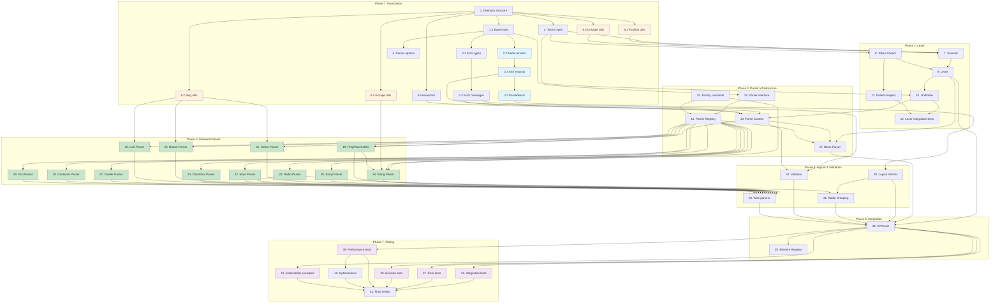

# Wyreframe Syntax v2.3 Parser - Implementation Plan

## Document Information

- **Version**: 1.2.0
- **Based on**: requirements.md v1.1.0, design.md v1.2.0
- **Created**: 2025-12-27
- **Updated**: 2026-06-08
- **Implementation Language**: ReScript (with @rescript/core)
- **Test Framework**: rescript-vitest
- **Status**: Draft

## Overview

This implementation plan provides a series of discrete, manageable coding steps for building the Wyreframe Syntax v2.3 Parser in ReScript. Each task follows test-driven development principles and builds incrementally on previous steps.

---

## Phase 1: Foundation (Types & Utils)

- [ ] 1. Set up parser module directory structure
  - Create the directory structure as specified in design.md v1.2.0:
    - `src/parser/v2/types/` (V2Types.res, Token.res, V2Errors.res)
    - `src/parser/v2/lexer/` (Lexer.res, Scanner.res, TokenStream.res, **GridIndex.res**)
    - `src/parser/v2/parser/` (BlockParser.res, ParseContext.res, Priority.res)
    - `src/parser/v2/elements/` (V2ElementParser.res, V2ParserRegistry.res, per-element parsers)
    - `src/parser/v2/layout/` (LayoutInferrer.res, RadioGrouper.res)
    - `src/parser/v2/validator/` (Validator.res)
    - `src/parser/v2/utils/` (PositionUtils.res, Slugify.res, UnicodeUtils.res, EscapeUtils.res, **Heuristics.res**)
    - `src/parser/v2/registry/` (EmojiRegistry.res, ElementRegistry.res)
    - `src/parser/v2/__tests__/` (with `heuristics/` and `perf/` subdirs)
  - Create placeholder `.res` files for each module
  - _Requirements: REQ-20.1, REQ-23_
  - _Complexity: S_
  - _Files: src/parser/v2/*_

- [ ] 2. Implement core AST type definitions
  - [ ] 2.1 Create base types and Position records
    - Implement `position` record with **`row`, `col`, `offset`** fields (0-based throughout; matches `Token.position`)
    - Implement `sourceLocation` record with start and end_ positions
    - Write unit tests for position and location creation
    - _Requirements: REQ-17.5, REQ-18.2_
    - _Complexity: S_
    - _Files: src/parser/v2/types/V2Types.res, src/parser/v2/__tests__/types/V2Types_test.res_

  - [ ] 2.2 Create Node type variants
    - Define `nodeType` variant with all 15 node types (Scene, Component, Container, Text, Button, Link, Input, Select, Checkbox, Radio, Divider, String, Emoji, PropPlaceholder, Error)
    - Define `deviceType` variant (Mobile, Tablet, Desktop)
    - Define `alignment` variant (Left, Center, Right)
    - Define `dividerStyle` variant (Normal, Bold)
    - Define `layoutDirection` variant (Row, Column, Mixed)
    - Write unit tests for type guards
    - _Requirements: REQ-18.2, REQ-1 to REQ-14_
    - _Complexity: S_
    - _Files: src/parser/v2/types/V2Types.res_

  - [ ] 2.3 Create AST node records with recursive types
    - Define recursive `astNode` variant with all node constructors
    - Define `sceneNode` record with slug, title, device, transition, children, layout
    - Define `componentNode` record with slug, props, children, layout
    - Define `containerNode` record with id, name, children, layout, bounds, **`containsErrorRecovery`** flag
    - Define all element node records (textNode, buttonNode, linkNode, inputNode, selectNode, checkboxNode, radioNode, dividerNode)
    - Define special node records:
      - `stringNode` with `content`, `multiline`, and `interpolations: array<interpolationContent>`
      - `interpolationContent = Literal(string) | PropRef(propPlaceholderNode) | EmojiRef(emojiNode)` **(EmojiRef is new)**
      - `emojiNode`, `propPlaceholderNode`, `errorNode`
    - Define `propDefinition` record
    - Define `layoutInfo` record with `direction`, `groups`, and **`distribution: option<distribution>`** (distribution lives in the same rec block, no longer standalone)
    - Define `elementGroup` record with **`start: int`, `end_: int`** (half-open index range into `parent.children` — never store child nodes here), and `startRow: int`
    - Define type aliases: `blockNode`, `elementNode`, `specialNode`
    - Write unit tests for node creation; assert children are NOT duplicated between `parent.children` and any `elementGroup`
    - _Requirements: REQ-1 to REQ-14, REQ-18.3, REQ-18.4_
    - _Complexity: M_
    - _Files: src/parser/v2/types/V2Types.res_

  - [ ] 2.4 Create ParseResult and helper functions
    - Define `parseResult` record with ast, errors, warnings, success fields
    - Implement `getNodeType` function
    - Implement `getLocation` function
    - Implement `isBlockNode` and `isElementNode` functions
    - Implement `getChildren` function
    - Write unit tests for helpers
    - _Requirements: REQ-18 (AST Output), REQ-17 (Error Handling)_
    - _Complexity: S_
    - _Files: src/parser/v2/types/V2Types.res_

- [ ] 3. Implement Error and Warning type definitions
  - [ ] 3.1 Create error type definitions
    - Define `severity` variant (Error, Warning)
    - Define `errorCode` variant with all 8 error codes:
      `InvalidIdFormat`, `MultipleIdDeclarations`, `UnclosedInput`, `UnclosedString`, `UnclosedContainer`, `MissingBlockDeclaration`, **`NestedBlockDeclaration`**, **`MaxDepthExceeded`**
    - Define `warningCode` variant with all warning codes:
      - Spec: `PropOutsideComponent`, `UnknownEmoji(string)`, `MixedDividerLabelId`, `MissingCheckboxLabel`, `MissingRadioLabel`
      - Heuristic-driven: `MisalignedContainerCorner`, `MisalignedContainerWall`, `InconsistentContainerWidth`, `RadioGroupAmbiguous`, `LooksLikeButton`, `LooksLikeInput`, `LooksLikeCheckbox`, `LooksLikeRadio`
      - Cross-cutting: `DuplicatePropName(string)`, `DuplicateContainerId(string)`, `UnknownPropReference(string)`, `MultipleRadiosSelected(string)`
    - Define `parseError` record (code, message, location, recoverable)
    - Define `parseWarning` record with **`ruleId: option<string>`** field for heuristic traceability
    - _Requirements: REQ-17.1, REQ-17.3, REQ-17.4, REQ-23.2_
    - _Complexity: S_
    - _Files: src/parser/v2/types/V2Errors.res_

  - [ ] 3.2 Create error message functions
    - Implement `getErrorMessage(code) → string` covering all 8 error codes (REQ-17.3)
    - Implement `getWarningMessage(code) → string` covering all warning codes (REQ-17.4)
    - Create helpers: `makeError(~code, ~location, ~recoverable)` and `makeWarning(~code, ~location, ~ruleId=?)`
    - Write unit tests asserting message text matches the REQ-17 mapping verbatim
    - _Requirements: REQ-17.3, REQ-17.4_
    - _Complexity: S_
    - _Files: src/parser/v2/types/V2Errors.res, src/parser/v2/__tests__/types/V2Errors_test.res_

- [ ] 4. Implement Token type definitions (physical tokens, grid-aware)
  - Define `position` record matching `V2Types.position`: `{ row, col, offset }` (0-based)
  - Define `tokenKind` variant covering physical lexemes (NOT semantic):
    `Identifier`, `Dashes(int)`, `Equals(int)`, `Plus`, `Pipe`, `LBracket`, `RBracket`, `LParen`, `RParen`, `LAngle`, `RAngle`, `Underscores(int)`, `Colon`, `Hash`, `Dollar`, `LBrace`, `RBrace`, `Asterisk`, `Quote`, `At`, `Comma`, `QuestionMark`, `Whitespace(int)`, `Newline`, `Other(string)`, `EOF`
  - Define `t` record with `kind`, `text`, `position` (start), `endPosition` (exclusive)
  - Implement `make`, `isEof`, `isNewline`, `isWhitespace` helpers
  - Write unit tests for token creation, position correctness, and Unicode width attribution
  - _Requirements: REQ-17.5, REQ-18.2, REQ-22.3_
  - _Complexity: S_
  - _Files: src/parser/v2/types/Token.res, src/parser/v2/__tests__/types/Token_test.res_

- [ ] 5. Implement Parser options record
  - Create `parseOptions` record with `strict`, `emojiRegistry`, `tabSize`, `maxDepth`, and **`heuristics: option<Heuristics.t>`** (partial overrides merged into defaults)
  - Create `defaultOptions` with: `strict=false`, `emojiRegistry=None`, `tabSize=4`, `maxDepth=10`, `heuristics=None`
  - Write unit tests for options merging (override → merged value, default for unspecified)
  - _Requirements: REQ-18.7, REQ-20.3, REQ-21, REQ-23.3_
  - _Complexity: S_
  - _Files: src/parser/v2/parser/BlockParser.res_

- [ ] 6. Implement utility functions
  - [ ] 6.1 Create Position tracking utilities
    - Implement `advancePosition` advancing offset and col by visual width (NOT by codepoint count)
    - Implement `advanceRow` for newline handling (resets col to 0)
    - Implement `calculateCol` delegating visual-width computation to `UnicodeUtils`
    - Implement `tabToVisualWidth(~tabSize, currentCol)` (tab stops, not "4 spaces")
    - Write unit tests with mixed ASCII / CJK / emoji / tab inputs
    - _Requirements: REQ-17.1, REQ-17.5, REQ-22.3, REQ-22.4_
    - _Complexity: M_
    - _Files: src/parser/v2/utils/PositionUtils.res, src/parser/v2/__tests__/utils/PositionUtils_test.res_

  - [ ] 6.2 Create slug generation utility
    - Implement `slugify` function converting text to kebab-case slugs
    - Handle Unicode characters, spaces, special characters
    - Write unit tests with various text inputs including Korean, Japanese, Chinese
    - _Requirements: REQ-1.1, REQ-5.3, REQ-6.3, REQ-8.3_
    - _Complexity: S_
    - _Files: src/parser/v2/utils/Slugify.res, src/parser/v2/__tests__/utils/Slugify_test.res_

  - [ ] 6.3 Create Unicode utilities (sole owner of visual-width math)
    - Implement `graphemeWidth(str) → int` — visual width of one grapheme cluster (narrow=1, wide=2, combining=0)
    - Implement `foldGraphemes` — iterate grapheme clusters with `(offsetStart, offsetEnd, visualWidth)`
    - Implement `visualWidth(str, ~startCol=?, ~tabSize=?) → int` (tab-aware)
    - Cover East Asian Wide, emoji ZWJ sequences, surrogate pairs, combining marks
    - Write unit tests for all categories listed above
    - **No other module is allowed to count columns directly** (enforced by review)
    - _Requirements: REQ-22.1, REQ-22.2, REQ-22.3, REQ-22.5_
    - _Complexity: M_
    - _Files: src/parser/v2/utils/UnicodeUtils.res, src/parser/v2/__tests__/utils/UnicodeUtils_test.res_

  - [ ] 6.4 Create escape sequence handling
    - Implement `processEscapeSequence` handling `\"`, `\\`, `\$`
    - Implement `unescapeString` for full string unescaping
    - Write unit tests for all escape sequences
    - _Requirements: REQ-12.4, REQ-12.5, REQ-12.6_
    - _Complexity: S_
    - _Files: src/parser/v2/utils/EscapeUtils.res, src/parser/v2/__tests__/utils/EscapeUtils_test.res_

  - [ ] 6.5 Create Heuristics module (single source of tolerances)
    - Define `Heuristics.t` record with all thresholds from design.md → Heuristics Catalog:
      - `containerColumnTolerance` (default 1)
      - `containerWidthTolerance` (default 2)
      - `radioHorizontalGap` (default 6)
      - `radioVerticalColumnTolerance` (default 1)
      - `radioMaxBlankRows` (default 0)
      - `centerSymmetryThreshold` (default 0.15)
      - `rightAlignThreshold` (default 0.10)
      - `dividerMinRun` (default 3)
      - `nearMissTokenDistance` (default 1)
    - Implement `default: t` and `make(~overrides=?) → t` (shallow merge of partial overrides)
    - Export rule-ID constants as module values (e.g. `Rule.containerWallAlignment = "container.wallAlignment"`) so callers reference them symbolically, never as bare strings
    - Write unit tests for default values, merge behavior, and rule-ID stability
    - _Requirements: REQ-23.1, REQ-23.3_
    - _Complexity: S_
    - _Files: src/parser/v2/utils/Heuristics.res, src/parser/v2/__tests__/utils/Heuristics_test.res_

---

## Phase 2: Lexer

- [ ] 7. Implement Character Scanner (Unicode-aware)
  - Create `Scanner.t` type with source, current offset, current row/col
  - Implement `make` from source string
  - Implement `peek`, `advance` (uses `UnicodeUtils.graphemeWidth` to step col by visual width), `isAtEnd`, `lookAhead`
  - Normalize CRLF → LF at the scanner level
  - Write unit tests with mixed ASCII/CJK/emoji and both line endings
  - _Requirements: REQ-22.1, REQ-22.2, REQ-22.3, Assumptions 1, 2, 6_
  - _Complexity: M_
  - _Files: src/parser/v2/lexer/Scanner.res, src/parser/v2/__tests__/lexer/Scanner_test.res_

- [ ] 8. Implement Token Stream (cursor with save/restore)
  - Create `TokenStream.t` (opaque) wrapping a `array<Token.t>` and a cursor
  - Implement `make`, `peek`, `peekAt(stream, n)` (0 = current), `next`, `isAtEnd`, `position`
  - Implement **`save: t => int`** (snapshot cursor) and **`restore: (t, int) => unit`** (rollback) — used by parsers' `canParse` for read-only probing
  - Document the contract: `canParse` MUST NOT advance the cursor on a `false` return
  - Write unit tests for save/restore correctness and isolation
  - _Requirements: REQ-16.1, REQ-16.2 (canParse contract)_
  - _Complexity: S_
  - _Files: src/parser/v2/lexer/TokenStream.res, src/parser/v2/__tests__/lexer/TokenStream_test.res_

- [ ] 9. Implement Lexer main module (eager tokenization)
  - Implement `tokenize(~tabSize=?, source) → array<Token.t>` — eagerly tokenize the entire input
  - Emit physical tokens per the `tokenKind` variant (Task 4); semantic disambiguation belongs to parsers
  - Tokenize runs of `-`, `=`, `_` as `Dashes(n)`, `Equals(n)`, `Underscores(n)` (length attached)
  - Tokenize runs of `' '`/`\t` as `Whitespace(visualWidth)`
  - Attach `position` (start) and `endPosition` (exclusive) to each token
  - Write unit tests for tokenizing every kind, Unicode-mixed input, tab stops, and Windows line endings
  - **Lazy tokenization is rejected** (see design.md → Performance Considerations)
  - _Requirements: REQ-19, REQ-22, Assumptions 1-3, 6_
  - _Complexity: M_
  - _Files: src/parser/v2/lexer/Lexer.res, src/parser/v2/__tests__/lexer/Lexer_test.res_

- [ ] 10. Implement GridIndex (2D random access)
  - Create `GridIndex.t` (opaque): row-keyed sparse map of column → token index
  - Implement `make(array<Token.t>) → t`
  - Implement `tokenAt(~row, ~col) → option<Token.t>` returning the token whose span covers (row, col), or None for whitespace/empty
  - Implement `charAt(~row, ~col) → string` (single grapheme; returns " " if out of range)
  - Implement `rowTokens(~row) → array<Token.t>` (left-to-right)
  - Implement `lastRow → int`
  - Performance: O(1) `charAt` after construction; pure whitespace rows take O(1) memory
  - Write unit tests including: corner alignment lookups, wide-character columns, out-of-range queries
  - _Requirements: REQ-2 (Container detection), REQ-15 (Implicit Layout), REQ-19_
  - _Complexity: M_
  - _Files: src/parser/v2/lexer/GridIndex.res, src/parser/v2/__tests__/lexer/GridIndex_test.res_

- [ ] 11. Lexer pattern detection helpers (thin layer over TokenStream)
  - Implement `matchKindSequence(stream, kinds) → bool` (peek-only) — checks an expected token-kind sequence starting at current cursor without consuming
  - Implement `findOnCurrentRow(stream, kind) → option<int>` — returns the token-stream index of the next occurrence of `kind` on the current row (no row crossing)
  - These are read-only conveniences; mutating advancement still uses `next`
  - Write unit tests including row-boundary stops
  - _Requirements: REQ-16.1, REQ-21_
  - _Complexity: S_
  - _Files: src/parser/v2/lexer/TokenStream.res_

- [ ] 12. Write Lexer integration tests
  - Test tokenization + GridIndex of complete wireframe sources
  - Test Unicode text tokenization (Korean, Japanese, emoji including ZWJ sequences)
  - Test mixed content (ASCII + Unicode + tabs)
  - Test line ending normalization (LF, CRLF)
  - Test tab-stop handling (verify the visual column matches `UnicodeUtils.visualWidth`)
  - Test GridIndex `charAt` returns the right grapheme at wide-character columns
  - _Requirements: REQ-19, REQ-22_
  - _Complexity: M_
  - _Files: src/parser/v2/__tests__/lexer/Lexer_integration_test.res_

---

## Phase 3: Core Parser Infrastructure

- [ ] 13. Implement Parse Context
  - Create `ParseContext.t` record with `blockType`, `blockId`, `props`, `currentContainer`, `errors`, `warnings`, **`containerDepth: int`**, **`heuristics: Heuristics.t`**, **`gridIndex: GridIndex.t`**
  - Define `blockType` variant (Scene, Component)
  - Implement `make` factory function
  - Implement `addError`, `addWarning(~ruleId=?)`, `setCurrentContainer`
  - Implement `enterContainer / exitContainer` adjusting depth and emitting `MaxDepthExceeded` when needed
  - Implement `isInComponent` helper for prop placeholder validation
  - Write unit tests for context state management, depth tracking, ruleId-aware warnings
  - _Requirements: REQ-14.4, REQ-17.2, REQ-18.7, REQ-23.2_
  - _Complexity: M_
  - _Files: src/parser/v2/parser/ParseContext.res, src/parser/v2/__tests__/parser/ParseContext_test.res_

- [ ] 14. Implement Element Parser interface
  - Define `V2ElementParser.parseResult` as `option<V2Types.astNode>`
  - Define `V2ElementParser.t` record: `elementType`, `priority`, `canParse: TokenStream.t => bool`, `parse: (ParseContext.t, TokenStream.t) => parseResult`
  - **Contract documented in module doc-comment**: `canParse` must use `save/restore` for any probing that would advance the cursor; must never advance on `false` return
  - Implement `make` factory, `getPriority`, `getElementType` getters
  - Write unit tests verifying the `canParse` cursor invariant
  - _Requirements: REQ-16.1, REQ-16.2, REQ-20.1_
  - _Complexity: S_
  - _Files: src/parser/v2/elements/V2ElementParser.res, src/parser/v2/__tests__/elements/V2ElementParser_test.res_

- [ ] 15. Implement Priority constants module
  - Create `Priority.res` with all 16 constants as named `let` bindings (115 for String down to 1 for Text)
  - Document that priority defines **trial order only**; disambiguation lives in each parser's `canParse`
  - Write unit tests that lock the numeric values (regression guard for accidental reordering)
  - _Requirements: REQ-16.1, REQ-16.2, REQ-16.3_
  - _Complexity: S_
  - _Files: src/parser/v2/parser/Priority.res, src/parser/v2/__tests__/parser/Priority_test.res_

- [ ] 16. Implement Element Parser Registry (owns priority dispatch)
  - Create `V2ParserRegistry.t` (opaque) wrapping a priority-sorted parsers list
  - Implement `make`, `makeDefault` (Phase 4 populates), `register` (auto-sorts), `unregister`
  - Implement `parsers(t) → array<V2ElementParser.t>` for tests/debugging
  - Implement `tryParse(t, ctx, stream) → option<V2Types.astNode>`: walks parsers in descending priority; for each, calls `canParse`; on the first `true`, dispatches `parse` and returns its result
  - **No separate PriorityMatcher**: trial order lives here; disambiguation lives in parser `canParse` (REQ-16.2)
  - Write unit tests covering: descending-priority traversal, first-match-wins, fallback to None when no parser claims the position
  - _Requirements: REQ-16.1, REQ-16.2, REQ-20.1, REQ-20.2_
  - _Complexity: M_
  - _Files: src/parser/v2/elements/V2ParserRegistry.res, src/parser/v2/__tests__/elements/V2ParserRegistry_test.res_

- [ ] 17. Implement Block Parser
  - [ ] 17.1 Create block detection logic
    - Implement `detectBlockType` scanning for `@scene:` or `@component:`
    - Emit `MissingBlockDeclaration` if no block found
    - Emit `NestedBlockDeclaration` if a second `@scene:`/`@component:` appears inside an active block; close the active block and start a new top-level block (REQ-18.6)
    - Write unit tests for block detection and nested-block recovery
    - _Requirements: REQ-1.1, REQ-1.5, REQ-1.7, REQ-18.6_
    - _Complexity: M_
    - _Files: src/parser/v2/parser/BlockParser.res_

  - [ ] 17.2 Implement Scene block parsing
    - Parse `@scene:` slug extraction
    - Parse optional `@title:`, `@device:`, `@transition:` properties
    - Validate device values (mobile, tablet, desktop)
    - Write unit tests for Scene parsing
    - _Requirements: REQ-1.1, REQ-1.2, REQ-1.3, REQ-1.4_
    - _Complexity: M_
    - _Files: src/parser/v2/parser/BlockParser.res, src/parser/v2/__tests__/parser/BlockParser_test.res_

  - [ ] 17.3 Implement Component block parsing and props parser (Algorithm 5)
    - Parse `@component:` slug extraction
    - Implement props parser supporting **all four forms** per design.md → Algorithm 5:
      - `name` → required, no default
      - `name?` → optional, no default
      - `name=value` → required, with default
      - `name?=value` → optional, with default
      - `"quoted name"=v` → name with spaces (quoted form preserves verbatim)
    - Strip whitespace around commas and `=`
    - Emit `DuplicatePropName(name)` warning on duplicates; last occurrence wins
    - Write unit tests covering each form, whitespace tolerance, quoted names, duplicates
    - _Requirements: REQ-1.5, REQ-1.6_
    - _Complexity: M_
    - _Files: src/parser/v2/parser/BlockParser.res_

  - [ ] 17.4 Implement content parsing delegation
    - Implement `parseContent` delegating to `V2ParserRegistry.tryParse`
    - Fall back to TextParser when `tryParse` returns None
    - Run `LayoutInferrer.inferLayout` on the assembled children before wrapping the block
    - Run `Validator.validate` on the assembled block
    - Write integration tests asserting children appear exactly once and layout groups address them by index range
    - _Requirements: REQ-16, REQ-15, REQ-18.4_
    - _Complexity: M_
    - _Files: src/parser/v2/parser/BlockParser.res_

---

## Phase 4: Element Parsers (by Priority Order)

- [ ] 18. Implement String Literal Parser (Priority 115)
  - [ ] 18.1 Create basic string parsing
    - Implement `StringParser` with `canParse` checking for `"` start
    - Parse content until closing `"` or EOF (error case)
    - Create `StringNode` with content property
    - Set priority = 115
    - Write unit tests for basic string parsing
    - _Requirements: REQ-12.1, REQ-12.8_
    - _Complexity: M_
    - _Files: src/parser/v2/elements/StringParser.res, src/parser/v2/__tests__/elements/StringParser_test.res_

  - [ ] 18.2 Add escape sequence handling
    - Integrate `EscapeUtils.unescapeString`
    - Handle `\"`, `\\`, `\$` sequences within string
    - Write unit tests for escaped characters
    - _Requirements: REQ-12.4, REQ-12.5, REQ-12.6_
    - _Complexity: S_
    - _Files: src/parser/v2/elements/StringParser.res_

  - [ ] 18.3 Add multiline string support
    - Allow newline characters within strings
    - Set `multiline: true` property when newlines present
    - Write unit tests for multiline strings
    - _Requirements: REQ-12.7_
    - _Complexity: S_
    - _Files: src/parser/v2/elements/StringParser.res_

  - [ ] 18.4 Add PropPlaceholder + Emoji interpolation in strings
    - Detect `${...}` patterns within string content → push `PropRef(propPlaceholderNode)` to interpolations
    - Detect `:name:` patterns within string content → push `EmojiRef(emojiNode)` to interpolations (uses `EmojiRegistry.lookup`)
    - All other content between interpolations is `Literal(string)` segments
    - Write unit tests for: prop-only, emoji-only, mixed prop+emoji, unknown shortcode inside string (emits `UnknownEmoji` warning, falls back to literal)
    - _Requirements: REQ-12.3, REQ-13.1, REQ-13.2_
    - _Complexity: M_
    - _Files: src/parser/v2/elements/StringParser.res_

  - [ ] 18.5 Add special character preservation
    - Ensure bracket/angle/paren element syntax (`[ ]`, `< >`, `( )`, `+--+`) is treated as literal text inside strings
    - Only `${...}` and `:name:` are interpolated; everything else is a literal segment
    - Write unit tests verifying no nested element parsing fires inside `"..."`
    - _Requirements: REQ-12.2_
    - _Complexity: S_
    - _Files: src/parser/v2/elements/StringParser.res_

- [ ] 19. Implement PropPlaceholder Parser (Priority 105)
  - [ ] 19.1 Create basic PropPlaceholder parsing
    - Implement `PropPlaceholderParser` with `canParse` checking for `${` start
    - Parse `${prop}` pattern extracting prop name
    - Create `PropPlaceholderNode` with required=true
    - Set priority = 105
    - Write unit tests for basic parsing
    - _Requirements: REQ-14.1_
    - _Complexity: M_
    - _Files: src/parser/v2/elements/PropPlaceholderParser.res, src/parser/v2/__tests__/elements/PropPlaceholderParser_test.res_

  - [ ] 19.2 Add optional prop support
    - Parse `${prop?}` pattern with `?` suffix
    - Set required=false, defaultValue=None
    - Write unit tests for optional props
    - _Requirements: REQ-14.2_
    - _Complexity: S_
    - _Files: src/parser/v2/elements/PropPlaceholderParser.res_

  - [ ] 19.3 Add default value support
    - Parse `${prop:default}` pattern extracting default value
    - Write unit tests for props with defaults
    - _Requirements: REQ-14.3_
    - _Complexity: S_
    - _Files: src/parser/v2/elements/PropPlaceholderParser.res_

  - [ ] 19.4 Add context validation
    - Check `ParseContext.isInComponent` before parsing
    - Generate PropOutsideComponent warning for Scene context
    - Preserve literal `${prop}` text when outside component
    - Write unit tests for context-aware parsing
    - _Requirements: REQ-14.4_
    - _Complexity: S_
    - _Files: src/parser/v2/elements/PropPlaceholderParser.res_

- [ ] 20. Implement Emoji Parser (Priority 100)
  - [ ] 20.1 Create Emoji Registry
    - Create `EmojiRegistry.t` type with mutable mappings dictionary
    - Implement `make`, `register`, `lookup` functions
    - Implement `makeDefault` with all 14 standard shortcodes: `:check:`, `:cross:`, `:warning:`, `:info:`, `:heart:`, `:star:`, `:search:`, `:settings:`, `:user:`, `:home:`, `:mail:`, `:bell:`, `:lock:`, `:bow:`
    - Write unit tests for registry operations
    - _Requirements: REQ-13.3, REQ-20.3_
    - _Complexity: M_
    - _Files: src/parser/v2/registry/EmojiRegistry.res, src/parser/v2/__tests__/registry/EmojiRegistry_test.res_

  - [ ] 20.2 Create Emoji Parser
    - Implement `EmojiParser` with `canParse` checking for `:...:` pattern
    - Parse `:name:` extracting shortcode name
    - Lookup in registry, create `EmojiNode` with resolved emoji
    - Set priority = 100
    - Write unit tests for emoji parsing
    - _Requirements: REQ-13.1_
    - _Complexity: M_
    - _Files: src/parser/v2/elements/EmojiParser.res, src/parser/v2/__tests__/elements/EmojiParser_test.res_

  - [ ] 20.3 Handle unknown shortcodes
    - Generate UnknownEmoji warning for unregistered shortcodes
    - Return as text instead of EmojiNode
    - Write unit tests for unknown shortcode handling
    - _Requirements: REQ-13.2_
    - _Complexity: S_
    - _Files: src/parser/v2/elements/EmojiParser.res_

- [ ] 21. Implement Select Parser (Priority 95)
  - Implement `SelectParser` with `canParse` checking for `[v:` pattern
  - Extract placeholder text after `v:` until `]`
  - Generate ID from placeholder using `Slugify.slugify`
  - Create `SelectNode` with id, placeholder
  - Set priority = 95
  - Write unit tests for Select parsing
  - _Requirements: REQ-8.1, REQ-8.2, REQ-8.3_
  - _Complexity: M_
  - _Files: src/parser/v2/elements/SelectParser.res, src/parser/v2/__tests__/elements/SelectParser_test.res_

- [ ] 22. Implement Input Parser (Priority 90)
  - [ ] 22.1 Create basic Input parsing
    - Implement `InputParser` with `canParse` checking for `[__` start and `__]` end
    - Extract placeholder between first `__` and last `__`
    - Create `InputNode` with placeholder
    - Set priority = 90
    - Write unit tests for basic Input parsing
    - _Requirements: REQ-7.1, REQ-7.2_
    - _Complexity: M_
    - _Files: src/parser/v2/elements/InputParser.res, src/parser/v2/__tests__/elements/InputParser_test.res_

  - [ ] 22.2 Handle edge cases
    - Parse `[__my__var__]` correctly (multiple underscores in middle)
    - Parse `[____________]` as empty placeholder
    - Write unit tests for edge cases
    - _Requirements: REQ-7.3, REQ-7.4_
    - _Complexity: S_
    - _Files: src/parser/v2/elements/InputParser.res_

  - [ ] 22.3 Add error handling
    - Detect unclosed Input (`[__text` without `__]`)
    - Generate UnclosedInput error
    - Write unit tests for error cases
    - _Requirements: REQ-7.5_
    - _Complexity: S_
    - _Files: src/parser/v2/elements/InputParser.res_

- [ ] 23. Implement Radio Parser (Priority 85)
  - [ ] 23.1 Create basic Radio parsing
    - Implement `RadioParser` with `canParse` checking for `(*)` or `( )` pattern
    - Parse `(*)` as selected=true, `( )` as selected=false
    - Extract label text after parentheses
    - Create `RadioNode` with selected, label, group=None
    - Set priority = 85
    - Write unit tests for Radio parsing
    - _Requirements: REQ-10.1, REQ-10.2, REQ-10.3_
    - _Complexity: M_
    - _Files: src/parser/v2/elements/RadioParser.res, src/parser/v2/__tests__/elements/RadioParser_test.res_

  - [ ] 23.2 Add label validation
    - Generate MissingRadioLabel warning when label is missing
    - Write unit tests for warning generation
    - _Requirements: REQ-10.7_
    - _Complexity: S_
    - _Files: src/parser/v2/elements/RadioParser.res_

- [ ] 24. Implement Checkbox Parser (Priority 80)
  - [ ] 24.1 Create basic Checkbox parsing
    - Implement `CheckboxParser` with `canParse` checking for exactly 3-char pattern `[x]`, `[X]`, `[v]`, `[V]`, `[ ]`
    - Parse checked state: `x`, `X`, `v`, `V` = true; space = false
    - Extract label text after brackets
    - Create `CheckboxNode` with checked, label
    - Set priority = 80
    - Write unit tests for Checkbox parsing
    - _Requirements: REQ-9.1, REQ-9.2, REQ-9.3, REQ-9.4_
    - _Complexity: M_
    - _Files: src/parser/v2/elements/CheckboxParser.res, src/parser/v2/__tests__/elements/CheckboxParser_test.res_

  - [ ] 24.2 Add label validation
    - Generate MissingCheckboxLabel warning when label is missing
    - Write unit tests for warning generation
    - _Requirements: REQ-9.5_
    - _Complexity: S_
    - _Files: src/parser/v2/elements/CheckboxParser.res_

- [ ] 25. Implement Button Parser (Priority 70)
  - Implement `ButtonParser` with `canParse` checking for `[ ` start and ` ]` end (not matching Select/Input/Checkbox patterns)
  - Extract text between brackets
  - Handle `[  ]` (2+ spaces) as empty button
  - Handle asymmetric patterns like `[ x]` or `[x ]`
  - Generate ID from text using `Slugify.slugify`
  - Create `ButtonNode` with id, text
  - Set priority = 70
  - Write unit tests for all button variants
  - _Requirements: REQ-5.1, REQ-5.2, REQ-5.3, REQ-5.4, REQ-5.5_
  - _Complexity: M_
  - _Files: src/parser/v2/elements/ButtonParser.res, src/parser/v2/__tests__/elements/ButtonParser_test.res_

- [ ] 26. Implement Link Parser (Priority 60)
  - Implement `LinkParser` with `canParse` checking for `< ` start and ` >` end
  - Extract text between angle brackets
  - Generate ID from text using `Slugify.slugify`
  - Create `LinkNode` with id, text
  - Set priority = 60
  - Write unit tests for Link parsing
  - _Requirements: REQ-6.1, REQ-6.2, REQ-6.3_
  - _Complexity: S_
  - _Files: src/parser/v2/elements/LinkParser.res, src/parser/v2/__tests__/elements/LinkParser_test.res_

- [ ] 27. Implement Divider Parser (Priority 50/48/45/40)
  - [ ] 27.1 Create basic Divider parsing
    - Implement `DividerParser` with `canParse` checking for `---` or `===` patterns
    - Parse `---` as style=Normal (priority 40)
    - Parse `===` as style=Bold (priority 40)
    - Create `DividerNode` with style
    - Write unit tests for basic dividers
    - _Requirements: REQ-11.1, REQ-11.2_
    - _Complexity: M_
    - _Files: src/parser/v2/elements/DividerParser.res, src/parser/v2/__tests__/elements/DividerParser_test.res_

  - [ ] 27.2 Add labeled divider support
    - Parse `--- text ---` as labeled normal divider (priority 48)
    - Parse `=== text ===` as labeled bold divider (priority 50)
    - Extract label text (if not starting with `#`)
    - Write unit tests for labeled dividers
    - _Requirements: REQ-11.3, REQ-11.4_
    - _Complexity: M_
    - _Files: src/parser/v2/elements/DividerParser.res_

  - [ ] 27.3 Add ID support in dividers
    - Parse `-#id-`, `---#id---`, `--- #id ---` patterns (priority 45)
    - Parse `=#id=`, `===#id===` patterns
    - Extract ID from pattern
    - Write unit tests for ID dividers
    - _Requirements: REQ-11.5, REQ-11.6_
    - _Complexity: M_
    - _Files: src/parser/v2/elements/DividerParser.res_

  - [ ] 27.4 Handle mixed label/ID warning
    - Detect `--- text #id ---` mixed pattern
    - Generate MixedDividerLabelId warning
    - Treat entire content as text
    - Write unit tests for mixed pattern handling
    - _Requirements: REQ-11.7_
    - _Complexity: S_
    - _Files: src/parser/v2/elements/DividerParser.res_

- [ ] 28. Implement Container Parser (Priority 10) — grid-based, Algorithm 1
  - [ ] 28.1 Top-border detection via GridIndex (Algorithm 1, steps 1-2)
    - Implement `canParse` checking for `Plus + Dashes(n) + ... + Plus` on the current row
    - Extract candidate left column `Lc`, right column `Rc`, name, and Format 1 ID
    - Define `containerBorderInfo = { name, format1Id, Lc, Rc, position }`
    - Set priority = 10
    - Write unit tests for top-border variations (`+--name--+`, `+--#id--+`, `+----+`, `+#id+`)
    - _Requirements: REQ-2.1, REQ-3.1_
    - _Complexity: M_
    - _Files: src/parser/v2/elements/ContainerParser.res, src/parser/v2/__tests__/elements/ContainerParser_test.res_

  - [ ] 28.2 Vertical wall walk + bottom-border match (Algorithm 1, steps 3-5)
    - Walk downward from `topRow + 1`. For each row, use `GridIndex.charAt(row, Lc)` and `charAt(row, Rc)`:
      - Both `|` (within `heuristics.containerColumnTolerance`) → body row
      - Both `+` with a dash run between → candidate bottom border
      - Otherwise → `UnclosedContainer` + invoke `errorRecovery.containerSync`
    - On misaligned wall (within tolerance), emit `MisalignedContainerWall` warning with `ruleId: container.wallAlignment`
    - On bottom-border width mismatch beyond `containerWidthTolerance`, emit `InconsistentContainerWidth` with `ruleId: container.widthConsistency`
    - Compute `bounds = { x: Lc, y: topRow, width: Rc-Lc+1, height: bottomRow-topRow+1 }`
    - Write unit tests for: aligned walls, ±1 drift (warning), 2+ drift (error/recovery), missing bottom border
    - _Requirements: REQ-2.3, REQ-2.5, REQ-23.1, REQ-23.2_
    - _Complexity: L_
    - _Files: src/parser/v2/elements/ContainerParser.res_

  - [ ] 28.3 Parse inner content (re-tokenize + re-dispatch)
    - For body rows, slice the inner region `(topRow+1..bottomRow-1, Lc+1..Rc-1)` and re-parse using the registry
    - Increment `ParseContext.containerDepth` before descending; decrement after
    - If `containerDepth + 1 > maxDepth`, emit `MaxDepthExceeded`, produce empty container, set `containsErrorRecovery=true`, continue siblings (REQ-18.7)
    - Detect nested top-border patterns within body rows → recurse into 28.1
    - Write unit tests for 1-, 2-, 3-level nesting and maxDepth boundary
    - _Requirements: REQ-2.2, REQ-2.4, REQ-18.7_
    - _Complexity: L_
    - _Files: src/parser/v2/elements/ContainerParser.res_

  - [ ] 28.4 Container ID resolution (Algorithm 2)
    - Collect `format1Id` (from border) and `format2Ids` (array of standalone `| #id |` lines anywhere in body)
    - Apply precedence:
      - Both present → use `format1Id`; demote Format 2 lines to TextNode children; no error
      - Only Format 2 with 1 candidate → use it
      - Only Format 2 with 2+ candidates → `MultipleIdDeclarations`, attach first, demote rest, set `containsErrorRecovery=true`
    - Detect `| #id text |` (mixed) during line parse → `InvalidIdFormat`, treat whole line as text
    - Write unit tests covering each branch of Algorithm 2
    - _Requirements: REQ-3.2, REQ-3.3, REQ-3.4, REQ-3.5, REQ-3.6_
    - _Complexity: M_
    - _Files: src/parser/v2/elements/ContainerParser.res_

  - [ ] 28.5 Handle nameless containers
    - Parse `+----------+` (no name, no ID) as Container with `name=None`, `id=None`
    - Write unit tests for nameless containers
    - _Requirements: REQ-2.6_
    - _Complexity: S_
    - _Files: src/parser/v2/elements/ContainerParser.res_

- [ ] 29. Implement Text Parser (Priority 1 - Fallback) — Algorithm 4 alignment
  - Implement `TextParser` as fallback (`canParse` always returns `true`)
  - Extract content from current cursor up to newline
  - Implement alignment detection per design.md → Algorithm 4:
    1. Compute `leftPad` (inner-left → text start) and `rightPad` (text end → inner-right) within enclosing Container's bounds
    2. `leftPad < 2 && rightPad < 2` → `Left`
    3. `rightPad/W ≤ heuristics.rightAlignThreshold && leftPad > rightPad*2` → `Right`
    4. `|leftPad - rightPad|/W ≤ heuristics.centerSymmetryThreshold` → `Center`
    5. Otherwise → `Left`
  - When step 3 or 4 fires, record a debug breadcrumb tagged with `ruleId: text.right` or `text.center`
  - Text outside any Container (no bounds) defaults to `Left` and never invokes the algorithm
  - Set priority = 1
  - Write unit tests including boundary cases for each threshold (just-inside / exact / just-outside)
  - _Requirements: REQ-4.1, REQ-4.2, REQ-4.3, REQ-23.6_
  - _Complexity: M_
  - _Files: src/parser/v2/elements/TextParser.res, src/parser/v2/__tests__/elements/TextParser_test.res_

---

## Phase 5: Layout & Validation

- [ ] 30. Implement Layout Inferrer (no children duplication)
  - [ ] 30.1 Group children by row, using index ranges
    - Implement `inferLayout(~children, ~containerBounds=?) → layoutInfo`
    - Walk `children` left-to-right; group consecutive children whose start `row` matches into one `elementGroup { direction, start, end_, startRow }`
    - Use the half-open index range `[start, end_)` — DO NOT copy child nodes into the group
    - For multi-line Containers, the Container's `bounds.y` is its start row (REQ-15.3)
    - Write unit tests asserting: zero duplication between `parent.children` and `group` references; direction correctness; correct boundary at row changes
    - _Requirements: REQ-15.1, REQ-15.2, REQ-15.3, REQ-15.5_
    - _Complexity: M_
    - _Files: src/parser/v2/layout/LayoutInferrer.res, src/parser/v2/__tests__/layout/LayoutInferrer_test.res_

  - [ ] 30.2 Determine overall direction and distribution
    - Compute overall `direction`: all groups Row → Row, all single-element groups → Column, else Mixed
    - Compute `distribution: option<distribution>` for Row-style groups using container bounds:
      - Single child → `None`
      - Equal gaps between children → `Equal`
      - Space at both ends ≈ inter-child space → `SpaceAround`
      - Large gap between children, small at ends → `SpaceBetween`
      - All children at the left → `Start`; right → `End`; centered as a unit → `Center`
    - Distribution is `None` if `containerBounds` is `None` (no width to compare against)
    - Write unit tests for each distribution case + None fallback
    - _Requirements: REQ-15, REQ-15.4, REQ-18.5_
    - _Complexity: M_
    - _Files: src/parser/v2/layout/LayoutInferrer.res_

- [ ] 31. Implement Radio Button Grouping (Algorithm 3)
  - Implement `assignGroups(radios, ~parentBounds=?) → array<radioNode>` per design.md Algorithm 3:
    1. Build graph: edges between radios that satisfy horizontal adjacency (same row, col distance ≤ `heuristics.radioHorizontalGap`, no non-whitespace token between) OR vertical adjacency (row distance ≤ `radioMaxBlankRows + 1`, col distance ≤ `radioVerticalColumnTolerance`, no element between on intervening columns)
    2. Connected components → groups
    3. Single component inside a named Container → use the container's id (or `radio-group-<containerSlug>-1`)
    4. Multiple components in the same Container with no visual separator → emit `RadioGroupAmbiguous` (`ruleId: radioGrouping.container`)
    5. Multi-component group IDs: `<parentSlug>-group-<n>` in document order
  - Update `radioNode.group` field; return rebuilt array (immutable; parent rebuilt by caller)
  - Write unit tests covering: horizontal-only, vertical-only, mixed, container-wide, ambiguous (warning), boundary cases for each threshold
  - _Requirements: REQ-10.4, REQ-10.5, REQ-10.6, REQ-23.1, REQ-23.4_
  - _Complexity: M_
  - _Files: src/parser/v2/layout/RadioGrouper.res, src/parser/v2/__tests__/layout/RadioGrouper_test.res_

- [ ] 32. Implement Validator (cross-cutting checks only)
  - [ ] 32.1 Implement validation entry point
    - Implement `validate(blockNode) → (array<parseError>, array<parseWarning>)` — returns NEW errors/warnings (does not mutate the AST)
    - Element parsers' local errors (UnclosedInput, MissingLabel, etc.) are already on `ParseContext` from parse time; the Validator does NOT re-emit them
    - _Requirements: REQ-17.1, REQ-17.2_
    - _Complexity: M_
    - _Files: src/parser/v2/validator/Validator.res, src/parser/v2/__tests__/validator/Validator_test.res_

  - [ ] 32.2 Implement cross-cutting checks
    - **ID uniqueness**: walk all `ContainerNode` ids within the block → `DuplicateContainerId(id)` on collision
    - **Button/Link slug collision**: detect identical auto-slugs within the block (warning)
    - **Prop reference validity**: for every `PropPlaceholder` inside a `@component`, verify the name appears in `componentNode.props` → `UnknownPropReference(name)` otherwise
    - **Radio group selection**: each group with 2+ `selected=true` radios → `MultipleRadiosSelected(group)`
    - **Near-miss detection**: walk text nodes; for any that look one-token-edit away from a known pattern, emit the corresponding `LooksLikeButton/Input/Checkbox/Radio` (`ruleId: nearMissPatterns`)
    - Write unit tests for each check, including "no-op when input is clean"
    - _Requirements: REQ-16.4, REQ-17, REQ-21.1, REQ-21.2_
    - _Complexity: L_
    - _Files: src/parser/v2/validator/Validator.res_

  - [ ] 32.3 Handle fatal errors
    - Detect unrecoverable errors (`MissingBlockDeclaration`) before validation runs
    - In strict mode (`parseOptions.strict=true`), promote `recoverable` errors to fatal
    - Write unit tests for fatal-error halting
    - _Requirements: REQ-21.3_
    - _Complexity: S_
    - _Files: src/parser/v2/validator/Validator.res_

- [ ] 33. Update V2ParserRegistry - Wire all parsers
  - Update `makeDefault` to register all 13 element parsers with correct priorities:
    - StringParser (115)
    - PropPlaceholderParser (105)
    - EmojiParser (100)
    - SelectParser (95)
    - InputParser (90)
    - RadioParser (85)
    - CheckboxParser (80)
    - ButtonParser (70)
    - LinkParser (60)
    - DividerParser (50/48/45/40)
    - ContainerParser (10)
    - TextParser (1)
  - Verify parser order is correct (descending priority)
  - Write integration test verifying correct parser selection
  - _Requirements: REQ-20_
  - _Complexity: S_
  - _Files: src/parser/v2/elements/V2ParserRegistry.res_

---

## Phase 6: Integration & Public API

- [ ] 34. Implement Main Parser module
  - [ ] 34.1 Create V2Parser module structure
    - Implement orchestration of full parse flow:
      1. Create Lexer from source
      2. Create TokenStream from tokens
      3. Create ParseContext
      4. Detect and parse block type
      5. Parse content with priority matching
      6. Infer layout
      7. Validate and collect errors/warnings
      8. Return parseResult
    - Write integration tests for basic parsing
    - _Requirements: REQ-18.1_
    - _Complexity: L_
    - _Files: src/parser/v2/V2Parser.res, src/parser/v2/__tests__/V2Parser_test.res_

  - [ ] 34.2 Implement parse function
    - Re-export `parseOptions` and `defaultOptions` from BlockParser
    - Implement `parse` function with options support
    - Add @genType annotations for TypeScript interop
    - Write integration tests for element recognition
    - _Requirements: REQ-16, REQ-18_
    - _Complexity: M_
    - _Files: src/parser/v2/V2Parser.res_

  - [ ] 34.3 Export public API
    - Export `parse` function as main entry point
    - Export `parseWireframe` convenience function
    - Export `version` string constant
    - Export `implementation` string constant ("rescript")
    - Write API usage example tests
    - _Requirements: REQ-18, REQ-20_
    - _Complexity: S_
    - _Files: src/parser/v2/V2Parser.res_

- [ ] 35. Create Element Registry module
  - Define `ElementRegistry.t` type with registered element types
  - Implement `make` with default element types
  - Implement `registerElement` for adding new element types
  - Implement `getElementTypes` returning all registered types
  - Integrate with V2ParserRegistry for dynamic registration
  - Write unit tests for registry operations
  - _Requirements: REQ-20_
  - _Complexity: S_
  - _Files: src/parser/v2/registry/ElementRegistry.res, src/parser/v2/__tests__/registry/ElementRegistry_test.res_

---

## Phase 7: Testing & Performance

- [ ] 36. Write comprehensive integration tests
  - [ ] 36.1 Full parse flow tests
    - Test complete Scene parsing with all element types
    - Test complete Component parsing with props and placeholders
    - Test deeply nested containers (3+ levels)
    - Write tests covering all 22 requirements
    - _Requirements: All REQ-1 through REQ-18_
    - _Complexity: L_
    - _Files: src/parser/v2/__tests__/integration/FullParse_test.res_

  - [ ] 36.2 Element priority disambiguation tests
    - Test `[v: Select]` parses as Select, not Button
    - Test `[__input__]` parses as Input, not Button
    - Test `[x] label` parses as Checkbox, not Button
    - Test `[ ] label` (1 space) parses as Checkbox, not Button
    - Test `[  ]` (2 spaces) parses as Button
    - Test `[ text ]` parses as Button
    - Test `:emoji:` parses as Emoji inside and outside string
    - Test `${prop}` parses as PropPlaceholder in component
    - Test string literal takes precedence over element syntax
    - _Requirements: REQ-16_
    - _Complexity: M_
    - _Files: src/parser/v2/__tests__/integration/Priority_test.res_

  - [ ] 36.3 Error recovery integration tests
    - Test parsing continues after recoverable errors
    - Test partial AST generation with error collection
    - Test multiple errors in single document
    - _Requirements: REQ-21_
    - _Complexity: M_
    - _Files: src/parser/v2/__tests__/integration/ErrorRecovery_test.res_

- [ ] 37. Write Error handling tests
  - Test MissingBlockDeclaration error for missing @scene/@component
  - Test UnclosedContainer error and recovery
  - Test UnclosedString error and recovery
  - Test UnclosedInput error and recovery
  - Test InvalidIdFormat error for `| #id text |`
  - Test MultipleIdDeclarations error
  - Test PropOutsideComponent warning
  - Test UnknownEmoji warning
  - Test MixedDividerLabelId warning
  - Test MissingCheckboxLabel warning
  - Test MissingRadioLabel warning
  - Verify error messages match exact format from REQ-17
  - Verify partial AST is returned on recoverable errors
  - _Requirements: REQ-17, REQ-21_
  - _Complexity: L_
  - _Files: src/parser/v2/__tests__/integration/ErrorHandling_test.res_

- [ ] 38. Write Unicode support tests
  - Test Korean text in containers and elements
  - Test Japanese text (hiragana, katakana, kanji)
  - Test Chinese text
  - Test direct Unicode emoji characters
  - Test mixed ASCII and non-ASCII content
  - Verify correct column position calculation with Unicode
  - Test tab character handling (4 spaces)
  - Test both LF and CRLF line endings
  - _Requirements: REQ-22_
  - _Complexity: M_
  - _Files: src/parser/v2/__tests__/integration/Unicode_test.res_

- [ ] 39. Implement performance tests (measurement contract per REQ-19.4)
  - [ ] 39.1 Create performance benchmarks
    - Set up Vitest `bench` (or dedicated `__tests__/perf/` harness) using best-of-5 wall time
    - Bench for 100-line file (target: < 50ms on reference platform)
    - Bench for 1000-line file (target: < 500ms on reference platform)
    - Document reference platform (M-series or x86-64 ≥ 2.5 GHz, Node ≥ 20, single-threaded) in test header
    - If CI hardware can't meet baseline, override threshold in `vitest.config` with a comment linking to REQ-19.4 (never silently relax)
    - _Requirements: REQ-19.1, REQ-19.2, REQ-19.4_
    - _Complexity: M_
    - _Files: src/parser/v2/__tests__/perf/Performance_test.res, vitest.config.*_

  - [ ] 39.2 Memory usage tests
    - Measure `process.memoryUsage().heapUsed` delta before/after a single parse run
    - Assert peak delta < 10× input byte size
    - _Requirements: REQ-19.3_
    - _Complexity: M_
    - _Files: src/parser/v2/__tests__/perf/Memory_test.res_

- [ ] 40. Implement performance optimizations (deliberate, measured)
  - Eager tokenization is the design baseline; **lazy tokenization is rejected** (design.md → Performance Considerations)
  - GridIndex uses per-row sparse representation; verify pure-whitespace rows take O(1) memory
  - Optimize tight loops in `Lexer.tokenize` and `GridIndex.make` only after benchmarks show a hotspot
  - Avoid micro-optimizations that obscure the parse pipeline; every optimization needs a before/after benchmark in the PR
  - Verify all existing tests still pass; document each optimization in the PR description
  - _Requirements: REQ-19_
  - _Complexity: M_
  - _Files: Various parser modules_

- [ ] 40.5 Implement Heuristics regression test suite
  - Create `src/parser/v2/__tests__/heuristics/` directory
  - For each named heuristic in the Heuristics Catalog, add boundary fixtures (just-inside / exact / just-outside)
  - Add golden fixtures for tricky hand-drawn inputs (off-by-one walls, misaligned bottom borders, radios with mixed grouping cues)
  - Add conflict fixtures designed to make two heuristics disagree, asserting the documented resolution
  - Lock the ruleId emitted by each fixture (regression test for ruleId stability)
  - _Requirements: REQ-23.4, REQ-23.5, REQ-23.6_
  - _Complexity: L_
  - _Files: src/parser/v2/__tests__/heuristics/*_

- [ ] 41. Write extensibility examples
  - Example: Custom element parser registration
  - Example: Custom emoji shortcode registration
  - Example: Parser option customization
  - Example: Accessing parsed AST nodes
  - Verify examples compile and run correctly
  - _Requirements: REQ-20_
  - _Complexity: S_
  - _Files: src/parser/v2/__tests__/examples/Extensibility_test.res_

- [ ] 42. Final integration and code review
  - All unit tests pass (95% coverage target for element parsers)
  - All integration tests pass (90% coverage target for parser)
  - All performance tests pass
  - Code follows ReScript best practices
  - All public APIs have proper documentation
  - No console warnings or errors
  - TypeScript interop verified with @genType
  - Traceability matrix complete (all requirements covered)
  - Ready for production use
  - _Requirements: All requirements_
  - _Complexity: S_
  - _Files: Review only_

---

## Requirements Traceability Summary

| Requirement | Tasks |
|-------------|-------|
| REQ-1 Block Type | 2.2, 17.1, 17.2, 17.3 |
| REQ-2 Container | 2.3, 28.1-28.6 |
| REQ-3 Container ID | 28.1, 28.2, 28.5 |
| REQ-4 Text | 2.3, 29 |
| REQ-5 Button | 2.3, 25 |
| REQ-6 Link | 2.3, 26 |
| REQ-7 Input | 2.3, 22.1-22.3 |
| REQ-8 Select | 2.3, 21 |
| REQ-9 Checkbox | 2.3, 24.1-24.2 |
| REQ-10 Radio | 2.3, 23.1-23.2, 31 |
| REQ-11 Divider | 2.3, 27.1-27.4 |
| REQ-12 String Literal | 2.3, 18.1-18.5, 6.4 |
| REQ-13 Emoji | 2.3, 20.1-20.3 |
| REQ-14 PropPlaceholder | 2.3, 19.1-19.4 |
| REQ-15 Implicit Layout | 2.4, 30.1, 30.2 |
| REQ-16 Priority System | 15, 16, 17.4, 36.2 |
| REQ-17 Error Handling | 3.1, 3.2, 13, 32.1-32.2, 37 |
| REQ-18 AST Output | 2.1-2.4, 17.1, 28.3, 34.1-34.3 |
| REQ-19 Performance | 39.1, 39.2, 40 |
| REQ-20 Extensibility | 1, 16, 20.1, 35, 41 |
| REQ-21 Error Recovery | 28.2, 32.2, 32.3, 36.3 |
| REQ-22 Unicode | 6.1, 6.3, 7, 38 |
| REQ-23 Heuristics & Tolerances | 6.5, 13, 28.2, 29, 31, 32.2, 40.5 |

---

## Tasks Dependency Diagram

```mermaid
flowchart TD
    subgraph Phase1["Phase 1: Foundation"]
        T1[1. Directory structure]
        T2_1[2.1 Base types]
        T2_2[2.2 Node variants]
        T2_3[2.3 AST records]
        T2_4[2.4 ParseResult]
        T3_1[3.1 Error types]
        T3_2[3.2 Error messages]
        T4[4. Token types]
        T5[5. Parser options]
        T6_1[6.1 Position utils]
        T6_2[6.2 Slug utils]
        T6_3[6.3 Unicode utils]
        T6_4[6.4 Escape utils]
        T6_5[6.5 Heuristics]
    end

    subgraph Phase2["Phase 2: Lexer"]
        T7[7. Scanner]
        T8[8. Token Stream]
        T9[9. Lexer]
        T10[10. GridIndex]
        T11[11. Pattern helpers]
        T12[12. Lexer integration tests]
    end

    subgraph Phase3["Phase 3: Parser Infrastructure"]
        T13[13. Parse Context]
        T14[14. Parser interface]
        T15[15. Priority constants]
        T16[16. Parser Registry]
        T17[17. Block Parser]
    end

    subgraph Phase4["Phase 4: Element Parsers"]
        T18[18. String Parser]
        T19[19. PropPlaceholder]
        T20[20. Emoji Parser]
        T21[21. Select Parser]
        T22[22. Input Parser]
        T23[23. Radio Parser]
        T24[24. Checkbox Parser]
        T25[25. Button Parser]
        T26[26. Link Parser]
        T27[27. Divider Parser]
        T28[28. Container Parser]
        T29[29. Text Parser]
    end

    subgraph Phase5["Phase 5: Layout & Validation"]
        T30[30. Layout Inferrer]
        T31[31. Radio Grouping]
        T32[32. Validator]
        T33[33. Wire parsers]
    end

    subgraph Phase6["Phase 6: Integration"]
        T34[34. V2Parser]
        T35[35. Element Registry]
    end

    subgraph Phase7["Phase 7: Testing"]
        T36[36. Integration tests]
        T37[37. Error tests]
        T38[38. Unicode tests]
        T39[39. Performance tests]
        T40[40. Optimizations]
        T41[41. Extensibility examples]
        T42[42. Final review]
    end

    %% Phase 1 dependencies
    T1 --> T2_1
    T2_1 --> T2_2
    T2_2 --> T2_3
    T2_3 --> T2_4
    T2_1 --> T3_1
    T3_1 --> T3_2
    T1 --> T4
    T2_1 --> T5
    T1 --> T6_1
    T1 --> T6_2
    T1 --> T6_3
    T1 --> T6_4
    T1 --> T6_5

    %% Phase 2 dependencies
    T4 --> T7
    T6_1 --> T7
    T6_3 --> T7
    T4 --> T8
    T7 --> T9
    T8 --> T9
    T4 --> T10
    T9 --> T10
    T8 --> T11
    T10 --> T12
    T11 --> T12

    %% Phase 3 dependencies
    T3_2 --> T13
    T2_3 --> T13
    T6_5 --> T13
    T10 --> T13
    T2_1 --> T14
    T14 --> T16
    T15 --> T16
    T9 --> T17
    T13 --> T17
    T16 --> T17

    %% Phase 4 dependencies (all need infrastructure)
    T15 --> T18
    T16 --> T18
    T6_4 --> T18
    T13 --> T19
    T16 --> T19
    T16 --> T20
    T6_2 --> T21
    T16 --> T21
    T16 --> T22
    T16 --> T23
    T16 --> T24
    T6_2 --> T25
    T16 --> T25
    T6_2 --> T26
    T16 --> T26
    T16 --> T27
    T16 --> T28
    T16 --> T29

    %% Phase 4 inter-dependencies
    T19 --> T18

    %% Phase 5 dependencies
    T2_4 --> T30
    T30 --> T31
    T23 --> T31
    T3_2 --> T32
    T13 --> T32
    T18 --> T33
    T19 --> T33
    T20 --> T33
    T21 --> T33
    T22 --> T33
    T23 --> T33
    T24 --> T33
    T25 --> T33
    T26 --> T33
    T27 --> T33
    T28 --> T33
    T29 --> T33

    %% Phase 6 dependencies
    T9 --> T34
    T17 --> T34
    T30 --> T34
    T31 --> T34
    T32 --> T34
    T33 --> T34
    T34 --> T35

    %% Phase 7 dependencies
    T34 --> T36
    T34 --> T37
    T34 --> T38
    T34 --> T39
    T39 --> T40
    T34 --> T41
    T36 --> T42
    T37 --> T42
    T38 --> T42
    T39 --> T42
    T40 --> T42
    T41 --> T42

    %% Parallel execution groups
    style T2_2 fill:#e1f5fe
    style T2_3 fill:#e1f5fe
    style T2_4 fill:#e1f5fe
    style T6_1 fill:#fff3e0
    style T6_2 fill:#fff3e0
    style T6_3 fill:#fff3e0
    style T6_4 fill:#fff3e0
    style T18 fill:#c8e6c9
    style T19 fill:#c8e6c9
    style T20 fill:#c8e6c9
    style T21 fill:#c8e6c9
    style T22 fill:#c8e6c9
    style T23 fill:#c8e6c9
    style T24 fill:#c8e6c9
    style T25 fill:#c8e6c9
    style T26 fill:#c8e6c9
    style T27 fill:#c8e6c9
    style T28 fill:#c8e6c9
    style T29 fill:#c8e6c9
    style T36 fill:#f3e5f5
    style T37 fill:#f3e5f5
    style T38 fill:#f3e5f5
    style T39 fill:#f3e5f5
    style T41 fill:#f3e5f5
```

**Legend:**
- Blue: Type definition tasks (can run in parallel)
- Orange: Utility tasks (can run in parallel)
- Green: Element parser tasks (can run in parallel after infrastructure)
- Purple: Testing tasks (can run in parallel)

---

**Version**: 1.2.0
**Last Updated**: 2026-06-08
**Status**: Draft

---

## Changelog

- **1.2.0 (2026-06-08)** — Aligned with design.md v1.2.0 and requirements.md v1.1.0.
  - Task 1: validator/ dir, GridIndex.res, Heuristics.res added to directory structure.
  - Task 2.1: `position` fields are now `row`, `col`, `offset` (0-based).
  - Task 2.3: `layoutInfo` uses index ranges (no children duplication); `interpolationContent` includes `EmojiRef`.
  - Task 3.1/3.2: added `NestedBlockDeclaration`, `MaxDepthExceeded` errors; 11 new warning codes (heuristic + cross-cutting); `parseWarning.ruleId` field.
  - Task 4: physical `tokenKind` variant (Plus, Pipe, Dashes(n), etc.) instead of generic `Punctuation`.
  - Task 5: `parseOptions.heuristics` override field.
  - Task 6.1/6.3: visual-width math centralized in UnicodeUtils; tab-stop math (not "4 spaces").
  - **Task 6.5 (new)**: `Heuristics` module with all tolerance defaults and rule-ID constants.
  - **Task 10 reframed**: was "Lexer line utilities" — now `GridIndex` (2D random access).
  - Task 8: `TokenStream.save/restore` formalized; `canParse` cursor contract documented.
  - Task 15: was "Priority Matcher" — now just the `Priority` constants module. Dispatch lives in Task 16 (`V2ParserRegistry.tryParse`).
  - Task 17.1/17.3: nested block detection; full props parser (Algorithm 5: name, name?, name=v, name?=v, "quoted"=v).
  - Task 18.4: emoji interpolation in strings.
  - Task 28: rewritten around Algorithms 1 (grid-based container detection) and 2 (ID resolution).
  - Task 29: alignment per Algorithm 4 with heuristic thresholds.
  - Task 30/31: layout groups by index range; Radio grouping per Algorithm 3.
  - Task 32: Validator scoped to cross-cutting checks; per-parser checks remain in parsers.
  - Task 39/40: lazy tokenization rejected; performance measurement contract per REQ-19.4.
  - **Task 40.5 (new)**: Heuristics regression test suite with boundary fixtures.
  - Traceability matrix: added REQ-23; remapped REQ-15/16/17/18/21 to new task IDs.
