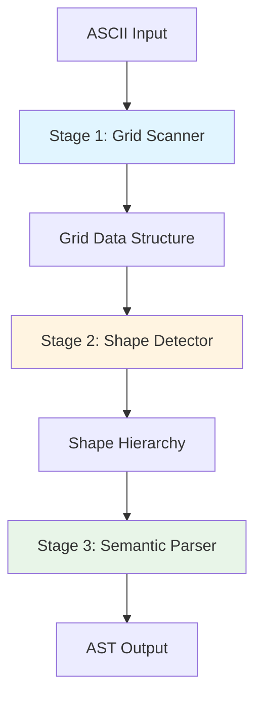

# Wyreframe Parser Developer Guide

**Version**: 0.1.0
**Date**: 2025-12-22
**Language**: ReScript
**Target Audience**: Developers extending or maintaining the parser

---

## Table of Contents

1. [Introduction](#introduction)
2. [3-Stage Architecture Overview](#3-stage-architecture-overview)
3. [Understanding the Grid Scanner](#understanding-the-grid-scanner)
4. [Understanding the Shape Detector](#understanding-the-shape-detector)
5. [Understanding the Semantic Parser](#understanding-the-semantic-parser)
6. [Creating Custom Element Parsers](#creating-custom-element-parsers)
7. [Extension Points](#extension-points)
8. [Error System Extension](#error-system-extension)
9. [Testing Your Extensions](#testing-your-extensions)
10. [Performance Considerations](#performance-considerations)
11. [Common Patterns and Best Practices](#common-patterns-and-best-practices)

---

## Introduction

The Wyreframe parser is designed with extensibility as a core principle. This guide will help you understand the architecture and show you how to extend the parser to support new element types, custom validation rules, and enhanced error messages.

### What You'll Learn

- How the 3-stage pipeline processes ASCII wireframes
- How to create custom element parsers
- Where and how to extend the parser for your needs
- Best practices for testing and performance

### Prerequisites

- Basic ReScript knowledge
- Familiarity with functional programming concepts
- Understanding of AST (Abstract Syntax Tree) concepts

---

## 3-Stage Architecture Overview

The Wyreframe parser uses a systematic 3-stage pipeline that separates concerns and enables clear, maintainable code.



### Stage 1: Grid Scanner

**Purpose**: Convert linear ASCII text into a searchable 2D grid.

**Input**: String (ASCII wireframe)
**Output**: Grid data structure with position indices

**Key Responsibilities**:
- Normalize line endings and widths
- Build 2D character array with (row, col) addressing
- Create indices for special characters (`+`, `-`, `|`, `=`)
- Enable position-based navigation (scanRight, scanDown, etc.)

**Why This Matters**: The Grid provides spatial awareness that regex-based parsing lacks. You can ask questions like "what's to the right of this position?" or "trace a line until you hit a corner."

### Stage 2: Shape Detector

**Purpose**: Recognize geometric shapes and their spatial relationships.

**Input**: Grid data structure
**Output**: Hierarchy of boxes with bounds and nesting information

**Key Responsibilities**:
- Trace box boundaries starting from corner characters
- Extract box names from top borders
- Detect horizontal dividers (lines with `=`)
- Build parent-child hierarchy based on spatial containment
- Validate box structure (matching widths, aligned edges)

**Why This Matters**: The Shape Detector provides structural understanding. It knows which boxes are nested inside others, enabling the semantic parser to understand context.

### Stage 3: Semantic Parser

**Purpose**: Interpret box contents and build the final AST.

**Input**: Grid + Shape hierarchy
**Output**: AST with typed elements (buttons, inputs, links, etc.)

**Key Responsibilities**:
- Parse box contents line by line
- Recognize UI elements using pluggable parsers
- Calculate element alignment (left/center/right)
- Build scene structure from directives
- Generate complete AST

**Why This Matters**: The Semantic Parser is where extensibility shines. Adding new element types doesn't require changing the Grid or Shape detection logic.

---

## Understanding the Grid Scanner

### Grid Data Structure

```rescript
type t = {
  cells: array<array<cellChar>>,
  width: int,
  height: int,
  cornerIndex: array<Position.t>,      // All '+' positions
  hLineIndex: array<Position.t>,       // All '-' positions
  vLineIndex: array<Position.t>,       // All '|' positions
  dividerIndex: array<Position.t>,     // All '=' positions
}
```

### Key Operations

#### Character Access

```rescript
// Get character at position
let char = Grid.get(grid, Position.make(5, 10))

// Get entire line
let line = Grid.getLine(grid, 5)

// Get range of characters
let range = Grid.getRange(grid, row: 5, ~startCol=10, ~endCol=20)
```

#### Directional Scanning

```rescript
// Scan right until predicate fails
let results = Grid.scanRight(grid, startPos, cell => {
  switch cell {
  | HLine | Corner => true  // Continue scanning
  | _ => false              // Stop scanning
  }
})

// Result: array<(Position.t, cellChar)>
```

#### Indexed Searches

```rescript
// Find all corners in O(1) time (using prebuilt index)
let corners = grid.cornerIndex

// Find all corners within a specific box
let cornersInBox = Grid.findInRange(grid, Corner, boxBounds)
```

### When to Use Grid Operations

- **Character lookup**: Use `get()` when you need a specific position
- **Line processing**: Use `getLine()` for entire rows
- **Directional tracing**: Use `scan*()` functions for boundary tracing
- **Bulk searches**: Use indices for finding all instances of a character

---

## Understanding the Shape Detector

### Box Tracing Algorithm

The core algorithm traces boxes by following their boundaries:

```rescript
let traceBox = (grid: Grid.t, topLeft: Position.t): Result.t<box, traceError> => {
  // 1. Verify starting position is a corner '+'

  // 2. Scan right along top edge
  let topEdge = Grid.scanRight(grid, topLeft, isTopEdgeChar)

  // 3. Extract box name if present
  let name = extractBoxName(topEdge)

  // 4. Scan down along right edge
  let rightEdge = Grid.scanDown(grid, topRight, isRightEdgeChar)

  // 5. Scan left along bottom edge
  let bottomEdge = Grid.scanLeft(grid, bottomRight, isBottomEdgeChar)

  // 6. Validate width match
  if topWidth != bottomWidth {
    return Error(MismatchedWidth({...}))
  }

  // 7. Scan up along left edge
  let leftEdge = Grid.scanUp(grid, bottomLeft, isLeftEdgeChar)

  // 8. Verify we returned to start position

  // 9. Create and return box
  Ok({
    name,
    bounds: Bounds.make(~top, ~left, ~bottom, ~right),
    children: []
  })
}
```

### Hierarchy Construction

```rescript
let buildHierarchy = (boxes: array<box>): Result.t<array<box>, hierarchyError> => {
  // Sort boxes by area (largest first)
  let sorted = boxes->Belt.SortArray.stableSortBy((a, b) =>
    compare(Bounds.area(b.bounds), Bounds.area(a.bounds))
  )

  // For each box, find its smallest containing parent
  sorted->Belt.Array.forEach(box => {
    let parent = sorted->Belt.Array.getBy(candidate =>
      candidate !== box &&
      Bounds.contains(candidate.bounds, box.bounds)
    )

    switch parent {
    | Some(p) => p.children->Js.Array2.push(box)->ignore
    | None => () // Root box
    }
  })

  // Return only root boxes (no parent)
  Ok(sorted->Belt.Array.keep(box => box.parent == None))
}
```

### Key Insights

1. **Spatial containment** determines hierarchy, not parsing order
2. **Smallest containing box** is the immediate parent
3. **Overlapping boxes** (neither contains the other) are errors
4. **All errors are collected** before returning (no early stopping)

---

## Understanding the Semantic Parser

### Parser Registry System

The Semantic Parser uses a priority-based registry to recognize different element types:

```rescript
type ElementParser.t = {
  priority: int,                                  // Higher = checked first
  canParse: string => bool,                       // Quick pattern check
  parse: (string, Position.t, Bounds.t) => parseResult  // Full parsing
}
```

### How Parsing Works

```rescript
let parse = (registry: ParserRegistry.t, content: string, position: Position.t, bounds: Bounds.t) => {
  // Iterate parsers in priority order
  let rec tryParsers = (parsers: array<ElementParser.t>) => {
    switch parsers {
    | [] => Text({content, position, align: Left, emphasis: false})  // Fallback
    | [parser, ...rest] =>
      if parser.canParse(content) {
        switch parser.parse(content, position, bounds) {
        | Some(element) => element
        | None => tryParsers(rest)  // Parser declined, try next
        }
      } else {
        tryParsers(rest)
      }
    }
  }

  tryParsers(registry.parsers)
}
```

### Alignment Calculation

```rescript
let calculate = (content: string, position: Position.t, boxBounds: Bounds.t): alignment => {
  let trimmed = content->Js.String2.trim
  let contentStart = position.col
  let contentEnd = contentStart + String.length(trimmed)

  // Calculate space on left and right
  let boxLeft = boxBounds.left + 1   // +1 to skip border
  let boxRight = boxBounds.right - 1  // -1 to skip border
  let boxWidth = boxRight - boxLeft

  let leftSpace = contentStart - boxLeft
  let rightSpace = boxRight - contentEnd

  // Calculate ratios
  let leftRatio = float_of_int(leftSpace) /. float_of_int(boxWidth)
  let rightRatio = float_of_int(rightSpace) /. float_of_int(boxWidth)

  // Determine alignment using thresholds
  if leftRatio < 0.2 && rightRatio > 0.3 {
    Left
  } else if rightRatio < 0.2 && leftRatio > 0.3 {
    Right
  } else if Js.Math.abs_float(leftRatio -. rightRatio) < 0.15 {
    Center
  } else {
    Left  // Default
  }
}
```

---

## Creating Custom Element Parsers

### Step-by-Step Guide

Let's create a custom parser for a "Badge" element with syntax `{badge: text}`.

#### Step 1: Define the Element Type

First, add your element to the `element` variant in `Types.res`:

```rescript
type element =
  | Box({...})
  | Button({...})
  | Input({...})
  // ... existing elements ...
  | Badge({
      text: string,
      position: Position.t,
      align: alignment,
    })
```

#### Step 2: Create the Parser Module

Create `src/parser/Semantic/Elements/BadgeParser.res`:

```rescript
module BadgeParser = {
  open Types

  // Pattern: {badge: some text}
  let pattern = %re("/{badge:\s*([^}]+)}/")

  let make = (): ElementParser.t => {
    priority: 75,  // Between links (80) and emphasis (70)

    canParse: content => {
      Js.Re.test_(pattern, content)
    },

    parse: (content, position, boxBounds) => {
      switch Js.Re.exec_(pattern, content) {
      | Some(result) => {
          let captures = Js.Re.captures(result)
          switch captures[1] {
          | Some(textCapture) => {
              let text = textCapture
                ->Js.Nullable.toOption
                ->Belt.Option.getExn
                ->Js.String2.trim

              let align = AlignmentCalc.calculate(content, position, boxBounds)

              Some(Badge({
                text,
                position,
                align,
              }))
            }
          | None => None
          }
        }
      | None => None
      }
    }
  }
}
```

#### Step 3: Register the Parser

In `ParserRegistry.res`, add a factory function:

```rescript
module ParserRegistry = {
  // ... existing code ...

  let makeBadgeParser = (): ElementParser.t => {
    BadgeParser.make()
  }

  let makeDefaultRegistry = (): t => {
    let registry = make()

    register(registry, makeButtonParser())
    register(registry, makeInputParser())
    register(registry, makeLinkParser())
    register(registry, makeCheckboxParser())
    register(registry, makeBadgeParser())  // Add your parser
    register(registry, makeEmphasisParser())
    register(registry, makeTextParser())

    registry
  }
}
```

#### Step 4: Test Your Parser

Create `src/parser/Semantic/Elements/__tests__/BadgeParser.test.res`:

```rescript
open Jest
open Expect

describe("BadgeParser", () => {
  let parser = BadgeParser.make()
  let dummyPosition = Position.make(0, 0)
  let dummyBounds = Bounds.make(~top=0, ~left=0, ~bottom=5, ~right=30)

  test("recognizes badge syntax", () => {
    let content = "{badge: Admin}"
    expect(parser.canParse(content))->toBe(true)
  })

  test("parses badge text correctly", () => {
    let content = "{badge: Premium User}"

    switch parser.parse(content, dummyPosition, dummyBounds) {
    | Some(Badge({text, position, align})) => {
        expect(text)->toBe("Premium User")
        expect(position)->toEqual(dummyPosition)
      }
    | _ => fail("Expected Badge element")
    }
  })

  test("handles whitespace in badge text", () => {
    let content = "{badge:   Whitespace   }"

    switch parser.parse(content, dummyPosition, dummyBounds) {
    | Some(Badge({text})) => expect(text)->toBe("Whitespace")
    | _ => fail("Expected Badge element")
    }
  })

  test("rejects invalid syntax", () => {
    let content = "{badge no colon}"
    expect(parser.canParse(content))->toBe(false)
  })
})
```

#### Step 5: Document Your Parser

Add documentation to your module:

```rescript
/**
 * BadgeParser recognizes badge elements with syntax: {badge: text}
 *
 * Examples:
 * - {badge: Admin}
 * - {badge: Premium User}
 * - {badge: VIP}
 *
 * Priority: 75 (between links and emphasis)
 *
 * Returns: Badge({text, position, align})
 */
module BadgeParser = {
  // ... implementation
}
```

### Advanced Parser Features

#### Context-Aware Parsing

Sometimes you need context beyond the current line:

```rescript
let parse = (content, position, boxBounds, ~context: parseContext) => {
  // Access grid for multi-line patterns
  let grid = context.grid

  // Check next line for continuation
  let nextLine = Grid.getLine(grid, position.row + 1)

  // ... use context for advanced parsing
}
```

#### Multi-Line Element Parsing

For elements spanning multiple lines:

```rescript
let parseMultiLine = (grid, startPos, bounds) => {
  let lines = []
  let currentRow = ref(startPos.row)

  while currentRow.contents <= bounds.bottom - 1 {
    switch Grid.getLine(grid, currentRow.contents) {
    | Some(line) => {
        lines->Js.Array2.push(line)->ignore
        currentRow := currentRow.contents + 1
      }
    | None => break
    }
  }

  // Process accumulated lines
  processLines(lines)
}
```

---

## Extension Points

### 1. Element Parser Registry

**Location**: `src/parser/Semantic/ParserRegistry.res`

**What You Can Extend**:
- Add new element types
- Change parser priority order
- Create specialized registries for different contexts

**Example**: Creating a minimal registry for testing:

```rescript
let makeMinimalRegistry = (): t => {
  let registry = make()
  register(registry, makeButtonParser())
  register(registry, makeTextParser())
  registry
}
```

### 2. Alignment Calculation

**Location**: `src/parser/Semantic/AlignmentCalc.res`

**What You Can Extend**:
- Custom alignment strategies
- Element-specific alignment rules

**Example**: Custom alignment for code blocks (always left):

```rescript
type alignmentStrategy =
  | RespectPosition     // Buttons, links
  | AlwaysLeft         // Text, code blocks
  | AlwaysCenter       // Titles, headers

let calculateWithStrategy = (content, position, bounds, strategy) => {
  switch strategy {
  | AlwaysLeft => Left
  | AlwaysCenter => Center
  | RespectPosition => calculate(content, position, bounds)
  }
}
```

### 3. Error Message Templates

**Location**: `src/parser/Errors/ErrorMessages.res`

**What You Can Extend**:
- Custom error messages
- Localization (different languages)
- Enhanced suggestions

**Example**: Adding a custom error type:

```rescript
type errorCode =
  | UncloseBox({...})
  | MismatchedWidth({...})
  // ... existing errors ...
  | InvalidBadgeSyntax({
      position: Position.t,
      found: string,
    })

let getTemplate = (code: errorCode): template => {
  switch code {
  | InvalidBadgeSyntax({position, found}) => {
      title: "Invalid badge syntax",
      message: `Found "${found}" at row ${Int.toString(position.row + 1)}, but badge syntax requires {badge: text}`,
      solution: "Use the correct syntax: {badge: your text here}",
    }
  // ... other error templates
  }
}
```

### 4. Box Tracing Validation

**Location**: `src/parser/Detector/BoxTracer.res`

**What You Can Extend**:
- Custom box border characters
- Alternative box styles
- Additional validation rules

**Example**: Supporting rounded corners with parentheses:

```rescript
let isCornerChar = (char: cellChar): bool => {
  switch char {
  | Corner => true                    // Standard '+'
  | Char("(") | Char(")") => true    // Rounded corners
  | _ => false
  }
}
```

### 5. AST Post-Processing

**Location**: `src/parser/Semantic/ASTBuilder.res`

**What You Can Extend**:
- AST transformation passes
- Validation rules
- Optimization passes

**Example**: Adding auto-ID generation:

```rescript
let generateMissingIds = (ast: ast): ast => {
  let idCounter = ref(0)

  let rec processElement = (element: element): element => {
    switch element {
    | Button({id: "", text, position, align}) => {
        idCounter := idCounter.contents + 1
        Button({
          id: `btn_${Int.toString(idCounter.contents)}`,
          text,
          position,
          align,
        })
      }
    | Box({name, bounds, children}) =>
        Box({name, bounds, children: children->Belt.Array.map(processElement)})
    | other => other
    }
  }

  {
    scenes: ast.scenes->Belt.Array.map(scene => {
      {
        ...scene,
        elements: scene.elements->Belt.Array.map(processElement)
      }
    })
  }
}
```

---

## Error System Extension

### Adding New Error Types

#### Step 1: Define Error Variant

In `ErrorTypes.res`:

```rescript
type errorCode =
  | UncloseBox({...})
  // ... existing errors ...
  | DuplicateElementId({
      id: string,
      firstPosition: Position.t,
      secondPosition: Position.t,
    })
```

#### Step 2: Determine Severity

```rescript
let getSeverity = (code: errorCode): severity => {
  switch code {
  | DuplicateElementId(_) => Warning  // Warning, not fatal
  | UncloseBox(_) => Error            // Fatal error
  // ... other cases
  }
}
```

#### Step 3: Create Message Template

In `ErrorMessages.res`:

```rescript
let getTemplate = (code: errorCode): template => {
  switch code {
  | DuplicateElementId({id, firstPosition, secondPosition}) => {
      title: "Duplicate element ID",
      message: `The ID "${id}" is used in multiple places:\n` ++
               `• First: row ${Int.toString(firstPosition.row + 1)}, col ${Int.toString(firstPosition.col + 1)}\n` ++
               `• Second: row ${Int.toString(secondPosition.row + 1)}, col ${Int.toString(secondPosition.col + 1)}`,
      solution: "Each element must have a unique ID. Rename one of them.",
    }
  // ... other cases
  }
}
```

#### Step 4: Use in Parser

```rescript
let validateUniqueIds = (elements: array<element>): Result.t<unit, ParseError.t> => {
  let idMap = Belt.Map.String.empty

  let rec check = (elements) => {
    elements->Belt.Array.forEach(element => {
      switch element {
      | Button({id, position}) | Input({id, position}) => {
          switch Belt.Map.String.get(idMap, id) {
          | Some(firstPosition) =>
              return Error(ParseError.make(
                DuplicateElementId({id, firstPosition, secondPosition: position}),
                grid
              ))
          | None =>
              idMap = Belt.Map.String.set(idMap, id, position)
          }
        }
      | Box({children}) => check(children)
      | _ => ()
      }
    })
  }

  check(elements)
  Ok()
}
```

---

## Testing Your Extensions

### Unit Testing Strategy

```rescript
// Test the parser in isolation
describe("BadgeParser", () => {
  test("canParse returns true for valid syntax", () => {
    let parser = BadgeParser.make()
    expect(parser.canParse("{badge: Text}"))->toBe(true)
  })

  test("parse extracts text correctly", () => {
    let parser = BadgeParser.make()
    let result = parser.parse(
      "{badge: Admin}",
      Position.make(0, 0),
      Bounds.make(~top=0, ~left=0, ~bottom=5, ~right=30)
    )

    switch result {
    | Some(Badge({text})) => expect(text)->toBe("Admin")
    | _ => fail("Expected Badge")
    }
  })
})
```

### Integration Testing

```rescript
// Test end-to-end parsing
describe("Badge element integration", () => {
  test("parses badge in wireframe", () => {
    let wireframe = `
+------------------+
| {badge: Admin}   |
+------------------+
`

    let result = WyreframeParser.parse(wireframe, None)

    switch result {
    | Ok(ast) => {
        let scene = ast.scenes[0]
        let hasBadge = scene.elements->Belt.Array.some(el => {
          switch el {
          | Badge(_) => true
          | _ => false
          }
        })
        expect(hasBadge)->toBe(true)
      }
    | Error(errors) => fail("Expected successful parse")
    }
  })
})
```

### Property-Based Testing

```rescript
open FastCheck

describe("Badge parser properties", () => {
  test("parsing is deterministic", () => {
    let arbBadge = fc.tuple(
      fc.string({minLength: 1, maxLength: 20})
    )->fc.map(text => `{badge: ${text}}`)

    fc.assert_(
      fc.property(arbBadge, content => {
        let parser = BadgeParser.make()
        let result1 = parser.parse(content, dummyPos, dummyBounds)
        let result2 = parser.parse(content, dummyPos, dummyBounds)
        deepEqual(result1, result2)
      })
    )
  })
})
```

---

## Performance Considerations

### Optimization Guidelines

#### 1. Use Prebuilt Indices

```rescript
// ❌ Inefficient: Scanning entire grid
let findAllCorners = (grid) => {
  let corners = []
  for row in 0 to grid.height - 1 {
    for col in 0 to grid.width - 1 {
      switch Grid.get(grid, Position.make(row, col)) {
      | Some(Corner) => corners->Js.Array2.push(Position.make(row, col))->ignore
      | _ => ()
      }
    }
  }
  corners
}

// ✅ Efficient: Use prebuilt index (O(1))
let findAllCorners = (grid) => {
  grid.cornerIndex
}
```

#### 2. Minimize Regex Compilation

```rescript
// ❌ Compiles regex on every call
let canParse = (content) => {
  Js.Re.test_(%re("/pattern/"), content)
}

// ✅ Compile once at module level
let pattern = %re("/pattern/")

let canParse = (content) => {
  Js.Re.test_(pattern, content)
}
```

#### 3. Use Belt Collections

```rescript
// ❌ Using JavaScript arrays
let filtered = array->Js.Array2.filter(predicate)

// ✅ Using Belt for better performance
let filtered = array->Belt.Array.keep(predicate)
```

#### 4. Lazy Evaluation for Expensive Operations

```rescript
// Only compute alignment if element actually uses it
let parse = (content, position, bounds) => {
  let align = lazy(AlignmentCalc.calculate(content, position, bounds))

  Some(Badge({
    text,
    position,
    align: Lazy.force(align),  // Only computed if Badge is created
  }))
}
```

### Benchmarking Your Parser

```rescript
let benchmarkParser = (parser: ElementParser.t, samples: int) => {
  let testContent = "{badge: Test}"
  let position = Position.make(0, 0)
  let bounds = Bounds.make(~top=0, ~left=0, ~bottom=5, ~right=30)

  let start = Js.Date.now()

  for _ in 0 to samples - 1 {
    let _ = parser.parse(testContent, position, bounds)
  }

  let end = Js.Date.now()
  let duration = end -. start

  Js.Console.log(`Parsed ${Int.toString(samples)} times in ${Float.toString(duration)}ms`)
  Js.Console.log(`Average: ${Float.toString(duration /. float_of_int(samples))}ms per parse`)
}
```

---

## Common Patterns and Best Practices

### Pattern 1: Progressive Enhancement

Start with basic parsing, add features incrementally:

```rescript
// Version 1: Simple badge
| Badge({text, position, align})

// Version 2: Add color
| Badge({text, color: option<string>, position, align})

// Version 3: Add icon
| Badge({text, color: option<string>, icon: option<string>, position, align})
```

### Pattern 2: Composition Over Modification

Don't modify core types; compose them:

```rescript
// ❌ Modifying core Button type
type element =
  | Button({id, text, position, align, customProp: option<string>})

// ✅ Wrapping with custom data
type customElement =
  | CoreElement(element)
  | EnhancedButton({
      button: element,  // Original button
      customProp: string,
    })
```

### Pattern 3: Error Collection

Always collect multiple errors:

```rescript
let validateElements = (elements: array<element>): Result.t<unit, array<ParseError.t>> => {
  let errors = []

  elements->Belt.Array.forEach(element => {
    // Validation 1
    switch validateId(element) {
    | Error(e) => errors->Js.Array2.push(e)->ignore
    | Ok() => ()
    }

    // Validation 2
    switch validateAlignment(element) {
    | Error(e) => errors->Js.Array2.push(e)->ignore
    | Ok() => ()
    }
  })

  if Array.length(errors) > 0 {
    Error(errors)
  } else {
    Ok()
  }
}
```

### Pattern 4: Type-Safe Element Matching

Use exhaustive pattern matching:

```rescript
let processElement = (element: element): processedElement => {
  switch element {
  | Box({name, bounds, children}) => processBox(name, bounds, children)
  | Button({id, text, position, align}) => processButton(id, text, position, align)
  | Input({id, placeholder, position}) => processInput(id, placeholder, position)
  | Link({id, text, position, align}) => processLink(id, text, position, align)
  | Checkbox({checked, label, position}) => processCheckbox(checked, label, position)
  | Text({content, emphasis, position, align}) => processText(content, emphasis, position, align)
  | Divider({position}) => processDivider(position)
  | Row({children, align}) => processRow(children, align)
  | Section({name, children}) => processSection(name, children)
  // Compiler ensures all cases are handled
  }
}
```

### Pattern 5: Documentation-Driven Development

Document before implementing:

```rescript
/**
 * SpecialParser recognizes special syntax: <<<content>>>
 *
 * Syntax:
 * - <<<text>>> - Creates a special element
 * - <<<text|variant>>> - With variant
 * - <<<text|variant|icon>>> - With variant and icon
 *
 * Priority: 65
 *
 * Examples:
 * ```
 * <<<Important>>>
 * <<<Warning|alert>>>
 * <<<Info|info|🛈>>>
 * ```
 *
 * Returns:
 * - Some(Special({...})) on success
 * - None if pattern doesn't match
 */
module SpecialParser = {
  // Implementation follows documentation
}
```

---

## Quick Reference

### Creating a New Element Parser Checklist

- [ ] Add element variant to `Types.res`
- [ ] Create parser module in `Semantic/Elements/`
- [ ] Implement `priority`, `canParse`, `parse`
- [ ] Define regex pattern at module level
- [ ] Use `AlignmentCalc` for alignment
- [ ] Register parser in `ParserRegistry.makeDefaultRegistry()`
- [ ] Write unit tests with ≥90% coverage
- [ ] Write integration test with real wireframe
- [ ] Add documentation with examples
- [ ] Benchmark if performance-critical

### Extension Point Summary

| Extension Point | Location | Difficulty | Common Use Case |
|----------------|----------|------------|-----------------|
| Element Parser | `Semantic/Elements/` | Easy | New UI elements |
| Alignment Strategy | `AlignmentCalc.res` | Easy | Custom positioning |
| Error Messages | `ErrorMessages.res` | Easy | Localization |
| Box Validation | `BoxTracer.res` | Medium | Alternative box styles |
| AST Transformation | `ASTBuilder.res` | Medium | Post-processing |
| Grid Operations | `Grid.res` | Hard | New scanning patterns |

### Performance Targets

| Operation | Target | Measurement |
|-----------|--------|-------------|
| Grid construction | <5ms per 1000 lines | `benchmarkGrid()` |
| Box tracing | <1ms per box | `benchmarkBoxTracer()` |
| Element parsing | <0.1ms per element | `benchmarkParser()` |
| Full parse | <50ms for 100 lines | `benchmarkEndToEnd()` |

---

## Getting Help

### Resources

- **Design Document**: `.claude/specs/parser-refactor/design.md` - Full architecture
- **Requirements**: `.claude/specs/parser-refactor/requirements.md` - All requirements
- **Type Definitions**: `src/parser/Core/Types.res` - Core types
- **Examples**: `__tests__/fixtures/` - Real wireframe examples

### Common Issues

**Q: My parser isn't being called**
A: Check the priority. Higher numbers are checked first. Ensure `canParse()` returns true.

**Q: How do I access the grid from a parser?**
A: Pass grid through parseContext parameter. Modify `ElementParser.t` signature if needed.

**Q: How do I handle multi-line elements?**
A: Use `Grid.getLine()` and `Grid.getRange()` to read multiple rows. See pattern examples above.

**Q: My tests are failing with type errors**
A: Run `npm run res:clean && npm run res:build` to rebuild ReScript output.

---

## Implementation Roadmap

This section outlines the phased approach to implementing and extending the parser.

### Phase 1: Core Infrastructure
- `Grid`, `Position`, `Bounds` classes
- `GridScanner` implementation
- Basic unit tests

### Phase 2: Shape Detection
- `BoxTracer` - Box boundary tracing
- `DividerDetector` - Divider detection
- `HierarchyBuilder` - Nesting relationships
- Integration tests for various box patterns

### Phase 3: Semantic Parsing
- `ParserRegistry` implementation
- Element parsers (Button, Input, Link, Checkbox, etc.)
- `AlignmentCalc` implementation
- `ASTBuilder` implementation

### Phase 4: Error System
- `ParseError` class
- Error message templates
- `ErrorContextBuilder` implementation
- Error message tests

### Phase 5: Integration
- `WireframeParser` unified class
- Backward compatibility with existing API
- Performance benchmarks
- Documentation

### Phase 6: Migration
- Parallel execution testing with legacy parser
- Result comparison validation
- Gradual transition
- Legacy code removal

---

## Conclusion

The Wyreframe parser is designed to be extended. The 3-stage architecture provides clear separation of concerns, and the plugin-based element parser system makes adding new features straightforward.

Key takeaways:

1. **Understand the stages**: Grid → Shapes → Semantics
2. **Use the registry**: Don't modify core parser logic
3. **Test thoroughly**: Unit, integration, and property tests
4. **Optimize wisely**: Use indices, lazy evaluation, Belt collections
5. **Document generously**: Help the next developer (or future you)

Happy parsing!

---

**Document Version**: 1.0
**Last Updated**: 2025-12-22
**Feedback**: Please submit issues or suggestions to the project repository
