# Implementation Plan - Shimbox Core

This document outlines the implementation tasks for Shimbox Core MVP. Each task builds incrementally on previous tasks, following a test-driven development approach where appropriate.

**Implementation Language:** ReScript
**Target:** Browser-based runtime environment with TypeScript API

---

## Phase 1: Project Setup

- [x] 1. Initialize ReScript project with build configuration
  - Set up `rescript.json` with ReScript v11+ configuration
  - Configure source directories matching design file structure (`src/`, `src/storage/`, `src/fs/`, `src/shell/`, `src/builtins/`)
  - Set up build scripts for development and production
  - Configure output for ES modules targeting browser environments
  - _Requirements: 12.1, 15.1_

- [x] 2. Set up testing infrastructure
  - Configure test framework compatible with ReScript (vitest or jest with rescript-jest)
  - Create test directory structure mirroring `tests/unit/`, `tests/integration/`, `tests/e2e/`, `tests/performance/`
  - Set up test runner scripts
  - _Requirements: 14.1-14.5, 16.1-16.4_

---

## Phase 2: Foundation Layer (Layer 0)

- [x] 3. Implement Types module
- [x] 3.1 Create core type definitions in `Types.res`
  - Define `nodeType` variant (File | Directory)
  - Define `metadata` record with size, created, modified, nodeType fields
  - Define `node` record with name, metadata, content (option<Uint8Array>), children (option<Dict>)
  - _Requirements: 3.1, 3.2_

- [x] 3.2 Define error and result types
  - Define `errorCode` variant (ENOENT, EEXIST, EACCES, ENOTDIR, EISDIR, ENOTEMPTY, EINVAL, ENOSPC)
  - Define `shimboxError` record with code, message, path fields
  - Define `result<'a>` type alias for Result.t<'a, shimboxError>
  - _Requirements: 13.1-13.9_

- [x] 3.3 Define API types
  - Define `stat` record with size, isFile, isDirectory, created, modified
  - Define `execResult` record with stdout, stderr, exitCode
  - Define `storageType` variant (Memory | IndexedDB)
  - Define `config` record with backend, initialCwd, dbName options
  - _Requirements: 12.3-12.5_

- [x] 3.4 Create Types.resi interface file
  - Export all public types
  - Document each type with comments
  - _Requirements: 12.1_

- [ ] 3.5 Write unit tests for Types module
  - Test type construction and validation
  - Test type conversions
  - Target 100% coverage for type module
  - _Requirements: 16.4_

- [ ] 4. Implement Error module
- [x] 4.1 Create error factory functions in `Error.res`
  - Implement `make` function to create errors with code and optional path
  - Implement `makeWithMessage` for custom error messages
  - Implement `getMessage` to map error codes to default messages
  - _Requirements: 13.1-13.8_

- [x] 4.2 Implement JavaScript error conversion
  - Implement `toJsError` to convert ReScript errors to JS Error objects
  - Implement `raise_` to throw as JavaScript exception
  - Ensure error objects include code, message, and path properties
  - _Requirements: 12.2, 12.6, 13.9_

- [x] 4.3 Create Error.resi interface file
  - Export public error creation functions
  - Document error handling patterns
  - _Requirements: 12.1_

- [ ] 4.4 Write unit tests for Error module
  - Test error creation with all error codes
  - Test message generation for each error code
  - Test JavaScript error conversion
  - Target 100% coverage
  - _Requirements: 16.4_

---

## Phase 3: Utilities Layer (Layer 1)

- [x] 5. Implement Path module
- [x] 5.1 Create path manipulation functions in `Path.res`
  - Implement `join` to combine path segments with proper separators
  - Implement `normalize` to resolve `.` and `..` segments and remove duplicate separators
  - Implement `isAbsolute` to check if path starts with `/`
  - Implement `split` to divide path into segments array
  - _Requirements: 4.1, 4.8, 4.9, 4.10_

- [x] 5.2 Implement path extraction functions
  - Implement `dirname` to extract directory portion
  - Implement `basename` with optional extension removal
  - Implement `extname` to extract file extension with leading dot
  - Implement `parent` to get parent directory path
  - _Requirements: 4.4, 4.5, 4.6, 4.7_

- [x] 5.3 Implement path resolution
  - Implement `resolve` to create absolute paths relative to cwd
  - Handle absolute paths in segments correctly (use as new base)
  - Ensure proper normalization of resolved paths
  - _Requirements: 4.2, 4.3_

- [x] 5.4 Create Path.resi interface file
  - Export all path manipulation functions
  - Document expected behavior and edge cases
  - _Requirements: 12.1_

- [x] 5.5 Write comprehensive unit tests for Path module
  - Test `join` with various segment combinations
  - Test `normalize` with `.`, `..`, and duplicate separators
  - Test `resolve` with relative and absolute paths
  - Test `dirname`, `basename`, `extname` edge cases (empty paths, no extension, hidden files)
  - Test `isAbsolute` with absolute and relative paths
  - Target 100% coverage with edge cases
  - _Requirements: 4.1-4.10_

---

## Phase 4: Storage Layer (Layer 2)

- [x] 6. Implement Storage interface
- [x] 6.1 Create Storage module type in `Storage.res`
  - Define `Backend` module type with init, getNode, setNode, deleteNode, listChildren, exists, clear operations
  - All operations return `promise<...>` for async compatibility
  - Define `make` factory function signature
  - _Requirements: 10.1, 11.1_

- [x] 6.2 Create Storage.resi interface file
  - Export Backend module type
  - Document storage contract
  - _Requirements: 12.1_

- [x] 7. Implement MemoryBackend module
- [x] 7.1 Create in-memory storage implementation in `MemoryBackend.res`
  - Implement using `Js.Dict.t` for O(1) path lookups
  - Initialize root node as empty directory on init
  - Wrap synchronous operations in Promises for interface compatibility
  - _Requirements: 10.1, 10.2, 10.4_

- [x] 7.2 Implement all Backend interface operations
  - Implement `init` to create root directory
  - Implement `getNode` for path lookup
  - Implement `setNode` for storing nodes
  - Implement `deleteNode` for removal
  - Implement `listChildren` for directory listing
  - Implement `exists` for path checking
  - Implement `clear` to reset storage
  - _Requirements: 10.1, 10.2, 10.5_

- [x] 7.3 Add memory-specific utilities
  - Implement `getStats` to return node count and total size
  - Ensure atomic operations (single-threaded JS guarantees)
  - _Requirements: 10.5_

- [x] 7.4 Create MemoryBackend.resi interface file
  - Export Backend implementation
  - Export additional stats function
  - _Requirements: 12.1_

- [x] 7.5 Write unit tests for MemoryBackend
  - Test initialization creates root directory
  - Test CRUD operations on nodes
  - Test listing children
  - Test existence checks
  - Test clear operation
  - _Requirements: 10.1-10.5_

- [x] 8. Implement IndexedDBBackend module
- [x] 8.1 Create IndexedDB availability check in `IndexedDBBackend.res`
  - Implement `isAvailable` function to detect IndexedDB support
  - Handle private browsing mode detection
  - _Requirements: 11.4_

- [x] 8.2 Implement IndexedDB storage operations
  - Implement database initialization with configurable name
  - Create object store with path as key
  - Implement all Backend interface operations using IDB transactions
  - Ensure atomic operations through transactions
  - _Requirements: 11.1, 11.2, 11.6_

- [x] 8.3 Implement fallback behavior
  - Fall back to MemoryBackend when IndexedDB unavailable
  - Emit console warning on fallback
  - _Requirements: 11.4_

- [x] 8.4 Handle storage quota errors
  - Catch quota exceeded errors
  - Convert to ENOSPC error code
  - _Requirements: 11.5_

- [x] 8.5 Create IndexedDBBackend.resi interface file
  - Export Backend implementation
  - Export config type and makeWithConfig
  - Export isAvailable function
  - _Requirements: 12.1_

- [x] 8.6 Write integration tests for IndexedDBBackend
  - Test initialization and database creation
  - Test persistence across simulated sessions
  - Test fallback behavior when unavailable
  - Test quota error handling
  - _Requirements: 11.1-11.6_

---

## Phase 5: Core Services Layer (Layer 3)

- [x] 9. Implement FileSystem module
- [x] 9.1 Create FileSystem module type in `FileSystem.res`
  - Define `T` module type with all file system operations
  - Implement `make` factory accepting storage backend
  - _Requirements: 1.1-1.12, 2.1-2.12, 3.1-3.9_

- [x] 9.2 Implement file read operations
  - Implement `readFile` returning Uint8Array
  - Implement `readFileUtf8` returning string
  - Handle ENOENT for non-existent paths
  - Handle EISDIR for directory paths
  - _Requirements: 1.1, 1.2_

- [x] 9.3 Implement file write operations
  - Implement `writeFile` for binary data
  - Implement `writeFileUtf8` for string data
  - Handle ENOENT when parent directory missing
  - Update metadata (size, modified timestamp)
  - _Requirements: 1.3, 1.4_

- [x] 9.4 Implement file append operations
  - Implement `appendFile` for appending data
  - Create file if non-existent
  - _Requirements: 1.5, 1.6_

- [x] 9.5 Implement file delete and rename operations
  - Implement `deleteFile` with ENOENT/EISDIR handling
  - Implement `rename` for move/rename
  - Handle ENOTEMPTY for non-empty directory destinations
  - _Requirements: 1.7-1.12_

- [x] 9.6 Implement directory operations
  - Implement `mkdir` with EEXIST/ENOENT handling
  - Implement `mkdir` recursive option for parent creation
  - Implement `rmdir` with ENOTEMPTY/ENOENT/ENOTDIR handling
  - Implement `rmdir` recursive option for deep deletion
  - Implement `readdir` returning entry names
  - _Requirements: 2.1-2.12_

- [x] 9.7 Implement metadata operations
  - Implement `stat` returning size, type, timestamps
  - Implement `exists` returning boolean without throwing
  - Implement `isFile` and `isDirectory` type checks
  - _Requirements: 3.1-3.9_

- [x] 9.8 Create FileSystem.resi interface file
  - Export T module type
  - Export make factory function
  - _Requirements: 12.1_

- [x] 9.9 Write integration tests for FileSystem with MemoryBackend
  - Test all file CRUD operations
  - Test directory operations including recursive
  - Test metadata retrieval
  - Test all error conditions
  - _Requirements: 1.1-1.12, 2.1-2.12, 3.1-3.9_

- [x] 10. Implement Environment module
- [x] 10.1 Create Environment type and factory in `Environment.res`
  - Define `t` type for environment state
  - Implement `make` with optional cwd and vars parameters
  - Default cwd to "/"
  - _Requirements: 6.1_

- [x] 10.2 Implement working directory operations
  - Implement `getCwd` returning absolute path
  - Implement `setCwd` for updating (validation done by caller)
  - _Requirements: 6.2, 6.3_

- [x] 10.3 Implement environment variable operations
  - Implement `getEnv` returning option<string>
  - Implement `setEnv` with EINVAL for invalid names
  - Implement `getAllEnv` returning Dict
  - _Requirements: 6.6, 6.7, 6.8_

- [x] 10.4 Implement variable expansion
  - Implement `expandVars` to substitute $VAR and ${VAR} patterns
  - Handle undefined variables (replace with empty string or preserve)
  - _Requirements: 6.9_

- [x] 10.5 Create Environment.resi interface file
  - Export type and all functions
  - _Requirements: 12.1_

- [x] 10.6 Write unit tests for Environment module
  - Test cwd initialization and updates
  - Test environment variable operations
  - Test variable expansion patterns
  - Test invalid variable name rejection
  - _Requirements: 6.1-6.9_

---

## Phase 6: Shell Layer (Layer 4)

- [x] 11. Implement CommandParser module
- [x] 11.1 Create command parsing types in `CommandParser.res`
  - Define `parsedCommand` record with command and args
  - Define `parseResult` variant (Ok | UnsupportedOperation | ParseError)
  - _Requirements: 5.4_

- [x] 11.2 Implement command string parsing
  - Implement `parse` to tokenize command strings
  - Handle single and double quoted arguments
  - Preserve quoted spaces within arguments
  - _Requirements: 5.4_

- [x] 11.3 Implement unsupported operation detection
  - Implement `hasUnsupportedOps` to detect pipes, redirects, background, chaining
  - Return descriptive error for unsupported operations
  - _Requirements: 5.5, 5.6_

- [x] 11.4 Create CommandParser.resi interface file
  - Export types and parse function
  - _Requirements: 12.1_

- [x] 11.5 Write unit tests for CommandParser
  - Test simple command parsing
  - Test quoted argument handling
  - Test unsupported operation detection (|, >, <, &, &&, ||, ;)
  - Test edge cases (empty command, only whitespace)
  - Target 100% coverage
  - _Requirements: 5.4-5.6_

- [x] 12. Implement CommandRegistry module
- [x] 12.1 Create registry types in `CommandRegistry.res`
  - Define `context` type with fs, env, cwd
  - Define `handler` type signature for command handlers
  - Define `t` type for registry
  - _Requirements: 5.1_

- [x] 12.2 Implement registry operations
  - Implement `make` to create empty registry
  - Implement `register` to add command handlers
  - Implement `get` to lookup handlers by name
  - Implement `has` to check command existence
  - Implement `list` to return all registered commands
  - _Requirements: 5.1, 5.2_

- [x] 12.3 Create CommandRegistry.resi interface file
  - Export types and registry functions
  - _Requirements: 12.1_

- [x] 12.4 Write unit tests for CommandRegistry
  - Test registration and lookup
  - Test existence checking
  - Test listing all commands
  - _Requirements: 5.1, 5.2_

- [x] 13. Implement Shell module
- [x] 13.1 Create Shell module type in `Shell.res`
  - Define `T` module type with exec, env, and cwd operations
  - Implement `make` factory with fs, registry, env dependencies
  - _Requirements: 5.1-5.3, 6.1-6.9_

- [x] 13.2 Implement command execution
  - Implement `exec` to parse and execute commands
  - Support optional timeout parameter
  - Expand environment variables in arguments before execution
  - Return execResult with stdout, stderr, exitCode
  - _Requirements: 5.1, 5.3_

- [x] 13.3 Implement error handling in execution
  - Handle parse errors with non-zero exit code
  - Handle unknown commands with exit code 127
  - Handle unsupported operations with descriptive error
  - Handle command timeout
  - _Requirements: 5.2, 5.3, 5.5, 5.6_

- [x] 13.4 Implement shell environment operations
  - Implement `getEnv` and `setEnv` delegating to Environment
  - Implement `getCwd` and `setCwd` with directory validation
  - Validate directory exists and is directory on setCwd
  - _Requirements: 6.2-6.8_

- [x] 13.5 Create Shell.resi interface file
  - Export T module type and make factory
  - _Requirements: 12.1_

- [x] 13.6 Write integration tests for Shell
  - Test command execution flow
  - Test environment variable handling
  - Test cwd operations with validation
  - Test timeout behavior
  - Test error conditions
  - _Requirements: 5.1-5.6, 6.1-6.9_

---

## Phase 7: Builtins Layer (Layer 5)

- [x] 14. Implement P0 Essential Builtin Commands
- [x] 14.1 Implement `echo` command in `Echo.res`
  - Output arguments separated by spaces with newline
  - Handle empty arguments
  - _Requirements: 7.6_

- [x] 14.2 Implement `pwd` command in `Pwd.res`
  - Output current working directory
  - _Requirements: 7.7_

- [x] 14.3 Implement `cd` command in `Cd.res`
  - Change to specified directory
  - Change to "/" when no arguments
  - Handle ENOENT and ENOTDIR errors
  - _Requirements: 7.8, 7.9_

- [x] 14.4 Implement `ls` command in `Ls.res`
  - List directory contents (cwd when no path)
  - Support `-l` flag for long format (type, size, timestamps)
  - Support `-a` flag to include hidden files
  - Handle ENOENT and ENOTDIR errors
  - _Requirements: 7.1, 7.2, 7.3_

- [x] 14.5 Implement `cat` command in `Cat.res`
  - Output file contents to stdout
  - Support multiple files concatenated
  - Handle non-existent files with stderr error
  - _Requirements: 7.4, 7.5_

- [x] 14.6 Implement `mkdir` command in `Mkdir.res`
  - Create directory at specified path
  - Support `-p` flag for recursive creation
  - Handle EEXIST and ENOENT errors
  - _Requirements: 7.10, 7.11_

- [x] 14.7 Implement `rm` command in `Rm.res`
  - Remove file at specified path
  - Support `-r` flag for recursive directory removal
  - Support `-f` flag to suppress non-existent errors
  - Handle EISDIR without `-r` flag
  - _Requirements: 7.12, 7.13, 7.14_

- [x] 14.8 Write unit tests for P0 commands
  - Test each command with various arguments
  - Test flag combinations
  - Test error conditions
  - _Requirements: 7.1-7.14_

- [ ] 15. Implement P1 Recommended Builtin Commands
- [x] 15.1 Implement `cp` command in `Cp.res`
  - Copy file to destination
  - Support `-r` flag for recursive directory copy
  - Handle ENOENT for missing source
  - _Requirements: 8.1, 8.2, 8.3_

- [x] 15.2 Implement `mv` command in `Mv.res`
  - Move/rename source to destination
  - Handle ENOENT for missing source
  - _Requirements: 8.4, 8.5_

- [x] 15.3 Implement `touch` command in `Touch.res`
  - Create empty file if non-existent
  - Update modification timestamp if exists
  - _Requirements: 8.6, 8.7_

- [x] 15.4 Write unit tests for P1 commands
  - Test file and directory operations
  - Test flag handling
  - Test error conditions
  - _Requirements: 8.1-8.7_

- [ ] 16. Implement P2 Optional Builtin Commands
- [x] 16.1 Implement `head` command in `Head.res`
  - Output first 10 lines by default
  - Support `-n` flag for custom line count
  - Handle non-existent files
  - _Requirements: 9.1, 9.2_

- [x] 16.2 Implement `tail` command in `Tail.res`
  - Output last 10 lines by default
  - Support `-n` flag for custom line count
  - Handle non-existent files
  - _Requirements: 9.3, 9.4_

- [x] 16.3 Implement `wc` command in `Wc.res`
  - Output line, word, and byte counts
  - Support `-l`, `-w`, `-c` flags for individual counts
  - Handle non-existent files
  - _Requirements: 9.5, 9.6, 9.7, 9.8_

- [x] 16.4 Write unit tests for P2 commands
  - Test default behavior
  - Test flag variations
  - Test error conditions
  - _Requirements: 9.1-9.8_

- [ ] 17. Create Builtins registration module
- [x] 17.1 Implement `Builtins.res` registration
  - Implement `registerAll` to register all builtin commands
  - Export individual command modules for testing
  - _Requirements: 7.1-7.14, 8.1-8.7, 9.1-9.8_

---

## Phase 8: API Layer (Layer 6)

- [x] 18. Implement Shimbox main module
- [x] 18.1 Create Shimbox factory in `Shimbox.res`
  - Define `t` type with fs, shell, path modules
  - Implement `create` factory accepting config
  - Implement `defaultConfig` with Memory backend
  - _Requirements: 12.3, 12.4, 12.5_

- [x] 18.2 Implement initialization flow
  - Select storage backend based on config
  - Initialize storage and create root directory
  - Create FileSystem with storage
  - Create Environment with initial cwd
  - Create CommandRegistry and register builtins
  - Create Shell with dependencies
  - Handle IndexedDB fallback to Memory
  - _Requirements: 10.4, 11.4, 12.3-12.5_

- [x] 18.3 Create Shimbox.resi interface file
  - Export t type, create factory, defaultConfig
  - _Requirements: 12.1_

- [x] 19. Implement TypeScript bindings
- [x] 19.1 Create TypeScript binding module in `Shimbox_Bindings.res`
  - Create JavaScript-friendly API wrapper
  - Convert ReScript Result types to Promise throws
  - Ensure all public functions are properly exported
  - _Requirements: 12.1, 12.2, 12.6_

- [x] 19.2 Generate TypeScript type definitions
  - Create or configure generation of `.d.ts` files
  - Ensure all interfaces match design specification
  - Include ShimboxError class with code, message, path
  - _Requirements: 12.1_

- [x] 19.3 Implement error conversion in bindings
  - Convert ReScript errors to ShimboxError instances
  - Ensure proper error inheritance from Error class
  - Include error code and path in thrown errors
  - _Requirements: 12.2, 12.6_

---

## Phase 9: Integration Testing

- [x] 20. Write integration tests for full stack
- [x] 20.1 Test FileSystem with IndexedDB backend
  - Test all file operations with persistence
  - Verify data survives simulated browser refresh
  - Test fallback behavior
  - _Requirements: 11.1-11.6_

- [x] 20.2 Test Shell with all builtin commands
  - Execute each command through shell.exec
  - Test command argument parsing
  - Test environment variable expansion
  - _Requirements: 5.1-5.6, 7.1-7.14_

- [x] 20.3 Test cross-component workflows
  - Create files, modify them, read back
  - Create directory structures, navigate with cd
  - Execute multi-step file operations
  - _Requirements: 1.1-1.12, 2.1-2.12, 5.1-5.6_

---

## Phase 10: End-to-End Testing

- [x] 21. Implement E2E test suite
- [x] 21.1 Test complete Shimbox lifecycle
  - Create Shimbox instance with various configs
  - Perform typical file system workflows
  - Test cleanup and resource release
  - _Requirements: 12.3-12.5_

- [x] 21.2 Test TypeScript API usage
  - Write tests using TypeScript consuming the bindings
  - Verify type safety and API ergonomics
  - Test error handling with try/catch
  - _Requirements: 12.1, 12.2_

- [x] 21.3 Test browser compatibility scenarios
  - Test with IndexedDB available
  - Test with IndexedDB unavailable (fallback)
  - Verify no DOM dependencies (Web Worker compatible)
  - _Requirements: 15.1, 15.2, 15.3_

---

## Phase 11: Performance Testing and Optimization

- [x] 22. Implement performance benchmarks
- [x] 22.1 Create benchmark tests for file operations
  - Benchmark readFile/writeFile with 1KB files (target: <1ms)
  - Run 1000 iterations for statistical significance
  - _Requirements: 14.1_

- [x] 22.2 Create benchmark tests for directory operations
  - Benchmark readdir with 100 files (target: <5ms)
  - Create test directory structures for benchmarks
  - _Requirements: 14.2_

- [x] 22.3 Create benchmark tests for shell operations
  - Benchmark exec("ls") (target: <10ms)
  - Run 100 iterations for statistical significance
  - _Requirements: 14.3_

- [x] 22.4 Create benchmark tests for initialization
  - Benchmark createShimbox() (target: <50ms)
  - Test with Memory and IndexedDB backends
  - _Requirements: 14.4_

- [x] 23. Bundle size optimization
- [x] 23.1 Configure production build optimization
  - Enable dead code elimination
  - Configure tree-shaking for unused exports
  - Measure gzipped bundle size (target: <30KB)
  - _Requirements: 14.5_

- [x] 23.2 Implement lazy loading for optional components
  - Lazy load IndexedDB backend when selected
  - Consider separating P2 commands if needed
  - _Requirements: 14.5_

---

## Phase 12: Documentation and Finalization

- [ ] 24. Generate API documentation
- [ ] 24.1 Document TypeScript API
  - Generate JSDoc comments for all public APIs
  - Create API reference from type definitions
  - _Requirements: 12.1_

- [x] 25. Final integration and validation
- [x] 25.1 Run full test suite
  - Verify all unit tests pass
  - Verify all integration tests pass
  - Verify all E2E tests pass
  - Verify performance benchmarks meet targets
  - _Requirements: 14.1-14.5, 16.1-16.4_

- [x] 25.2 Validate browser compatibility
  - Test in Chrome (latest 2 versions)
  - Test in Firefox (latest 2 versions)
  - Test in Safari (latest 2 versions)
  - Test in Edge (latest 2 versions)
  - _Requirements: 15.1_

- [x] 25.3 Validate bundle size
  - Verify gzipped bundle <30KB
  - Document actual bundle size
  - _Requirements: 14.5_

---

## Tasks Dependency Diagram

```mermaid
flowchart TD
    subgraph "Phase 1: Setup"
        T1[1. Initialize ReScript project]
        T2[2. Set up testing infrastructure]
    end

    subgraph "Phase 2: Foundation"
        T3_1[3.1 Core type definitions]
        T3_2[3.2 Error and result types]
        T3_3[3.3 API types]
        T3_4[3.4 Types.resi interface]
        T3_5[3.5 Types unit tests]
        T4_1[4.1 Error factory functions]
        T4_2[4.2 JS error conversion]
        T4_3[4.3 Error.resi interface]
        T4_4[4.4 Error unit tests]
    end

    subgraph "Phase 3: Utilities"
        T5_1[5.1 Path manipulation]
        T5_2[5.2 Path extraction]
        T5_3[5.3 Path resolution]
        T5_4[5.4 Path.resi interface]
        T5_5[5.5 Path unit tests]
    end

    subgraph "Phase 4: Storage"
        T6_1[6.1 Storage module type]
        T6_2[6.2 Storage.resi interface]
        T7_1[7.1 MemoryBackend impl]
        T7_2[7.2 Backend operations]
        T7_3[7.3 Memory utilities]
        T7_4[7.4 MemoryBackend.resi]
        T7_5[7.5 Memory unit tests]
        T8_1[8.1 IndexedDB availability]
        T8_2[8.2 IndexedDB operations]
        T8_3[8.3 Fallback behavior]
        T8_4[8.4 Quota error handling]
        T8_5[8.5 IndexedDB.resi]
        T8_6[8.6 IndexedDB tests]
    end

    subgraph "Phase 5: Core Services"
        T9_1[9.1 FileSystem module type]
        T9_2[9.2 File read operations]
        T9_3[9.3 File write operations]
        T9_4[9.4 File append operations]
        T9_5[9.5 Delete/rename ops]
        T9_6[9.6 Directory operations]
        T9_7[9.7 Metadata operations]
        T9_8[9.8 FileSystem.resi]
        T9_9[9.9 FileSystem tests]
        T10_1[10.1 Environment type]
        T10_2[10.2 Cwd operations]
        T10_3[10.3 Env var operations]
        T10_4[10.4 Variable expansion]
        T10_5[10.5 Environment.resi]
        T10_6[10.6 Environment tests]
    end

    subgraph "Phase 6: Shell"
        T11_1[11.1 Parser types]
        T11_2[11.2 Command parsing]
        T11_3[11.3 Unsupported detection]
        T11_4[11.4 Parser.resi]
        T11_5[11.5 Parser tests]
        T12_1[12.1 Registry types]
        T12_2[12.2 Registry operations]
        T12_3[12.3 Registry.resi]
        T12_4[12.4 Registry tests]
        T13_1[13.1 Shell module type]
        T13_2[13.2 Command execution]
        T13_3[13.3 Error handling]
        T13_4[13.4 Shell env ops]
        T13_5[13.5 Shell.resi]
        T13_6[13.6 Shell tests]
    end

    subgraph "Phase 7: Builtins"
        T14_1[14.1 echo command]
        T14_2[14.2 pwd command]
        T14_3[14.3 cd command]
        T14_4[14.4 ls command]
        T14_5[14.5 cat command]
        T14_6[14.6 mkdir command]
        T14_7[14.7 rm command]
        T14_8[14.8 P0 tests]
        T15_1[15.1 cp command]
        T15_2[15.2 mv command]
        T15_3[15.3 touch command]
        T15_4[15.4 P1 tests]
        T16_1[16.1 head command]
        T16_2[16.2 tail command]
        T16_3[16.3 wc command]
        T16_4[16.4 P2 tests]
        T17_1[17.1 Builtins registration]
    end

    subgraph "Phase 8: API"
        T18_1[18.1 Shimbox factory]
        T18_2[18.2 Init flow]
        T18_3[18.3 Shimbox.resi]
        T19_1[19.1 TS bindings]
        T19_2[19.2 Type definitions]
        T19_3[19.3 Error conversion]
    end

    subgraph "Phase 9-12: Testing & Finalization"
        T20_1[20.1 FS+IDB tests]
        T20_2[20.2 Shell+builtins tests]
        T20_3[20.3 Workflow tests]
        T21_1[21.1 Lifecycle tests]
        T21_2[21.2 TS API tests]
        T21_3[21.3 Browser tests]
        T22_1[22.1 File benchmarks]
        T22_2[22.2 Dir benchmarks]
        T22_3[22.3 Shell benchmarks]
        T22_4[22.4 Init benchmarks]
        T23_1[23.1 Build optimization]
        T23_2[23.2 Lazy loading]
        T24_1[24.1 API docs]
        T25_1[25.1 Full test suite]
        T25_2[25.2 Browser validation]
        T25_3[25.3 Bundle validation]
    end

    %% Setup dependencies
    T1 --> T2
    T1 --> T3_1

    %% Foundation dependencies
    T3_1 --> T3_2
    T3_2 --> T3_3
    T3_3 --> T3_4
    T3_4 --> T3_5
    T3_3 --> T4_1
    T4_1 --> T4_2
    T4_2 --> T4_3
    T4_3 --> T4_4

    %% Utilities dependencies
    T3_5 --> T5_1
    T5_1 --> T5_2
    T5_2 --> T5_3
    T5_3 --> T5_4
    T5_4 --> T5_5

    %% Storage dependencies
    T4_4 --> T6_1
    T6_1 --> T6_2
    T6_2 --> T7_1
    T7_1 --> T7_2
    T7_2 --> T7_3
    T7_3 --> T7_4
    T7_4 --> T7_5
    T7_5 --> T8_1
    T8_1 --> T8_2
    T8_2 --> T8_3
    T8_3 --> T8_4
    T8_4 --> T8_5
    T8_5 --> T8_6

    %% Core Services dependencies
    T5_5 --> T9_1
    T8_6 --> T9_1
    T9_1 --> T9_2
    T9_2 --> T9_3
    T9_3 --> T9_4
    T9_4 --> T9_5
    T9_5 --> T9_6
    T9_6 --> T9_7
    T9_7 --> T9_8
    T9_8 --> T9_9
    T4_4 --> T10_1
    T10_1 --> T10_2
    T10_2 --> T10_3
    T10_3 --> T10_4
    T10_4 --> T10_5
    T10_5 --> T10_6

    %% Shell dependencies
    T3_5 --> T11_1
    T11_1 --> T11_2
    T11_2 --> T11_3
    T11_3 --> T11_4
    T11_4 --> T11_5
    T9_9 --> T12_1
    T10_6 --> T12_1
    T12_1 --> T12_2
    T12_2 --> T12_3
    T12_3 --> T12_4
    T11_5 --> T13_1
    T12_4 --> T13_1
    T13_1 --> T13_2
    T13_2 --> T13_3
    T13_3 --> T13_4
    T13_4 --> T13_5
    T13_5 --> T13_6

    %% Builtins dependencies (can run in parallel)
    T13_6 --> T14_1
    T13_6 --> T14_2
    T13_6 --> T14_3
    T13_6 --> T14_4
    T13_6 --> T14_5
    T13_6 --> T14_6
    T13_6 --> T14_7
    T14_1 --> T14_8
    T14_2 --> T14_8
    T14_3 --> T14_8
    T14_4 --> T14_8
    T14_5 --> T14_8
    T14_6 --> T14_8
    T14_7 --> T14_8

    T14_8 --> T15_1
    T14_8 --> T15_2
    T14_8 --> T15_3
    T15_1 --> T15_4
    T15_2 --> T15_4
    T15_3 --> T15_4

    T15_4 --> T16_1
    T15_4 --> T16_2
    T15_4 --> T16_3
    T16_1 --> T16_4
    T16_2 --> T16_4
    T16_3 --> T16_4

    T16_4 --> T17_1

    %% API dependencies
    T17_1 --> T18_1
    T18_1 --> T18_2
    T18_2 --> T18_3
    T18_3 --> T19_1
    T19_1 --> T19_2
    T19_2 --> T19_3

    %% Testing dependencies
    T19_3 --> T20_1
    T19_3 --> T20_2
    T19_3 --> T20_3
    T20_1 --> T21_1
    T20_2 --> T21_1
    T20_3 --> T21_1
    T21_1 --> T21_2
    T21_2 --> T21_3

    T21_3 --> T22_1
    T21_3 --> T22_2
    T21_3 --> T22_3
    T21_3 --> T22_4
    T22_1 --> T23_1
    T22_2 --> T23_1
    T22_3 --> T23_1
    T22_4 --> T23_1
    T23_1 --> T23_2

    T23_2 --> T24_1
    T24_1 --> T25_1
    T25_1 --> T25_2
    T25_1 --> T25_3

    %% Styling for parallel tasks
    style T14_1 fill:#e1f5fe
    style T14_2 fill:#e1f5fe
    style T14_3 fill:#e1f5fe
    style T14_4 fill:#e1f5fe
    style T14_5 fill:#e1f5fe
    style T14_6 fill:#e1f5fe
    style T14_7 fill:#e1f5fe
    style T15_1 fill:#e1f5fe
    style T15_2 fill:#e1f5fe
    style T15_3 fill:#e1f5fe
    style T16_1 fill:#e1f5fe
    style T16_2 fill:#e1f5fe
    style T16_3 fill:#e1f5fe
    style T22_1 fill:#c8e6c9
    style T22_2 fill:#c8e6c9
    style T22_3 fill:#c8e6c9
    style T22_4 fill:#c8e6c9
```

**Legend:**
- Blue nodes: Tasks that can be executed in parallel within their group
- Green nodes: Performance benchmark tasks that can run in parallel
- Sequential tasks follow arrow dependencies

---

## Revision History

| Version | Date | Author | Description |
|---------|------|--------|-------------|
| 1.0 | 2025-12-21 | Claude | Initial implementation plan |
